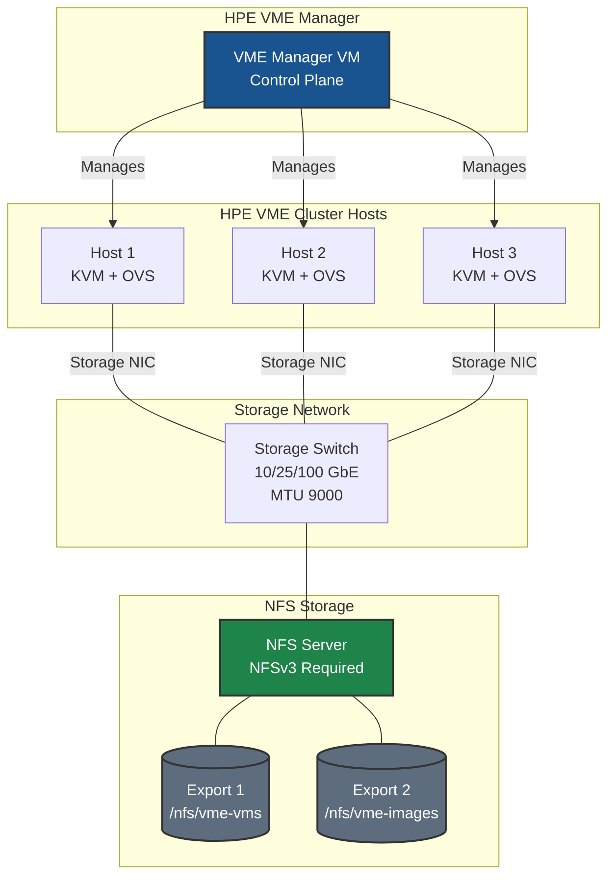

# NFS Storage on HPE VM Essentials - Best Practices Guide

Comprehensive best practices for deploying NFS storage with HPE Virtual Machine Essentials (VME) clusters in production environments.

---

> **This guide assumes that the Pure Storage FlashArray is already configured and ready for NFS connectivity.** This includes:
> - NFS-enabled interfaces configured on the array
> - Export policies created with appropriate rules (NFSv3, `auth_sys`, `no-root-squash`, `rw`)
> - Storage network (switches, VLANs, MTU) configured end-to-end
> - At least one NFS export available for connection
>
> The **only** Pure FlashArray configuration covered in this guide is export policy best practices. For initial FlashArray NFS setup, refer to the [Pure Storage FlashArray documentation](https://support.purestorage.com).

---

## Table of Contents
- [Architecture Overview](#architecture-overview)
- [HPE VME Storage Concepts](#hpe-vme-storage-concepts)
- [Network Configuration](#network-configuration)
- [Pure FlashArray NFS Export Configuration](#pure-flasharray-nfs-export-configuration)
- [HPE VME Manager Configuration](#hpe-vme-manager-configuration)
- [Virtual Image Management](#virtual-image-management)
- [Security](#security)
- [Monitoring & Verification](#monitoring--verification)
- [Troubleshooting](#troubleshooting)

---

## Architecture Overview

### HPE VME NFS Storage Topology



### Key Design Principles

- **Dedicated storage network** for NFS traffic (separate VLAN or physical network)
- **MTU 9000 (jumbo frames)** end-to-end for optimal throughput
- **🚨 NFSv3 required** — NFSv4/4.1 causes permission failures due to ID mapping mismatches (see [NFSv4 Known Issue](#known-issue-nfsv4-permission-denied))
- **Sync exports** for data integrity with VM storage
- **Proper export permissions** for all cluster hosts and VME Manager

---

## HPE VME Storage Concepts

### Storage Layouts

HPE VME supports external storage connectivity via NFS, iSCSI, and Fibre Channel. This guide focuses on NFS integration with Pure Storage FlashArray.

---

## Network Configuration

Per the [HPE VME documentation](https://hpevm-docs.morpheusdata.com/), VME recommends three separate network interfaces per host: management, storage, and compute. NFS storage traffic should use a **dedicated storage interface** with **MTU 9000 (jumbo frames)** configured end-to-end.

### Best Practices

- Use a **dedicated VLAN** for NFS storage traffic — do not share with management or compute networks
- Set **MTU 9000** on all storage interfaces, switches, and Pure FlashArray NFS ports
- Verify jumbo frame connectivity before configuring NFS datastores:

```bash
ping -M do -s 8972 <pure-nfs-ip>
```

### MTU Checklist

- [ ] Host storage interfaces — MTU 9000
- [ ] Storage network switches — MTU 9000
- [ ] Pure FlashArray NFS interfaces — MTU 9000

---

## Pure FlashArray NFS Export Configuration

### Export Policy Best Practices

On the Pure FlashArray, configure NFS export policies with the following settings:

| Setting | Value | Purpose |
|---------|-------|---------|
| NFS Version | NFSv3 | Required — NFSv4 causes ID mapping failures with VME |
| Security | `auth_sys` (AUTH_SYS) | Standard UNIX authentication |
| Root Squash | Disabled (`no-root-squash`) | Allow libvirt/KVM root-level access to VM disks |
| Access | `rw` (read-write) | Full read/write for VM storage operations |
| Client Scope | All VME host IPs + VME Manager IP | Ensure every node and the manager can access the export |

### Recommended Export Layout

Create separate exports on the Pure FlashArray for different storage roles:

| Export | Purpose | Client Scope |
|--------|---------|-------------|
| `/VMs` | VM disk storage (NFS datastore) | All cluster host IPs |
| `/ISO` | ISO image repository (NFS file share) | All cluster host IPs + VME Manager IP |

> **Note:** The VME Manager appliance IP must be included in the export policy for any NFS file shares used for ISO/image storage. NFS datastores are mounted directly by the cluster hosts.

---

## HPE VME Manager Configuration

### Adding NFS Datastore via UI

1. **Infrastructure > Clusters > [Your Cluster] > Storage > Data Stores**
2. Click **ADD**
3. Configure:
   - **NAME**: Descriptive, permanent name (cannot be changed)
   - **TYPE**: NFS Pool
   - **SOURCE HOST**: NFS server IP or hostname
   - **SOURCE DIRECTORY**: Export path

### Integrating NFS File Share for Images

For using NFS as an image repository:

1. **Infrastructure > Storage > File Shares**
2. Click **+ ADD > NFSv3**
3. Configure:
   - **NAME**: Display name
   - **HOST**: NFS server IP
   - **EXPORT FOLDER**: Path to image exports
   - **ACTIVE**: Check to enable
   - **DEFAULT VIRTUAL IMAGE STORE**: Optional, makes this the default

### Creating Virtual Images from NFS

```bash
# Path format for QCOW images in file share
# Don't include file share name or filename in path
# Example: templates/qcow/ubuntu/server/2204/011025
```

> **Important:** Deleting a Virtual Image backed by an NFS file deletes the actual file on the NFS share.

---

## Virtual Image Management

### Saving VMs to NFS-backed Images

1. From Instance detail page, click **Actions > Import as Image**
2. Set image name
3. Select NFS file share as target bucket
4. Image saved as QCOW2 to NFS share

### Using NFS Images for Provisioning

1. Create Virtual Image pointing to NFS QCOW file
2. Configure OS type, minimum memory
3. Select NFS bucket for storage
4. Image available in provisioning wizard

---

## Security

### Network Isolation

- **Dedicated VLAN** for NFS storage traffic
- **No routing** from storage network to public networks
- **Pure FlashArray export policies** scoped to only VME host and manager IPs

### NFS Security Options

On the Pure FlashArray, restrict NFS access by scoping export policy rules to only the VME host IPs and VME Manager IP. Use `auth_sys` authentication with `no-root-squash` and `rw` permissions.

---

## Monitoring & Verification

Key commands for verifying NFS health on VME hosts:

| Command | Purpose |
|---------|---------|
| `mount \| grep nfs` | Verify NFS mounts are active and using `vers=3` |
| `df -h \| grep nfs` | Check datastore capacity and usage |
| `showmount -e <pure-nfs-ip>` | Verify NFS exports are visible from the host |

---

## Troubleshooting

### Common Issues

**Issue: Datastore shows offline in VME Manager**
```bash
# Verify NFS export is reachable from host
showmount -e <pure-nfs-ip>

# Verify NFS connectivity
sudo mount -t nfs -o vers=3 <pure-nfs-ip>:/<export-path> /mnt/test
```

**Issue: Permission denied when creating VMs**

Verify the Pure FlashArray export policy includes the host IP with `no-root-squash` and `rw` permissions. See the [NFS Quickstart — Troubleshooting](./QUICKSTART.md#troubleshooting) for details.

<a id="known-issue-nfsv4-permission-denied"></a>
**Issue: NFSv4/4.1 Permission Denied — `d?????????` on NFS mounts (KNOWN ISSUE)**

VME hosts mounting NFS as NFSv4.1 will show `d?????????` permissions and `Permission denied` or `Stale file handle` errors, even with correct export policies and `no_root_squash` enabled.

**Root Cause:** NFSv4 requires matching ID mapping domains between the NFS server and all clients. VME hosts typically have no DNS domain configured and `/etc/idmapd.conf` has the `Domain` line commented out. This causes UID/GID mapping failures at the NFSv4 layer.

**Symptoms:**
```bash
# Mount appears to succeed, but listing fails
ls -la /mnt/<datastore-uuid>
# d????????? ? ? ? ?            ? .

# Or stale file handle after policy changes
stat /mnt/<datastore-uuid>
# stat: cannot statx '/mnt/...': Stale file handle
```

**Resolution:** Always use **NFSv3** for VME NFS datastores and file shares:
- When adding a datastore in VME Manager, select **NFSv3** (not NFSv4)
- The NFS version **cannot be changed after creation** — you must delete and recreate
- File shares default to NFSv3 and have no version toggle
- Verify with: `mount | grep nfs` → confirm `vers=3` in mount options

**For Pure FlashArray storage arrays:**
- Create a dedicated NFS export policy (e.g., `vme-nfs-policy`)
- Add rules for each VME host IP and the VME Manager IP with `no-root-squash` and `RW`
- Apply the policy as a direct member to each file system (`/VMs`, `/ISO`, etc.)
- After changing export policies on live mounts, remove and re-add the storage in VME to clear stale file handles

**Issue: Slow NFS performance**

Verify MTU 9000 is configured end-to-end with `ping -M do -s 8972 <pure-nfs-ip>`. If jumbo frame pings fail but standard pings succeed, there is an MTU mismatch somewhere in the path (host, switch, or array).

---

## Additional Resources

- [NFS Quick Start](./QUICKSTART.md)
- [HPE VM Essentials Documentation](https://hpevm-docs.morpheusdata.com/)
- [Pure Storage FlashArray Documentation](https://support.purestorage.com)

---

## Quick Reference

### Pure FlashArray Export Checklist

- [ ] Export policy created with NFSv3, `auth_sys`, `no-root-squash`, `rw`
- [ ] Policy rules include all VME cluster host IPs
- [ ] Policy rules include VME Manager IP (required for file shares)
- [ ] Policy applied to each file system (`/VMs`, `/ISO`, etc.)

### HPE VME Host Checklist

- [ ] Storage network interface configured
- [ ] MTU 9000 set on storage interface
- [ ] Can mount NFS share manually **using NFSv3** (`mount -t nfs -o vers=3`)

### HPE VME Manager Checklist

- [ ] NFS datastore added with **NFSv3 selected** (not NFSv4)
- [ ] File share integrated for images (optional, defaults to NFSv3)
- [ ] Virtual images accessible for provisioning

