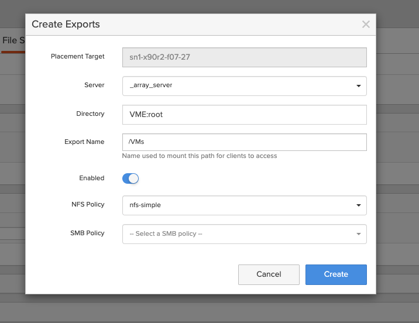
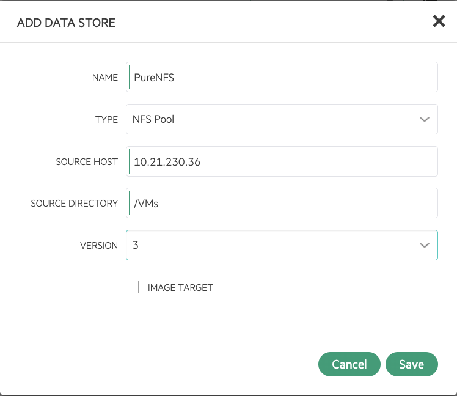
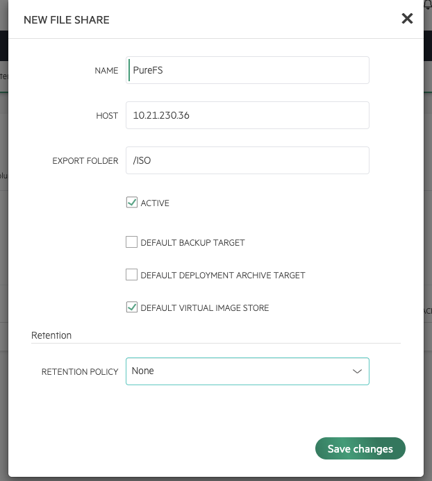

# Pure Storage FlashArray NFS Configuration Guide for HPE VM Essentials

This guide provides step-by-step instructions for configuring NFS storage from a Pure Storage FlashArray for use with HPE VM Essentials (VME). It covers two use cases:

1. **NFS Datastore** — shared storage for virtual machine disk images (`/VMs`)
2. **NFS ISO Repository** — ISO image storage for VM provisioning (`/ISO`)

> **🚨 Critical — NFSv3 is Required:** VME **must** use NFSv3 for all NFS datastores and file shares. NFSv4/4.1 causes `Permission denied` errors and broken mount listings (`d?????????`) due to ID mapping mismatches between VME hosts and the Pure FlashArray. The NFS version **cannot be changed after creation** — if NFSv4 is selected, the datastore or file share must be deleted and recreated.

---

## Disclaimer

> **This guide assumes that the Pure Storage FlashArray is already configured and ready for NFS connectivity.** This includes:
> - NFS-enabled interfaces configured on the array
> - Export policies created with appropriate rules (NFSv3, `auth_sys`, `no-root-squash`, `rw`)
> - Storage network (switches, VLANs, MTU) configured end-to-end
> - At least one NFS export available for connection
>
> For initial FlashArray NFS setup, refer to the [Pure Storage FlashArray documentation](https://support.purestorage.com).

---

## Prerequisites

| Requirement | Details |
|-------------|---------|
| HPE VME Cluster | Deployed and operational |
| Pure Storage FlashArray | NFS exports configured with NFSv3 and `auth_sys` |
| Export Policy | `no-root-squash`, `rw`, client scope set to allow all VME host IPs |
| Network | NFS server IP reachable from all cluster hosts and the VME Manager |

---

## Part 1: NFS Datastore for Virtual Machines

### Step 1: Verify NFS Connectivity from Cluster Hosts

On **each cluster host**, verify that the Pure FlashArray NFS export is accessible:

```bash
# Verify NFS server exports are visible
showmount -e <pure-nfs-ip>

# Test mount with NFSv3
sudo mkdir -p /mnt/test-nfs
sudo mount -t nfs -o vers=3 <pure-nfs-ip>:/<export-path> /mnt/test-nfs

# Verify read/write access
ls -la /mnt/test-nfs
touch /mnt/test-nfs/test-write && rm /mnt/test-nfs/test-write && echo "OK"

# Clean up
sudo umount /mnt/test-nfs
```

> **Tip:** If `showmount` fails or the mount returns `Permission denied`, verify the Pure export policy rules include the host's IP address with `no-root-squash` and `rw` permissions.

### Step 2: Add NFS Datastore in VME Manager

The Pure FlashArray NFS export configuration should already be in place:



In the VME Manager UI:

1. Navigate to **Infrastructure > Clusters > [Your Cluster] > Storage > Data Stores**
2. Click **+ ADD**
3. Configure the datastore:
   - **TYPE**: Select **NFS Pool**
   - **NFS VERSION**: Select **NFSv3** (do NOT select NFSv4)
   - **SOURCE HOST**: Enter the Pure FlashArray NFS IP address
   - **SOURCE DIRECTORY**: Enter the export path (e.g., `/VMs`)
   - **NAME**: Enter a descriptive name
4. Click **Save**



The VME Manager will mount the NFS export on all cluster hosts automatically. Monitor the **Data Stores** tab until the status shows **Online**.

> **⚠️ Important:** The NFS version cannot be changed after creation. If NFSv4 is accidentally selected, the datastore must be deleted and recreated with NFSv3.

### Step 3: Verify NFS Datastore

On any cluster host:

```bash
# Verify NFS mount is active
mount | grep nfs

# Check available space
df -h | grep nfs
```

In the VME Manager UI, confirm the datastore shows **Online** status with correct capacity.

---

## Part 2: NFS ISO Repository

VME supports NFS-based storage for ISO images used during VM provisioning. This is configured as a separate NFS file share pointing to a dedicated ISO directory on the Pure FlashArray.

### Step 1: Verify NFS ISO Export

Confirm that the Pure FlashArray NFS export for ISO images is accessible from the VME Manager:

```bash
# Verify NFS server exports are visible
showmount -e <pure-nfs-ip>

# Test mount with NFSv3
sudo mkdir -p /mnt/test-iso
sudo mount -t nfs -o vers=3 <pure-nfs-ip>:/<iso-export-path> /mnt/test-iso
ls -la /mnt/test-iso
sudo umount /mnt/test-iso
```

### Step 2: Add NFSv3 File Share in VME Manager

In the VME Manager UI:

1. Navigate to **Infrastructure > Storage**
2. Select the **File Shares** tab
3. Click **+ ADD**
4. Select **NFSv3** from the type dropdown
5. Configure the following fields:
   - **NAME**: Descriptive name (e.g., `Pure NFS ISO`)
   - **HOST**: The Pure FlashArray NFS IP address or hostname
   - **EXPORT FOLDER**: The ISO export path (e.g., `/ISO`)
   - **ACTIVE**: Checked (required for the file share to be usable)
   - **DEFAULT IMAGE STORE**: (Optional) Check to make this the default storage target for virtual image uploads
6. Click **Save**



VME Manager will create a persistent NFSv3 mount to the Pure FlashArray export. ISO images stored on this share will be available for VM provisioning.

### Step 3: Create Virtual Images from ISO Files

1. Navigate to **Library > Virtual Images**
2. Click **+ ADD**
3. Select the appropriate image type (e.g., ISO)
4. Configure the virtual image settings and select the NFS file share as the storage location
5. Upload or reference ISO files on the file share
6. When provisioning VMs, the ISO images will be available for selection

---

## Troubleshooting

| Symptom | Cause | Resolution |
|---------|-------|------------|
| `Permission denied` when mounting NFS | Export policy missing host IP, or `root-squash` is enabled | Verify Pure export policy includes host IP with `no-root-squash` and `rw` |
| Mount shows `d?????????` permissions | NFSv4 was used instead of NFSv3 — ID mapping mismatch | Delete the datastore/file share and recreate with **NFSv3** |
| `stale file handle` errors | NFS export was recreated or path changed while mounted | Unmount and remount on all affected hosts: `umount /path && mount /path` |
| NFS datastore shows Offline in VME | NFS server unreachable from one or more cluster hosts | Verify network connectivity and export policy from all hosts |
| ISO images not visible in VME | File share not configured or NFS mount failed | Verify file share status in **Infrastructure > Storage > File Shares** |

---

## Important Considerations

1. **Always use NFSv3.** NFSv4/4.1 causes permission errors due to ID mapping mismatches between VME hosts and Pure Storage. VME hosts typically have no DNS domain configured and `/etc/idmapd.conf` uses the default domain, which does not match the Pure FlashArray's NFSv4 domain.

2. **Export policy must include all VME hosts AND the VME Manager.** NFS datastores are mounted by cluster hosts. NFS file shares are accessed by the VME Manager appliance. Ensure the export policy covers all IP addresses.

3. **NFS version cannot be changed after creation.** If a datastore or file share is created with NFSv4, it must be deleted and recreated. There is no edit option for the NFS version.

4. **Create separate exports for VMs and ISO images.** Using separate directories on the Pure FlashArray allows different export policies and simplifies management. For example, `/VMs` for VM disk storage and `/ISO` for ISO images.

---

## Pre-Flight Checklist

### NFS Datastore
- [ ] Pure FlashArray export policy configured: NFSv3, `auth_sys`, `no-root-squash`, `rw`
- [ ] Export policy includes all cluster host IPs
- [ ] NFS connectivity verified from all cluster hosts (`showmount -e`, test mount)
- [ ] NFS datastore added in VME Manager with **NFSv3** selected
- [ ] Datastore shows Online status in VME Manager

### NFS ISO Repository
- [ ] Separate Pure FlashArray NFS export created for ISO images
- [ ] Export policy includes VME Manager appliance IP
- [ ] NFS connectivity verified from cluster hosts
- [ ] NFSv3 file share added in VME Manager
- [ ] ISO images accessible in **Library > Virtual Images**

