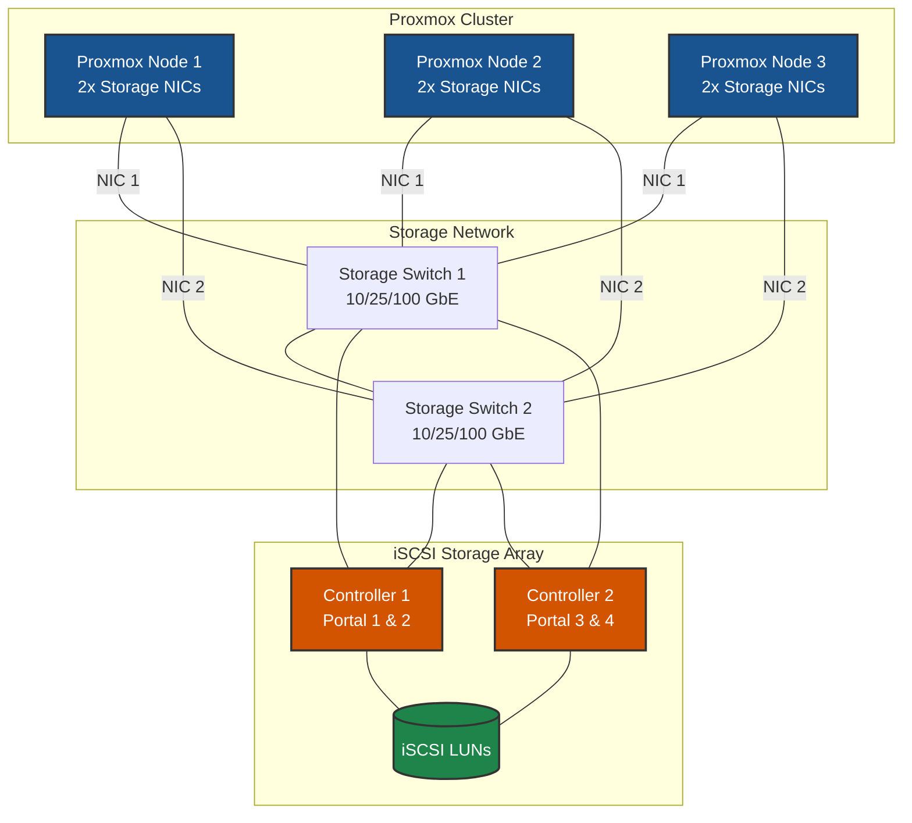
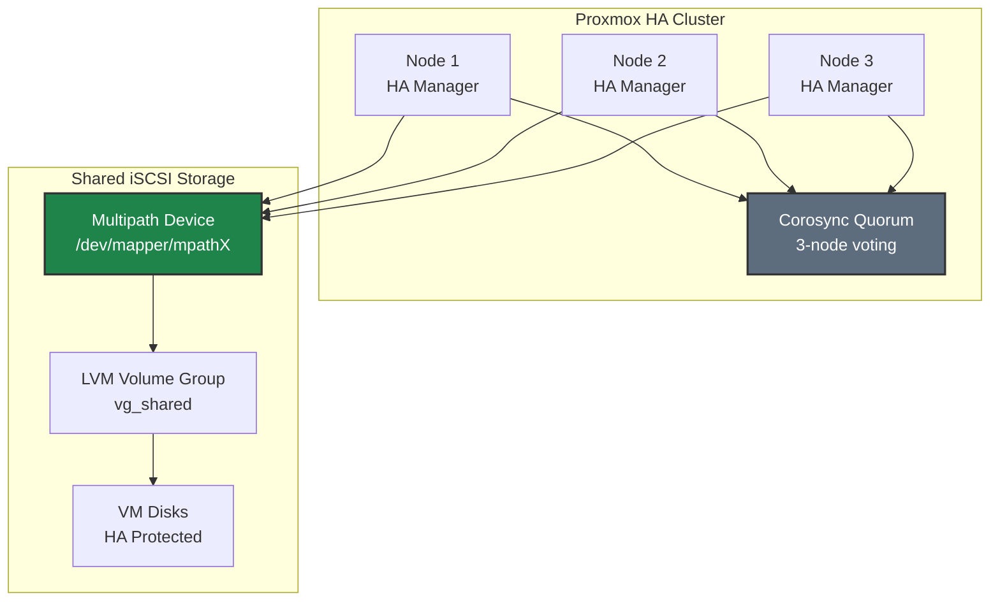

# iSCSI on Proxmox VE - Best Practices Guide

Comprehensive best practices for deploying iSCSI storage on Proxmox VE in production environments.

> **Distribution-Specific Guides:** For detailed best practices tailored to specific Linux distributions, see:
> - [RHEL/Rocky/AlmaLinux Best Practices](../../distributions/rhel/iscsi/BEST-PRACTICES.md)
> - [Debian/Ubuntu Best Practices](../../distributions/debian/iscsi/BEST-PRACTICES.md)
> - [SUSE/openSUSE Best Practices](../../distributions/suse/iscsi/BEST-PRACTICES.md)
> - [Oracle Linux Best Practices](../../distributions/oracle/iscsi/BEST-PRACTICES.md)

---

## ⚠️ Important Disclaimers

> **Vendor Documentation Priority:**
> - This guide is **specific to Pure Storage configurations** and should be used in conjunction with official vendor documentation
> - Always consult and follow **Proxmox VE official documentation** for complete system configuration
> - In case of any conflicts between this guide and vendor documentation, **vendor documentation takes precedence**
>
> **Testing Requirements:**
> - All configurations and recommendations in this guide are **for reference only**
> - **Test thoroughly in a lab environment** before implementing in production
> - Validate all settings with your specific hardware, software versions, and workload requirements
> - Performance and compatibility may vary based on your environment
>
> **Support:**
> - For Pure Storage-specific issues, contact Pure Storage Support
> - For Proxmox VE issues, consult Proxmox documentation or community forums
> - This guide is provided as-is without warranty

---

## Table of Contents
- [Architecture Overview](#architecture-overview)
- [Proxmox VE-Specific Considerations](#proxmox-ve-specific-considerations)
- [Network Design](#network-design)
- [Multipath Configuration](#multipath-configuration)
- [High Availability & Redundancy](#high-availability--redundancy)
- [Performance Optimization](#performance-optimization)
- [Security Best Practices](#security-best-practices)
- [Monitoring & Maintenance](#monitoring--maintenance)
- [Troubleshooting](#troubleshooting)

---

## Architecture Overview

### Reference Architecture

A production-grade iSCSI deployment for Proxmox VE consists of:

- **Proxmox Cluster**: 3+ nodes for high availability
  - *Why*: Minimum 3 nodes required for Proxmox HA quorum; allows maintenance without downtime

- **Dedicated Storage Network**: Isolated network infrastructure for storage traffic
  - *Why*: Prevents storage I/O contention with other traffic; ensures predictable performance; simplifies troubleshooting

- **iSCSI Storage Array**: Enterprise storage with multiple controllers
  - *Why*: Multiple controllers eliminate single point of failure; enable active-active multipath for performance and redundancy

- **DM-Multipath Configuration**: Multiple redundant paths for failover and load balancing
  - *Why*: Automatic failover on path failure; load distribution across all paths; no downtime during maintenance

### Deployment Topology



---

## Proxmox VE-Specific Considerations

### Proxmox VE Overview

**Key Characteristics:**
- Debian-based virtualization platform (current versions based on Debian 12 Bookworm)
- Uses `ifupdown2` for network configuration (not netplan)
- Built-in clustering and HA capabilities
- Web-based management interface
- Supports both KVM VMs and LXC containers

**Recommended Versions:**
- **Proxmox VE**: 8.x or later (based on Debian 12)
- **Kernel**: Proxmox default kernel (includes required iSCSI and multipath modules)

### Package Management

**Update system:**
```bash
# Update package lists
apt update

# Upgrade packages
apt full-upgrade -y
```

**Essential packages (most pre-installed):**
```bash
# Core iSCSI and multipath tools
apt install -y \
    open-iscsi \
    multipath-tools \
    lvm2 \
    sg3-utils

# Performance monitoring tools
apt install -y \
    sysstat \
    iotop \
    htop
```

**Verify installation:**
```bash
# Check iSCSI initiator
iscsiadm --version

# Check multipath
multipath -ll

# Check services
systemctl status iscsid
systemctl status open-iscsi
systemctl status multipathd
```

---

## Network Design

> **Note:** For comprehensive network architecture concepts, see [Network Concepts](../../common/includes/network-concepts.md).

### Network Architecture Principles

1. **Dedicated Storage Network**: Always use dedicated physical or VLAN-isolated networks for storage traffic
   - *Why*: Isolates storage I/O from other network traffic; prevents bandwidth contention

2. **No Single Points of Failure**: Redundant switches, NICs, and storage controllers
   - *Why*: Any single component can fail without impacting storage availability

3. **Proper Segmentation**: Separate storage traffic from management and VM traffic
   - *Why*: Prevents noisy neighbor problems; ensures consistent storage performance

4. **Optimized MTU**: Use jumbo frames (MTU 9000) end-to-end when possible
   - *Why*: Reduces CPU overhead; improves throughput by reducing packet count

### Proxmox Network Configuration (ifupdown2)

Proxmox uses `ifupdown2` for network configuration via `/etc/network/interfaces`.

#### Option 1: Dedicated Physical Networks (Recommended)

**Configuration in `/etc/network/interfaces`:**
```bash
# Storage interface 1
auto ens1f0
iface ens1f0 inet static
    address 10.100.1.101/24
    mtu 9000

# Storage interface 2
auto ens1f1
iface ens1f1 inet static
    address 10.100.2.101/24
    mtu 9000
```

**Apply configuration:**
```bash
# Reload networking (ifupdown2 allows without reboot)
ifreload -a

# Verify
ip addr show ens1f0
ip addr show ens1f1
```

#### Option 2: VLAN-Based Storage Network

**Configuration with VLAN interfaces:**
```bash
# Physical NICs - no IP, used for trunking
auto ens1f0
iface ens1f0 inet manual
    mtu 9000

auto ens1f1
iface ens1f1 inet manual
    mtu 9000

# Storage VLAN interface 1
auto ens1f0.100
iface ens1f0.100 inet static
    address 10.100.1.101/24
    mtu 9000
    vlan-raw-device ens1f0

# Storage VLAN interface 2
auto ens1f1.100
iface ens1f1.100 inet static
    address 10.100.1.102/24
    mtu 9000
    vlan-raw-device ens1f1
```

### ARP Configuration for Same-Subnet Multipath

> **⚠️ CRITICAL**: When using multiple interfaces on the same subnet, proper ARP configuration is **mandatory** to prevent routing issues.

**Create ARP sysctl configuration:**
```bash
cat > /etc/sysctl.d/99-iscsi-arp.conf << 'EOF'
# ARP settings for same-subnet multipath (CRITICAL)
# Prevents ARP responses on wrong interface
# See: network-concepts.md for detailed explanation

net.ipv4.conf.all.arp_ignore = 2
net.ipv4.conf.default.arp_ignore = 2
net.ipv4.conf.all.arp_announce = 2
net.ipv4.conf.default.arp_announce = 2

# Interface-specific (adjust names as needed)
net.ipv4.conf.ens1f0.arp_ignore = 2
net.ipv4.conf.ens1f1.arp_ignore = 2
net.ipv4.conf.ens1f0.arp_announce = 2
net.ipv4.conf.ens1f1.arp_announce = 2

# For VLAN interfaces (if used)
#net.ipv4.conf.ens1f0/100.arp_ignore = 2
#net.ipv4.conf.ens1f1/100.arp_ignore = 2
#net.ipv4.conf.ens1f0/100.arp_announce = 2
#net.ipv4.conf.ens1f1/100.arp_announce = 2
EOF

# Apply settings
sysctl -p /etc/sysctl.d/99-iscsi-arp.conf
```

For detailed explanation of ARP settings, see [ARP Configuration for Same-Subnet Multipath](../../common/includes/network-concepts.md#arp-configuration-for-same-subnet-multipath).

### MTU Configuration

**Verify MTU end-to-end:**
```bash
# Check interface MTU
ip link show ens1f0 | grep mtu

# Test MTU to storage portal (9000 - 28 byte header = 8972)
ping -M do -s 8972 10.100.1.10

# If ping fails, check:
# 1. Interface MTU
# 2. Switch MTU configuration
# 3. Storage array MTU
```

**Important:** MTU must be 9000 end-to-end (host → switch → storage).

### Firewall Configuration

**Proxmox uses `pve-firewall` (iptables-based):**

#### Option 1: Disable Filtering on Storage Interfaces (Recommended)

For dedicated storage networks, **disable firewall filtering** on storage interfaces to eliminate CPU overhead from packet inspection. This is critical for high-throughput iSCSI storage.

**Why disable filtering on storage interfaces:**
- **CPU overhead**: Firewall packet inspection adds latency and consumes CPU cycles
- **Performance impact**: At high IOPS, filtering overhead becomes significant
- **Network isolation**: Dedicated storage VLANs provide security at the network layer
- **Simplicity**: No port rules to maintain for storage traffic

```bash
# Check firewall status
pve-firewall status

# Option 1a: Disable pve-firewall entirely on storage interfaces
# In /etc/pve/firewall/cluster.fw or node firewall, don't include storage interfaces

# Option 1b: Accept all traffic on storage interfaces via iptables
iptables -A INPUT -i ens1f0 -j ACCEPT
iptables -A INPUT -i ens1f1 -j ACCEPT

# Save rules
iptables-save > /etc/iptables.rules
```

#### Option 2: Port Filtering (For Shared or Non-Isolated Networks)

Use port filtering only when storage interfaces share a network with other traffic or when additional host-level security is required by policy.

> **⚠️ Performance Note:** Port filtering adds CPU overhead for every packet. For production storage with high IOPS requirements, use Option 1 with network-level isolation instead.

```bash
# Direct iptables rules with port filtering:
iptables -A INPUT -i ens1f0 -p tcp --dport 3260 -j ACCEPT
iptables -A INPUT -i ens1f1 -p tcp --dport 3260 -j ACCEPT

# Save rules
iptables-save > /etc/iptables.rules
```

---

## Multipath Configuration

> **Note:** For detailed multipath concepts, see [Multipath Concepts](../../common/includes/multipath-concepts.md) and [iSCSI Multipath Configuration](../../common/includes/iscsi-multipath-config.md).

### DM-Multipath for iSCSI

iSCSI uses device-mapper multipath (dm-multipath) for path management, unlike NVMe-TCP which uses native NVMe multipathing.

**Why DM-Multipath for iSCSI:**
- Presents multiple paths as single block device (`/dev/mapper/mpathX`)
- Supports ALUA (Asymmetric Logical Unit Access) for path prioritization
- Configurable failover and load balancing policies
- Well-established and mature technology

### Multipath Configuration

**Create `/etc/multipath.conf`:**
```bash
cat > /etc/multipath.conf << 'EOF'
defaults {
    user_friendly_names yes
    find_multipaths no
    enable_foreign "^$"
    polling_interval 5
}

blacklist {
    devnode "^(ram|raw|loop|fd|md|dm-|sr|scd|st|nvme)[0-9]*"
    devnode "^hd[a-z]"
    devnode "^cciss.*"
}

devices {
    device {
        vendor "PURE"
        product "FlashArray"
        path_selector "service-time 0"
        path_grouping_policy "group_by_prio"
        prio "alua"
        failback "immediate"
        path_checker "tur"
        fast_io_fail_tmo 10
        dev_loss_tmo 60
        no_path_retry 0
        hardware_handler "1 alua"
        rr_min_io_rq 1
    }
}
EOF
```

**Key Configuration Parameters:**

| Parameter | Value | Purpose |
|-----------|-------|---------|
| `path_selector` | `service-time 0` | Routes I/O to path with lowest service time |
| `path_grouping_policy` | `group_by_prio` | Groups paths by ALUA priority |
| `prio` | `alua` | Uses ALUA for path prioritization |
| `failback` | `immediate` | Returns to preferred path immediately when available |
| `fast_io_fail_tmo` | `10` | Seconds before failing I/O on path failure |
| `dev_loss_tmo` | `60` | Seconds before removing device on path loss |
| `no_path_retry` | `0` | **Fail immediately when all paths down** (prevents hangs) |

> **⚠️ Critical**: Setting `no_path_retry 0` is recommended to prevent system hangs during APD (All Paths Down) events. See [Understanding APD Events](../../common/includes/iscsi-multipath-config.md#understanding-apd-all-paths-down-events).

**Enable and start multipath:**
```bash
# Enable multipath service
systemctl enable multipathd

# Restart to apply configuration
systemctl restart multipathd

# Verify configuration
multipath -ll
```

### iSCSI Initiator Configuration

**Configure iSCSI initiator settings:**
```bash
# Set initiator name (do this once per host)
echo "InitiatorName=iqn.2024-01.com.yourcompany:proxmox-node1" > /etc/iscsi/initiatorname.iscsi

# Configure iSCSI settings
cat >> /etc/iscsi/iscsid.conf << 'EOF'

# Timeouts optimized for Pure Storage
node.session.timeo.replacement_timeout = 20
node.conn[0].timeo.login_timeout = 30
node.conn[0].timeo.logout_timeout = 15

# Recovery settings
node.session.err_timeo.abort_timeout = 15
node.session.err_timeo.lu_reset_timeout = 30
node.session.err_timeo.tgt_reset_timeout = 30

# Startup behavior
node.startup = automatic

# Queue depth
node.session.queue_depth = 128
EOF

# Restart iSCSI services
systemctl restart iscsid
systemctl enable open-iscsi
systemctl restart open-iscsi
```

### iSCSI Interface Binding

**Bind iSCSI to specific interfaces for multipath:**
```bash
# Create iSCSI interface for first NIC
iscsiadm -m iface -I iscsi0 -o new
iscsiadm -m iface -I iscsi0 -o update -n iface.net_ifacename -v ens1f0

# Create iSCSI interface for second NIC
iscsiadm -m iface -I iscsi1 -o new
iscsiadm -m iface -I iscsi1 -o update -n iface.net_ifacename -v ens1f1

# Verify interfaces
iscsiadm -m iface
```

**Discover and login to targets using both interfaces:**
```bash
# Discover via first interface
iscsiadm -m discovery -t sendtargets -p 10.100.1.10:3260 -I iscsi0
iscsiadm -m discovery -t sendtargets -p 10.100.1.11:3260 -I iscsi0

# Discover via second interface
iscsiadm -m discovery -t sendtargets -p 10.100.1.10:3260 -I iscsi1
iscsiadm -m discovery -t sendtargets -p 10.100.1.11:3260 -I iscsi1

# Login to all discovered targets
iscsiadm -m node -L all

# Verify sessions (should see multiple sessions)
iscsiadm -m session

# Verify multipath
multipath -ll
```

---

## High Availability & Redundancy

### Proxmox HA with iSCSI Storage

Proxmox VE has built-in HA capabilities that work well with iSCSI storage.

**HA Requirements:**
- Minimum 3 nodes for quorum
- Shared storage accessible by all nodes (iSCSI multipath)
- Fencing capability (recommended)

**HA Architecture with iSCSI:**



### Configuring Shared LVM on iSCSI

**Create shared volume group:**
```bash
# On first node only - create PV and VG
pvcreate /dev/mapper/mpathX
vgcreate vg_shared /dev/mapper/mpathX

# Create thin pool for VM storage
lvcreate -l 95%FREE -T vg_shared/thinpool
```

**Configure LVM for shared access:**
```bash
# Edit /etc/lvm/lvm.conf on ALL nodes
# Set system_id_source to prevent conflicts
sed -i 's/# system_id_source = "none"/system_id_source = "uname"/' /etc/lvm/lvm.conf

# Or use LVM locking for active-active (requires dlm)
# This is more complex - consult Proxmox documentation
```

**Add storage to Proxmox via GUI or CLI:**
```bash
# Add LVM-thin storage
pvesm add lvmthin iscsi-shared \
    --vgname vg_shared \
    --thinpool thinpool \
    --content images,rootdir \
    --shared 1
```

### Path Redundancy

**Verify path redundancy:**
```bash
# Check multipath status
multipath -ll

# Expected output with 4 paths (2 NICs × 2 portals):
# mpathX (3600...) dm-0 PURE,FlashArray
# size=100G features='0' hwhandler='1 alua' wp=rw
# |-+- policy='service-time 0' prio=50 status=active
# | |- 1:0:0:1 sda 8:0   active ready running
# | `- 2:0:0:1 sdb 8:16  active ready running
# `-+- policy='service-time 0' prio=10 status=enabled
#   |- 3:0:0:1 sdc 8:32  active ready running
#   `- 4:0:0:1 sdd 8:48  active ready running
```

**Test failover:**
```bash
# Simulate path failure (disconnect one NIC)
ip link set ens1f0 down

# Verify I/O continues on remaining paths
multipath -ll
dd if=/dev/mapper/mpathX of=/dev/null bs=1M count=100

# Restore path
ip link set ens1f0 up

# Verify path returns
multipath -ll
```

---

## Performance Optimization

> **Note:** For comprehensive performance tuning, see [Performance Tuning](../../common/includes/performance-tuning.md) and [iSCSI Performance Tuning](../../common/includes/iscsi-performance-tuning.md).

### Kernel Parameters

**Optimize kernel for iSCSI storage:**
```bash
cat > /etc/sysctl.d/99-iscsi-proxmox.conf << 'EOF'
# Network performance for iSCSI
net.core.netdev_max_backlog = 5000
net.core.rmem_max = 134217728
net.core.wmem_max = 134217728
net.ipv4.tcp_rmem = 4096 87380 67108864
net.ipv4.tcp_wmem = 4096 65536 67108864

# Low latency TCP
net.ipv4.tcp_low_latency = 1

# VM tuning for storage workloads
vm.dirty_ratio = 10
vm.dirty_background_ratio = 5
vm.swappiness = 10

# ARP settings for same-subnet multipath
net.ipv4.conf.all.arp_ignore = 2
net.ipv4.conf.default.arp_ignore = 2
net.ipv4.conf.all.arp_announce = 2
net.ipv4.conf.default.arp_announce = 2
EOF

# Apply settings
sysctl -p /etc/sysctl.d/99-iscsi-proxmox.conf
```

### I/O Scheduler Configuration

**Set optimal I/O scheduler for iSCSI devices:**
```bash
cat > /etc/udev/rules.d/99-iscsi-scheduler.rules << 'EOF'
# Set I/O scheduler for iSCSI devices (none/noop for SSD/Flash)
ACTION=="add|change", KERNEL=="sd[a-z]", ATTR{queue/rotational}=="0", ATTR{queue/scheduler}="none"

# Set queue depth for Pure Storage devices
ACTION=="add|change", KERNEL=="sd[a-z]", ATTR{device/vendor}=="PURE*", ATTR{device/queue_depth}="128"

# Set read-ahead
ACTION=="add|change", KERNEL=="sd[a-z]", ATTR{device/vendor}=="PURE*", ATTR{bdi/read_ahead_kb}="128"

# Multipath device settings
ACTION=="add|change", KERNEL=="dm-*", ATTR{dm/name}=="mpath*", ATTR{queue/scheduler}="none"
EOF

# Reload udev rules
udevadm control --reload-rules
udevadm trigger
```

### Network Interface Tuning

**Optimize NIC settings:**
```bash
# Create network tuning script
cat > /usr/local/bin/tune-storage-nics.sh << 'EOF'
#!/bin/bash
# Tune storage NICs for iSCSI

for NIC in ens1f0 ens1f1; do
    if ip link show $NIC &>/dev/null; then
        # Increase ring buffers
        ethtool -G $NIC rx 4096 tx 4096 2>/dev/null || true

        # Optimize interrupt coalescing
        ethtool -C $NIC rx-usecs 50 tx-usecs 50 2>/dev/null || true

        # Enable TCP offloads
        ethtool -K $NIC tso on gso on gro on 2>/dev/null || true

        echo "Tuned $NIC"
    fi
done
EOF

chmod +x /usr/local/bin/tune-storage-nics.sh

# Run at boot
cat > /etc/systemd/system/tune-storage-nics.service << 'EOF'
[Unit]
Description=Tune storage NICs for iSCSI
After=network-online.target

[Service]
Type=oneshot
ExecStart=/usr/local/bin/tune-storage-nics.sh
RemainAfterExit=yes

[Install]
WantedBy=multi-user.target
EOF

systemctl daemon-reload
systemctl enable tune-storage-nics.service
systemctl start tune-storage-nics.service
```

### IRQ Affinity

**Install and configure irqbalance:**
```bash
# Install irqbalance (usually pre-installed)
apt install -y irqbalance

# Enable and start
systemctl enable --now irqbalance

# Check IRQ distribution
cat /proc/interrupts | grep -E "ens1f"
```

---

## Security Best Practices

> **Note:** For general security best practices, see [Security Best Practices](../../common/includes/security-best-practices.md).

### CHAP Authentication

**Configure CHAP on iSCSI initiator:**
```bash
# Set CHAP credentials for a target
TARGET_IQN="iqn.2010-06.com.purestorage:flasharray.12345abc"
PORTAL_IP="10.100.1.10"

iscsiadm -m node -T $TARGET_IQN -p $PORTAL_IP:3260 \
    -o update -n node.session.auth.authmethod -v CHAP

iscsiadm -m node -T $TARGET_IQN -p $PORTAL_IP:3260 \
    -o update -n node.session.auth.username -v <username>

iscsiadm -m node -T $TARGET_IQN -p $PORTAL_IP:3260 \
    -o update -n node.session.auth.password -v <password>

# Reconnect with CHAP
iscsiadm -m node -T $TARGET_IQN -p $PORTAL_IP:3260 --logout
iscsiadm -m node -T $TARGET_IQN -p $PORTAL_IP:3260 --login
```

### Network Isolation

**Best practices for storage network security:**
1. **Dedicated VLANs**: Isolate storage traffic on separate VLANs
2. **No default gateway**: Storage interfaces should not have default routes
3. **Firewall rules**: Restrict iSCSI ports to storage network only
4. **Physical isolation**: When possible, use dedicated switches

### Credential Management

**Secure iSCSI credentials:**
```bash
# Protect iSCSI configuration files
chmod 600 /etc/iscsi/iscsid.conf
chmod 600 /etc/iscsi/nodes/*/*/*

# Verify permissions
ls -la /etc/iscsi/
```

---

## Monitoring & Maintenance

> **Note:** For comprehensive monitoring procedures, see [Monitoring & Maintenance](../../common/includes/monitoring-maintenance.md).

### Health Check Script

**Create Proxmox iSCSI health check:**
```bash
cat > /usr/local/bin/iscsi-health-check.sh << 'EOF'
#!/bin/bash
# iSCSI Health Check Script for Proxmox VE

echo "=== iSCSI Health Check ==="
echo "Date: $(date)"
echo "Hostname: $(hostname)"
echo

echo "--- iSCSI Sessions ---"
iscsiadm -m session 2>/dev/null || echo "No active sessions"

echo
echo "--- Multipath Status ---"
multipath -ll | head -50

echo
echo "--- Failed/Faulty Paths ---"
multipath -ll | grep -i "failed\|faulty" || echo "No failed paths"

echo
echo "--- Storage Interface Status ---"
for NIC in ens1f0 ens1f1; do
    if ip link show $NIC &>/dev/null; then
        echo "$NIC: $(ip -br link show $NIC)"
    fi
done

echo
echo "--- Disk I/O Statistics ---"
iostat -x 1 2 2>/dev/null | tail -20 || echo "iostat not available"

echo
echo "=== End Health Check ==="
EOF

chmod +x /usr/local/bin/iscsi-health-check.sh
```

### Monitoring with systemd Journal

**View iSCSI and multipath logs:**
```bash
# View iSCSI logs
journalctl -u iscsid -f

# View multipath logs
journalctl -u multipathd -f

# View storage-related kernel messages
dmesg -w | grep -E "scsi|multipath|iscsi"

# Check for recent errors
journalctl -p err -u iscsid -u multipathd --since "1 hour ago"
```

### Scheduled Health Checks

**Add to cron:**
```bash
# Run health check every 6 hours
cat > /etc/cron.d/iscsi-health << 'EOF'
0 */6 * * * root /usr/local/bin/iscsi-health-check.sh >> /var/log/iscsi-health.log 2>&1
EOF
```

---

## Troubleshooting

> **Note:** For common troubleshooting procedures, see [Common Troubleshooting](../../common/includes/troubleshooting-common.md).

### Service Status

**Check iSCSI and multipath services:**
```bash
# Check service status
systemctl status iscsid
systemctl status open-iscsi
systemctl status multipathd

# Check for failed services
systemctl --failed | grep -E "iscsi|multipath"

# View detailed logs
journalctl -xe -u iscsid
journalctl -xe -u multipathd
```

### Connection Issues

**Diagnose iSCSI connectivity:**
```bash
# Test network connectivity to portals
ping -c 3 10.100.1.10
ping -c 3 10.100.1.11

# Test iSCSI port
nc -zv 10.100.1.10 3260

# Check interface binding
iscsiadm -m iface

# Rediscover targets
iscsiadm -m discovery -t sendtargets -p 10.100.1.10:3260

# Check session details
iscsiadm -m session -P 3
```

### Multipath Issues

**Diagnose multipath problems:**
```bash
# Verbose multipath output
multipath -v3

# Reconfigure multipath
multipath -r

# Flush and reload (use with caution!)
# multipath -F  # Flush all mappings
# multipath     # Rediscover

# Check device mapper status
dmsetup table
dmsetup status

# Check for blacklisted devices
multipath -v3 2>&1 | grep -i blacklist
```

### Path Failure Recovery

**Recover from path failures:**
```bash
# Check current path status
multipath -ll

# Force path check
multipathd show paths

# Reinstate a failed path
multipathd reinstate path <device>

# Or restart multipath
systemctl restart multipathd

# Rescan SCSI bus
for host in /sys/class/scsi_host/host*; do
    echo "- - -" > ${host}/scan
done
```

### LVM Issues on Shared Storage

**Troubleshoot LVM on iSCSI:**
```bash
# Scan for volume groups
vgscan
vgchange -ay

# Check LVM locks (if using lvmlockd)
lvmlockctl -i

# Force LVM rescan
pvscan --cache
vgscan --mknodes

# Check Proxmox storage status
pvesm status
```

---

## Additional Resources

- [Proxmox VE Documentation](https://pve.proxmox.com/wiki/)
- [Proxmox VE Storage](https://pve.proxmox.com/wiki/Storage)
- [iSCSI Quick Start](./QUICKSTART.md)
- [Common Network Concepts](../../common/includes/network-concepts.md)
- [Multipath Concepts](../../common/includes/multipath-concepts.md)
- [Storage Terminology Glossary](../../common/includes/glossary.md)

---

## Quick Reference

**Discover targets:**
```bash
iscsiadm -m discovery -t sendtargets -p <portal_ip>:3260
```

**Login to all targets:**
```bash
iscsiadm -m node -L all
```

**Check sessions:**
```bash
iscsiadm -m session
```

**Check multipath:**
```bash
multipath -ll
```

**Restart services:**
```bash
systemctl restart iscsid open-iscsi multipathd
```

**Check logs:**
```bash
journalctl -u iscsid -u multipathd -f
```

**Verify path redundancy:**
```bash
multipath -ll | grep -E "status|policy"
```


