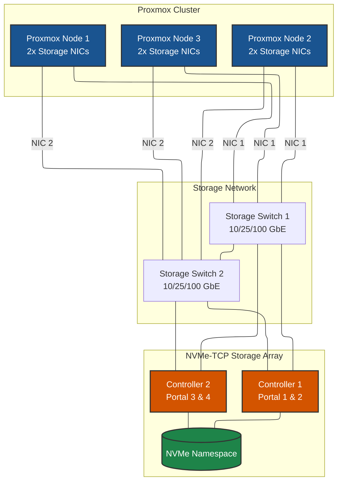
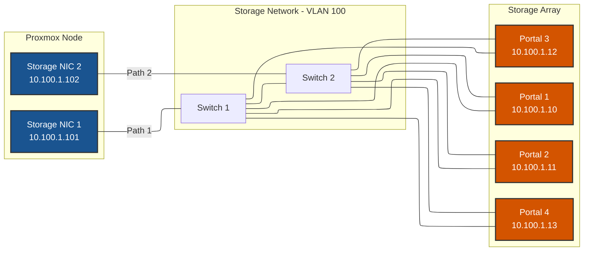
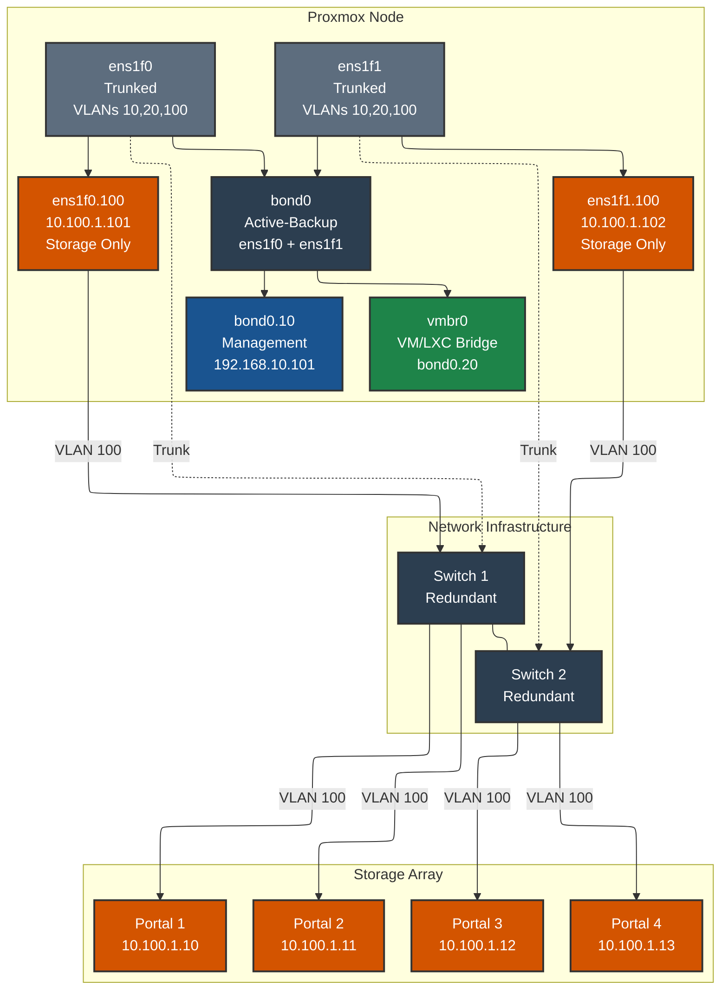
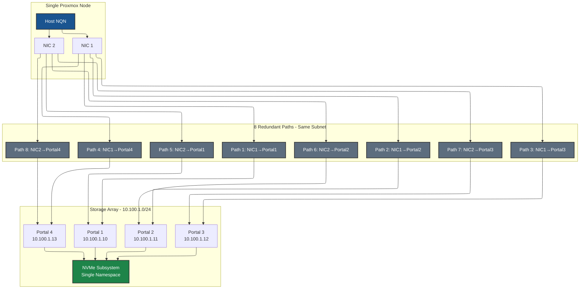
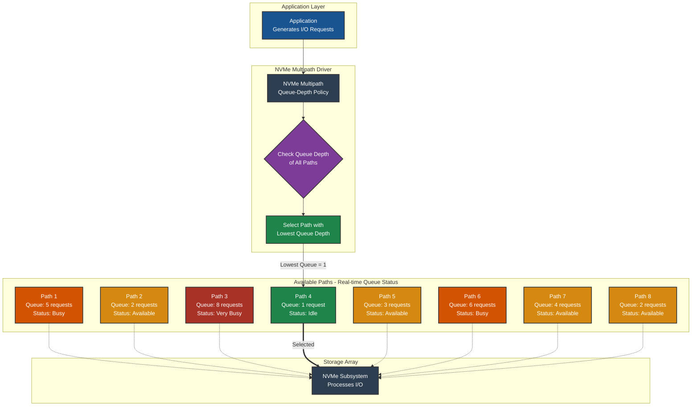
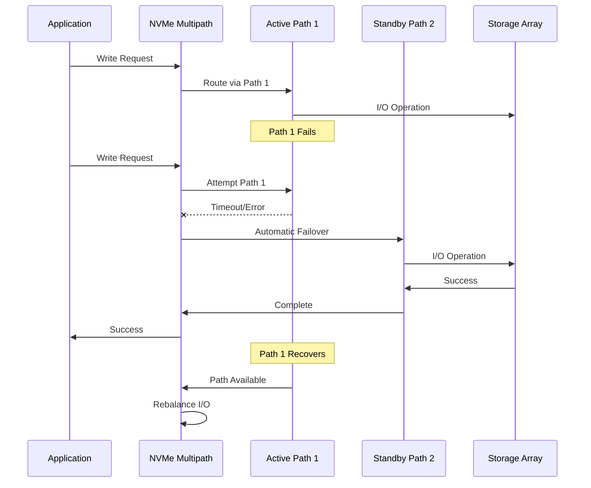
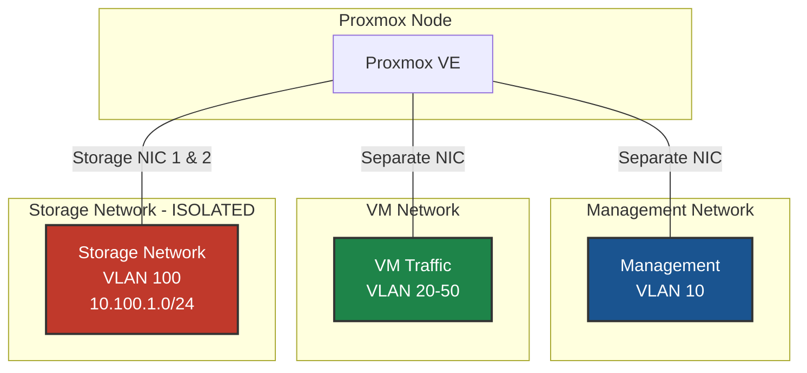
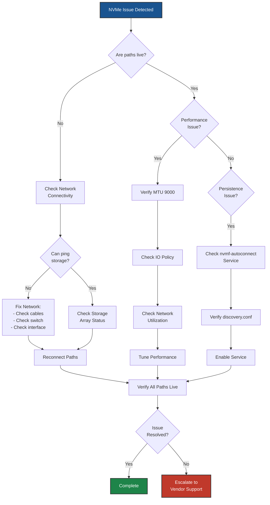

# NVMe-TCP on Proxmox VE - Best Practices Guide

> **Distribution-Specific Guides:** For detailed best practices tailored to specific Linux distributions, see:
> - [RHEL/Rocky/AlmaLinux Best Practices](../../distributions/rhel/nvme-tcp/BEST-PRACTICES.md)
> - [Debian/Ubuntu Best Practices](../../distributions/debian/nvme-tcp/BEST-PRACTICES.md)
> - [SUSE/openSUSE Best Practices](../../distributions/suse/nvme-tcp/BEST-PRACTICES.md)
> - [Oracle Linux Best Practices](../../distributions/oracle/nvme-tcp/BEST-PRACTICES.md)

---



---

## Table of Contents
- [Architecture Overview](#architecture-overview)
- [Network Design](#network-design)
- [High Availability & Redundancy](#high-availability--redundancy)
- [Performance Optimization](#performance-optimization)
- [Security Best Practices](#security-best-practices)
- [Monitoring & Maintenance](#monitoring--maintenance)
- [Troubleshooting](#troubleshooting)

---

## Architecture Overview

### Reference Architecture

A production-grade NVMe-TCP deployment consists of:

- **Proxmox Cluster**: 3+ nodes for high availability
  - *Why*: Minimum 3 nodes required for Proxmox HA quorum; allows maintenance without downtime

- **Dedicated Storage Network**: Isolated network infrastructure for storage traffic
  - *Why*: Prevents storage I/O contention with other traffic; ensures predictable performance; simplifies troubleshooting

- **NVMe-TCP Storage Array**: Enterprise storage with multiple controllers
  - *Why*: Multiple controllers eliminate single point of failure; enable active-active multipath for performance and redundancy

- **Multipath Configuration**: Multiple redundant paths for failover and load balancing
  - *Why*: Automatic failover on path failure; load distribution across all paths; no downtime during maintenance

### Deployment Topology



---

## Network Design



### Network Architecture Principles

1. **Dedicated Storage Network**: Always use dedicated physical or VLAN-isolated networks for storage traffic
   - *Why*: Isolates storage I/O from other network traffic; prevents bandwidth contention; enables QoS policies specific to storage; simplifies security and firewall rules

2. **No Single Points of Failure**: Redundant switches, NICs, and storage controllers
   - *Why*: Any single component can fail without impacting storage availability; enables zero-downtime maintenance; critical for production environments

3. **Proper Segmentation**: Separate storage traffic from management and VM traffic
   - *Why*: Prevents noisy neighbor problems; ensures storage performance is not affected by VM traffic spikes; improves security posture; simplifies network troubleshooting

4. **Optimized MTU**: Use jumbo frames (MTU 9000) end-to-end when possible
   - *Why*: Reduces CPU overhead by ~30%; improves throughput by reducing packet count; lowers interrupt rate; essential for high-performance storage

### Network Topology Options

#### Option 1: Dedicated Physical Networks (Recommended)

**Why Recommended:**
This is the gold standard for production storage networks because it provides complete isolation and maximum performance.

**Advantages:**
- **Maximum performance and isolation**: Storage has dedicated bandwidth with zero contention
- **No contention with other traffic**: VM traffic spikes cannot impact storage performance
- **Simplified troubleshooting**: Storage network issues are isolated and easier to diagnose
- **Predictable latency**: Consistent performance without interference from other workloads

**Requirements:**
- Dedicated NICs on each Proxmox node (minimum 2 for redundancy)
  - *Why 2 minimum*: Provides redundancy; one NIC can fail without storage outage
- Dedicated storage switches (minimum 2 for redundancy)
  - *Why 2 minimum*: Eliminates switch as single point of failure; allows switch maintenance without downtime
- Direct connections to storage array
  - *Why direct*: Reduces latency; simplifies network path; fewer points of failure



**Configuration Example:**
```bash
# /etc/network/interfaces
# Both NICs on same subnet (10.100.1.0/24)
auto ens1f0
iface ens1f0 inet static
    address 10.100.1.101/24
    mtu 9000

auto ens1f1
iface ens1f1 inet static
    address 10.100.1.102/24
    mtu 9000
```

#### Option 2: VLAN-Based Segmentation (Shared NICs)

**When to Use:**
Choose this option when you have limited physical NICs or want to consolidate infrastructure. Acceptable for environments where cost/port density is a concern and you can accept some performance trade-offs.

**Advantages:**
- **Efficient use of physical infrastructure**: Reduces NIC and switch port requirements
- **Flexible network design**: Easy to add new VLANs without physical changes
- **Single set of NICs handles multiple traffic types**: Lower hardware costs; fewer cables

**Considerations:**
- **NICs are shared with management, VM, and container traffic**
  - *Impact*: Storage competes for bandwidth with other traffic; potential performance degradation during high VM traffic
- **Requires proper VLAN configuration and trunking on switches**
  - *Why critical*: Misconfiguration can cause traffic leakage or complete storage outage
- **Storage VLANs share bandwidth with other VLANs on same NICs**
  - *Impact*: Maximum storage throughput is limited by total NIC bandwidth minus other traffic
- **Requires QoS/traffic prioritization for storage VLANs**
  - *Why essential*: Without QoS, VM traffic can starve storage traffic causing I/O timeouts
- **Proper switch redundancy still required**
  - *Why*: Even with shared NICs, you still need redundant switches to avoid single point of failure

**Architecture:**
In this configuration, physical NICs are trunked and carry multiple VLANs:
- **VLAN 10**: Management traffic (Proxmox web UI, SSH) - uses both NICs via bond
  - *Why bonded*: Ensures management access even if one NIC fails
- **VLAN 20**: VM/LXC bridge traffic - uses both NICs via bond
  - *Why bonded*: Provides redundancy for VM network connectivity
- **VLAN 100**: Storage traffic (NVMe-TCP) - each NIC has separate VLAN interface (no bond)
  - *Why NOT bonded*: Bonding would reduce 8 paths to 1 path, eliminating multipath benefits; separate interfaces preserve all redundant paths for NVMe native multipathing



**Configuration Example:**
```bash
# /etc/network/interfaces
# Physical NICs configured for trunking (no IP, just up)
auto ens1f0
iface ens1f0 inet manual
    bond-master bond0
    mtu 9000

auto ens1f1
iface ens1f1 inet manual
    bond-master bond0
    mtu 9000

# Bond interface for management and VM traffic
auto bond0
iface bond0 inet manual
    bond-slaves ens1f0 ens1f1
    bond-mode active-backup
    bond-miimon 100
    bond-primary ens1f0
    mtu 9000

# Management VLAN 10 on bond (single management interface)
auto bond0.10
iface bond0.10 inet static
    address 192.168.10.101/24
    gateway 192.168.10.1
    vlan-raw-device bond0

# VM/LXC Bridge on VLAN 20 (single bridge using bond)
auto vmbr0
iface vmbr0 inet manual
    bridge-ports bond0.20
    bridge-stp off
    bridge-fd 0
    bridge-vlan-aware yes
    bridge-vids 20-50

# Storage VLAN 100 - NVMe-TCP ONLY (NO BOND - separate paths)
# Each NIC gets its own VLAN interface on same subnet
auto ens1f0.100
iface ens1f0.100 inet static
    address 10.100.1.101/24
    vlan-raw-device ens1f0
    mtu 9000

auto ens1f1.100
iface ens1f1.100 inet static
    address 10.100.1.102/24
    vlan-raw-device ens1f1
    mtu 9000
```

**Important Notes:**
- **Physical NICs are trunked to carry multiple VLANs**
  - *Why*: Allows single physical connection to carry multiple isolated networks

- **Management and VM traffic: Use bond0 (active-backup) for redundancy**
  - *Why active-backup*: Provides failover without requiring switch configuration (unlike LACP); simple and reliable

- **Storage traffic: Does NOT use bond - each NIC has separate VLAN interface for multipath**
  - *Why critical*: Bonding would aggregate paths into one, defeating NVMe multipathing; separate interfaces maintain 8 independent paths (2 NICs × 4 portals)

- **Storage VLAN (100) is isolated from other traffic at Layer 2**
  - *Why*: Prevents accidental routing of storage traffic; enables VLAN-specific QoS and security policies

- **Both storage VLAN interfaces on same subnet (10.100.1.0/24)**
  - *Why*: Simplifies routing; all paths can reach all portals without complex routing; matches storage array configuration

- **Single management interface (bond0.10) uses both NICs**
  - *Why*: Consolidates management traffic; provides redundancy; simplifies firewall rules

- **Single VM bridge (vmbr0) uses both NICs**
  - *Why*: Provides redundant network path for VMs; simplifies VM network configuration

- **QoS should prioritize storage VLAN traffic**
  - *Why essential*: Ensures storage I/O is not delayed by VM traffic; prevents I/O timeouts; maintains consistent performance

- **Two switches provide redundancy even in converged infrastructure**
  - *Why*: Eliminates switch as single point of failure; allows switch maintenance without downtime

### Network Design Best Practices

| Practice | Recommendation | Rationale |
|----------|---------------|-----------|
| **MTU Size** | 9000 (Jumbo Frames) | Reduces CPU overhead by ~30%; improves throughput by reducing packet count; lowers interrupt rate; must be configured end-to-end (NICs, switches, storage) |
| **Number of NICs** | Minimum 2 per node | Provides redundancy (one NIC can fail); enables load distribution across paths; recommended 2-4 NICs depending on performance requirements |
| **Switch Redundancy** | Minimum 2 switches | Eliminates switch as single point of failure; allows switch firmware updates without downtime; each NIC connects to different switch |
| **IP Addressing** | Same subnet for all paths | Simplifies routing (no need for static routes); all NICs can reach all portals directly; easier troubleshooting; matches most storage array configurations |
| **Link Speed** | 10 GbE minimum, 25/100 GbE preferred | 10 GbE provides ~1 GB/s per link; 25/100 GbE needed for high-performance NVMe arrays; must match or exceed storage array capability to avoid bottleneck |
| **Flow Control** | Enable on storage ports | Prevents packet drops during bursts; essential for lossless storage traffic; configure on both NIC and switch ports |
| **QoS** | Priority for storage VLANs | Ensures storage traffic is not delayed by other traffic; prevents I/O timeouts; critical when sharing NICs with VM traffic; recommend highest priority for storage VLAN |

### Subnet Design Example

**Why This IP Scheme:**
- **Single /24 subnet**: Simplifies routing; all devices can communicate directly without routing
- **Storage array uses .10-.19**: Reserved range for storage infrastructure; easy to identify in logs
- **Nodes use .100+**: Clear separation from storage; each node gets 10 IPs (e.g., Node 1: .101-.110)
- **Sequential NIC numbering**: .101, .102 for Node 1; .111, .112 for Node 2; easy to remember and troubleshoot

```
Storage Network: 10.100.1.0/24 (VLAN 100)

Proxmox Nodes:
├── Node 1 NIC 1: 10.100.1.101  (ens1f0 or ens1f0.100)
├── Node 1 NIC 2: 10.100.1.102  (ens1f1 or ens1f1.100)
├── Node 2 NIC 1: 10.100.1.111  (ens1f0 or ens1f0.100)
├── Node 2 NIC 2: 10.100.1.112  (ens1f1 or ens1f1.100)
├── Node 3 NIC 1: 10.100.1.121  (ens1f0 or ens1f0.100)
└── Node 3 NIC 2: 10.100.1.122  (ens1f1 or ens1f1.100)

Storage Array Portals:
├── Portal 1 (Controller 1): 10.100.1.10
├── Portal 2 (Controller 1): 10.100.1.11
├── Portal 3 (Controller 2): 10.100.1.12
└── Portal 4 (Controller 2): 10.100.1.13

Result: Each node has 8 paths (2 NICs × 4 portals)
```

---

## High Availability & Redundancy

> **Note:** For detailed multipath concepts and configuration patterns, see [Multipath Concepts]({{ site.baseurl }}/common/multipath-concepts.html).

### Multipath Architecture

NVMe native multipathing provides automatic failover and load balancing across multiple paths.

**Why NVMe Native Multipathing:**
- **Built into the kernel**: No additional software (like device-mapper multipath) required
- **Lower latency**: Direct path to storage without additional layers
- **Automatic failover**: Kernel handles path failures transparently
- **Load balancing**: Distributes I/O across all available paths
- **Simpler configuration**: Enabled with single kernel parameter

#### Path Redundancy Model



**Key Concepts:**
- **2 NICs × 4 Portals = 8 Total Paths** per node
  - *Why 8 paths*: Provides redundancy at NIC level (2 NICs) and controller level (4 portals across 2 controllers); any single NIC or controller can fail without impact

- **Each NIC connects to ALL storage portals**
  - *Why all portals*: Maximizes redundancy; if one NIC fails, remaining NIC still has 4 paths to storage; ensures full connectivity

- **NVMe native multipathing manages all paths as a single device**
  - *Why single device*: Simplifies management; applications see one /dev/nvmeXnY device; kernel handles path selection automatically

- **Automatic failover if any path fails**
  - *Why automatic*: No manual intervention required; I/O continues on remaining paths; transparent to applications

- **Load balancing across all active paths**
  - *Why load balance*: Utilizes full aggregate bandwidth; prevents single path bottleneck; improves overall performance

### IO Policy Configuration

The IO policy determines how I/O is distributed across multiple paths.

| Policy | Behavior | Use Case | Why Use / Why Not |
|--------|----------|----------|-------------------|
| **numa** (default) | Routes I/O to paths on same NUMA node | CPU-local optimization | *Good for*: NUMA-aware workloads; reduces cross-NUMA traffic. *Avoid if*: Not all NUMA nodes have equal path access; can create imbalanced load |
| **round-robin** | Distributes I/O evenly across all paths | Even distribution | *Good for*: Simple, predictable distribution. *Avoid if*: Paths have different performance characteristics; doesn't adapt to congestion |
| **queue-depth** | Routes to path with lowest queue depth | **Recommended for best performance** | *Best choice*: Adapts to real-time conditions; automatically avoids congested paths; maximizes throughput; handles mixed workloads well |

**Why Queue-Depth is Recommended:**
- **Adaptive**: Responds to actual path load, not static rules
- **Performance**: Automatically uses fastest available path at any moment
- **Congestion avoidance**: Routes around busy paths without manual intervention
- **Mixed workloads**: Handles varying I/O patterns effectively

**Recommended Configuration:**
```bash
# Set via udev rule (persistent)
cat > /etc/udev/rules.d/99-nvme-iopolicy.rules << 'EOF'
ACTION=="add|change", SUBSYSTEM=="nvme-subsystem", ATTR{iopolicy}="queue-depth"
EOF
```

#### Queue-Depth Load Balancing

The **queue-depth** IO policy provides intelligent load balancing by monitoring the queue depth of each path and routing I/O requests to the path with the lowest current queue depth. This ensures optimal performance by:

- **Avoiding congested paths**: Automatically routes around busy paths
- **Dynamic load distribution**: Adapts in real-time to changing workload patterns
- **Maximizing throughput**: Utilizes all available paths efficiently
- **Minimizing latency**: Sends requests to the least busy path

**How Queue-Depth Balancing Works:**



**Example Scenario:**

In the diagram above, the NVMe multipath driver:
1. Receives an I/O request from the application
2. Checks the current queue depth of all 8 paths
3. Identifies Path 4 has the lowest queue depth (1 request)
4. Routes the new I/O request to Path 4
5. Continuously monitors and adapts to changing conditions

**Benefits Over Other Policies:**

| Scenario | Round-Robin | Queue-Depth |
|----------|-------------|-------------|
| One path experiencing network congestion | Continues sending I/O to slow path | Automatically avoids congested path |
| Uneven workload distribution | Forces equal distribution regardless of load | Adapts to actual load on each path |
| Path recovery after failure | Immediately sends full load to recovered path | Gradually increases load as path proves stable |
| Mixed I/O sizes (small + large) | Can overload paths with large I/O | Balances based on actual queue depth |

**Verification:**
```bash
# Check current IO policy
cat /sys/class/nvme-subsystem/nvme-subsys*/iopolicy
```

### Failover Behavior



### Redundancy Checklist

- [ ] **Network Redundancy**
  - [ ] Minimum 2 NICs per Proxmox node
    - *Why*: One NIC can fail without storage outage; provides load distribution
  - [ ] Minimum 2 network switches
    - *Why*: Eliminates switch as single point of failure; allows switch maintenance
  - [ ] No single point of failure in network path
    - *Why*: Any single component failure should not cause storage outage

- [ ] **Storage Redundancy**
  - [ ] Minimum 2 storage controllers
    - *Why*: Controller failure doesn't impact storage availability; enables active-active configuration
  - [ ] Minimum 2 portals per controller (4 total)
    - *Why*: Provides multiple paths per controller; increases aggregate bandwidth
  - [ ] RAID or erasure coding on storage array
    - *Why*: Protects against drive failures; ensures data durability

- [ ] **Path Redundancy**
  - [ ] Each NIC connects to all portals
    - *Why*: Maximizes redundancy; if one NIC fails, other NIC maintains connectivity to all controllers
  - [ ] Minimum 4 paths per node (2 NICs × 2 portals)
    - *Why*: Minimum for basic redundancy; allows one NIC and one controller to fail
  - [ ] Recommended 8 paths per node (2 NICs × 4 portals)
    - *Why*: Optimal redundancy and performance; distributes load across more paths; higher aggregate bandwidth

- [ ] **Configuration Redundancy**
  - [ ] Persistent connection configuration
    - *Why*: Ensures storage is available after reboot without manual intervention
  - [ ] Automatic reconnection enabled
    - *Why*: Recovers from transient network issues automatically; reduces downtime
  - [ ] IO policy configured via udev
    - *Why*: Ensures optimal IO policy is applied automatically on every boot

### Connection Timeout Settings

```bash
# Recommended timeout values
--ctrl-loss-tmo=1800    # 30 minutes before declaring controller lost
--reconnect-delay=10     # 10 seconds between reconnection attempts
```

**Rationale:**

- **`ctrl-loss-tmo=1800` (30 minutes)**
  - *Why 30 minutes*: Allows time for planned storage maintenance (firmware updates, controller reboots) without triggering I/O errors
  - *What happens*: If a path is down for less than 30 minutes, I/O is queued and retried; after 30 minutes, path is declared dead and I/O fails
  - *Alternative values*: Use `-1` for infinite timeout (never give up), or lower value (e.g., 600 = 10 minutes) for faster failure detection

- **`reconnect-delay=10` (10 seconds)**
  - *Why 10 seconds*: Balances quick recovery with avoiding connection storms that could overwhelm storage array
  - *What happens*: After path failure, waits 10 seconds before attempting reconnection; prevents rapid reconnection attempts
  - *Alternative values*: Lower (e.g., 5) for faster recovery; higher (e.g., 30) if storage array is sensitive to connection storms

---

## Persistent Connection Configuration

Making NVMe-TCP connections persistent ensures that storage is automatically available after system reboots without manual intervention. This section covers the complete configuration including network interfaces, IP addressing, and automatic connection setup.

### Prerequisites

Before configuring persistent connections, ensure:
- [ ] Network interfaces are configured with static IP addresses
- [ ] NVMe kernel modules are loaded on boot
- [ ] Host NQN is generated and registered with storage array
- [ ] Network connectivity to storage portals is verified

### Step 1: Configure Network Interfaces (All Nodes)

Network interface configuration must be persistent and applied before NVMe connections are established.

**Why This Step is Critical:**
- NVMe connections require IP connectivity before they can be established
- Static IPs ensure consistent addressing across reboots
- MTU must be configured before connections to avoid fragmentation
- Interfaces must be up before nvmf-autoconnect service runs

#### Option A: Dedicated Physical Interfaces

**When to Use:** You have dedicated NICs for storage traffic (recommended for production).

**Configuration for dedicated storage NICs on same subnet:**

```bash
# /etc/network/interfaces
# Storage interface 1
auto ens1f0
iface ens1f0 inet static
    address 10.100.1.101/24  # Unique IP for this NIC
    mtu 9000                  # Jumbo frames for performance

# Storage interface 2
auto ens1f1
iface ens1f1 inet static
    address 10.100.1.102/24  # Different IP, same subnet
    mtu 9000                  # Must match across all devices
```

**Why These Settings:**
- **`auto ens1f0`**: Brings interface up automatically on boot (critical for autoconnect)
- **`inet static`**: Static IP required; DHCP would cause unpredictable addressing
- **`address 10.100.1.101/24`**: Each NIC gets unique IP on same subnet for multipath
- **`mtu 9000`**: Jumbo frames reduce CPU overhead and improve throughput

**Apply configuration:**
```bash
# Apply network changes
ifreload -a

# Verify interfaces are up
ip addr show ens1f0
ip addr show ens1f1

# Test connectivity to storage portals
ping -c 3 10.100.1.10
ping -c 3 10.100.1.11
ping -c 3 10.100.1.12
ping -c 3 10.100.1.13
```

#### Option B: VLAN Interfaces (Shared NICs)

**When to Use:** You want to share physical NICs between storage, management, and VM traffic using VLANs.

**Configuration for storage VLANs on trunked interfaces:**

```bash
# /etc/network/interfaces
# Physical NICs configured for trunking
auto ens1f0
iface ens1f0 inet manual    # No IP on physical interface
    bond-master bond0        # Member of bond for management/VM traffic
    mtu 9000

auto ens1f1
iface ens1f1 inet manual    # No IP on physical interface
    bond-master bond0        # Member of bond for management/VM traffic
    mtu 9000

# Bond for management and VM traffic
auto bond0
iface bond0 inet manual     # No IP on bond itself
    bond-slaves ens1f0 ens1f1
    bond-mode active-backup  # Simple failover mode
    bond-miimon 100          # Check link every 100ms
    mtu 9000

# Management VLAN
auto bond0.10
iface bond0.10 inet static
    address 192.168.10.101/24
    gateway 192.168.10.1     # Default gateway for management
    vlan-raw-device bond0

# VM/LXC Bridge
auto vmbr0
iface vmbr0 inet manual
    bridge-ports bond0.20    # VLAN 20 for VM traffic
    bridge-stp off           # STP not needed in this design
    bridge-fd 0              # No forwarding delay
    bridge-vlan-aware yes
    bridge-vids 20-50        # Allow VLANs 20-50 for VMs

# Storage VLAN 100 - NVMe-TCP (NO BOND - separate paths)
auto ens1f0.100
iface ens1f0.100 inet static
    address 10.100.1.101/24
    vlan-raw-device ens1f0   # VLAN on physical NIC, NOT bond
    mtu 9000

auto ens1f1.100
iface ens1f1.100 inet static
    address 10.100.1.102/24
    vlan-raw-device ens1f1   # VLAN on physical NIC, NOT bond
    mtu 9000
```

**Why These Settings:**
- **Physical NICs `inet manual`**: No IP on physical interface; VLANs will have IPs
- **`bond-master bond0`**: Physical NICs are members of bond for management/VM traffic
- **`bond-mode active-backup`**: Simple failover; doesn't require switch configuration
- **`bond-miimon 100`**: Monitors link status every 100ms for fast failover detection
- **Storage VLANs on physical NICs, NOT bond**: Critical - preserves separate paths for multipathing
- **`vlan-raw-device ens1f0`**: Creates VLAN interface on physical NIC, bypassing bond

**ifupdown2 dependency**

Proxmox uses ifupdown2 for network configuration.  The configuration above is for ifupdown2.  If your distribution uses a different network configuration tool, the configuration will be different.  The principles are the same, but the syntax will be different.  Recent changes to the ifupdown code have resulted in an error when configuring the interfraces of a bridge with other configurations.  Proxmox does not include the version if ifupdown2 that has this behavior.  (https://lore.proxmox.com/pve-devel/20250930140948.265119-1-s.hanreich@proxmox.com/)

**Apply configuration:**
```bash
# Apply network changes
ifreload -a

# Verify storage VLAN interfaces
ip addr show ens1f0.100
ip addr show ens1f1.100

# Test connectivity
ping -I ens1f0.100 -c 3 10.100.1.10
ping -I ens1f1.100 -c 3 10.100.1.10
```

**Configure ARP behavior (critical for same-subnet multipath):**

```bash
# Configure ARP to prevent responses on wrong interface
cat > /etc/sysctl.d/99-nvme-tcp-arp.conf << 'EOF'
# ARP configuration for NVMe-TCP multipath
# Prevents ARP responses on wrong interface when multiple NICs share same subnet

# For dedicated physical interfaces
net.ipv4.conf.ens1f0.arp_ignore = 2
net.ipv4.conf.ens1f1.arp_ignore = 2
net.ipv4.conf.ens1f0.arp_announce = 2
net.ipv4.conf.ens1f1.arp_announce = 2

# For VLAN interfaces (uncomment if using VLANs instead of physical)
#net.ipv4.conf.ens1f0/100.arp_ignore = 2
#net.ipv4.conf.ens1f1/100.arp_ignore = 2
#net.ipv4.conf.ens1f0/100.arp_announce = 2
#net.ipv4.conf.ens1f1/100.arp_announce = 2

# Global settings
net.ipv4.conf.all.arp_ignore = 2
net.ipv4.conf.default.arp_ignore = 2
net.ipv4.conf.all.arp_announce = 2
net.ipv4.conf.default.arp_announce = 2
EOF

# Apply settings immediately
sysctl -p /etc/sysctl.d/99-nvme-tcp-arp.conf

# Verify
sysctl net.ipv4.conf.ens1f0.arp_ignore
sysctl net.ipv4.conf.ens1f1.arp_ignore
```

**Why ARP Configuration is Critical:**
- Multiple interfaces on same subnet can cause ARP confusion
- Without arp_ignore=2, interfaces may respond to ARP requests for other interfaces' IPs
- This breaks multipath by causing asymmetric routing
- See Performance Optimization section for detailed explanation

### Step 2: Load NVMe Kernel Modules (All Nodes)

Ensure NVMe modules load automatically on boot.

**Why This Step is Critical:**
- Modules must be loaded before NVMe connections can be established
- Multipath must be enabled at module load time (cannot be changed later without reboot)
- nvmf-autoconnect service depends on these modules being loaded

```bash
# Load modules immediately
modprobe nvme           # Core NVMe driver
modprobe nvme-tcp       # NVMe over TCP transport
modprobe nvme-core      # NVMe core functionality

# Make modules persistent across reboots
cat > /etc/modules-load.d/nvme-tcp.conf << 'EOF'
nvme
nvme-tcp
nvme-core
EOF
# Why: systemd-modules-load.service reads this file on boot

# Enable multipath
echo 'options nvme_core multipath=Y' > /etc/modprobe.d/nvme-tcp.conf
# Why: Enables native NVMe multipathing; must be set before module loads

# Verify modules are loaded
lsmod | grep nvme
# Expected output: nvme, nvme_tcp, nvme_core

# Verify multipath is enabled
cat /sys/module/nvme_core/parameters/multipath
# Expected output: Y
```

### Step 3: Generate and Register Host NQN (All Nodes)

**Why This Step is Critical:**
- Host NQN uniquely identifies this Proxmox node to the storage array
- Storage arrays use host NQN for access control (like iSCSI initiator IQN)
- Must be persistent across reboots (stored in /etc/nvme/hostnqn)
- Each node must have a unique host NQN

```bash
# Create directory
mkdir -p /etc/nvme

# Generate host NQN if it doesn't exist
if [ ! -f /etc/nvme/hostnqn ]; then
    nvme gen-hostnqn > /etc/nvme/hostnqn
fi
# Why: Generates UUID-based NQN that is unique to this host

# Display host NQN
cat /etc/nvme/hostnqn
# Example output: nqn.2014-08.org.nvmexpress:uuid:12345678-1234-1234-1234-123456789abc
```

**Important:** Register this host NQN with your storage array's access control list.
- *Why*: Storage array will reject connections from unregistered host NQNs (security)
- *How*: Add this NQN to the storage array's host/initiator configuration
- *Note*: Each Proxmox node will have a different host NQN

### Step 4: Configure Persistent Connections (All Nodes)

There are two methods for configuring persistent NVMe-TCP connections. Choose the method that best fits your environment.

#### Method 1: Discovery Controller Configuration (Recommended)

**Why This Method is Recommended:**
- Uses native nvme-cli discovery service (built-in to Proxmox)
- Automatically discovers all subsystems from storage array
- Simpler configuration (no need to specify subsystem NQN)
- Easier to maintain when adding new subsystems

This method uses the native nvme-cli discovery service for automatic connections.

**Create discovery configuration:**

```bash
# Create config directory
mkdir -p /etc/nvme

# Create discovery.conf with all paths
# Each line defines one path: host interface -> storage portal
cat > /etc/nvme/discovery.conf << 'EOF'
# NVMe-TCP Discovery Configuration
# Format: --transport=tcp --traddr=<portal> --trsvcid=<port> --host-iface=<iface> --host-traddr=<host-ip>

# Interface 1 (ens1f0 or ens1f0.100) -> All Portals
--transport=tcp --traddr=10.100.1.10 --trsvcid=4420 --host-iface=ens1f0 --host-traddr=10.100.1.101
--transport=tcp --traddr=10.100.1.11 --trsvcid=4420 --host-iface=ens1f0 --host-traddr=10.100.1.101
--transport=tcp --traddr=10.100.1.12 --trsvcid=4420 --host-iface=ens1f0 --host-traddr=10.100.1.101
--transport=tcp --traddr=10.100.1.13 --trsvcid=4420 --host-iface=ens1f0 --host-traddr=10.100.1.101

# Interface 2 (ens1f1 or ens1f1.100) -> All Portals
--transport=tcp --traddr=10.100.1.10 --trsvcid=4420 --host-iface=ens1f1 --host-traddr=10.100.1.102
--transport=tcp --traddr=10.100.1.11 --trsvcid=4420 --host-iface=ens1f1 --host-traddr=10.100.1.102
--transport=tcp --traddr=10.100.1.12 --trsvcid=4420 --host-iface=ens1f1 --host-traddr=10.100.1.102
--transport=tcp --traddr=10.100.1.13 --trsvcid=4420 --host-iface=ens1f1 --host-traddr=10.100.1.102
EOF
```

**Why These Parameters:**
- **`--transport=tcp`**: Specifies NVMe over TCP (vs RDMA or FC)
- **`--traddr=10.100.1.10`**: Target address (storage portal IP)
- **`--trsvcid=4420`**: Target service ID (port); 4420 is NVMe-TCP default
- **`--host-iface=ens1f0`**: Which local interface to use for this connection (critical for multipath)
- **`--host-traddr=10.100.1.101`**: Source IP address (must match IP configured on host-iface)

**For VLAN interfaces, use the VLAN interface names:**

```bash
cat > /etc/nvme/discovery.conf << 'EOF'
# NVMe-TCP Discovery Configuration for VLAN interfaces

# Interface 1 (ens1f0.100) -> All Portals
--transport=tcp --traddr=10.100.1.10 --trsvcid=4420 --host-iface=ens1f0.100 --host-traddr=10.100.1.101
--transport=tcp --traddr=10.100.1.11 --trsvcid=4420 --host-iface=ens1f0.100 --host-traddr=10.100.1.101
--transport=tcp --traddr=10.100.1.12 --trsvcid=4420 --host-iface=ens1f0.100 --host-traddr=10.100.1.101
--transport=tcp --traddr=10.100.1.13 --trsvcid=4420 --host-iface=ens1f0.100 --host-traddr=10.100.1.101

# Interface 2 (ens1f1.100) -> All Portals
--transport=tcp --traddr=10.100.1.10 --trsvcid=4420 --host-iface=ens1f1.100 --host-traddr=10.100.1.102
--transport=tcp --traddr=10.100.1.11 --trsvcid=4420 --host-iface=ens1f1.100 --host-traddr=10.100.1.102
--transport=tcp --traddr=10.100.1.12 --trsvcid=4420 --host-iface=ens1f1.100 --host-traddr=10.100.1.102
--transport=tcp --traddr=10.100.1.13 --trsvcid=4420 --host-iface=ens1f1.100 --host-traddr=10.100.1.102
EOF
```

**Enable and start the autoconnect service:**

```bash
# Enable automatic connection on boot
systemctl enable nvmf-autoconnect.service
# Why: Ensures nvmf-autoconnect.service runs on every boot to establish connections

# Connect all paths now
nvme connect-all
# Why: Establishes connections immediately without waiting for reboot

# Verify connections
nvme list-subsys
# Expected: Should show 8 paths (2 NICs × 4 portals) all in 'live' state
```

#### Method 2: Per-Subsystem Configuration

**When to Use This Method:**
- You need explicit control over timeout parameters per subsystem
- You want to connect to specific subsystems only (not all discovered)
- You have multiple subsystems with different timeout requirements
- You need to document exact subsystem NQN in configuration

For more control, create individual configuration files with explicit subsystem NQN and timeout parameters:

```bash
# Create config directory
mkdir -p /etc/nvme/config.d

# Create configuration file for your subsystem
cat > /etc/nvme/config.d/storage-subsystem.conf << 'EOF'
# Subsystem: storage-subsystem
# 8 paths: 2 interfaces x 4 portals

# Interface 1 -> All Portals
--transport=tcp --traddr=10.100.1.10 --trsvcid=4420 --host-iface=ens1f0 --host-traddr=10.100.1.101 --nqn=nqn.2024-01.com.example:storage --ctrl-loss-tmo=1800 --reconnect-delay=10
--transport=tcp --traddr=10.100.1.11 --trsvcid=4420 --host-iface=ens1f0 --host-traddr=10.100.1.101 --nqn=nqn.2024-01.com.example:storage --ctrl-loss-tmo=1800 --reconnect-delay=10
--transport=tcp --traddr=10.100.1.12 --trsvcid=4420 --host-iface=ens1f0 --host-traddr=10.100.1.101 --nqn=nqn.2024-01.com.example:storage --ctrl-loss-tmo=1800 --reconnect-delay=10
--transport=tcp --traddr=10.100.1.13 --trsvcid=4420 --host-iface=ens1f0 --host-traddr=10.100.1.101 --nqn=nqn.2024-01.com.example:storage --ctrl-loss-tmo=1800 --reconnect-delay=10

# Interface 2 -> All Portals
--transport=tcp --traddr=10.100.1.10 --trsvcid=4420 --host-iface=ens1f1 --host-traddr=10.100.1.102 --nqn=nqn.2024-01.com.example:storage --ctrl-loss-tmo=1800 --reconnect-delay=10
--transport=tcp --traddr=10.100.1.11 --trsvcid=4420 --host-iface=ens1f1 --host-traddr=10.100.1.102 --nqn=nqn.2024-01.com.example:storage --ctrl-loss-tmo=1800 --reconnect-delay=10
--transport=tcp --traddr=10.100.1.12 --trsvcid=4420 --host-iface=ens1f1 --host-traddr=10.100.1.102 --nqn=nqn.2024-01.com.example:storage --ctrl-loss-tmo=1800 --reconnect-delay=10
--transport=tcp --traddr=10.100.1.13 --trsvcid=4420 --host-iface=ens1f1 --host-traddr=10.100.1.102 --nqn=nqn.2024-01.com.example:storage --ctrl-loss-tmo=1800 --reconnect-delay=10
EOF

# Replace nqn.2024-01.com.example:storage with your actual subsystem NQN

# Enable automatic connection
systemctl enable nvmf-autoconnect.service

# Connect all
nvme connect-all
```

### Step 5: Configure IO Policy (All Nodes)

Set the IO policy to queue-depth for optimal performance.

**Why This Step is Critical:**
- Default IO policy (numa) may not distribute load optimally
- Queue-depth policy provides best performance by routing to least busy path
- Must be configured persistently or it reverts to default on reboot
- Udev rule ensures policy is applied automatically when subsystem is added

```bash
# Create udev rule for automatic IO policy configuration
cat > /etc/udev/rules.d/99-nvme-iopolicy.rules << 'EOF'
# Set IO policy to queue-depth for all NVMe subsystems
ACTION=="add|change", SUBSYSTEM=="nvme-subsystem", ATTR{iopolicy}="queue-depth"
EOF
# Why: Udev automatically applies this rule when NVMe subsystem is detected

# Reload udev rules
udevadm control --reload-rules
udevadm trigger
# Why: Makes udev re-read rules and apply to existing devices

# Apply to existing subsystems
for subsys in /sys/class/nvme-subsystem/nvme-subsys*; do
    echo "queue-depth" > "$subsys/iopolicy" 2>/dev/null || true
done

# Verify
cat /sys/class/nvme-subsystem/nvme-subsys*/iopolicy
```

### Step 6: Verify Persistent Configuration

```bash
# Check if autoconnect service is enabled
systemctl is-enabled nvmf-autoconnect.service

# View current connections
nvme list-subsys

# Expected output: 8 paths (2 NICs × 4 portals)
# nvme-subsys0 - NQN=nqn.2024-01.com.example:storage
#  +- nvme0 tcp traddr=10.100.1.10 ... live
#  +- nvme1 tcp traddr=10.100.1.11 ... live
#  +- nvme2 tcp traddr=10.100.1.12 ... live
#  +- nvme3 tcp traddr=10.100.1.13 ... live
#  +- nvme4 tcp traddr=10.100.1.10 ... live
#  +- nvme5 tcp traddr=10.100.1.11 ... live
#  +- nvme6 tcp traddr=10.100.1.12 ... live
#  +- nvme7 tcp traddr=10.100.1.13 ... live

# Check IO policy
cat /sys/class/nvme-subsystem/nvme-subsys*/iopolicy
# Expected: queue-depth

# List NVMe devices
nvme list

# Check block devices
lsblk | grep nvme
```

### Step 7: Test Persistence with Reboot

```bash
# Reboot the node
reboot

# After reboot, verify everything reconnected automatically
nvme list-subsys
nvme list
cat /sys/class/nvme-subsystem/nvme-subsys*/iopolicy
```

### Configuration Summary

**Complete persistent configuration checklist:**

- [ ] Network interfaces configured with static IPs in `/etc/network/interfaces`
- [ ] ARP configuration for multipath (`/etc/sysctl.d/99-nvme-tcp-arp.conf`)
  - *Why*: Prevents ARP responses on wrong interface; critical for same-subnet multipath
- [ ] NVMe kernel modules configured to load on boot (`/etc/modules-load.d/nvme-tcp.conf`)
- [ ] Multipath enabled (`/etc/modprobe.d/nvme-tcp.conf`)
- [ ] Host NQN generated and saved (`/etc/nvme/hostnqn`)
- [ ] Discovery configuration created (`/etc/nvme/discovery.conf` or `/etc/nvme/config.d/*.conf`)
- [ ] nvmf-autoconnect service enabled
- [ ] IO policy udev rule created (`/etc/udev/rules.d/99-nvme-iopolicy.rules`)
- [ ] Configuration tested with reboot

### Troubleshooting Persistent Connections

**Connections not restored after reboot:**

```bash
# Check service status
systemctl status nvmf-autoconnect.service

# View service logs
journalctl -u nvmf-autoconnect.service -b

# Manually trigger connection
nvme connect-all

# Check for errors
dmesg | grep nvme
```

**Wrong interface or IP being used:**

```bash
# Verify discovery.conf has correct interface names and IPs
cat /etc/nvme/discovery.conf

# For VLAN interfaces, ensure VLAN interface names are used (e.g., ens1f0.100)
# For physical interfaces, use physical interface names (e.g., ens1f0)

# Check that host-traddr matches the IP configured on host-iface
ip addr show ens1f0
ip addr show ens1f1
```

**Paths missing after reboot:**

```bash
# Check network interfaces are up
ip link show

# Verify IP addresses are assigned
ip addr show

# Test connectivity to storage portals
ping -c 3 10.100.1.10

# Manually connect missing paths
nvme connect -t tcp -a 10.100.1.10 -s 4420 -n <SUBSYSTEM_NQN> \
    --host-iface=ens1f0 --host-traddr=10.100.1.101 \
    --ctrl-loss-tmo=1800 --reconnect-delay=10
```

**Intermittent connection issues or asymmetric routing:**

```bash
# Check ARP configuration
sysctl net.ipv4.conf.ens1f0.arp_ignore
sysctl net.ipv4.conf.ens1f1.arp_ignore
# Expected: 2

# If not set correctly, apply ARP configuration
sysctl -p /etc/sysctl.d/99-nvme-tcp-arp.conf

# Monitor ARP traffic to verify correct behavior
tcpdump -i ens1f0 arp &
tcpdump -i ens1f1 arp &
# Each interface should only respond to ARP for its own IP

# Check for ARP cache issues
ip neigh show
# Clear ARP cache if needed
ip neigh flush all
```

**Why ARP Issues Cause Problems:**
- Storage array may cache wrong MAC address for an IP
- Traffic sent to one interface but routed through another
- Breaks multipath path selection
- Causes intermittent connection failures

---

## Performance Optimization



### Performance Tuning Parameters

#### 1. MTU Configuration

**Impact:** Jumbo frames reduce CPU overhead and improve throughput

**Why This Matters:**
- Standard MTU (1500) requires more packets for same data
- Jumbo frames (9000) reduce packet count by ~6x
- Fewer packets = fewer interrupts = lower CPU usage
- Can improve throughput by 20-30% for large sequential I/O

**Important:** MTU must be 9000 on ALL devices in path (NICs, switches, storage)

```bash
# Set MTU 9000 on all storage interfaces
ip link set dev ens1f0 mtu 9000
ip link set dev ens1f1 mtu 9000

# Verify end-to-end (tests that full 9000-byte packets can traverse path)
ping -M do -s 8972 -c 3 10.100.1.10  # 8972 + 28 bytes header = 9000
# Why -M do: Don't fragment flag; will fail if any device has MTU < 9000
# Why 8972: ICMP payload size; adds 28 bytes (20 IP + 8 ICMP) = 9000 total
```

#### 2. CPU Affinity and NUMA

**Impact:** Reduces cross-NUMA traffic and improves latency

**Why This Matters:**
- Modern servers have multiple NUMA nodes (CPU + local memory)
- Cross-NUMA memory access is slower (~2x latency)
- NICs are attached to specific NUMA nodes
- VMs running on same NUMA node as storage NICs have lower latency

```bash
# Check NUMA topology
numactl --hardware
# Shows: Number of NUMA nodes, CPUs per node, memory per node

# Check NIC NUMA node
cat /sys/class/net/ens1f0/device/numa_node
# Example output: 0 (NIC is on NUMA node 0)

# Pin storage-intensive VMs to same NUMA node as storage NICs
# Why: Keeps I/O path local to NUMA node; avoids cross-NUMA traffic
# How: In Proxmox VM config, set CPU affinity to CPUs on same NUMA node
```

#### 3. Interrupt Handling

**Impact:** Distributes interrupt load across CPUs

**Why This Matters:**
- Each I/O completion generates an interrupt
- Without balancing, all interrupts go to CPU 0 (bottleneck)
- irqbalance distributes interrupts across all CPUs
- Prevents single CPU from becoming saturated

```bash
# Install irqbalance
apt-get install irqbalance

# Enable and start
systemctl enable irqbalance
systemctl start irqbalance
# Why: Automatically balances IRQs across CPUs based on load

# Verify IRQ distribution
cat /proc/interrupts | grep nvme
# Should see interrupts distributed across multiple CPUs, not just CPU 0
```

#### 4. Queue Depth

**Impact:** Allows more concurrent I/O operations

**Why This Matters:**
- Queue depth limits how many I/O requests can be outstanding
- Higher queue depth = more parallelism = better throughput
- Too low = underutilizes storage array
- Too high = increased latency for individual requests

**Default (128-256) is usually sufficient; only increase for high-throughput workloads**

```bash
# Check current queue depth
cat /sys/block/nvme0n1/queue/nr_requests
# Default: Usually 128 or 256

# Increase if needed (for high-throughput workloads)
echo 1024 > /sys/block/nvme0n1/queue/nr_requests
# Why 1024: Allows more concurrent I/O; useful for large sequential workloads
# When to increase: If you see queue saturation in monitoring
# When NOT to increase: Low-latency workloads (higher queue = higher latency)
```

#### 5. ARP Configuration for Multiple Interfaces

**Impact:** Prevents ARP issues when multiple interfaces are on the same subnet

**Why This Matters:**
- With multiple NICs on the same subnet (e.g., 10.100.1.101 and 10.100.1.102), Linux may respond to ARP requests on the "wrong" interface
- This can cause asymmetric routing and connection issues
- Storage array may send traffic to one IP but receive responses from a different interface
- Setting `arp_ignore=2` ensures each interface only responds to ARP requests for its own IP address

**The Problem Without arp_ignore:**
```
Storage Portal 10.100.1.10 sends ARP: "Who has 10.100.1.101?"
Without arp_ignore: Both ens1f0 AND ens1f1 might respond
Result: Storage array gets confused about which MAC address to use
Impact: Packets may be sent to wrong interface, breaking multipath
```

**The Solution:**
```bash
# Configure ARP behavior for storage interfaces
# Option 1: Temporary (for testing)
echo 2 > /proc/sys/net/ipv4/conf/ens1f0/arp_ignore
echo 2 > /proc/sys/net/ipv4/conf/ens1f1/arp_ignore
echo 2 > /proc/sys/net/ipv4/conf/all/arp_ignore

# For VLAN interfaces
echo 2 > /proc/sys/net/ipv4/conf/ens1f0.100/arp_ignore
echo 2 > /proc/sys/net/ipv4/conf/ens1f1.100/arp_ignore

# Option 2: Persistent (recommended)
cat >> /etc/sysctl.d/99-nvme-tcp-arp.conf << 'EOF'
# ARP configuration for NVMe-TCP multipath
# Prevents ARP responses on wrong interface when multiple NICs share same subnet

# For dedicated physical interfaces
net.ipv4.conf.ens1f0.arp_ignore = 2
net.ipv4.conf.ens1f1.arp_ignore = 2

# For VLAN interfaces (uncomment if using VLANs)
#net.ipv4.conf.ens1f0/100.arp_ignore = 2
#net.ipv4.conf.ens1f1/100.arp_ignore = 2

# Global setting (applies to all interfaces)
net.ipv4.conf.all.arp_ignore = 2
net.ipv4.conf.default.arp_ignore = 2
EOF

# Apply settings immediately
sysctl -p /etc/sysctl.d/99-nvme-tcp-arp.conf

# Verify settings
sysctl net.ipv4.conf.ens1f0.arp_ignore
sysctl net.ipv4.conf.ens1f1.arp_ignore
# Expected output: net.ipv4.conf.ens1f0.arp_ignore = 2
```

**ARP Ignore Values Explained:**

| Value | Behavior | Use Case |
|-------|----------|----------|
| **0** (default) | Reply to ARP requests on any interface | Single interface per subnet |
| **1** | Reply only if target IP is local address on incoming interface | Partial protection |
| **2** | Reply only if target IP is local address on incoming interface AND sender IP is in same subnet | **Recommended for multipath** |

**Why arp_ignore=2 is Critical for NVMe-TCP Multipath:**
- **Ensures correct path selection**: Each interface only responds for its own IP
- **Prevents asymmetric routing**: Traffic sent to .101 always uses ens1f0, traffic to .102 always uses ens1f1
- **Maintains multipath integrity**: Storage array can reliably use all paths
- **Avoids connection confusion**: Each path remains distinct and predictable

**Verification:**
```bash
# Test ARP behavior from storage array or another host on same subnet
# Send ARP request for 10.100.1.101
arping -I <interface> 10.100.1.101

# Should only get response from ens1f0 MAC address, not ens1f1

# Monitor ARP traffic
tcpdump -i ens1f0 arp
tcpdump -i ens1f1 arp
# Each interface should only respond to ARP requests for its own IP
```

**Additional ARP Settings (Optional):**

For even more control, you can also configure `arp_announce`:

```bash
cat >> /etc/sysctl.d/99-nvme-tcp-arp.conf << 'EOF'
# ARP announce: Use best local address for ARP requests
net.ipv4.conf.all.arp_announce = 2
net.ipv4.conf.default.arp_announce = 2
net.ipv4.conf.ens1f0.arp_announce = 2
net.ipv4.conf.ens1f1.arp_announce = 2
EOF

sysctl -p /etc/sysctl.d/99-nvme-tcp-arp.conf
```

**Why arp_announce=2:**
- When sending ARP requests, use the source IP that matches the outgoing interface
- Prevents sending ARP requests with "wrong" source IP
- Complements arp_ignore for complete ARP control

**Reference:** [Linux Virtual Server - ARP Configuration](https://kb.linuxvirtualserver.org/wiki/Using_arp_announce/arp_ignore_to_disable_ARP)

---

## Security Best Practices



### Network Security

#### 1. Network Isolation



**Best Practices:**
- Never route storage traffic through management network
- Use dedicated VLANs or physical networks for storage
- No default gateway on storage interfaces
- Disable firewall filtering on storage interfaces (use network-level isolation instead)

#### Firewall Configuration for Storage Interfaces

For dedicated storage networks, **disable firewall filtering** on storage interfaces to eliminate CPU overhead from packet inspection. This is critical for high-throughput NVMe-TCP storage.

```bash
# Option 1 (Recommended): Add storage interfaces to trusted zone in pve-firewall
# Edit /etc/pve/firewall/cluster.fw or node-specific firewall
# Storage interfaces should not have filtering enabled

# Option 2: Use iptables to accept all traffic on storage interfaces
iptables -A INPUT -i <STORAGE_INTERFACE_1> -j ACCEPT
iptables -A INPUT -i <STORAGE_INTERFACE_2> -j ACCEPT
```

**Why disable filtering on storage interfaces:**
- **CPU overhead**: Firewall packet inspection adds latency and consumes CPU cycles
- **Performance impact**: At high IOPS (millions with NVMe-TCP), filtering overhead becomes significant
- **Network isolation**: Dedicated storage VLANs provide security at the network layer
- **Simplicity**: No port rules to maintain for storage traffic

> **⚠️ Note:** If port filtering is required by security policy, allow ports 4420 (data) and 8009 (discovery). However, this adds CPU overhead for every packet.

#### 2. Access Control

```bash
# Storage array configuration (example)
# - Register only authorized host NQNs
# - Use CHAP authentication if supported
# - Implement IP-based ACLs on storage array

# Verify host NQN is registered
cat /etc/nvme/hostnqn
# Example: nqn.2014-08.org.nvmexpress:uuid:12345678-1234-1234-1234-123456789abc
```

**Access Control Checklist:**
- [ ] Only authorized host NQNs registered on storage array
- [ ] Storage network isolated from public networks
- [ ] Firewall filtering disabled on storage interfaces (or ports 4420/8009 allowed if filtering required)
- [ ] Regular audit of authorized hosts

### Security Monitoring

```bash
# Monitor for unauthorized connection attempts
journalctl -u nvmf-autoconnect -f

# Check active connections
nvme list-subsys

# Audit network connections
ss -tn | grep :4420
```

---

## Monitoring & Maintenance



### Health Monitoring

#### NVMe Device Health

```bash
# Check SMART data
nvme smart-log /dev/nvme0n1

# Key metrics to monitor:
# - Temperature
# - Available Spare
# - Available Spare Threshold
# - Percentage Used
# - Critical Warning flags
```

#### Path Health Monitoring

```bash
# Check all paths status
nvme list-subsys

# Expected output shows all paths as "live"
# Example:
# nvme-subsys0 - NQN=nqn.2024...
#  +- nvme0 tcp traddr=10.100.1.10 ... live
#  +- nvme1 tcp traddr=10.100.1.11 ... live
#  +- nvme2 tcp traddr=10.100.2.10 ... live
#  +- nvme3 tcp traddr=10.100.2.11 ... live
```

#### Network Health Monitoring

```bash
# Monitor interface errors
ip -s link show ens1f0

# Check for packet loss
ethtool -S ens1f0 | grep -i error

# Monitor bandwidth utilization
iftop -i ens1f0
```

### Automated Monitoring Script

```bash
#!/bin/bash
# /usr/local/bin/nvme-health-check.sh

# Check NVMe subsystem status
SUBSYS_STATUS=$(nvme list-subsys 2>&1)
DEAD_PATHS=$(echo "$SUBSYS_STATUS" | grep -c "dead")

if [ "$DEAD_PATHS" -gt 0 ]; then
    echo "WARNING: $DEAD_PATHS dead NVMe paths detected"
    echo "$SUBSYS_STATUS"
    # Send alert (email, webhook, etc.)
fi

# Check SMART health
for dev in /dev/nvme*n1; do
    CRITICAL=$(nvme smart-log "$dev" | grep "critical_warning" | awk '{print $3}')
    if [ "$CRITICAL" != "0" ]; then
        echo "CRITICAL: NVMe device $dev has critical warning"
        nvme smart-log "$dev"
        # Send alert
    fi
done

# Check network interface status
for iface in ens1f0 ens1f1; do
    if ! ip link show "$iface" | grep -q "state UP"; then
        echo "ERROR: Interface $iface is down"
        # Send alert
    fi
done
```

**Schedule with cron:**
```bash
# Run every 5 minutes
*/5 * * * * /usr/local/bin/nvme-health-check.sh
```

## Troubleshooting



### Common Issues and Solutions

#### Issue 1: Paths Showing as "Dead"

**Symptoms:**
```bash
nvme list-subsys
# Shows paths as "dead" instead of "live"
```

**Diagnosis:**
```bash
# Check network connectivity
ping -I ens1f0 10.100.1.10

# Check interface status
ip link show ens1f0

# Check for errors in logs
journalctl -u nvmf-autoconnect | tail -50
dmesg | grep nvme | tail -50
```

**Solutions:**
1. Verify network interface is up and configured
2. Check switch configuration and connectivity
3. Verify storage array portal is accessible
4. Manually reconnect:
```bash
nvme disconnect -n <NQN>
nvme connect -t tcp -a <PORTAL_IP> -s 4420 -n <NQN> \
    --host-iface=<INTERFACE> --host-traddr=<HOST_IP>
```

#### Issue 2: Poor Performance

**Symptoms:**
- High latency
- Low throughput
- VM disk I/O bottlenecks

**Diagnosis:**
```bash
# Check I/O statistics
iostat -x 1 nvme0n1

# Check network utilization
iftop -i ens1f0

# Check for packet loss
ethtool -S ens1f0 | grep -i drop

# Verify MTU settings
ip link show ens1f0 | grep mtu

# Check IO policy
cat /sys/class/nvme-subsystem/nvme-subsys*/iopolicy
```

**Solutions:**
1. Verify jumbo frames (MTU 9000) configured end-to-end
2. Set IO policy to "queue-depth"
3. Check for network errors or packet loss
4. Verify all paths are active and load-balanced
5. Check storage array performance metrics

#### Issue 3: Connection Not Persistent After Reboot

**Symptoms:**
- NVMe devices not available after reboot
- Must manually reconnect

**Diagnosis:**
```bash
# Check if service is enabled
systemctl is-enabled nvmf-autoconnect.service

# Check configuration files
ls -la /etc/nvme/
cat /etc/nvme/discovery.conf
```

**Solutions:**
```bash
# Enable autoconnect service
systemctl enable nvmf-autoconnect.service

# Verify discovery.conf exists and is correct
cat /etc/nvme/discovery.conf

# Test connection
nvme connect-all

# Reboot and verify
reboot
# After reboot:
nvme list-subsys
```

#### Issue 4: LVM Volume Not Visible on Other Nodes

**Symptoms:**
- Storage shows "unknown" status in Proxmox GUI
- LVM volume not visible on some nodes

**Diagnosis:**
```bash
# Check if NVMe device is visible
lsblk | grep nvme

# Check if PV is visible
pvs

# Check if VG is visible
vgs
```

**Solutions:**
```bash
# Rescan LVM cache
pvscan --cache

# Activate volume group
vgchange -ay nvme-vg

# Verify in Proxmox
pvesm status
```

### Diagnostic Commands Reference

| Command | Purpose |
|---------|---------|
| `nvme list` | List all NVMe devices |
| `nvme list-subsys` | Show subsystems and path status |
| `nvme smart-log /dev/nvme0n1` | Check device health |
| `ip -s link show <iface>` | Network interface statistics |
| `ethtool -S <iface>` | Detailed NIC statistics |
| `journalctl -u nvmf-autoconnect` | Service logs |
| `dmesg \| grep nvme` | Kernel messages |
| `iostat -x 1` | I/O performance metrics |
| `pvesm status` | Proxmox storage status |

### Troubleshooting Flowchart



---

## Summary Checklist

### Initial Deployment

- [ ] Network infrastructure configured with redundancy
- [ ] MTU 9000 configured end-to-end
- [ ] NVMe kernel modules loaded and persistent
- [ ] Host NQNs generated and registered with storage
- [ ] All paths connected (2 NICs × 4 portals = 8 paths)
- [ ] IO policy set to "queue-depth"
- [ ] Persistent connection configuration in place
- [ ] nvmf-autoconnect service enabled
- [ ] LVM volume group created and shared
- [ ] All nodes can access storage

### Ongoing Operations

- [ ] Monitor path health daily
- [ ] Monitor NVMe SMART data weekly
- [ ] Review performance metrics weekly
- [ ] Test failover procedures quarterly
- [ ] Update firmware during maintenance windows
- [ ] Verify backups regularly
- [ ] Document any configuration changes
- [ ] Keep runbooks updated

---

## Additional Resources

- [NVMe-TCP Quick Start Guide](./QUICKSTART.md) - Step-by-step setup instructions
- [NVMe Specification](https://nvmexpress.org/) - Official NVMe standards
- [Proxmox VE Documentation](https://pve.proxmox.com/pve-docs/) - Proxmox official docs
- [Linux NVMe Wiki](https://github.com/linux-nvme/nvme-cli) - nvme-cli documentation

