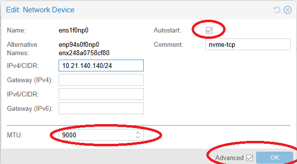
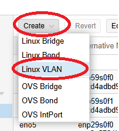
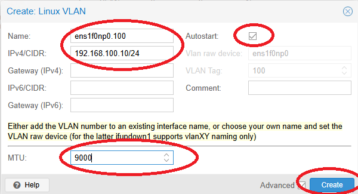
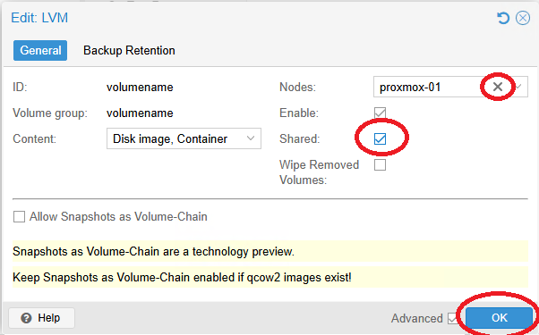

# NVMe-TCP on Proxmox VE - Quick Start Guide

Generic guide for configuring NVMe over TCP storage on Proxmox VE using native CLI tools.

> **Distribution-Specific Guides:** For detailed guides tailored to specific Linux distributions, see:
> - [RHEL/Rocky/AlmaLinux Quick Start](../../distributions/rhel/nvme-tcp/QUICKSTART.md)
> - [Debian/Ubuntu Quick Start](../../distributions/debian/nvme-tcp/QUICKSTART.md)
> - [SUSE/openSUSE Quick Start](../../distributions/suse/nvme-tcp/QUICKSTART.md)
> - [Oracle Linux Quick Start](../../distributions/oracle/nvme-tcp/QUICKSTART.md)

---

## ⚠️ Important Disclaimers

> **Vendor Documentation Priority:**
> - This guide is **specific to Pure Storage configurations** and should be used in conjunction with official vendor documentation
> - Always consult and follow **Proxmox VE official documentation** for complete system configuration
> - In case of any conflicts between this guide and vendor documentation, **vendor documentation takes precedence**
>
> **Testing Requirements:**
> - All configurations and recommendations in this guide are **for reference only**
> - **Test thoroughly in a lab environment** before implementing in production
> - Validate all settings with your specific hardware, software versions, and workload requirements
> - Performance and compatibility may vary based on your environment
>
> **Support:**
> - For Pure Storage-specific issues, contact Pure Storage Support
> - For Proxmox VE issues, consult Proxmox documentation or community forums
> - This guide is provided as-is without warranty

---

## Prerequisites

- Proxmox VE 9.x or later
- NVMe-TCP storage array with:
  - Portal IP address(es) and port
  - Subsystem NQN
- Dedicated network interfaces for storage traffic (recommended)
- Network connectivity between Proxmox nodes and storage

## Key Terminology

> **📖 New to NVMe-TCP?** See the complete [Storage Terminology Glossary](../common/includes/glossary.md) for definitions of all terms used in this guide.

| Term | Definition |
|------|------------|
| **NQN** | NVMe Qualified Name - unique identifier for hosts and subsystems |
| **Subsystem** | NVMe storage entity containing one or more namespaces (analogous to iSCSI target) |
| **Namespace** | Individual NVMe storage volume (analogous to iSCSI LUN) |
| **Portal** | IP address and port for NVMe-TCP access (data: 4420, discovery: 8009) |
| **Host NQN** | Unique identifier for this host, stored in `/etc/nvme/hostnqn` |
| **Native Multipath** | Kernel-level multipathing for NVMe, enabled via `nvme_core multipath=Y` |

## Step 1: Configure Network Interfaces (All Nodes)

For optimal performance and reliability, configure dedicated network interfaces for NVMe-TCP traffic.

### Option A: Dedicated Physical Interfaces (Recommended)

Use separate physical NICs for storage traffic. No VLAN tagging, direct connection to storage network. Replace the interface names with your actual interface names.  Replace the IPs with your actual host IP addresses.

#### GUI Configuration

Go to:  Datacenter -> `<node>` -> System -> Network. Select the interface and click Edit.  


Set the IP address and MTU to 9000 (or 1500 if jumbo frames not configured on your network.  This configuration is in the advanced section).  Enable Autostart.  Click OK.
Gateway configuration should not be necessary.  It is recommended that the interfaces are on the same subnet as the storage endpoints.  If this is not the case manual routing will be necessary.

 

Repeat for each interface.

Apply the configuration.

Repeat for each node.


#### CLI Configuration

On each Proxmox node:

Edit `/etc/network/interfaces`:

```bash
# Storage interface 1 - dedicated physical NIC
auto <INTERFACE_NAME_1>
iface <INTERFACE_NAME_1> inet static
    address <PORTAL_IP_1>/<CIDR>
    mtu 9000

# Storage interface 2 - dedicated physical NIC
auto <INTERFACE_NAME_2>
iface <INTERFACE_NAME_2> inet static
    address <PORTAL_IP_2>/<CIDR>
    mtu 9000
```


### Option B: VLAN Interfaces on Physical NICs

If you need to share physical NICs, use VLAN interfaces. This configuration can be applied directly to stand alone interfaces or to the phyiscal interfaces in a bond.  Replace the interface names with your actual interface names.  Replace the IPs with your actual host IP addresses, and `100` with your actual VLAN ID(s):

#### GUI Configuration

Go to:  Datacenter -> `<node>` -> System -> Network. Select the interface and click Edit.


Enable Autostart if it is not already enabled.  Set the MTU to 9000 (or 1500 if jumbo frames are not configured on your network).  If there is already an IP address assigned to the interface, leave it.  This can be configured on interfaces that are part of a bond as well (these should already be active).  Click OK.

 

Repeat for each interface.

Create a Linux VLAN Interface.  Click on Create -> Linux VLAN

 

Name the new vlan inteface in the format of `<physical_interface>.<vlan_id>` (`ens1f0np0.100` in the example below).  This should match the name of the physical interface that the VLAN is being created on.  Notice the VLAN Tag field is not editable but shows the VLAN ID from the interface name.  Set the IP address and MTU to 9000 (or 1500 if jumbo frames are not supported).  Enable Autostart.  Click Create.

 

Repeat for each physical interface and VLAN ID that needs to be configured.

Apply the configuration

Repeat for each node.


#### CLI Configuration

SSH to the Proxmox node and run the following commands:

##### Load 8021q module if necessary.  On Proxmox this is already enabled on Proxmox VE

```bash
# Load 8021q module for VLANs
modprobe 8021q
echo "8021q" >> /etc/modules-load.d/vlans.conf
```
##### Configure VLAN interfaces

Edit `/etc/network/interfaces`:

```bash
# Physical interface (no IP, just up)
auto <INTERFACE_NAME_1>
iface <INTERFACE_NAME_1> inet manual
    mtu 9000

# Storage VLAN 100 on <INTERFACE_NAME_1>
auto <INTERFACE_NAME_1>.<VLAN_ID>
iface <INTERFACE_NAME_1>.<VLAN_ID> inet static
    address <PORTAL_IP_1>/<CIDR>
    vlan-raw-device <INTERFACE_NAME_1>
    mtu 9000

# Physical interface 2 (no IP, just up)
auto <INTERFACE_NAME_2>
iface <INTERFACE_NAME_2> inet manual
    mtu 9000

# Storage VLAN 101 on <INTERFACE_NAME_2>
auto <INTERFACE_NAME_2>.<VLAN_ID>
iface <INTERFACE_NAME_2>.<VLAN_ID> inet static
    address <PORTAL_IP_2>/<CIDR>
    vlan-raw-device <INTERFACE_NAME_2>
    mtu 9000
```

##### Apply Network Configuration

```bash
# Apply changes
ifreload -a

# Verify interfaces are up
ip addr show <INTERFACE_NAME_1>.<VLAN_ID>
ip addr show <INTERFACE_NAME_2>.<VLAN_ID>

# Test connectivity to storage portals
ping -I <INTERFACE_NAME_1> <PORTAL_IP_1>
ping -I <INTERFACE_NAME_1> <PORTAL_IP_2>
ping -I <INTERFACE_NAME_2> <PORTAL_IP_1>
ping -I <INTERFACE_NAME_2> <PORTAL_IP_2>
```

Repeat on each node

### Network Design Notes

- **Jumbo frames (MTU 9000)**: Recommended for storage traffic. Ensure switches and storage support jumbo frames end-to-end.
- **Same Subnet**:  This configuration assumes the same subnet.  Multiple subnets may be used if needed.
- **No bonding**: Do not use a bond interface for storage. If the interfaces are part of a bond the inerface name or raw device setting will apply the configuration to the specific interface.
- **No Routing Of Storage Traffic**:  The interfaces should be on the same subnet as the storage endpoints.  If this is not the case manual routing will be necessary.
- **⚠️ ARP Configuration Required for Same-Subnet**: When using multiple interfaces on the same subnet, proper ARP configuration (`arp_ignore=2`, `arp_announce=2`) is **critical** to prevent routing issues. See [ARP Configuration for Same-Subnet Multipath](../../common/includes/network-concepts.md#arp-configuration-for-same-subnet-multipath) and the [Best Practices Guide](./BEST-PRACTICES.md) for detailed configuration.

## Step 2: Install Dependencies (All Nodes)

Run on every Proxmox node:

```bash
# Install nvme-cli
apt-get update
apt-get install -y nvme-cli

# Load kernel modules
modprobe nvme
modprobe nvme-tcp
modprobe nvme-core

# Make modules load on boot
cat > /etc/modules-load.d/nvme-tcp.conf << 'EOF'
nvme
nvme-tcp
nvme-core
EOF

# Make multipath persistent across reboots
echo 'options nvme_core multipath=Y' > /etc/modprobe.d/nvme-tcp.conf
```

## Step 3: Generate Host NQN (All Nodes)

```bash
# Create directory
mkdir -p /etc/nvme

# Generate host NQN if it doesn't exist
if [ ! -f /etc/nvme/hostnqn ]; then
    nvme gen-hostnqn > /etc/nvme/hostnqn
fi

# Display host NQN - register this with your storage array
cat /etc/nvme/hostnqn
```

**Important:** Add each node's host NQN to your storage array's allowed hosts list.

## Step 4: Discover Targets (Optional)

Replace the `<PORTAL_IP_X>` with your actual portal IP addresses.  Replace `<INTERFACE_NAME>` with your actual interface name.  Replace `<INTERFACE_IP>` with the IP address of the interface.

**Port Note:** Port 8009 is the NVMe-oF Discovery Controller port, used only for discovering available subsystems. Port 4420 is the NVMe-TCP data port, used for actual connections. Some storage arrays support discovery on port 4420 as well.

```bash
# Discover available NVMe subsystems via specific interface
# Port 8009 = Discovery Controller port (standard)
nvme discover -t tcp \
    -a <PORTAL_IP_1> \
    -s 8009 \
    --host-iface=<INTERFACE_NAME> \
    --host-traddr=<INTERFACE_IP>
```

## Step 5: Connect to NVMe-TCP Target (All Nodes)

Run on **every Proxmox node**. Each interface connects to ALL portals for maximum path redundancy.
With 2 interfaces and 4 portals, you get 8 paths total.  Replace `<PORTAL_IP_X>` with your actual portal IP addresses, and `<SUBSYSTEM_NQN>` with your actual subsystem NQN.  Replace `<INTERFACE_NAME_1>` and `<INTERFACE_NAME_2>` with your actual interface names.  Replace `<PORTAL_IP_1>` and `<PORTAL_IP_2>` with your actual host IP addresses.  Replace 4420 with your actual port if different.  The example below assumes you have 4 portals.  If you have more or less, adjust accordingly.

```bash
# Interface 1 -> All Portals
nvme connect -t tcp -a <PORTAL_IP_1> -s 4420 -n <SUBSYSTEM_NQN> \
    --host-iface=<INTERFACE_NAME_1> --host-traddr=<PORTAL_IP_1> \
    --ctrl-loss-tmo=1800 --reconnect-delay=10

nvme connect -t tcp -a <PORTAL_IP_2> -s 4420 -n <SUBSYSTEM_NQN> \
    --host-iface=<INTERFACE_NAME_1> --host-traddr=<INTERFACE_IP_1> \
    --ctrl-loss-tmo=1800 --reconnect-delay=10

nvme connect -t tcp -a <PORTAL_IP_3> -s 4420 -n <SUBSYSTEM_NQN> \
    --host-iface=<INTERFACE_NAME_1> --host-traddr=<INTERFACE_IP_1> \
    --ctrl-loss-tmo=1800 --reconnect-delay=10

nvme connect -t tcp -a <PORTAL_IP_4> -s 4420 -n <SUBSYSTEM_NQN> \
    --host-iface=<INTERFACE_NAME_1> --host-traddr=<INTERFACE_IP_1> \
    --ctrl-loss-tmo=1800 --reconnect-delay=10

# Interface 2 -> All Portals
nvme connect -t tcp -a <PORTAL_IP_1> -s 4420 -n <SUBSYSTEM_NQN> \
    --host-iface=<INTERFACE_NAME_2> --host-traddr=<INTERFACE_IP_2> \
    --ctrl-loss-tmo=1800 --reconnect-delay=10

nvme connect -t tcp -a <PORTAL_IP_2> -s 4420 -n <SUBSYSTEM_NQN> \
    --host-iface=<INTERFACE_NAME_2> --host-traddr=<INTERFACE_IP_2> \
    --ctrl-loss-tmo=1800 --reconnect-delay=10

nvme connect -t tcp -a <PORTAL_IP_3> -s 4420 -n <SUBSYSTEM_NQN> \
    --host-iface=<INTERFACE_NAME_2> --host-traddr=<INTERFACE_IP_2> \
    --ctrl-loss-tmo=1800 --reconnect-delay=10

nvme connect -t tcp -a <PORTAL_IP_4> -s 4420 -n <SUBSYSTEM_NQN> \
    --host-iface=<INTERFACE_NAME_2> --host-traddr=<INTERFACE_IP_2> \
    --ctrl-loss-tmo=1800 --reconnect-delay=10
```

Verify connection:
```bash
# List subsystems and paths (should show 8 paths)
nvme list-subsys

# List NVMe devices
nvme list

# Check block devices
lsblk | grep nvme
```

## Step 6: Configure IO Policy with udev (All Nodes)

Create a udev rule to automatically set the IO policy when NVMe subsystems are created:

```bash
# Create udev rule for NVMe IO policy
cat > /etc/udev/rules.d/99-nvme-iopolicy.rules << 'EOF'
# Set IO policy to queue-depth for all NVMe subsystems
ACTION=="add", SUBSYSTEM=="nvme-subsystem", ATTR{iopolicy}="queue-depth"
EOF

# Reload udev rules
udevadm control --reload-rules
udevadm trigger

# Apply to existing subsystems (for current session)
for subsys in /sys/class/nvme-subsystem/nvme-subsys*; do
    echo "queue-depth" > "$subsys/iopolicy" 2>/dev/null || true
done

# Verify
cat /sys/class/nvme-subsystem/nvme-subsys*/iopolicy
```

The udev rule ensures the IO policy is set automatically on every boot and whenever new subsystems are connected.

## Step 7: Configure Persistent Connections (All Nodes)

Use the native nvme-cli discovery configuration for automatic connections on boot.
Each interface connects to ALL portals for maximum redundancy (2 interfaces × 4 portals = 8 paths).

### Option A: Discovery Controller Configuration (Recommended)

Create a discovery configuration file:

```bash
# Create config directory
mkdir -p /etc/nvme

# Create discovery.conf - one entry per path (interface + portal combination)
# 2 interfaces x 4 portals = 8 entries
cat > /etc/nvme/discovery.conf << 'EOF'
# NVMe-TCP Discovery Configuration
# Each line defines one path: host interface -> storage portal
# Format: --transport=tcp --traddr=<portal> --trsvcid=<port> --host-iface=<iface> --host-traddr=<host-ip>

# Interface 1 -> All Portals
--transport=tcp --traddr=<PORTAL_IP_1> --trsvcid=4420 --host-iface=<INTERFACE_NAME_1> --host-traddr=<INTERFACE_IP_1>
--transport=tcp --traddr=<PORTAL_IP_2> --trsvcid=4420 --host-iface=<INTERFACE_NAME_1> --host-traddr=<INTERFACE_IP_1>
--transport=tcp --traddr=<PORTAL_IP_3> --trsvcid=4420 --host-iface=<INTERFACE_NAME_1> --host-traddr=<INTERFACE_IP_1>
--transport=tcp --traddr=<PORTAL_IP_4> --trsvcid=4420 --host-iface=<INTERFACE_NAME_1> --host-traddr=<INTERFACE_IP_1>

# Interface 2 -> All Portals
--transport=tcp --traddr=<PORTAL_IP_1> --trsvcid=4420 --host-iface=<INTERFACE_NAME_2> --host-traddr=<INTERFACE_IP_2>
--transport=tcp --traddr=<PORTAL_IP_2> --trsvcid=4420 --host-iface=<INTERFACE_NAME_2> --host-traddr=<INTERFACE_IP_2>
--transport=tcp --traddr=<PORTAL_IP_3> --trsvcid=4420 --host-iface=<INTERFACE_NAME_2> --host-traddr=<INTERFACE_IP_2>
--transport=tcp --traddr=<PORTAL_IP_4> --trsvcid=4420 --host-iface=<INTERFACE_NAME_2> --host-traddr=<INTERFACE_IP_2>
EOF
```

Enable and start the nvme-connect service:

```bash
# Enable automatic connection on boot
systemctl enable nvmf-autoconnect.service

# Connect all (discovers and connects to all subsystems via all paths.)
nvme connect-all
```

### Option B: Per-Subsystem Configuration

For more control, create individual configuration files with explicit NQN and timeouts:

```bash
# Create config directory for subsystems
mkdir -p /etc/nvme/config.d

# Create a config file for your subsystem
# 2 interfaces x 4 portals = 8 paths
cat > /etc/nvme/config.d/my-storage.conf << 'EOF'
# Subsystem: my-storage
# 8 paths: 2 interfaces x 4 portals

# Interface 1 -> All Portals
--transport=tcp --traddr=<PORTAL_IP_1> --trsvcid=4420 --host-iface=<INTERFACE_NAME_1> --host-traddr=<INTERFACE_IP_1> --nqn=<SUBSYSTEM_NQN> --ctrl-loss-tmo=1800 --reconnect-delay=10
--transport=tcp --traddr=<PORTAL_IP_2> --trsvcid=4420 --host-iface=<INTERFACE_NAME_1> --host-traddr=<INTERFACE_IP_1> --nqn=<SUBSYSTEM_NQN> --ctrl-loss-tmo=1800 --reconnect-delay=10
--transport=tcp --traddr=<PORTAL_IP_3> --trsvcid=4420 --host-iface=<INTERFACE_NAME_1> --host-traddr=<INTERFACE_IP_1> --nqn=<SUBSYSTEM_NQN> --ctrl-loss-tmo=1800 --reconnect-delay=10
--transport=tcp --traddr=<PORTAL_IP_4> --trsvcid=4420 --host-iface=<INTERFACE_NAME_1> --host-traddr=<INTERFACE_IP_1> --nqn=<SUBSYSTEM_NQN> --ctrl-loss-tmo=1800 --reconnect-delay=10

# Interface 2 -> All Portals
--transport=tcp --traddr=<PORTAL_IP_1> --trsvcid=4420 --host-iface=<INTERFACE_NAME_2> --host-traddr=<INTERFACE_IP_2> --nqn=<SUBSYSTEM_NQN> --ctrl-loss-tmo=1800 --reconnect-delay=10
--transport=tcp --traddr=<PORTAL_IP_2> --trsvcid=4420 --host-iface=<INTERFACE_NAME_2> --host-traddr=<INTERFACE_IP_2> --nqn=<SUBSYSTEM_NQN> --ctrl-loss-tmo=1800 --reconnect-delay=10
--transport=tcp --traddr=<PORTAL_IP_3> --trsvcid=4420 --host-iface=<INTERFACE_NAME_2> --host-traddr=<INTERFACE_IP_2> --nqn=<SUBSYSTEM_NQN> --ctrl-loss-tmo=1800 --reconnect-delay=10
--transport=tcp --traddr=<PORTAL_IP_4> --trsvcid=4420 --host-iface=<INTERFACE_NAME_2> --host-traddr=<INTERFACE_IP_2> --nqn=<SUBSYSTEM_NQN> --ctrl-loss-tmo=1800 --reconnect-delay=10
EOF
```

Enable and start the nvme-connect service:

```bash
# Enable automatic connection
systemctl enable nvmf-autoconnect.service

# Connect all
nvme connect-all
```

### Verify Persistent Configuration

```bash
# Check if service is enabled
systemctl is-enabled nvmf-autoconnect.service

# View current connections
nvme list-subsys

# Test by rebooting
reboot
```

After reboot, verify connections are restored:

```bash
nvme list-subsys
nvme list
```

## Step 8: Create LVM Volume Group (One Node)

### GUI

Run on **on node only**:

Go to: Datacenter -> `<Node>` -> Disks.  Make sure the NVMe device is visible.


If it is not click reload.

Go to LVM and create a new volume group with the new device.


Select the device and name the volume group.  Make sure to keep "Add Storage" checked and click "Create".


The new volume group should now be visible in the storage list.  The shared configuration is not yet enabled and the storage is not yet available to the other nodes.

Go to: Datacenter -> Storage.  Select the volume group and click "Edit".  Check the "Shared" box.  Enable the volume on other nodes by either selecting them in the Nodes drop down or by clearing the Nodes field by clicking the "x" to the right of the field.  Click "OK".



The storage should now be enabled on all nodse or the selected nodes.  If a node has a "?" overlay on the icon for the volume or the status says "unknown" on a node:


SSH to the node and run the following command:

```bash
pvscan --cache
```

Repeat for all nodes that have this status.

This should update the nodes cache of LVM volumes and the storage should now be available.

### CLI
Run on **one node only**:

```bash
# List NVMe namespaces
lsblk | grep nvme

# Create LVM physical volume (use your device)
pvcreate /dev/nvme0n1

# Create volume group
vgcreate nvme-vg /dev/nvme0n1

# Verify
vgs
pvs
```

#### Add LVM Storage to Proxmox (One Node)

Run on **one node only** (config syncs via cluster):

```bash
# Add LVM storage
pvesm add lvm nvme-datastore \
    --vgname nvme-vg \
    --content images,rootdir \
    --shared 1

# Verify
pvesm status
```

#### Activate VG on Other Nodes

Run on **each additional node**:

```bash
pvscan --cache
```


#### Verify Setup (All Nodes)

```bash
# Check NVMe connections
nvme list-subsys

# Check IO policy
cat /sys/class/nvme-subsystem/nvme-subsys*/iopolicy

# Check Proxmox storage
pvesm status

# Check LVM
vgs
lvs
```

---

## Quick Reference

| Command | Description |
|---------|-------------|
| `nvme list` | List NVMe devices |
| `nvme list-subsys` | List subsystems and paths |
| `nvme discover -t tcp -a <ip> -s 8009` | Discover targets (port 8009 = discovery controller) |
| `nvme connect -t tcp -a <ip> -s 4420 -n <nqn>` | Connect to target (port 4420 = data port) |
| `nvme disconnect -n <nqn>` | Disconnect from target |
| `cat /sys/class/nvme-subsystem/*/iopolicy` | Check IO policy |

## Disconnect

```bash
# Disconnect from subsystem
nvme disconnect -n <NQN>

# Or disconnect all
nvme disconnect-all
```
