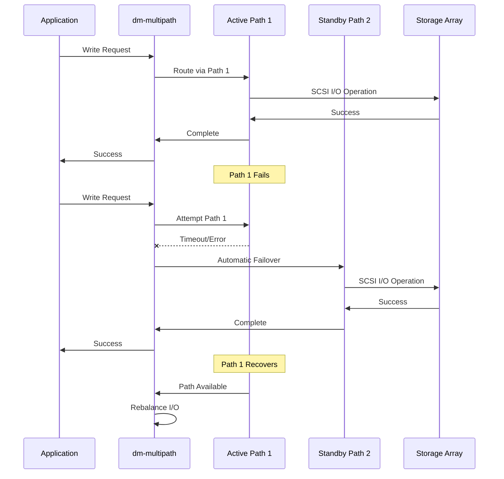
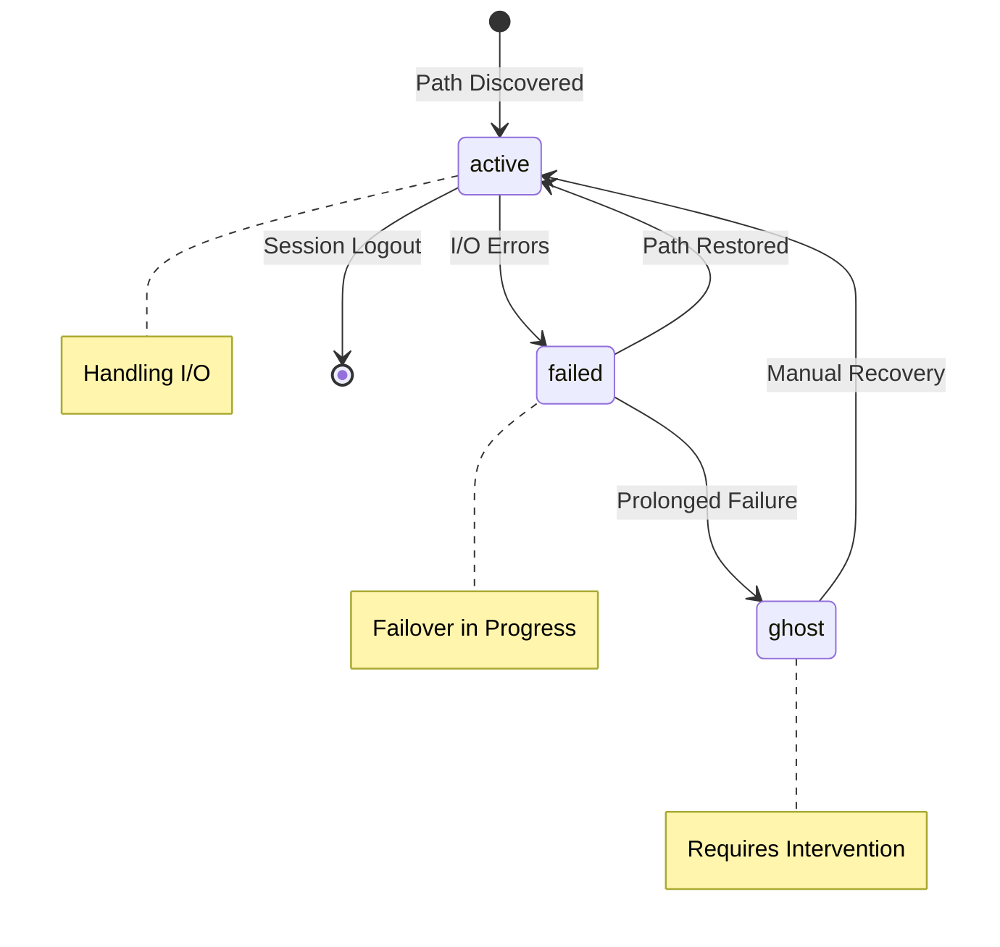
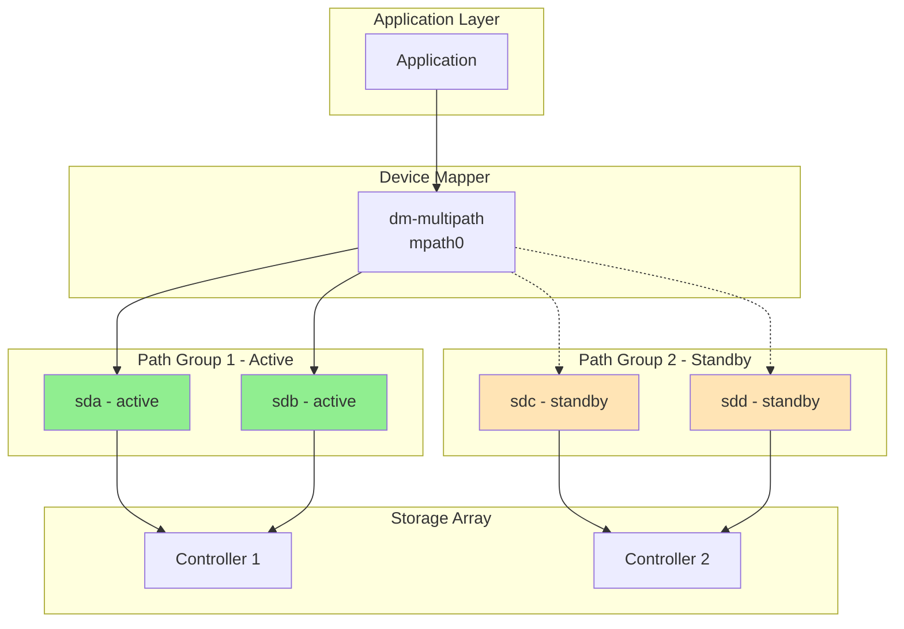

# Failover Diagrams (iSCSI)

Failover behavior diagrams for iSCSI with dm-multipath.

## iSCSI/dm-multipath Failover Sequence



## Failover Timing

### iSCSI Failover Parameters

| Parameter | Default | Recommended | Description |
|-----------|---------|-------------|-------------|
| `replacement_timeout` | 120s | 20s | Time before failing over to alternate path |
| `fast_io_fail_tmo` | 5s | 5s | Time before marking path as failed |
| `no_path_retry` | fail | queue | Behavior when all paths fail |
| `polling_interval` | 5s | 5s | Path checking frequency |

**Configure timeouts in /etc/iscsi/iscsid.conf:**
```bash
# Aggressive failover (faster, may cause false positives in busy networks)
node.session.timeo.replacement_timeout = 20

# Conservative failover (slower, more tolerant of network glitches)
node.session.timeo.replacement_timeout = 60
```

## Path States



## dm-multipath Path Groups



## Failback Behavior

**Automatic failback** (default for active/active arrays):
- When failed path recovers, I/O is automatically rebalanced
- No manual intervention required

**Manual failback** (for active/passive arrays):
```bash
# Check current path states
multipathd show paths

# Force path check
multipathd reconfigure

# Manually switch path group
multipathd switchgroup <multipath_device> <group_number>
```

