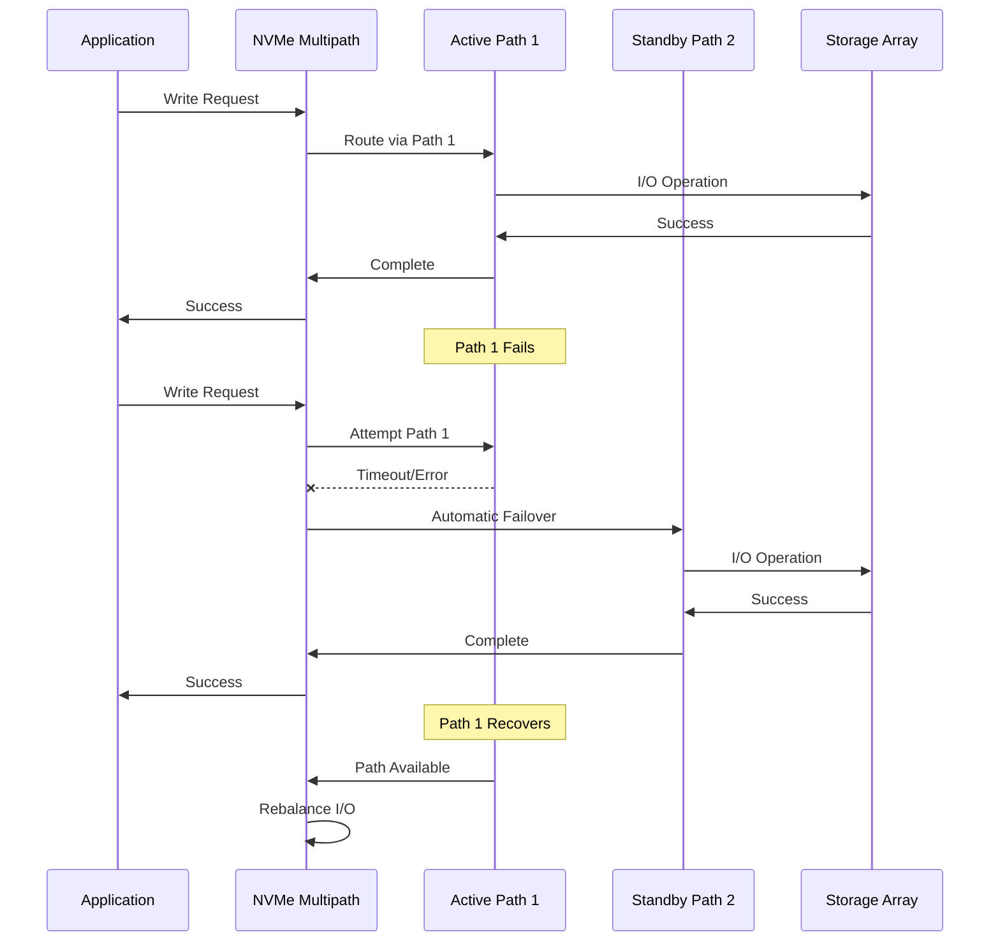

# Failover Diagrams

Failover behavior diagrams for NVMe-TCP.

## NVMe-TCP Failover Sequence

## NVMe-TCP Failover Parameters

| Parameter | Default | Recommended | Description |
|-----------|---------|-------------|-------------|
| `ctrl-loss-tmo` | 600s | 1800s | Time before controller considered lost |
| `reconnect-delay` | 10s | 10s | Delay between reconnection attempts |
| `nr_io_queues` | CPU count | - | Number of IO queues per controller |

> **Note:** NVMe-TCP uses native NVMe multipathing built into the Linux kernel. This is NOT dm-multipath (`multipath.conf`, `multipathd`) - those are for iSCSI/Fibre Channel only.

## NVMe-TCP APD (All Paths Down) Behavior

When all paths to an NVMe controller are lost:

1. **ctrl-loss-tmo timer starts** - Default 600s (recommended: 1800s for production)
2. **Reconnection attempts** - NVMe driver attempts reconnection every `reconnect-delay` seconds
3. **If timer expires** - Controller is removed and I/O fails to application
4. **If path recovers** - I/O automatically resumes without intervention

