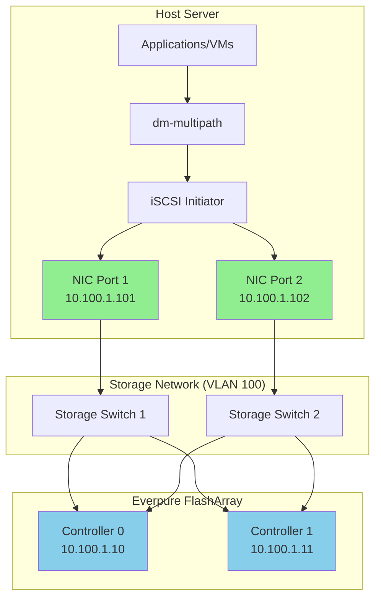
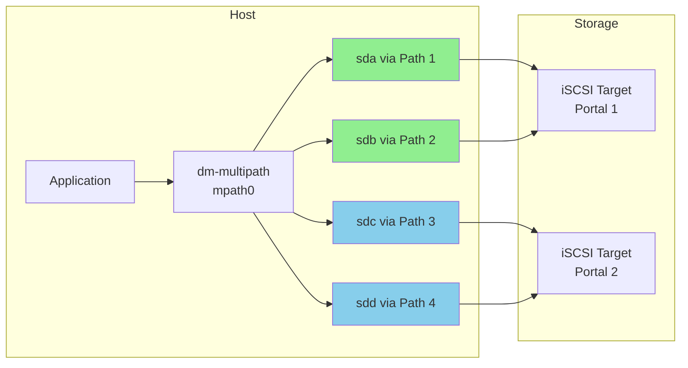

# Storage Network Topology (iSCSI)

## Recommended iSCSI Network Architecture

## Key Design Principles

### Redundancy at Every Level
- **Dual NICs**: Separate physical ports for each storage path
- **Dual Switches**: Eliminate single point of failure in network
- **Dual Controllers**: Active-active storage controllers

### Network Isolation
- **Dedicated VLAN**: Storage traffic isolated from management/VM traffic
- **Jumbo Frames**: MTU 9000 for optimal performance
- **No Routing**: Layer 2 connectivity between hosts and storage

## iSCSI Path Flow

## Physical Cabling

| Component | Connection | Purpose |
|-----------|------------|---------|
| NIC Port 1 | Switch 1 | Primary iSCSI path |
| NIC Port 2 | Switch 2 | Secondary iSCSI path |
| Storage CT0 | Both Switches | Controller 0 connectivity |
| Storage CT1 | Both Switches | Controller 1 connectivity |

## Network Configuration Summary

| Parameter | Recommendation |
|-----------|----------------|
| MTU | 9000 (jumbo frames) |
| VLAN | Dedicated storage VLAN |
| Flow Control | Enabled (send/receive) |
| Speed | 10/25/100 GbE |
| Duplex | Full |

