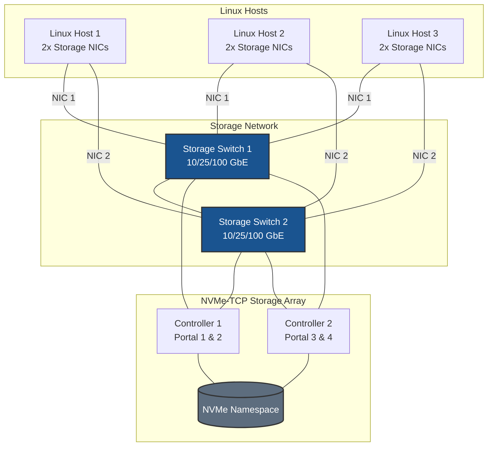
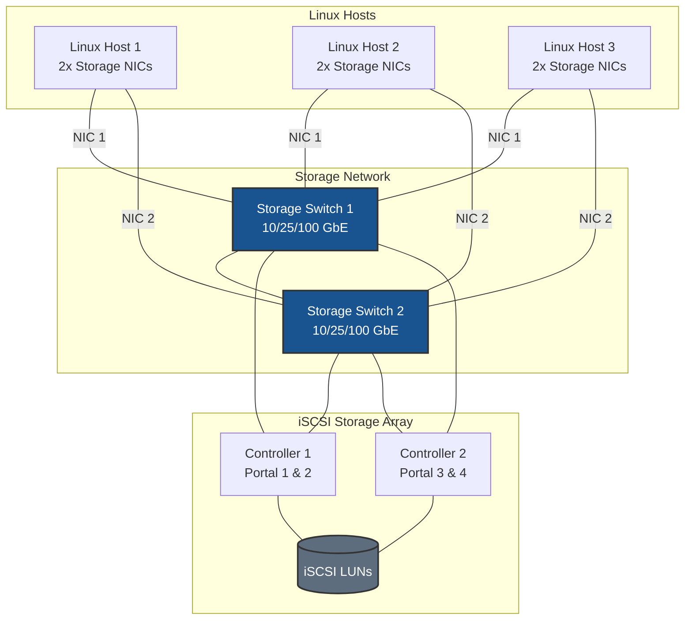

# Storage Topology Diagrams

Common storage topology diagrams for Linux storage documentation.

## Standard Deployment Topology

### NVMe-TCP Deployment

### iSCSI Deployment

## Key Design Principles

| Component | Best Practice |
|-----------|---------------|
| **Switches** | Dual switches for redundancy |
| **NICs** | Minimum 2 per host for multipath |
| **Controllers** | Dual controller array for HA |
| **Paths** | 2 NICs × 4 portals = 8 paths |

