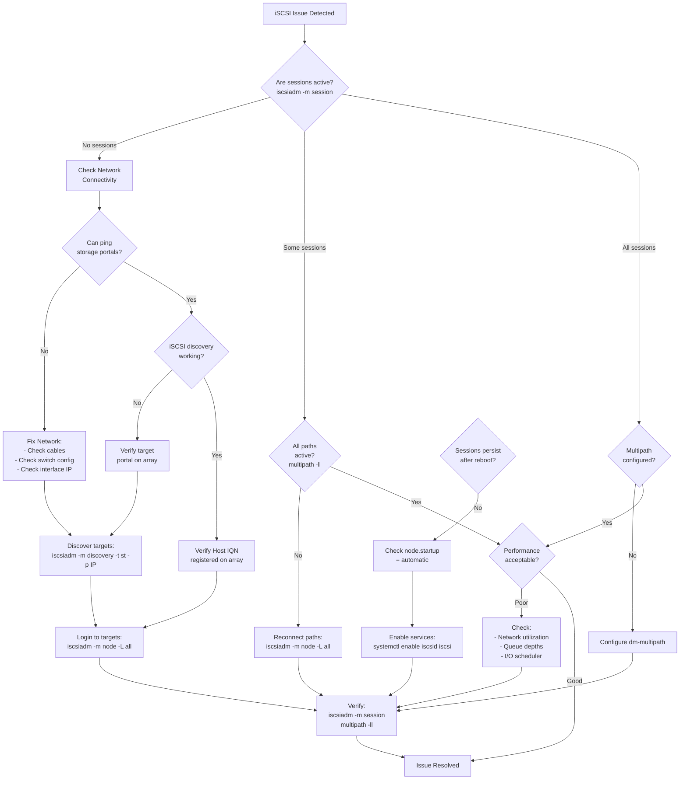
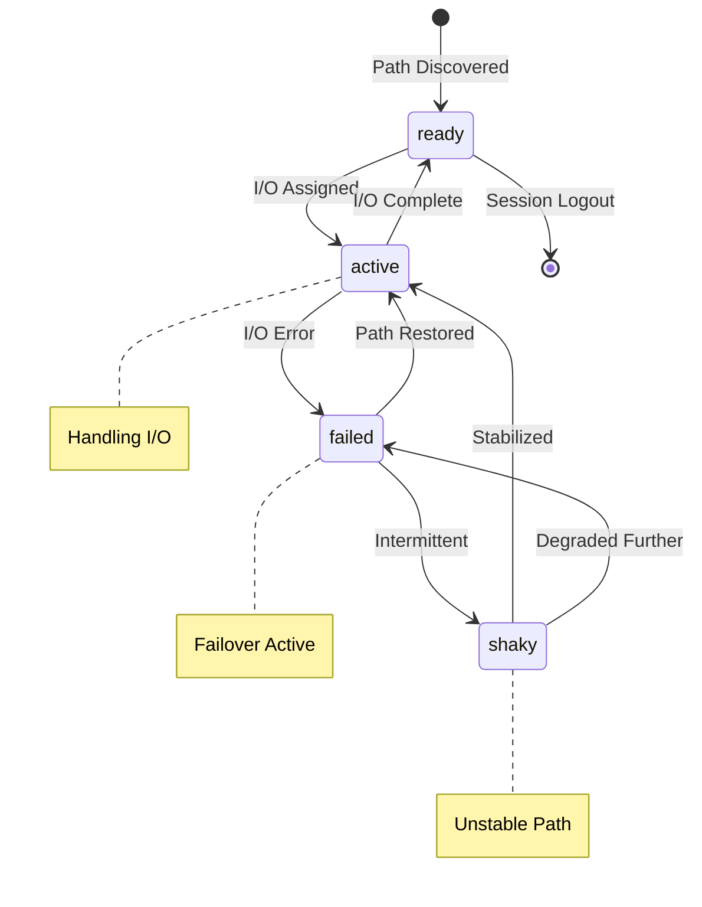

# Troubleshooting Diagrams (iSCSI)

Common troubleshooting diagrams for iSCSI connectivity issues.

## iSCSI Troubleshooting Flowchart

## Multipath State Diagram

## Quick Reference Table

| Step | Command | Purpose |
|------|---------|---------|
| 1 | `iscsiadm -m session` | Show active sessions |
| 2 | `iscsiadm -m session -P 3` | Detailed session info |
| 3 | `multipath -ll` | Show multipath status |
| 4 | `multipathd show paths` | Show all path states |
| 5 | `iostat -xz 1` | I/O statistics |
| 6 | `dmesg \| grep iscsi` | Check for errors |

