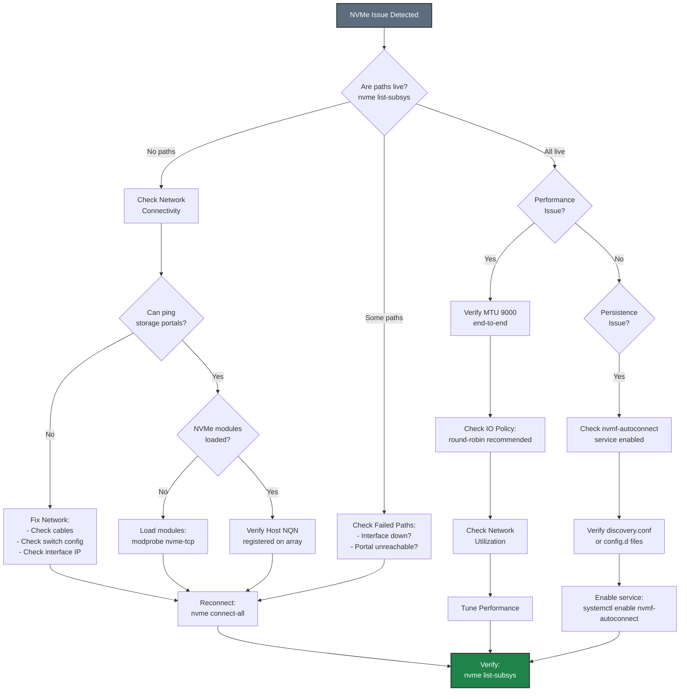

# Troubleshooting Flowcharts

Common troubleshooting diagrams for NVMe-TCP storage connectivity issues.

## NVMe-TCP Troubleshooting Flowchart

## Quick Diagnostic Commands

| Command | Purpose |
|---------|---------|
| `nvme list-subsys` | Show subsystems and path status |
| `nvme list` | List connected namespaces |
| `nvme discover -t tcp -a <ip>` | Discover available subsystems |
| `cat /sys/class/nvme-subsystem/nvme-subsys*/iopolicy` | Check IO policy |
| `dmesg \| grep nvme` | NVMe kernel messages |
| `ip addr` | Network interface status |

