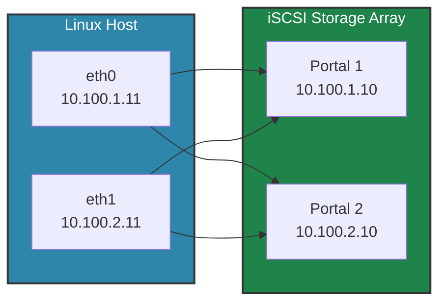
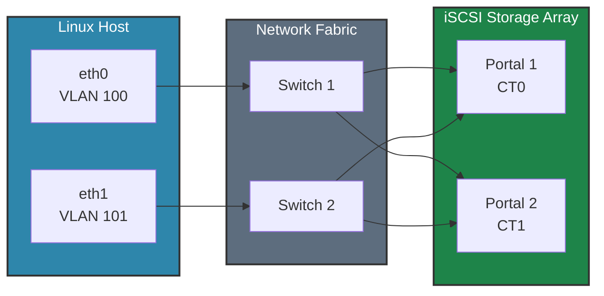
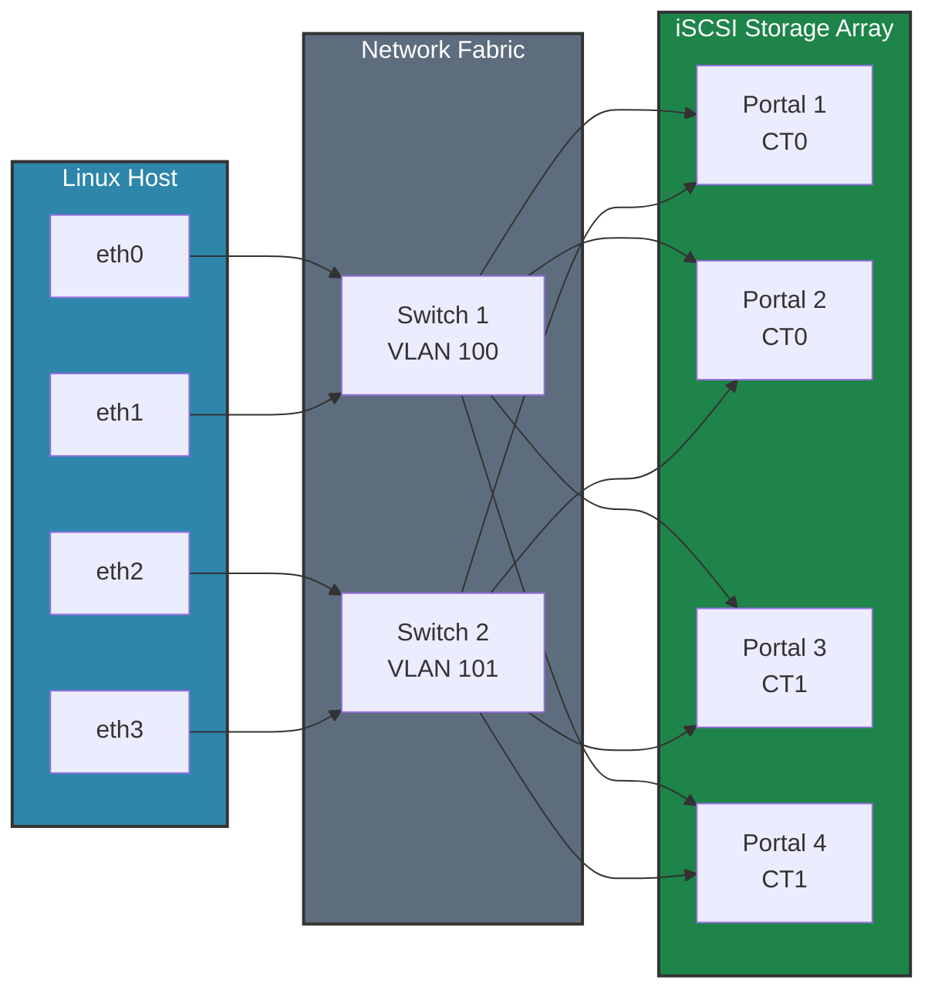

> **⚠️ Disclaimer:** This content is for reference only. Always consult official vendor documentation for your distribution and storage array. Test thoroughly in a lab environment before production use. In case of conflicts, vendor documentation takes precedence.

## iSCSI Architecture and Design

### iSCSI Components

**Initiator (Host/Client):**
- Software or hardware component that initiates iSCSI connections
- Identified by IQN (iSCSI Qualified Name)
- Example: `iqn.1994-05.com.redhat:hostname`

**Target (Storage Array):**
- Storage device that receives iSCSI connections
- Also identified by IQN
- Example: `iqn.2010-06.com.storagevendor:array.12345abc`

**Portal:**
- IP address and port combination for iSCSI access
- Default port: 3260
- Example: `10.100.1.10:3260`

**LUN (Logical Unit Number):**
- Individual storage volume presented to initiator
- Appears as block device (e.g., /dev/sda)

### Network Architecture Principles

**1. Dedicated Storage Network**
- *Why*: Isolates storage I/O from other traffic
- *Benefit*: Prevents bandwidth contention, enables QoS
- *Implementation*: Dedicated VLANs or physical networks

**2. Redundant Paths**
- *Why*: Eliminates single points of failure
- *Benefit*: High availability and load balancing
- *Implementation*: Multiple NICs and switches

**3. Jumbo Frames (MTU 9000)**
- *Why*: Reduces CPU overhead and improves throughput
- *Benefit*: Improved performance (verify with benchmarks in your environment)
- *Requirement*: Must be configured end-to-end

**4. No Default Gateway**
- *Why*: Prevents routing storage traffic
- *Benefit*: Keeps storage traffic local and secure
- *Implementation*: Static routes only if needed

### Recommended Topologies

#### Topology 1: Basic Redundancy (2×2)



**Paths:** 2 NICs × 2 Portals = 4 paths

**Pros:**
- Simple configuration
- Good redundancy
- Adequate for most workloads

**Cons:**
- Limited bandwidth
- Single switch = single point of failure

#### Topology 2: High Availability (2×2 with Redundant Switches)



**Paths:** 2 NICs × 2 Portals = 4 paths

**Pros:**
- No single point of failure
- Switch maintenance without downtime
- Production-ready

**Cons:**
- Requires two switches
- More complex cabling

#### Topology 3: Maximum Performance (4×4)



**Paths:** 4 NICs × 4 Portals = 16 paths

**Pros:**
- Maximum bandwidth and redundancy
- Excellent for high-performance workloads
- Can sustain multiple failures

**Cons:**
- Requires more NICs and switch ports
- More complex configuration

### VLAN Segmentation

**Why use VLANs for iSCSI:**
- Logical separation without dedicated switches
- Cost-effective redundancy
- Simplified management

**Example configuration:**
```
VLAN 100: Storage Network 1 (10.100.1.0/24)
VLAN 101: Storage Network 2 (10.100.2.0/24)

Host eth0.100 → Switch VLAN 100 → Storage Portal 1
Host eth0.101 → Switch VLAN 101 → Storage Portal 2
```

### IP Addressing Scheme

**Best practices:**
- Use dedicated subnet for storage
- Static IP addresses (no DHCP)
- Consistent naming convention
- Document all assignments

**Example:**
```
Storage Network 1: 10.100.1.0/24
  - Host NICs: 10.100.1.11-10.100.1.99
  - Storage Portals: 10.100.1.10, 10.100.1.20

Storage Network 2: 10.100.2.0/24
  - Host NICs: 10.100.2.11-10.100.2.99
  - Storage Portals: 10.100.2.10, 10.100.2.20
```

### Security Considerations

**Network isolation:**
- Dedicated VLANs or physical networks
- No routing to other networks
- Firewall rules to restrict access

**Authentication:**
- CHAP (Challenge-Handshake Authentication Protocol)
- Mutual CHAP for bidirectional authentication
- IQN-based access control on storage array

**Encryption (optional):**
- IPsec for data-in-transit encryption
- Performance impact: ~10-20%
- Required for compliance in some environments

