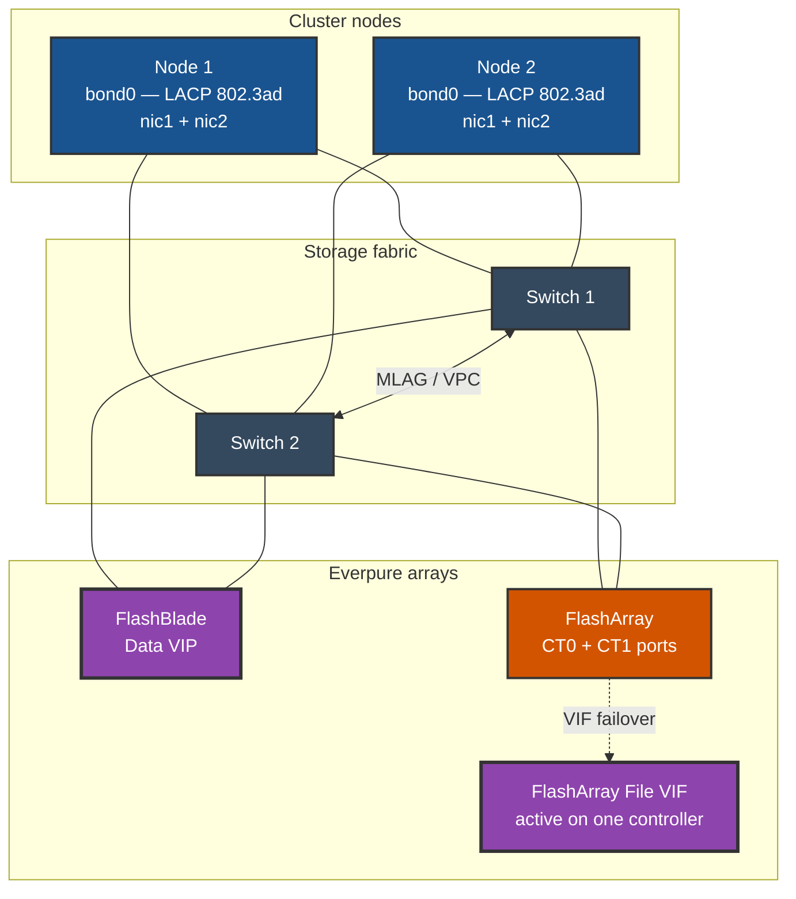

Each node carries one LACP bond built from two physical NICs, with one leg into each switch of an MLAG or VPC pair. The bond gives the node a single storage IP and survives the loss of a NIC, a cable, or an entire switch. Both arrays present a single NFS endpoint into the same storage VLAN.

Every link in the diagram is a dedicated storage VLAN at MTU 9000: node to switch, switch to switch, and switch to array. Each node contributes one bond leg to each switch, so no single switch, cable, or NIC is a single point of failure. The FlashArray File VIF is active on one controller at a time and migrates on controller failover; the FlashBlade data VIP is reachable through either switch.

Why bonding rather than two independent NICs: NFS presents a single server address, so the protocol has no path failover of its own. Block protocols do — iSCSI and NVMe-oF discover multiple portals and let the initiator or Portworx manage sessions across separate NICs, which is why those transports are often deployed without a bond. NFS has no equivalent, so link redundancy has to come from the OS bond underneath. A single unbonded NIC means a NIC failure is a storage outage.
