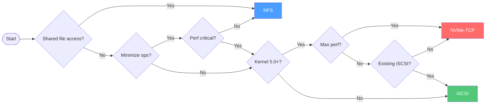
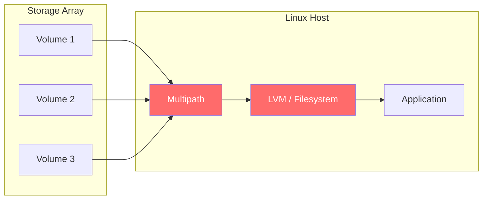
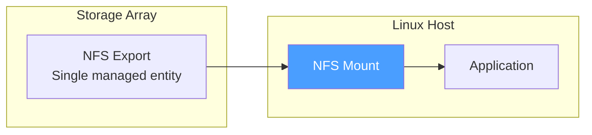
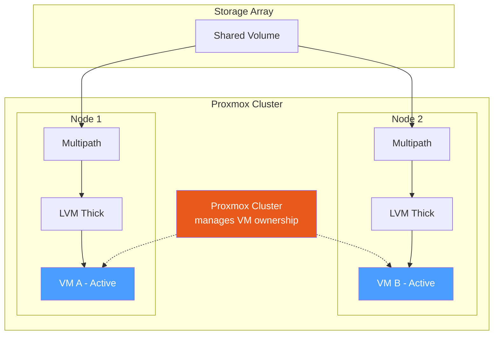
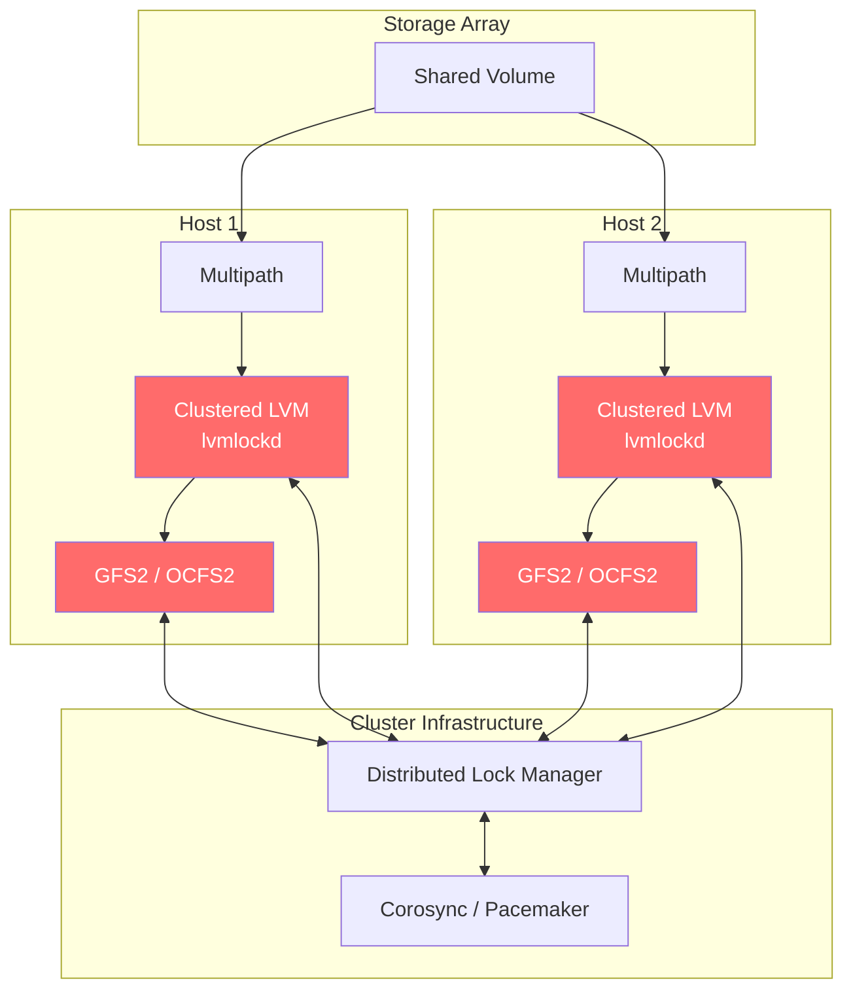
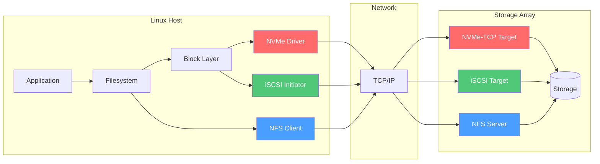

# Choosing a Storage Protocol

This guide helps you select the right storage protocol—**NVMe-TCP**, **iSCSI**, or **NFS**—for your environment.

---

## Quick Decision Flowchart



---

## Protocol Comparison

| Feature | NVMe-TCP | iSCSI | NFS |
|---------|----------|-------|-----|
| **Type** | Block | Block | File |
| **Latency** | Lowest | Low | Moderate |
| **CPU Overhead** | Lowest | Low | Higher |
| **Multi-host Access** | Yes (complex)* | Yes (complex)* | Yes (native) |
| **Host-side Volume Mgmt** | Required (LVM) | Required (LVM) | None |
| **Kernel Version** | 5.0+ | Any | Any |
| **Protocol Maturity** | Newer | Mature | Mature |
| **Multipath** | Native (ANA) | dm-multipath | VIP failover |
| **Controller Failover** | Immediate (ANA) | Immediate (ALUA) | 10-30 seconds (VIP) |

*\*Block multi-host access requires thick LVM, clustered LVM (lvmlockd), and/or cluster filesystems (GFS2/OCFS2)—significantly more complex than NFS.*

---

## Operational Overhead

One of the most significant differences between block and file protocols is **operational complexity**.

### Block Protocols (NVMe-TCP, iSCSI)

Block protocols require host-side volume management:



**Management overhead:**
- Create/resize volumes on storage array
- Configure multipath on each host
- Create LVM physical volumes, volume groups, logical volumes
- Create and manage filesystems
- Resize operations require coordination (array → multipath → LVM → filesystem)

**Resource considerations:**
- Each volume consumes array resources (metadata, connections)
- Arrays have limits on volumes per host and total volumes
- Each host maintains multipath device maps and LVM metadata
- More volumes = more objects to monitor and manage

### NFS (File Protocol)

NFS provides a simpler operational model:



**Simpler operations:**
- Mount the export—no LVM, no multipath configuration
- Capacity managed at the export level (or thin provisioned)
- No per-volume management on hosts
- Add capacity without host-side changes

**Resource advantages:**
- Fewer array objects (one export vs. many volumes)
- No multipath device overhead on hosts
- No LVM CPU/memory overhead
- Easier monitoring (fewer entities)

### Multi-host Access with Block Protocols

Block protocols **can** support multi-host access through two approaches:

#### Option 1: Hypervisor-Managed (Proxmox, etc.)

Hypervisors like Proxmox can share block storage across nodes using **LVM thick**, with the hypervisor managing VM ownership:



**How it works:**
- All nodes see the shared LVM volume group
- Proxmox cluster tracks which node owns each VM
- Only one node accesses a VM's disk at a time
- Live migration transfers ownership between nodes
- No cluster filesystem needed—hypervisor coordinates access

**Requirements:**
- **LVM thick (not thin)** — LVM-thin does not support shared access
- Each VM disk is a separate logical volume
- Proxmox manages locking and coordination

**Advantages:**
- Simpler than full cluster filesystem stack
- Hypervisor handles HA and live migration
- Block-level performance for VMs

**Trade-offs:**
- No thin provisioning (capacity allocated upfront)
- More array volumes if using per-VM volumes on array

#### Option 2: Cluster Filesystem (GFS2/OCFS2)

**May not be supported by hypervisor vendor**

For concurrent file access from multiple hosts (not hypervisor VMs), a full cluster stack is required:



**Requirements:**

| Component | Purpose |
|-----------|---------|
| **Thick LVM** | Thin LVM requires hypervisor coordination; thick for raw cluster FS |
| **Clustered LVM (lvmlockd)** | Coordinates LVM metadata across hosts |
| **Cluster filesystem (GFS2/OCFS2)** | Provides concurrent file access with distributed locking |
| **Distributed Lock Manager (DLM)** | Coordinates locks across cluster nodes |
| **Cluster stack (Corosync/Pacemaker)** | Manages cluster membership and fencing |

#### When to Use Each Approach

| Use Case | Recommended Approach |
|----------|---------------------|
| VM storage across hypervisor cluster | Hypervisor-managed (Proxmox LVM thick) |
| Oracle RAC, clustered databases | Cluster filesystem or raw block |
| Shared file access across Linux hosts | NFS (simplest) or GFS2/OCFS2 |
| General shared storage | NFS |

### Comparison Summary

| Aspect | Block (NVMe-TCP/iSCSI) | NFS |
|--------|------------------------|-----|
| **New capacity** | Create volume → configure multipath → create PV → extend VG → create/extend LV → create/extend FS | Use available space |
| **Host setup** | Multipath + LVM + filesystem | Mount command |
| **Resize operation** | Multi-step coordination | Automatic (thin) or export resize |
| **Array objects** | Many volumes per host | Single export per use case |
| **Array limits** | Volume count limits apply | Fewer objects, higher scale |
| **Monitoring** | Per-volume metrics | Per-export metrics |
| **Multi-host access** | Requires thick LVM + cluster FS + DLM | Native, no extra components |
| **Controller failover** | Immediate (multipath) | 10-30 seconds (VIP migration) |

---

## When to Use Each Protocol

### NVMe-TCP

**Best for:** High-performance workloads requiring the lowest latency.

✅ **Use when:**
- Running databases, analytics, or latency-sensitive applications
- Your kernel supports NVMe-TCP (Linux 5.0+)
- You need the most efficient CPU utilization
- You have capacity for LVM/multipath management
- Multi-host clustering with thick LVM + GFS2/OCFS2 is acceptable

❌ **Avoid when:**
- Running older kernels without NVMe-TCP support
- You want simple multi-host access (use NFS instead)
- Operational simplicity is a priority

---

### iSCSI

**Best for:** General-purpose block storage with broad compatibility.

✅ **Use when:**
- You have existing iSCSI infrastructure and expertise
- Running older kernels without NVMe-TCP support
- Broad tool and monitoring compatibility is needed
- Boot from SAN is required
- Multi-host clustering with thick LVM + GFS2/OCFS2 is acceptable

❌ **Avoid when:**
- Maximum performance is critical (use NVMe-TCP instead)
- You want simple multi-host access (use NFS instead)
- You want to minimize volume management overhead

---

### NFS

**Best for:** Shared file access with minimal operational overhead.

✅ **Use when:**
- Multiple hosts need concurrent access without cluster complexity
- Running VM images from shared storage (Proxmox, XCP-ng)
- Workloads benefit from file-level access (media files, home directories)
- Operational simplicity is a priority
- You want to minimize array object count
- Capacity needs to grow dynamically without host changes

❌ **Avoid when:**
- Running latency-sensitive databases (use block protocols)
- Maximum single-stream throughput is critical
- Application requires raw block device access

#### NFS Controller Failover

Unlike block protocols (NVMe-TCP/iSCSI) which use multipath with immediate path failover, NFS uses a **Virtual IP (VIP)** that migrates between controllers:

| Event | FlashArray Target | I/O Behavior |
|-------|-------------------|--------------|
| **Planned failover (NDO)** | < 15 seconds | I/O pauses, then resumes |
| **Unplanned failover** | < 30 seconds | I/O pauses, then resumes |

**What happens during failover:**
- NFS clients using `hard` mounts queue I/O operations (no errors returned)
- VIP migrates to standby controller
- NFSv4.1 session state (locks, opens) is recovered automatically
- Queued I/O completes in order once VIP is available

**Recommended mount options for failover resilience:**
```
vers=4.1,hard,timeo=300,retrans=2
```

- `hard` — Retry indefinitely (critical for failover)
- `timeo=300` — 30-second timeout (deciseconds)
- `retrans=2` — ~90 seconds total before major timeout, exceeds 30s failover target

> **Note:** VMs using NFS storage will experience a brief I/O pause during failover. With `hard` mounts, no errors are returned to applications—I/O simply queues and resumes automatically.

---

## Protocol Architecture



---

## Use Case Examples

| Use Case | Recommended | Reason |
|----------|-------------|--------|
| Production databases | NVMe-TCP | Lowest latency, best IOPS |
| VM storage (shared) | NFS | Multi-host access, no per-VM volumes |
| VM storage (dedicated) | NVMe-TCP or iSCSI | Block performance, single host |
| Boot volumes | iSCSI | Broad bootloader support |
| File shares | NFS | Native file access, no LVM |
| Kubernetes PVs | NVMe-TCP or iSCSI | CSI drivers use block |
| Legacy applications | iSCSI | Compatibility with older systems |
| Media/video editing | NFS | Concurrent access, simple capacity |
| Large VM fleet | NFS | Fewer array objects to manage |
| Dev/test environments | NFS | Fast provisioning, minimal setup |
| High-scale deployments | NFS | Avoid per-host volume limits |

---

## Kernel Support Matrix

| Protocol | Minimum Kernel | Recommended |
|----------|---------------|-------------|
| NVMe-TCP | 5.0 | 5.14+ |
| iSCSI | 2.6 | Any current |
| NFS v4.1 | 2.6.31 | 5.4+ (nconnect) |

Check your kernel version:
```bash
uname -r
```

---

## Next Steps

Once you've chosen a protocol, see the distribution-specific guides:

- **NVMe-TCP:** [RHEL](../distributions/rhel/nvme-tcp/QUICKSTART.md) | [Debian](../distributions/debian/nvme-tcp/QUICKSTART.md) | [SUSE](../distributions/suse/nvme-tcp/QUICKSTART.md) | [Oracle](../distributions/oracle/nvme-tcp/QUICKSTART.md) | [Proxmox](../distributions/proxmox/nvme-tcp/QUICKSTART.md)
- **iSCSI:** [RHEL](../distributions/rhel/iscsi/QUICKSTART.md) | [Debian](../distributions/debian/iscsi/QUICKSTART.md) | [SUSE](../distributions/suse/iscsi/QUICKSTART.md) | [Oracle](../distributions/oracle/iscsi/QUICKSTART.md) | [Proxmox](../distributions/proxmox/iscsi/QUICKSTART.md)
- **NFS:** [RHEL](../distributions/rhel/nfs/QUICKSTART.md) | [Debian](../distributions/debian/nfs/QUICKSTART.md) | [SUSE](../distributions/suse/nfs/QUICKSTART.md) | [Oracle](../distributions/oracle/nfs/QUICKSTART.md) | [Proxmox](../distributions/proxmox/nfs/QUICKSTART.md)

