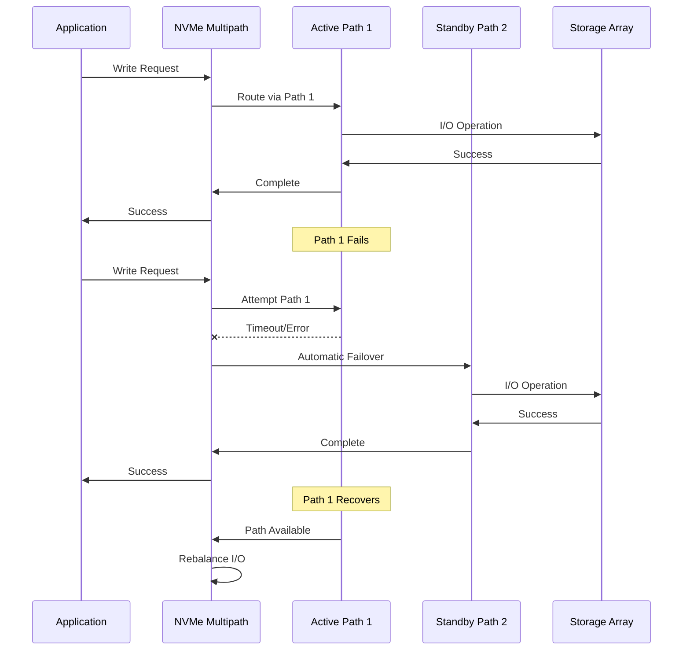
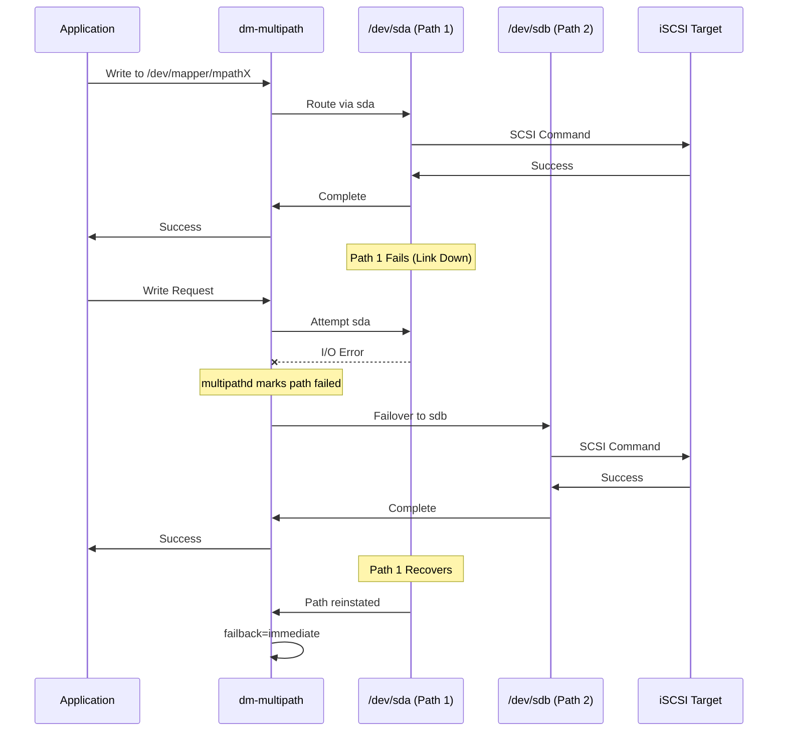
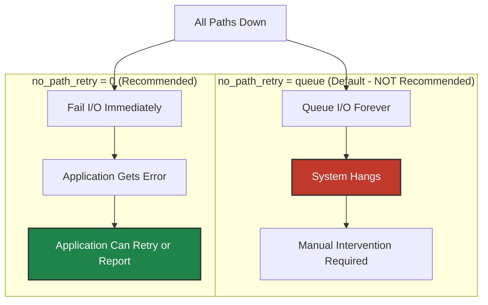

# Failover Diagrams

Failover behavior diagrams for NVMe-TCP and iSCSI.

## NVMe-TCP Failover Sequence

## iSCSI dm-multipath Failover Sequence

## Failover Timing

### NVMe-TCP Failover Parameters

| Parameter | Default | Recommended | Description |
|-----------|---------|-------------|-------------|
| `ctrl-loss-tmo` | 600s | 1800s | Time before controller considered lost |
| `reconnect-delay` | 10s | 10s | Delay between reconnection attempts |
| `nr_io_queues` | CPU count | - | Number of IO queues per controller |

### iSCSI Failover Parameters

| Parameter | Default | Recommended | Description |
|-----------|---------|-------------|-------------|
| `no_path_retry` | queue | 0 | Fail immediately vs queue forever |
| `path_checker` | - | tur | Health check method |
| `polling_interval` | 5s | 5s | Path check frequency |

## APD (All Paths Down) Behavior

