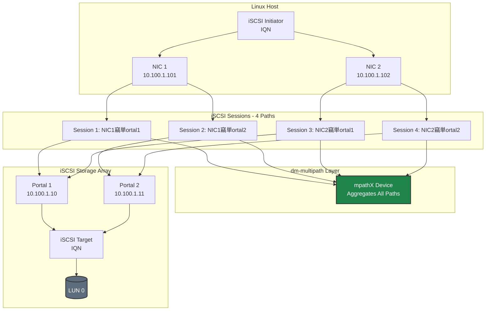

# iSCSI Multipath Diagrams

Diagrams specific to iSCSI with dm-multipath.

## iSCSI Path Redundancy Model

## dm-multipath Architecture

## ALUA Path States

## Key dm-multipath Settings

| Setting | Recommended Value | Purpose |
|---------|-------------------|---------|
| **no_path_retry** | 0 | Fail immediately when all paths down |
| **path_selector** | service-time 0 | Route based on path latency |
| **failback** | immediate | Return to optimal path when available |
| **path_checker** | tur | Test Unit Ready health check |

