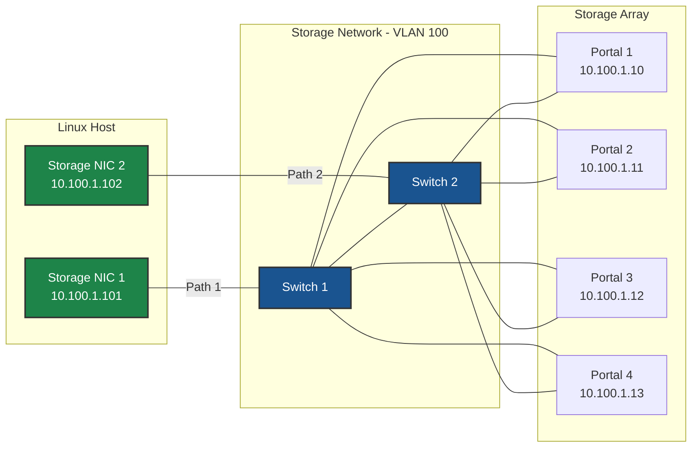
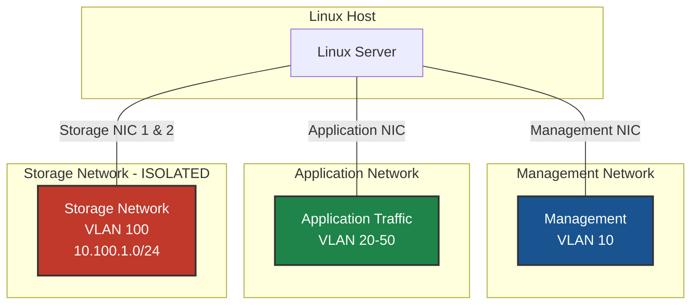

# Network Architecture Diagrams

Common network architecture diagrams for storage connectivity.

## Host Network Architecture



## Network Isolation



## Network Configuration Recommendations

| Setting | Recommendation | Why |
|---------|----------------|-----|
| **MTU** | 9000 (Jumbo Frames) | Reduces CPU overhead, improves throughput |
| **VLAN** | Dedicated storage VLAN | Isolates storage traffic |
| **Bonding** | Do NOT bond storage NICs | Preserves multipath redundancy |
| **Gateway** | None on storage interfaces | Storage traffic stays on local subnet |

## ARP Configuration for Same-Subnet Multipath

When using multiple interfaces on the same subnet, configure ARP settings:

```bash
# Required for same-subnet multipath
sysctl -w net.ipv4.conf.all.arp_ignore=2
sysctl -w net.ipv4.conf.all.arp_announce=2
```

See [ARP Configuration](./network-concepts.md#arp-configuration-for-same-subnet-multipath) for detailed explanation.

