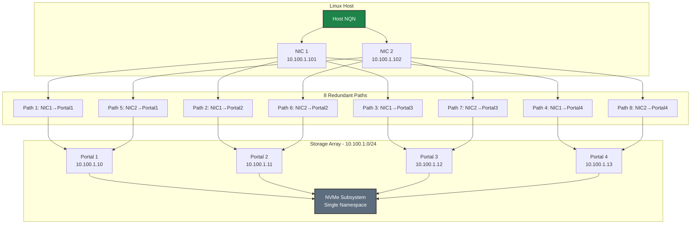
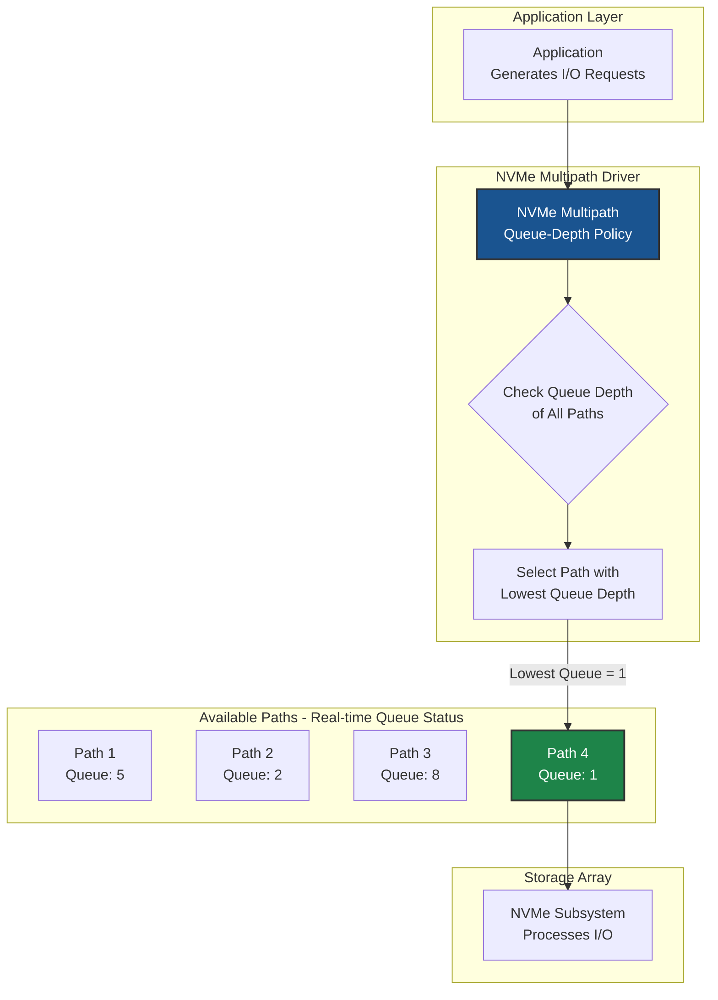

# NVMe Native Multipath Diagrams

Diagrams specific to NVMe native multipathing (not dm-multipath).

## Path Redundancy Model



## Queue-Depth IO Policy



## IO Policy Comparison

| Policy | Behavior | Best For |
|--------|----------|----------|
| **queue-depth** | Routes to path with lowest queue | Mixed workloads (recommended) |
| **round-robin** | Rotates through paths equally | Uniform latency paths |
| **numa** | Prefers NUMA-local paths | NUMA-optimized systems |

## Enabling Native Multipath

```bash
# Add kernel parameter
echo 'options nvme_core multipath=Y' > /etc/modprobe.d/nvme-tcp.conf

# Verify after reboot
cat /sys/module/nvme_core/parameters/multipath
# Output: Y
```

