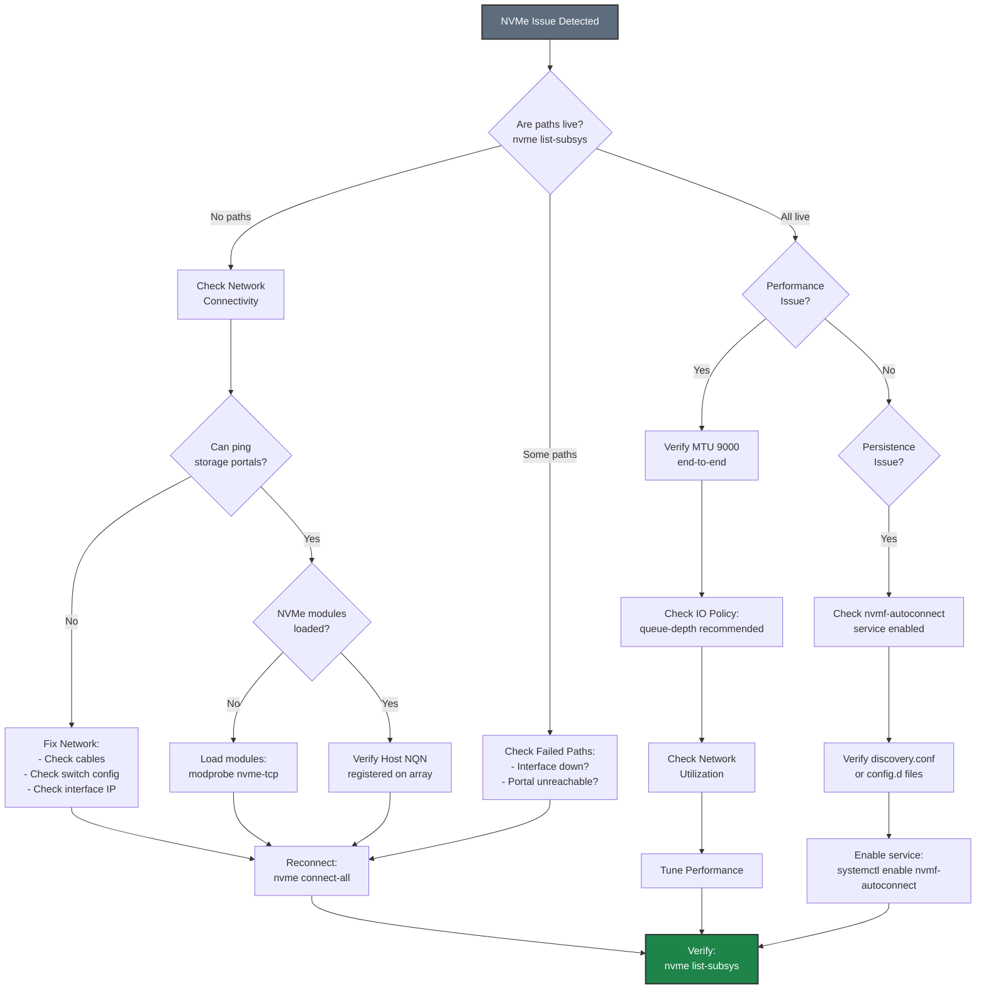
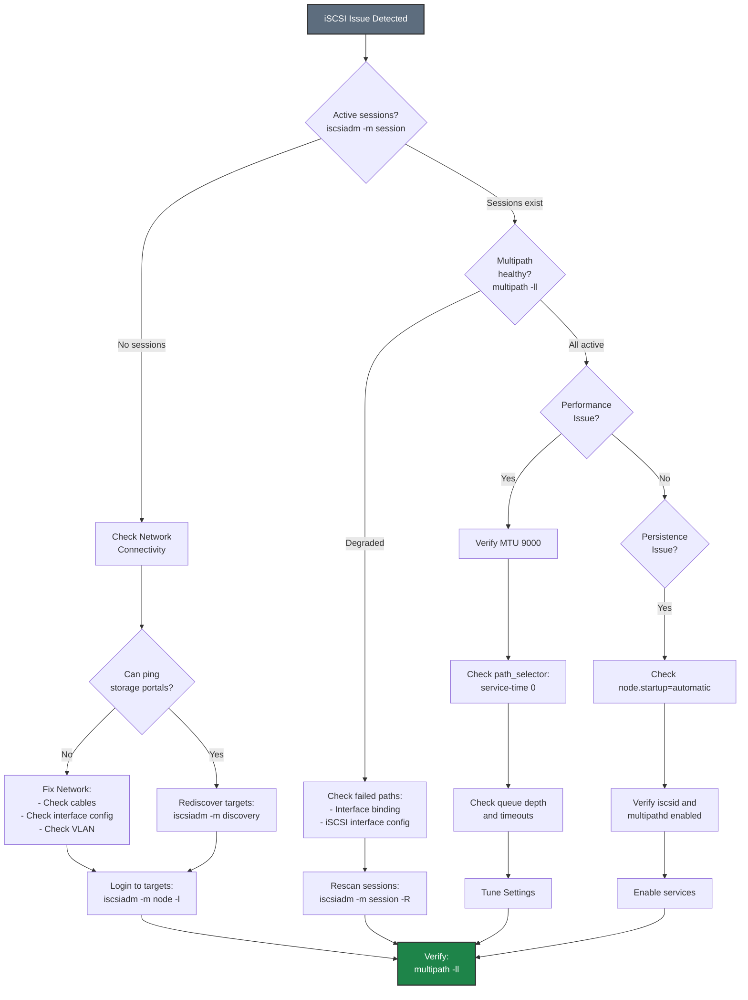

# Troubleshooting Flowcharts

Common troubleshooting diagrams for storage connectivity issues.

## NVMe-TCP Troubleshooting Flowchart

## iSCSI Troubleshooting Flowchart

## Quick Diagnostic Commands

| Protocol | Command | Purpose |
|----------|---------|---------|
| **NVMe** | `nvme list-subsys` | Show subsystems and path status |
| **NVMe** | `nvme list` | List connected namespaces |
| **iSCSI** | `iscsiadm -m session` | Show active sessions |
| **iSCSI** | `multipath -ll` | Show multipath status |
| **Both** | `dmesg \| tail -50` | Recent kernel messages |
| **Both** | `ip addr` | Network interface status |

