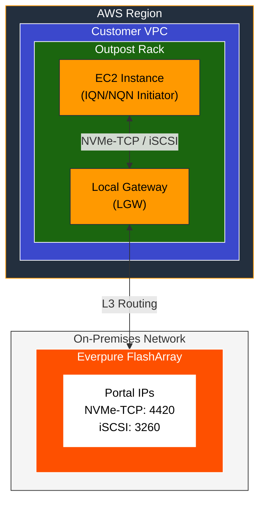
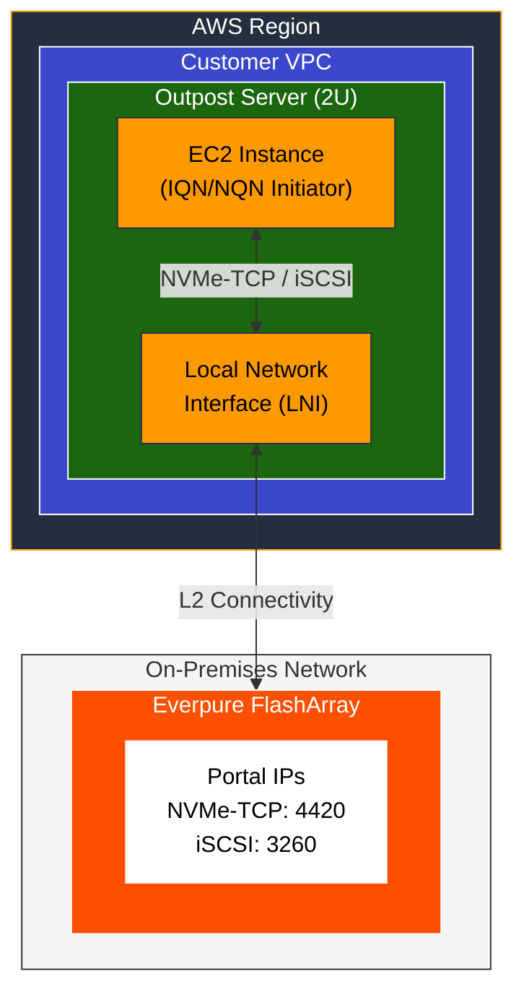

# Everpure FlashArray for AWS Outposts - Quick Start Guide

This guide covers connecting EC2 instances on AWS Outposts to Everpure FlashArray for both data and boot volumes using NVMe-TCP or iSCSI protocols.

> **For detailed explanations and troubleshooting:** See the [AWS Outposts external storage documentation](https://docs.aws.amazon.com/outposts/latest/userguide/external-storage.html)

---



---

## Overview

AWS Outposts (Racks and 2U Servers) now support external block storage from Everpure FlashArray.

### Supported Protocols

| Protocol | Port | Use Case |
|----------|------|----------|
| **NVMe-TCP** | 4420 | High-performance workloads, modern deployments |
| **iSCSI** | 3260 | Broad compatibility, Windows/Linux support |

### Supported Configurations

| Outpost Type | Connectivity | Protocols |
|--------------|--------------|-----------|
| **Outposts Rack (42U)** | Local Gateway (LGW) | iSCSI, NVMe-TCP |
| **Outposts Server (2U)** | Local Network Interface (LNI) | iSCSI, NVMe-TCP |

### Boot Volume Methods

| Method | Description | Use Case |
|--------|-------------|----------|
| **SANboot** | Direct boot from FlashArray via iPXE/iSCSI | Persistent VMs, databases, production |
| **Localboot** | Copies volume to local instance storage | VDI, dev/test, ephemeral workloads |

---

## Prerequisites

- AWS Outposts Rack or Server deployed and connected
- Everpure FlashArray accessible from EC2 instances via:
  - **Racks**: Local Gateway (LGW) routing to on-premises network
  - **Servers**: Local Network Interface (LNI) with L2 connectivity to on-premises network
- VPC with subnet on the Outpost
- [Supported AMI](https://docs.aws.amazon.com/outposts/latest/userguide/outpost-third-party-block-storage.html) for external storage

> **Note:** Each EC2 instance has its own IQN (iSCSI) or NQN (NVMe) initiator identity. When creating Host entries on the FlashArray, use the EC2 instance's initiator identity, not the physical Outpost server.

---

## Step 1: Configure FlashArray

Configure the FlashArray to recognize the EC2 instance and provision storage. You can use either the GUI or CLI.

### Option A: Via FlashArray GUI

**Create Host Entry:**
1. Log into Everpure FlashArray GUI
2. Navigate to **Storage → Hosts**
3. Create a new host with the EC2 instance identifier

**For NVMe-TCP:**
- Set **Personality** to `NVMe`
- Add the **Initiator NQN** (format: `nqn.2014-08.org.nvmexpress:uuid:<unique-id>`)
- Note the **Target NQN** and **Target Portal IPs** (port 4420)

**For iSCSI:**
- Set **Personality** to `iSCSI`
- Add the **Initiator IQN** (format: `iqn.YYYY-MM.com.amazon:<identifier>`)
- Note the **Target IQN** and **Target Portal IPs** (port 3260)

**Create and Map Volumes:**
1. Navigate to **Storage → Volumes**
2. Create volume(s) with appropriate size
3. Connect volume(s) to the host entry

### Option B: Via Pure CLI

Run these commands from any workstation with SSH access to the FlashArray management IP.

```bash
# SSH to FlashArray (or use pureuser@<array-ip>)
ssh pureuser@10.21.148.130

# Create host with NVMe-TCP personality
purehost create --personality nvme \
  --nqnlist nqn.2014-08.org.nvmexpress:uuid:ec2-instance-01 \
  ec2-instance-01

# Or create host with iSCSI personality
purehost create --personality iscsi \
  --iqnlist iqn.2024-01.com.amazon:ec2-instance-01 \
  ec2-instance-01

# Create a data volume (e.g., 100GB)
purevol create --size 100G ec2-instance-01-data

# Connect volume to host
purehost connect --vol ec2-instance-01-data ec2-instance-01

# Verify connection
purevol list --connect ec2-instance-01-data
```

> **Tip:** You can also use the [Pure Storage Python SDK](https://pypi.org/project/py-pure-client/) or REST API from your workstation for automation.

---

## Step 2: Launch EC2 Instance with External Storage

### Via AWS Console

1. Navigate to **EC2 → Instances → Launch instances**
2. **Name**: Enter instance name
3. **AMI**: Select a [supported AMI](https://docs.aws.amazon.com/outposts/latest/userguide/outpost-third-party-block-storage.html) for external storage
4. **Instance Type**: Select a [supported instance type](https://docs.aws.amazon.com/outposts/latest/userguide/outpost-third-party-block-storage.html)
5. **Network Settings**:
   - Select VPC and **Outpost subnet**
   - **Outposts Servers only**: Create LNI in Advanced Network settings
6. **Configure Storage → External storage volumes settings → Edit**:

#### For NVMe-TCP:
- Storage network protocol: **NVMe/TCP**
- Initiator NQN: Enter the NQN configured on FlashArray
- Click **Add NVMe/TCP Target**:
  - Target IP: FlashArray portal IP
  - Target Port: `4420`
  - Target NQN: FlashArray subsystem NQN
- Repeat for each portal (multipath)

#### For iSCSI:
- Storage network protocol: **iSCSI**
- Initiator IQN: Enter the IQN configured on FlashArray
- Click **Add iSCSI Target**:
  - Target IP: FlashArray portal IP
  - Target Port: `3260` (or `4420`)
  - Target IQN: FlashArray target IQN
- Repeat for each portal (multipath)

7. **Advanced Details**: Review auto-generated user data
8. Click **Launch instance**

---

## Step 3: Verify Connectivity

### Linux (NVMe-TCP)

```bash
# List NVMe devices
sudo nvme list

# Check subsystem connections
sudo nvme list-subsys
```

### Linux (iSCSI)

```bash
# Check iSCSI sessions
sudo iscsiadm -m session -P3

# List block devices
lsblk
```

### Windows

```powershell
# List disks
Get-Disk

# For iSCSI sessions
Get-IscsiSession
```

---

## Boot Volume Configuration

AWS Outposts supports booting EC2 instances from Everpure FlashArray volumes. The **AWS Console handles iPXE user-data generation automatically** when you configure external boot volumes during instance launch—no manual iPXE scripting required.

**AWS Sample Tooling:** [aws-samples/sample-outposts-third-party-storage-integration](https://github.com/aws-samples/sample-outposts-third-party-storage-integration)

### Boot Methods

| Method | Description | Use Case |
|--------|-------------|----------|
| **SANboot** | Direct boot from FlashArray via iPXE/iSCSI | Persistent VMs, databases, production |
| **Localboot** | Copies volume to local instance storage at boot | VDI, dev/test, ephemeral workloads |

**SANboot Benefits:**
- Persistent storage across instance stop/start
- Full Everpure features (snapshots, replication, SafeMode)
- Consistent boot environment

**Localboot Benefits:**
- Local NVMe performance after initial hydration
- Source volume unchanged (golden image pattern)
- Note: Local storage is ephemeral—data lost on instance stop/terminate

> **Important:** Windows instances do **not** support Localboot via NVMe-over-TCP. Use iSCSI for Windows Localboot.

### Boot Image Preparation

#### Step 1: Export or Convert Image

**From an existing AMI:**
```bash
# Clone the AWS sample repo (run from your workstation)
git clone https://github.com/aws-samples/sample-outposts-third-party-storage-integration.git
cd sample-outposts-third-party-storage-integration
pip install -e .

# Export AMI to RAW format (for Localboot)
python3 -m vmie export --region us-west-2 --s3-bucket <bucket-name> \
  --ami-id ami-XXXXXXXXXXXX

# Export AMI with SANboot support (Linux only)
python3 -m vmie export --region us-west-2 --s3-bucket <bucket-name> \
  --ami-id ami-XXXXXXXXXXXX --install-sanbootable
```

**From QCOW2 image:**
```bash
# Convert to RAW (requires qemu-img on your workstation)
qemu-img convert -f qcow2 -O raw ./image.qcow2 ./image.raw
```

#### Step 2: Create Boot Volume on FlashArray

```bash
# SSH to FlashArray from your workstation
ssh pureuser@10.21.148.130

# Create boot volume sized for your image (e.g., 20GB for typical Linux)
purevol create --size 20G golden-rhel9-boot

# Connect to a "provisioning host" for image writing
purehost connect --vol golden-rhel9-boot provisioning-host
```

#### Step 3: Write Image to FlashArray Volume

Connect the boot volume to a Linux or Windows system on the same network as the FlashArray. This can be your workstation if it has iSCSI connectivity, or any other system with storage network access.

**Linux:**
```bash
# Download exported RAW image from S3
aws s3 cp "s3://<bucket>/exports/<export-path>/export-ami-XXX.raw" ./image.raw

# Check image size
ls -lsh ./image.raw

# Write to FlashArray volume (replace mpathX with your multipath device)
sudo dd if=./image.raw of=/dev/mapper/mpathX bs=8M status=progress oflag=sync

# Disconnect when done
sudo multipath -f mpathX
```

**Windows (PowerShell as Administrator):**
```powershell
# Download exported RAW image
aws s3 cp "s3://<bucket>/exports/<export-path>/export-ami-XXX.raw" .\image.raw

# Identify the FlashArray disk (offline disk)
Get-Disk | Where-Object OperationalStatus -eq 'Offline'

# Write RAW image (replace X with disk number; requires dd via Git Bash/WSL)
dd if=.\image.raw of=\\.\PhysicalDriveX bs=8M
```

> **Tip:** On Windows, [Win32 Disk Imager](https://sourceforge.net/projects/win32diskimager/) can also write RAW images.

#### Step 4: Create Golden Image Snapshot

After writing the image, create a snapshot for fast provisioning of new boot volumes:

```bash
# SSH to FlashArray
ssh pureuser@10.21.148.130

# Create snapshot of the golden image
purevol snap --suffix golden-v1 golden-rhel9-boot

# Clone new boot volumes from snapshot
purevol copy golden-rhel9-boot.golden-v1 ec2-instance-01-boot
purehost connect --vol ec2-instance-01-boot ec2-instance-01
```

---

## Architecture Diagram

### Outposts Rack (via Local Gateway)



### Outposts Server (via Local Network Interface)



---

## Quick Reference

| Task | NVMe-TCP | iSCSI |
|------|----------|-------|
| **Default Port** | 4420 | 3260 |
| **Identifier** | NQN | IQN |
| **Linux Check** | `nvme list-subsys` | `iscsiadm -m session -P3` |
| **Discovery Port** | 8009 | 3260 |

---

## Troubleshooting

### Connection Issues

1. **Verify network connectivity** from Outpost subnet to FlashArray portal IPs
2. **Check LGW/LNI configuration** in AWS console
3. **Verify initiator mapping** on FlashArray (NQN/IQN must match)
4. **Check volume mapping** - volume must be connected to the host entry

### No Volumes Visible

```bash
# Linux - check dmesg for connection errors
dmesg | grep -i nvme
dmesg | grep -i iscsi

# Verify kernel modules loaded
lsmod | grep nvme
lsmod | grep iscsi
```

### Multipath Not Working

- Ensure all portal IPs are added during EC2 launch
- Verify all paths show as active in FlashArray
---

## Next Steps

For production deployments:

- Configure multiple portal IPs for multipath redundancy
- Enable Everpure SafeMode Snapshots for ransomware protection
- Set up ActiveDR replication for disaster recovery
**Resources:**
- [AWS Outposts External Storage Documentation](https://docs.aws.amazon.com/outposts/latest/userguide/external-storage.html)
- [AWS Blog: Deploying external boot volumes with AWS Outposts](https://aws.amazon.com/blogs/compute/deploying-external-boot-volumes-with-aws-outposts/)
- [AWS VM Import/Export](https://aws.amazon.com/ec2/vm-import/)
- [Everpure FlashArray for AWS Outposts Blog](https://blog.purestorage.com/solutions/pure-storage-flasharray-aws-outposts-boot-volumes/)
- [Everpure FlashArray Documentation](https://support.purestorage.com/)

