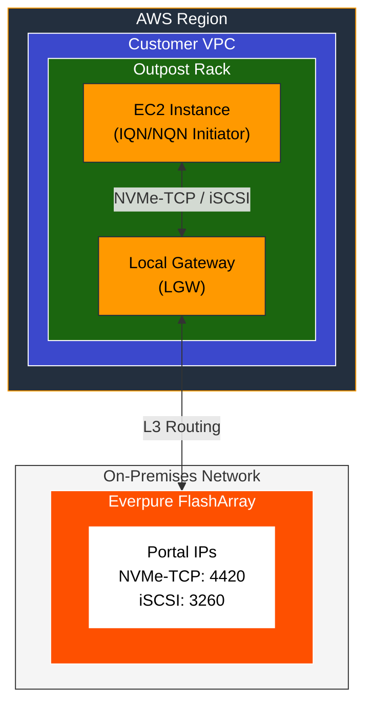
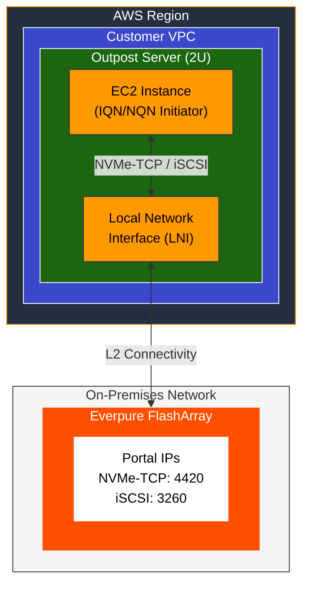

# Everpure FlashArray for AWS Outposts - Quick Start Guide

This guide covers connecting EC2 instances on AWS Outposts to Everpure FlashArray for both data and boot volumes using NVMe-TCP or iSCSI protocols.

> **📘 For detailed explanations and troubleshooting:** See the [AWS Outposts external storage documentation](https://docs.aws.amazon.com/outposts/latest/userguide/external-storage.html)

---



---

## Overview

AWS Outposts (Racks and 2U Servers) now support external block storage from Everpure FlashArray.

### Supported Protocols

| Protocol | Port | Use Case |
|----------|------|----------|
| **NVMe-TCP** | 4420 | High-performance workloads, modern deployments |
| **iSCSI** | 3260 | Broad compatibility, Windows/Linux support |

### Supported Configurations

| Outpost Type | Connectivity | Protocols |
|--------------|--------------|-----------|
| **Outposts Rack (42U)** | Local Gateway (LGW) | iSCSI, NVMe-TCP |
| **Outposts Server (2U)** | Local Network Interface (LNI) | iSCSI, NVMe-TCP |

### Boot Volume Methods

| Method | Description | Use Case |
|--------|-------------|----------|
| **SANboot** | Direct boot from FlashArray via iPXE/iSCSI | Persistent VMs, databases, production |
| **Localboot** | Copies volume to local instance storage | VDI, dev/test, ephemeral workloads |

---

## Prerequisites

- AWS Outposts Rack or Server deployed and connected
- Everpure FlashArray accessible from EC2 instances via:
  - **Racks**: Local Gateway (LGW) routing to on-premises network
  - **Servers**: Local Network Interface (LNI) with L2 connectivity to on-premises network
- VPC with subnet on the Outpost
- [Supported AMI](https://docs.aws.amazon.com/outposts/latest/userguide/outpost-third-party-block-storage.html) for external storage

> **Note:** Each EC2 instance has its own IQN (iSCSI) or NQN (NVMe) initiator identity. When creating Host entries on the FlashArray, use the EC2 instance's initiator identity, not the physical Outpost server.

---

## Step 1: Configure FlashArray

### Create Host Entry

1. Log into Everpure FlashArray GUI
2. Navigate to **Storage → Hosts**
3. Create a new host with the EC2 instance identifier

### For NVMe-TCP Connections

1. Set the host **Personality** to `NVMe`
2. Add the **Initiator NQN** that will be used for the EC2 instance
   - Format: `nqn.2014-08.org.nvmexpress:uuid:<unique-id>`
3. Note the **Target NQN** and **Target Portal IPs** (ports 4420)

### For iSCSI Connections

1. Set the host **Personality** to `iSCSI`
2. Add the **Initiator IQN** that will be used for the EC2 instance
   - Generate or use format: `iqn.YYYY-MM.com.amazon:<identifier>`
3. Note the **Target IQN** and **Target Portal IPs** (port 3260 or 4420)

### Create and Map Volumes

1. Navigate to **Storage → Volumes**
2. Create volume(s) with appropriate size
3. Connect volume(s) to the host entry created above

---

## Step 2: Launch EC2 Instance with External Storage

### Via AWS Console

1. Navigate to **EC2 → Instances → Launch instances**
2. **Name**: Enter instance name
3. **AMI**: Select a [supported AMI](https://docs.aws.amazon.com/outposts/latest/userguide/outpost-third-party-block-storage.html) for external storage
4. **Instance Type**: Select a [supported instance type](https://docs.aws.amazon.com/outposts/latest/userguide/outpost-third-party-block-storage.html)
5. **Network Settings**:
   - Select VPC and **Outpost subnet**
   - **Outposts Servers only**: Create LNI in Advanced Network settings
6. **Configure Storage → External storage volumes settings → Edit**:

#### For NVMe-TCP:
- Storage network protocol: **NVMe/TCP**
- Initiator NQN: Enter the NQN configured on FlashArray
- Click **Add NVMe/TCP Target**:
  - Target IP: FlashArray portal IP
  - Target Port: `4420`
  - Target NQN: FlashArray subsystem NQN
- Repeat for each portal (multipath)

#### For iSCSI:
- Storage network protocol: **iSCSI**
- Initiator IQN: Enter the IQN configured on FlashArray
- Click **Add iSCSI Target**:
  - Target IP: FlashArray portal IP
  - Target Port: `3260` (or `4420`)
  - Target IQN: FlashArray target IQN
- Repeat for each portal (multipath)

7. **Advanced Details**: Review auto-generated user data
8. Click **Launch instance**

---

## Step 3: Verify Connectivity

### Linux (NVMe-TCP)

```bash
# List NVMe devices
sudo nvme list

# Check subsystem connections
sudo nvme list-subsys
```

### Linux (iSCSI)

```bash
# Check iSCSI sessions
sudo iscsiadm -m session -P3

# List block devices
lsblk
```

### Windows

```powershell
# List disks
Get-Disk

# For iSCSI sessions
Get-IscsiSession
```

---

## Boot Volume Configuration

Boot volume support requires specific image preparation. AWS provides sample tooling at:
- **GitHub Repository**: [aws-samples/sample-outposts-third-party-storage-integration](https://github.com/aws-samples/sample-outposts-third-party-storage-integration)

### SANboot (Direct Boot from FlashArray)

SANboot uses iPXE to boot EC2 instances directly from iSCSI volumes on FlashArray. The instance boots over the network from storage on the FlashArray.

**Workflow:** Image Preparation → Export with `--install-sanbootable` → Write to FlashArray → Launch with iPXE Helper AMI → Boot from External Volume

**Benefits**:
- Persistent storage across instance stop/start
- Full Everpure features (snapshots, replication, SafeMode)
- Consistent boot environment

### Localboot (Hydrated Local Storage)

Localboot copies the boot volume from FlashArray to local instance storage at boot time. The instance runs from local NVMe but sources the image from FlashArray.

**Workflow:** Image Preparation → Export in RAW format → Write to FlashArray (Golden Image) → Launch with Localboot AMI → Copy to Local NVMe → Boot Locally

> **Important:** Windows instances do **not** support LocalBoot via NVMe-over-TCP. This combination is only supported for Linux instances.

**Benefits**:
- Local NVMe performance
- Source volume unchanged (golden image pattern)
- Suitable for VDI, dev/test, ephemeral workloads

**Note**: Local instance storage is ephemeral - data is lost on instance stop/terminate

### Boot Image Preparation

You can prepare boot images from multiple sources:

| Source | Format | Notes |
|--------|--------|-------|
| AWS Marketplace AMI | AMI | Use existing vendor-published AMIs |
| Custom AMI | AMI | Your own AMIs in the region |
| Raw disk image | RAW | Direct disk images |
| QCOW2 image | QCOW2 | Convert to RAW before use |

#### Option A: Use Existing AMI

Export an existing AMI to RAW format for FlashArray:

```bash
# Export AMI to RAW format (for Localboot)
python3 -m vmie export --region us-west-2 --s3-bucket <bucket-name> \
  --ami-id ami-XXXXXXXXXXXX

# Export AMI with SANboot support (Linux only)
python3 -m vmie export --region us-west-2 --s3-bucket <bucket-name> \
  --ami-id ami-XXXXXXXXXXXX --install-sanbootable
```

#### Option B: Use Raw/QCOW2 Image

```bash
# Convert QCOW2 to RAW (if needed)
qemu-img convert -f qcow2 -O raw ./image.qcow2 ./image.raw
```

#### Write Image to FlashArray Volume

Run these commands from a host (physical or VM) that has iSCSI or NVMe-TCP connectivity to the FlashArray and the boot volume mapped. This can be any Linux or Windows system on the same network as the FlashArray.

**Linux:**
```bash
# Download exported RAW image (if using AMI export)
aws s3 cp "s3://<bucket>/exports/<export-path>/export-ami-XXX.raw" ./image.raw

# Check image size and provision matching FlashArray volume
ls -lsh ./image.raw

# Write to FlashArray volume (via multipath device)
sudo dd if=./image.raw of=/dev/mapper/mpathX bs=8M status=progress oflag=sync
```

**Windows (PowerShell as Administrator):**
```powershell
# Download exported RAW image (if using AMI export)
aws s3 cp "s3://<bucket>/exports/<export-path>/export-ami-XXX.raw" .\image.raw

# Check image size
Get-Item .\image.raw | Select-Object Name, Length

# Identify the FlashArray disk number (offline disk mapped via iSCSI)
Get-Disk | Where-Object OperationalStatus -eq 'Offline'

# Write RAW image to FlashArray volume (replace X with disk number)
# Using dd for Windows (install via Git Bash, Cygwin, or WSL)
dd if=.\image.raw of=\\.\PhysicalDriveX bs=8M
```

> **Tip:** On Windows, you can also use tools like [Rufus](https://rufus.ie/) or [Win32 Disk Imager](https://sourceforge.net/projects/win32diskimager/) to write RAW images to the mapped FlashArray volume.

### Resources

- [AWS Blog: Deploying external boot volumes with AWS Outposts](https://aws.amazon.com/blogs/compute/deploying-external-boot-volumes-with-aws-outposts/)
- [AWS VM Import/Export](https://aws.amazon.com/ec2/vm-import/)

---

## Architecture Diagram

### Outposts Rack (via Local Gateway)



### Outposts Server (via Local Network Interface)



---

## Quick Reference

| Task | NVMe-TCP | iSCSI |
|------|----------|-------|
| **Default Port** | 4420 | 3260 |
| **Identifier** | NQN | IQN |
| **Linux Check** | `nvme list-subsys` | `iscsiadm -m session -P3` |
| **Discovery Port** | 8009 | 3260 |

---

## Troubleshooting

### Connection Issues

1. **Verify network connectivity** from Outpost subnet to FlashArray portal IPs
2. **Check LGW/LNI configuration** in AWS console
3. **Verify initiator mapping** on FlashArray (NQN/IQN must match)
4. **Check volume mapping** - volume must be connected to the host entry

### No Volumes Visible

```bash
# Linux - check dmesg for connection errors
dmesg | grep -i nvme
dmesg | grep -i iscsi

# Verify kernel modules loaded
lsmod | grep nvme
lsmod | grep iscsi
```

### Multipath Not Working

- Ensure all portal IPs are added during EC2 launch
- Verify all paths show as active in FlashArray
---

## Next Steps

For production deployments:

- Configure multiple portal IPs for multipath redundancy
- Enable Everpure SafeMode Snapshots for ransomware protection
- Set up ActiveDR replication for disaster recovery
- Review [Everpure FlashArray documentation](https://support.purestorage.com/)

**Additional Resources:**
- [AWS Outposts External Storage Documentation](https://docs.aws.amazon.com/outposts/latest/userguide/external-storage.html)
- [Everpure FlashArray for AWS Outposts Blog](https://blog.purestorage.com/solutions/pure-storage-flasharray-aws-outposts-boot-volumes/)
- [AWS re:Invent 2024 Announcement](https://aws.amazon.com/blogs/compute/new-simplifying-the-use-of-third-party-block-storage-with-aws-outposts/)

