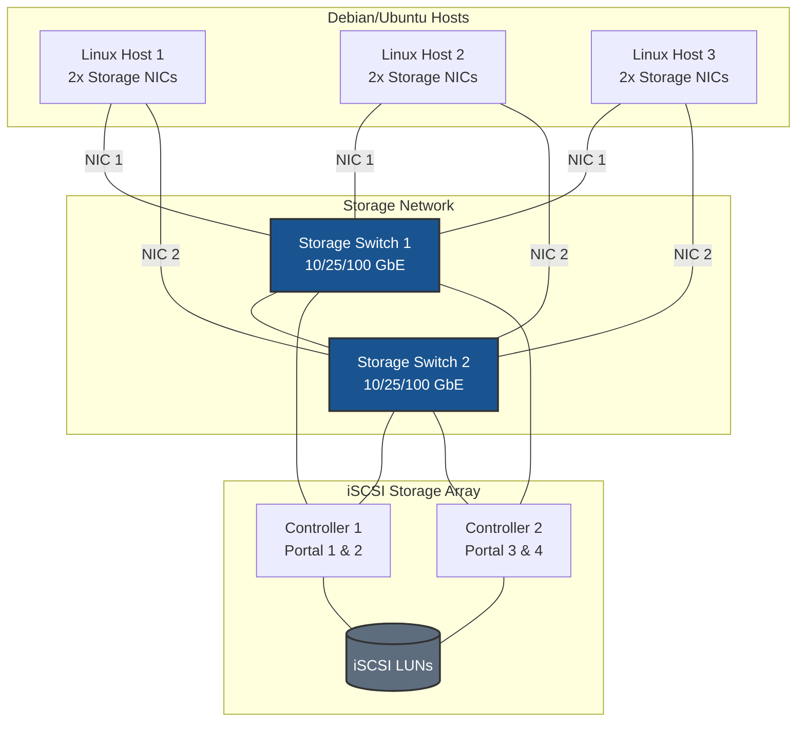
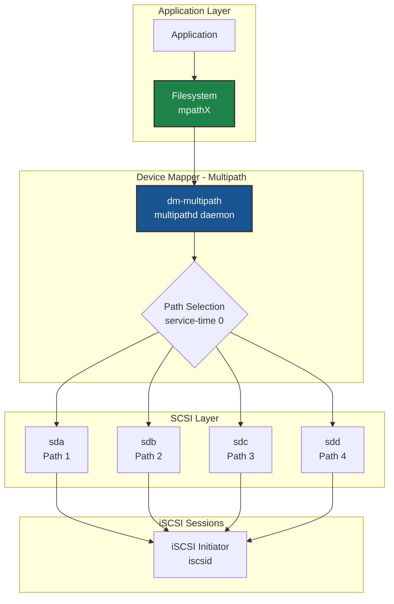
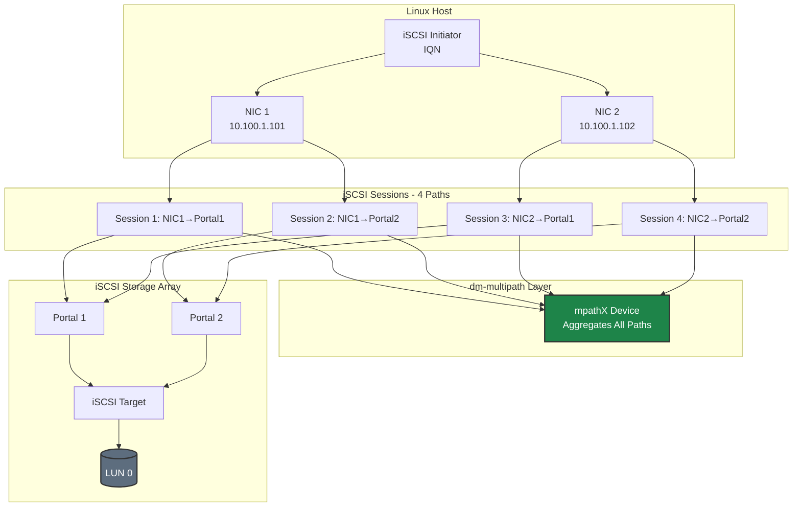
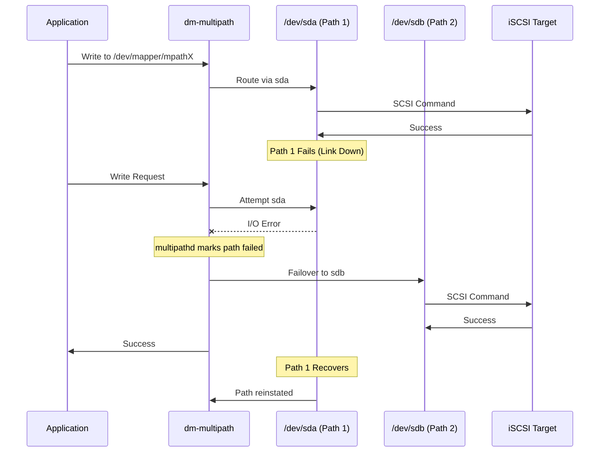
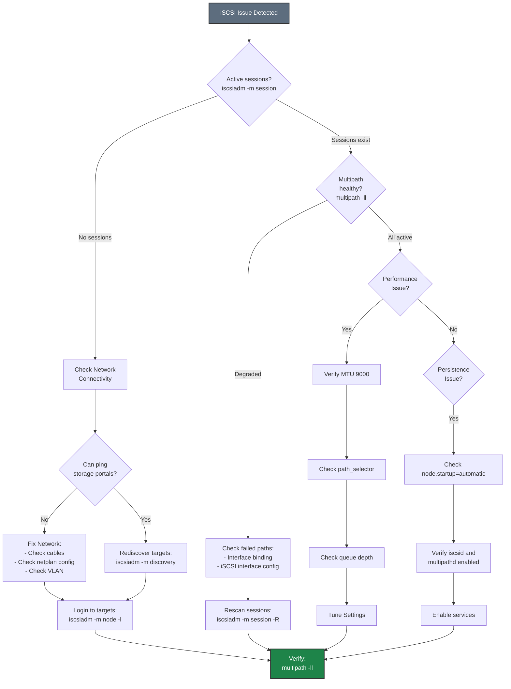

# iSCSI on Debian/Ubuntu - Best Practices Guide

Comprehensive best practices for deploying iSCSI storage on Debian and Ubuntu systems in production environments.

---

## ⚠️ Important Disclaimers

> **Vendor Documentation Priority:**
> - This guide is **specific to Pure Storage configurations** and should be used in conjunction with official vendor documentation
> - Always consult and follow **Debian/Ubuntu official documentation** for complete system configuration
> - In case of any conflicts between this guide and vendor documentation, **vendor documentation takes precedence**
>
> **Testing Requirements:**
> - All configurations and recommendations in this guide are **for reference only**
> - **Test thoroughly in a lab environment** before implementing in production
> - Validate all settings with your specific hardware, software versions, and workload requirements
> - Performance and compatibility may vary based on your environment
>
> **Support:**
> - For Pure Storage-specific issues, contact Pure Storage Support
> - For Debian/Ubuntu issues, consult official documentation or community resources
> - This guide is provided as-is without warranty

---

## Table of Contents
- [Architecture Overview](#architecture-overview)
- [Debian/Ubuntu-Specific Considerations](#debianubuntu-specific-considerations)
- [Network Configuration](#network-configuration)
- [AppArmor Configuration](#apparmor-configuration)
- [Firewall Configuration](#firewall-configuration)
- [iSCSI Architecture](#iscsi-architecture)
- [Multipath Configuration](#multipath-configuration)
- [Performance Tuning](#performance-tuning)
- [High Availability](#high-availability)
- [Monitoring & Maintenance](#monitoring--maintenance)
- [Security](#security)
- [Troubleshooting](#troubleshooting)

---

## Architecture Overview

### Deployment Topology



### dm-multipath Architecture



**Key Design Principles:**
- **Dual switches** for network redundancy
- **Minimum 2 NICs per host** for multipath
- **Dual controller array** for storage HA
- **dm-multipath** aggregates all paths into single device

> **📊 More Diagrams:** See [Common Storage Topology](../../../common/includes/diagrams-storage-topology.md) and [iSCSI Multipath Diagrams](../../../common/includes/diagrams-iscsi-multipath.md) for additional diagrams.

---

## Debian/Ubuntu-Specific Considerations

### Distribution Differences

**Debian:**
- Stable, conservative release cycle
- Uses traditional `/etc/network/interfaces` or netplan (11+)
- AppArmor available but not enabled by default
- Uses `iptables` or `nftables` for firewall

**Ubuntu:**
- More frequent releases (LTS every 2 years)
- Uses netplan by default (Server 18.04+)
- AppArmor enabled by default
- Uses UFW (Uncomplicated Firewall)
- Desktop uses NetworkManager

**Recommended versions:**
- **Debian**: 11 (Bullseye) or later
- **Ubuntu**: 20.04 LTS, 22.04 LTS, or 24.04 LTS

### Package Management

**Update system:**
```bash
# Update package lists
sudo apt update

# Upgrade packages
sudo apt upgrade -y

# Dist upgrade (if needed)
sudo apt dist-upgrade -y
```

**Essential packages:**
```bash
# Core iSCSI and multipath tools
sudo apt install -y \
    open-iscsi \
    multipath-tools \
    lvm2 \
    sg3-utils

# Performance monitoring tools
sudo apt install -y \
    sysstat \
    iotop \
    iftop \
    htop \
    linux-tools-generic

# Network tools
sudo apt install -y \
    ethtool \
    iproute2 \
    iputils-ping \
    dnsutils \
    netcat

# Optional: For netplan
sudo apt install -y netplan.io
```

**Verify installation:**
```bash
# Check iSCSI initiator
iscsiadm --version

# Check multipath
multipath -ll

# Check services
systemctl status iscsid
systemctl status open-iscsi
systemctl status multipath-tools
```

### Kernel Requirements

**Check kernel version:**
```bash
uname -r

# Verify iSCSI module is available
modinfo iscsi_tcp
```

**Update kernel if needed:**
```bash
# Debian
sudo apt install linux-image-amd64

# Ubuntu
sudo apt install linux-generic

# Reboot
sudo reboot
```

---

## Network Configuration

### Network Configuration Methods

**Ubuntu Server (18.04+): netplan**
- YAML-based configuration
- Default for Ubuntu Server
- Managed by systemd-networkd or NetworkManager

**Debian / Ubuntu Desktop: NetworkManager**
- GUI and CLI management
- Dynamic configuration
- Good for desktop environments

**Debian Traditional: /etc/network/interfaces**
- Text-based configuration
- Simple and reliable
- Good for servers

### Storage Network Configuration with netplan

**Create netplan configuration:**
```bash
# Create netplan config for storage interfaces
sudo tee /etc/netplan/60-storage.yaml > /dev/null <<'EOF'
network:
  version: 2
  renderer: networkd
  ethernets:
    ens1f0:
      dhcp4: no
      dhcp6: no
      addresses:
        - 10.100.1.101/24
      mtu: 9000
      optional: true
    ens1f1:
      dhcp4: no
      dhcp6: no
      addresses:
        - 10.100.2.101/24
      mtu: 9000
      optional: true
EOF

# Apply configuration
sudo netplan apply

# Verify
ip addr show ens1f0
ip addr show ens1f1
```

**Key netplan parameters:**
- `dhcp4: no` - Static IP configuration
- `mtu: 9000` - Jumbo frames
- `optional: true` - Don't wait for interface during boot (if not critical)

### Storage Network Configuration with /etc/network/interfaces

**Traditional Debian configuration:**
```bash
# Edit /etc/network/interfaces
sudo tee -a /etc/network/interfaces > /dev/null <<'EOF'

# Storage interface 1
auto ens1f0
iface ens1f0 inet static
    address 10.100.1.101
    netmask 255.255.255.0
    mtu 9000
    post-up ethtool -G ens1f0 rx 4096 tx 4096 || true
    post-up ethtool -C ens1f0 rx-usecs 50 tx-usecs 50 || true

# Storage interface 2
auto ens1f1
iface ens1f1 inet static
    address 10.100.2.101
    netmask 255.255.255.0
    mtu 9000
    post-up ethtool -G ens1f1 rx 4096 tx 4096 || true
    post-up ethtool -C ens1f1 rx-usecs 50 tx-usecs 50 || true
EOF

# Restart networking
sudo systemctl restart networking

# Or bring up interfaces individually
sudo ifup ens1f0
sudo ifup ens1f1
```

### MTU Configuration

```bash
# Verify MTU
ip link show ens1f0 | grep mtu

# Test MTU (jumbo frames)
ping -M do -s 8972 <storage_portal_ip>

# If ping fails, check:
# 1. Interface MTU
# 2. Switch MTU configuration
# 3. Storage array MTU
```

**Important:** MTU must be 9000 end-to-end (host → switch → storage)

---

## AppArmor Configuration

### Understanding AppArmor

**AppArmor vs SELinux:**
- AppArmor: Path-based mandatory access control (Ubuntu default)
- SELinux: Label-based mandatory access control (RHEL default)

**Check AppArmor status:**
```bash
sudo aa-status

# Check if AppArmor is enabled
sudo systemctl status apparmor
```

### AppArmor Profiles for iSCSI

**Check iSCSI-related profiles:**
```bash
# List loaded profiles
sudo aa-status | grep -i iscsi

# Check for denials
sudo dmesg | grep -i apparmor | grep -i iscsi
```

**Create AppArmor profile for iSCSI (if needed):**
```bash
# Most iSCSI tools run unconfined by default
# If you need to create a profile:

sudo tee /etc/apparmor.d/usr.sbin.iscsid > /dev/null <<'EOF'
#include <tunables/global>

/usr/sbin/iscsid {
  #include <abstractions/base>
  #include <abstractions/nameservice>

  capability net_admin,
  capability sys_admin,
  capability dac_override,

  /etc/iscsi/** r,
  /var/lib/iscsi/** rw,
  /run/lock/iscsi/** rw,
  /sys/class/iscsi_host/** r,
  /sys/devices/** r,

  /usr/sbin/iscsid mr,
  /proc/*/net/if_inet6 r,
  /proc/sys/net/ipv4/conf/*/rp_filter r,
}
EOF

# Load profile
sudo apparmor_parser -r /etc/apparmor.d/usr.sbin.iscsid
```

### AppArmor Best Practices

1. **Monitor for denials:**
   ```bash
   sudo dmesg | grep -i apparmor
   sudo journalctl | grep -i apparmor
   ```

2. **Use complain mode for testing:**
   ```bash
   # Set profile to complain mode
   sudo aa-complain /usr/sbin/iscsid

   # Set back to enforce mode
   sudo aa-enforce /usr/sbin/iscsid
   ```

3. **Keep AppArmor enabled in production**
   - Don't disable AppArmor
   - Create proper profiles instead

---

## Firewall Configuration

### Option 1: Disable Filtering on Storage Interfaces (Recommended)

For dedicated storage networks, **disable firewall filtering** on storage interfaces to eliminate CPU overhead from packet inspection. This is important for high-throughput iSCSI storage.

**Why disable filtering on storage interfaces:**
- **CPU overhead**: Firewall packet inspection adds latency and consumes CPU cycles
- **Performance impact**: At high IOPS, filtering overhead becomes significant
- **Network isolation**: Dedicated storage VLANs provide security at the network layer
- **Simplicity**: No port rules to maintain for storage traffic

#### Using UFW (Ubuntu)

```bash
# Allow all traffic on storage interfaces (no filtering)
sudo ufw allow in on ens1f0
sudo ufw allow in on ens1f1

# Verify
sudo ufw status verbose
```

#### Using iptables (Debian)

```bash
# Accept all traffic on storage interfaces (no filtering)
sudo iptables -A INPUT -i ens1f0 -j ACCEPT
sudo iptables -A INPUT -i ens1f1 -j ACCEPT

# Save rules
sudo apt install iptables-persistent
sudo netfilter-persistent save
```

#### Using nftables (Debian 10+)

```bash
# Create nftables configuration with no filtering on storage interfaces
sudo tee /etc/nftables.conf > /dev/null <<'EOF'
#!/usr/sbin/nft -f

flush ruleset

table inet filter {
    chain input {
        type filter hook input priority 0; policy drop;

        # Allow established connections
        ct state established,related accept

        # Allow loopback
        iif lo accept

        # Allow all traffic on storage interfaces (no filtering)
        iifname "ens1f0" accept
        iifname "ens1f1" accept
    }
}
EOF

# Enable and start nftables
sudo systemctl enable nftables
sudo systemctl restart nftables
```

### Option 2: Port Filtering (For Shared or Non-Isolated Networks)

Use port filtering only when storage interfaces share a network with other traffic or when additional host-level security is required by policy.

> **⚠️ Performance Note:** Port filtering adds CPU overhead for every packet. For production storage with high IOPS requirements, use Option 1 with network-level isolation instead.

#### Using UFW (Ubuntu)

```bash
# Enable UFW
sudo ufw enable

# Allow iSCSI traffic from specific subnet
sudo ufw allow from 10.100.1.0/24 to any port 3260 proto tcp
sudo ufw allow from 10.100.2.0/24 to any port 3260 proto tcp

# Or allow on specific interface with port filtering
sudo ufw allow in on ens1f0 to any port 3260 proto tcp
sudo ufw allow in on ens1f1 to any port 3260 proto tcp

# Check status
sudo ufw status verbose
```

#### Using iptables (Debian)

```bash
# Allow iSCSI traffic with port filtering
sudo iptables -A INPUT -p tcp --dport 3260 -s 10.100.1.0/24 -j ACCEPT
sudo iptables -A INPUT -p tcp --dport 3260 -s 10.100.2.0/24 -j ACCEPT

# Or allow on specific interface with port filtering
sudo iptables -A INPUT -i ens1f0 -p tcp --dport 3260 -j ACCEPT
sudo iptables -A INPUT -i ens1f1 -p tcp --dport 3260 -j ACCEPT

# Save rules
sudo apt install iptables-persistent
sudo netfilter-persistent save
```

#### Using nftables (Debian 10+)

```bash
# Create nftables configuration with port filtering
sudo tee /etc/nftables.conf > /dev/null <<'EOF'
#!/usr/sbin/nft -f

flush ruleset

table inet filter {
    chain input {
        type filter hook input priority 0; policy drop;

        # Allow established connections
        ct state established,related accept

        # Allow loopback
        iif lo accept

        # Allow iSCSI on storage interfaces (port filtering)
        iifname "ens1f0" tcp dport 3260 accept
        iifname "ens1f1" tcp dport 3260 accept
    }
}
EOF

# Enable and start nftables
sudo systemctl enable nftables
sudo systemctl restart nftables

# Verify
sudo nft list ruleset
```

---

## iSCSI Architecture

For comprehensive information on iSCSI architecture, topologies, and design principles, see:
- [iSCSI Architecture and Design](../../../common/includes/iscsi-architecture.md)

**Key points for Debian/Ubuntu:**
- Use dedicated storage networks (VLANs or physical)
- Minimum 2×2 topology (2 NICs × 2 portals = 4 paths)
- Static IP addressing (no DHCP)
- No default gateway on storage interfaces
- MTU 9000 end-to-end

---

## Multipath Configuration

For detailed multipath configuration information, see:
- [iSCSI Multipath Configuration](../../../common/includes/iscsi-multipath-config.md)

### Debian/Ubuntu-Specific Multipath Setup

**Enable and configure multipath:**
```bash
# Enable multipath
sudo systemctl enable --now multipath-tools

# Generate default configuration
sudo tee /etc/multipath.conf > /dev/null <<'EOF'
defaults {
    user_friendly_names yes
    find_multipaths no
    enable_foreign "^$"
}

blacklist {
    devnode "^(ram|raw|loop|fd|md|dm-|sr|scd|st)[0-9]*"
    devnode "^hd[a-z]"
    devnode "^cciss.*"
}

devices {
    device {
        vendor "PURE"
        product "FlashArray"
        path_selector "service-time 0"
        path_grouping_policy "group_by_prio"
        prio "alua"
        failback "immediate"
        path_checker "tur"
        fast_io_fail_tmo 10
        dev_loss_tmo 60
        no_path_retry 0
        hardware_handler "1 alua"
        rr_min_io_rq 1
    }
}
EOF

# Restart multipath
sudo systemctl restart multipath-tools

# Verify configuration
sudo multipath -ll
```

**Ubuntu-specific notes:**
- Service name is `multipath-tools` (not `multipathd`)
- Configuration file is `/etc/multipath.conf`
- Use `systemctl` for service management

---

## Performance Tuning

For comprehensive performance tuning information, see:
- [iSCSI Performance Tuning](../../../common/includes/iscsi-performance-tuning.md)
- [General Performance Tuning](../../../common/includes/performance-tuning.md)

### Debian/Ubuntu-Specific Tuning

#### Kernel Parameters

**Optimize kernel for iSCSI:**
```bash
# Create sysctl configuration
sudo tee /etc/sysctl.d/99-iscsi-debian.conf > /dev/null <<'EOF'
# Network performance
net.core.netdev_max_backlog = 5000
net.core.rmem_max = 134217728
net.core.wmem_max = 134217728
net.ipv4.tcp_rmem = 4096 87380 67108864
net.ipv4.tcp_wmem = 4096 65536 67108864

# Connection tracking
net.netfilter.nf_conntrack_max = 1048576

# Low latency
net.ipv4.tcp_low_latency = 1

# VM tuning for storage
vm.dirty_ratio = 10
vm.dirty_background_ratio = 5
vm.swappiness = 10

# ARP settings for same-subnet multipath (CRITICAL)
# Prevents ARP responses on wrong interface when multiple NICs share same subnet
# See: ../../../common/includes/network-concepts.md for detailed explanation
net.ipv4.conf.all.arp_ignore = 2
net.ipv4.conf.default.arp_ignore = 2
net.ipv4.conf.all.arp_announce = 2
net.ipv4.conf.default.arp_announce = 2
# Interface-specific (adjust interface names as needed)
net.ipv4.conf.ens1f0.arp_ignore = 2
net.ipv4.conf.ens1f1.arp_ignore = 2
net.ipv4.conf.ens1f0.arp_announce = 2
net.ipv4.conf.ens1f1.arp_announce = 2
EOF

# Apply settings
sudo sysctl -p /etc/sysctl.d/99-iscsi-debian.conf
```

#### I/O Scheduler

**Set I/O scheduler for iSCSI devices:**
```bash
# Create udev rule
sudo tee /etc/udev/rules.d/99-iscsi-scheduler.rules > /dev/null <<'EOF'
# Set I/O scheduler for iSCSI devices (SSD/Flash)
ACTION=="add|change", KERNEL=="sd[a-z]", ATTR{queue/rotational}=="0", ATTR{queue/scheduler}="none"

# Set queue depth
ACTION=="add|change", KERNEL=="sd[a-z]", ATTR{device/vendor}=="PURE", ATTR{device/queue_depth}="128"

# Set read-ahead
ACTION=="add|change", KERNEL=="sd[a-z]", ATTR{device/vendor}=="PURE", ATTR{bdi/read_ahead_kb}="128"
EOF

# Reload udev rules
sudo udevadm control --reload-rules
sudo udevadm trigger
```

#### IRQ Affinity

**Install and configure irqbalance:**
```bash
# Install irqbalance
sudo apt install -y irqbalance

# Enable and start
sudo systemctl enable --now irqbalance

# Check IRQ distribution
cat /proc/interrupts | grep -E "eth|ens"
```

---

## High Availability

### iSCSI Path Redundancy Model



### Failover Behavior



> **📊 More Diagrams:** See [iSCSI Multipath Diagrams](../../../common/includes/diagrams-iscsi-multipath.md) and [Failover Diagrams](../../../common/includes/diagrams-failover.md) for additional details.

### Cluster Configuration with Pacemaker

**Install cluster packages:**
```bash
# Install Pacemaker and Corosync
sudo apt install -y pacemaker corosync crmsh fence-agents

# Configure Corosync
sudo tee /etc/corosync/corosync.conf > /dev/null <<'EOF'
totem {
    version: 2
    cluster_name: iscsi-cluster
    transport: udpu
    interface {
        ringnumber: 0
        bindnetaddr: 192.168.1.0
        broadcast: yes
        mcastport: 5405
    }
}

nodelist {
    node {
        ring0_addr: 192.168.1.11
        name: node1
        nodeid: 1
    }
    node {
        ring0_addr: 192.168.1.12
        name: node2
        nodeid: 2
    }
}

quorum {
    provider: corosync_votequorum
    two_node: 1
}

logging {
    to_logfile: yes
    logfile: /var/log/corosync/corosync.log
    to_syslog: yes
}
EOF

# Start cluster services
sudo systemctl enable --now corosync
sudo systemctl enable --now pacemaker

# Check cluster status
sudo crm status
```

### Shared Storage Resources

**Configure iSCSI LVM as cluster resource:**
```bash
# Create LVM volume group on multipath device
sudo vgcreate vg_iscsi /dev/mapper/mpatha

# Create logical volume
sudo lvcreate -L 100G -n lv_data vg_iscsi

# Create filesystem
sudo mkfs.ext4 /dev/vg_iscsi/lv_data

# Add to cluster as resource
sudo crm configure primitive fs_data Filesystem \
    params device="/dev/vg_iscsi/lv_data" directory="/mnt/data" fstype="ext4" \
    op monitor interval="20s"

# Verify
sudo crm status
```

---

## Monitoring & Maintenance

For general monitoring and maintenance procedures, see:
- [Monitoring & Maintenance](../../../common/includes/monitoring-maintenance.md)

### Debian/Ubuntu-Specific Monitoring

#### Using systemd Journal

**Monitor iSCSI services:**
```bash
# View iSCSI logs
sudo journalctl -u iscsid -f
sudo journalctl -u open-iscsi -f

# View multipath logs
sudo journalctl -u multipath-tools -f

# View all storage-related logs
sudo journalctl -u iscsid -u open-iscsi -u multipath-tools --since "1 hour ago"
```

#### Performance Monitoring with sysstat

**Install and configure sysstat:**
```bash
# Install
sudo apt install -y sysstat

# Enable data collection
sudo sed -i 's/ENABLED="false"/ENABLED="true"/' /etc/default/sysstat

# Restart service
sudo systemctl restart sysstat

# View I/O statistics
sar -d 1 10

# View network statistics
sar -n DEV 1 10
```

#### Monitoring Scripts

**Create monitoring script:**
```bash
sudo tee /usr/local/bin/iscsi-health-check.sh > /dev/null <<'EOF'
#!/bin/bash
# iSCSI Health Check Script for Debian/Ubuntu

echo "=== iSCSI Health Check ==="
echo "Date: $(date)"
echo

echo "--- iSCSI Sessions ---"
iscsiadm -m session

echo
echo "--- Multipath Status ---"
multipath -ll | head -50

echo
echo "--- Failed Paths ---"
multipath -ll | grep -i "failed\|faulty" || echo "No failed paths"

echo
echo "--- Disk I/O ---"
iostat -x 1 2 | tail -20

echo
echo "--- Network Interfaces ---"
ip -s link show | grep -A 3 "ens1f"

echo
echo "=== End Health Check ==="
EOF

sudo chmod +x /usr/local/bin/iscsi-health-check.sh

# Run health check
sudo /usr/local/bin/iscsi-health-check.sh
```

**Schedule with cron:**
```bash
# Add to crontab
echo "0 */6 * * * /usr/local/bin/iscsi-health-check.sh >> /var/log/iscsi-health.log 2>&1" | sudo crontab -
```

---

## Security

For general security best practices, see:
- [Security Best Practices](../../../common/includes/security-best-practices.md)

### Debian/Ubuntu-Specific Security

#### CHAP Authentication

**Configure CHAP on initiator:**
```bash
# Set CHAP credentials
sudo iscsiadm -m node -T <target_iqn> -p <portal_ip>:3260 \
    -o update -n node.session.auth.authmethod -v CHAP

sudo iscsiadm -m node -T <target_iqn> -p <portal_ip>:3260 \
    -o update -n node.session.auth.username -v <username>

sudo iscsiadm -m node -T <target_iqn> -p <portal_ip>:3260 \
    -o update -n node.session.auth.password -v <password>

# Reconnect with CHAP
sudo iscsiadm -m node -T <target_iqn> -p <portal_ip>:3260 --logout
sudo iscsiadm -m node -T <target_iqn> -p <portal_ip>:3260 --login
```

#### Audit Logging

**Enable audit logging for iSCSI:**
```bash
# Install auditd
sudo apt install -y auditd

# Add audit rules
sudo tee -a /etc/audit/rules.d/iscsi.rules > /dev/null <<'EOF'
# Monitor iSCSI configuration changes
-w /etc/iscsi/ -p wa -k iscsi_config
-w /etc/multipath.conf -p wa -k multipath_config

# Monitor iSCSI commands
-a always,exit -F arch=b64 -S execve -F path=/usr/sbin/iscsiadm -k iscsi_commands
EOF

# Reload audit rules
sudo augenrules --load

# View iSCSI audit events
sudo ausearch -k iscsi_config
sudo ausearch -k iscsi_commands
```

---

## Troubleshooting

### Troubleshooting Flowchart



> **📊 More Diagrams:** See [Troubleshooting Flowcharts](../../../common/includes/diagrams-troubleshooting.md) for detailed procedures.

For common troubleshooting procedures, see:
- [Common Troubleshooting](../../../common/includes/troubleshooting-common.md)

### Debian/Ubuntu-Specific Troubleshooting

#### Check Service Status

```bash
# Check all iSCSI-related services
sudo systemctl status iscsid
sudo systemctl status open-iscsi
sudo systemctl status multipath-tools

# Check for failed services
sudo systemctl --failed | grep -E "iscsi|multipath"

# View detailed service logs
sudo journalctl -xe -u iscsid
sudo journalctl -xe -u open-iscsi
```

#### Network Troubleshooting

**netplan:**
```bash
# Check netplan configuration
sudo netplan get

# Test configuration
sudo netplan try

# Apply configuration
sudo netplan apply

# Debug netplan
sudo netplan --debug apply
```

**Traditional interfaces:**
```bash
# Check interface status
ip addr show

# Bring interface up
sudo ifup ens1f0

# Restart networking
sudo systemctl restart networking
```

#### Multipath Troubleshooting

```bash
# Verbose multipath output
sudo multipath -v3

# Reload multipath configuration
sudo systemctl reload multipath-tools

# Reconfigure all devices
sudo multipath -r

# Check for blacklisted devices
sudo multipath -v3 | grep -i blacklist

# View device mapper tables
sudo dmsetup table
sudo dmsetup status
```

#### AppArmor Troubleshooting

```bash
# Check for AppArmor denials
sudo dmesg | grep -i apparmor | grep -i iscsi

# Check AppArmor status
sudo aa-status

# Set profile to complain mode
sudo aa-complain /usr/sbin/iscsid

# View AppArmor logs
sudo journalctl | grep -i apparmor
```

---

## Additional Resources

- [Debian Administrator's Handbook](https://debian-handbook.info/)
- [Ubuntu Server Guide](https://ubuntu.com/server/docs)
- [iSCSI Quick Start](./QUICKSTART.md)
- [Common Network Concepts](../../../common/includes/network-concepts.md)
- [Multipath Concepts](../../../common/includes/multipath-concepts.md)

---

## Quick Reference

**Discover targets:**
```bash
sudo iscsiadm -m discovery -t sendtargets -p <portal_ip>:3260
```

**Login to target:**
```bash
sudo iscsiadm -m node -T <target_iqn> -p <portal_ip>:3260 --login
```

**Check sessions:**
```bash
sudo iscsiadm -m session
```

**Check multipath:**
```bash
sudo multipath -ll
```

**Restart services:**
```bash
sudo systemctl restart iscsid open-iscsi multipath-tools
```

**Check logs:**
```bash
sudo journalctl -u iscsid -u open-iscsi -u multipath-tools -f
```

