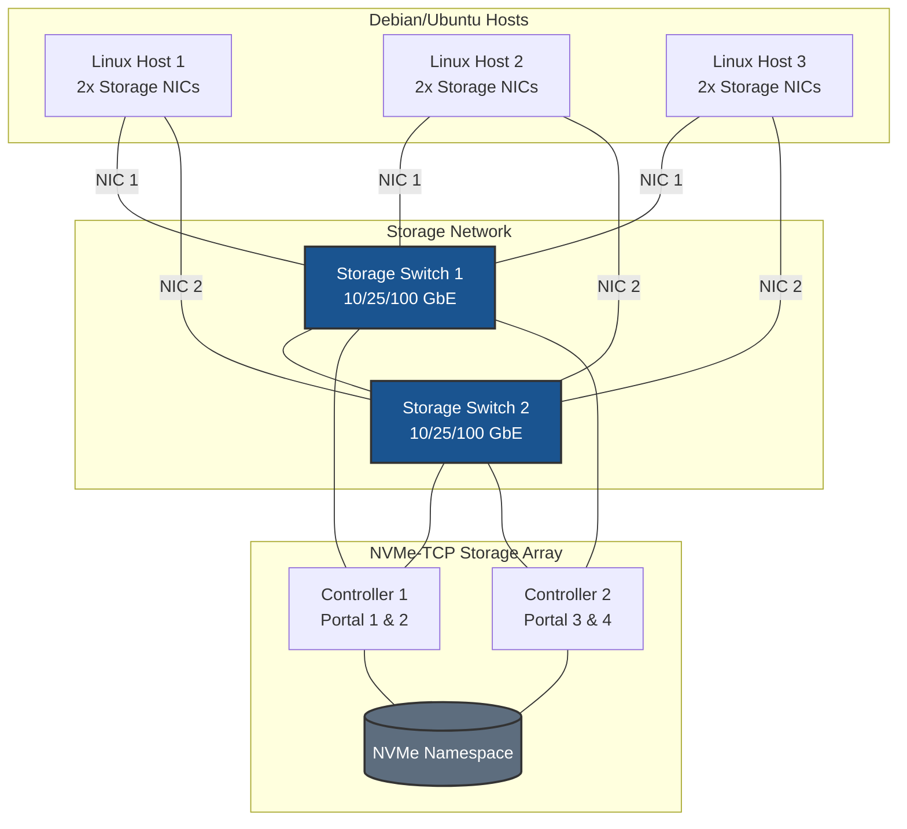
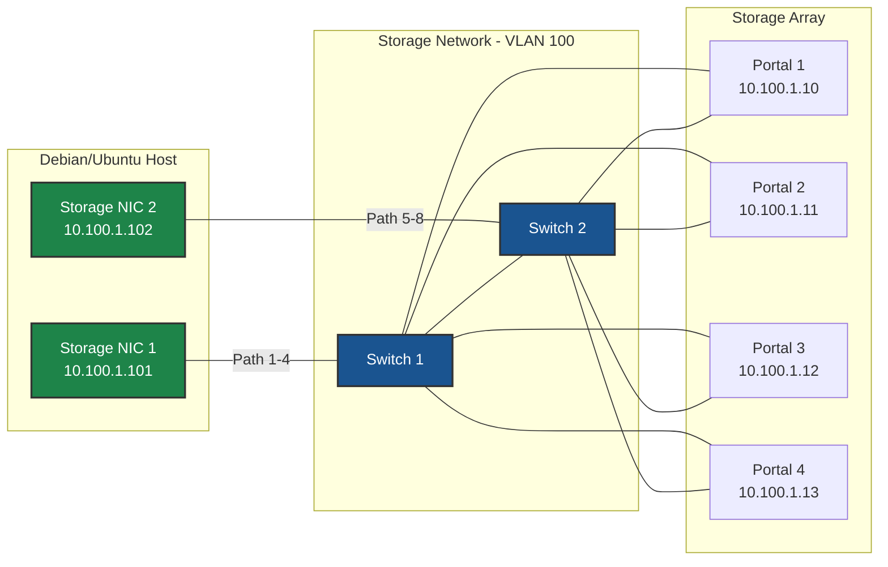
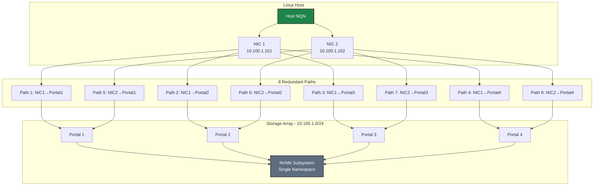
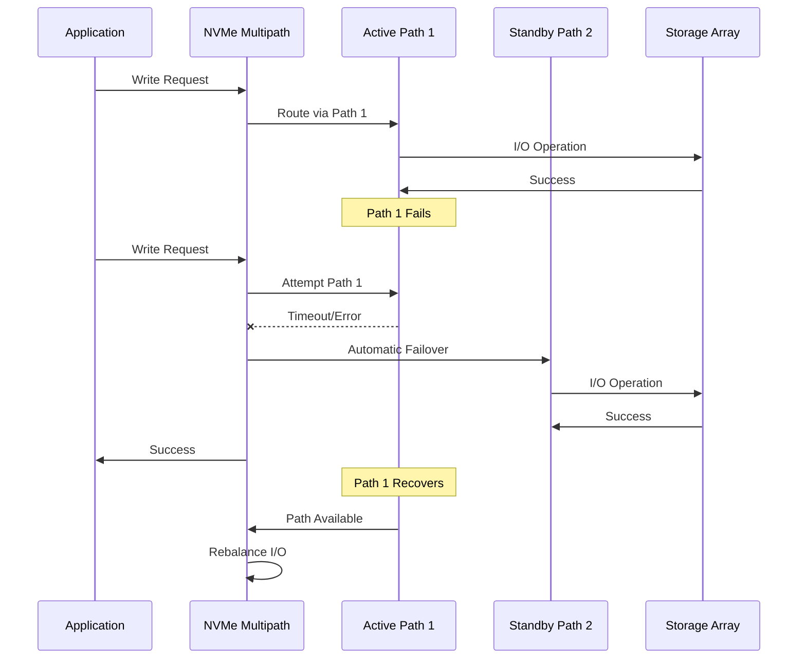
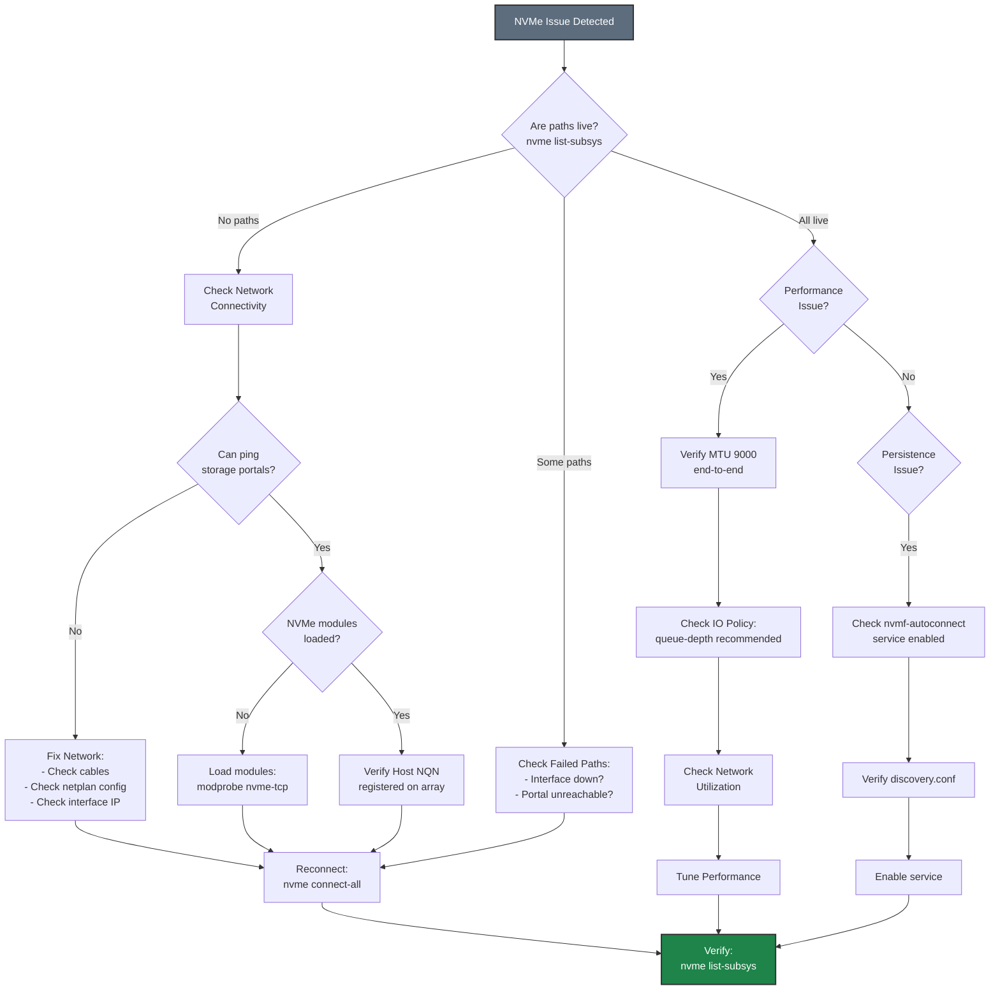

# NVMe-TCP on Debian/Ubuntu - Best Practices Guide

Comprehensive best practices for deploying NVMe-TCP storage on Debian and Ubuntu systems in production environments.

---

## ⚠️ Important Disclaimers

> **Vendor Documentation Priority:**
> - This guide is **specific to Pure Storage configurations** and should be used in conjunction with official vendor documentation
> - Always consult and follow **Debian/Ubuntu official documentation** for complete system configuration
> - In case of any conflicts between this guide and vendor documentation, **vendor documentation takes precedence**
>
> **Testing Requirements:**
> - All configurations and recommendations in this guide are **for reference only**
> - **Test thoroughly in a lab environment** before implementing in production
> - Validate all settings with your specific hardware, software versions, and workload requirements
> - Performance and compatibility may vary based on your environment
>
> **Support:**
> - For Pure Storage-specific issues, contact Pure Storage Support
> - For Debian/Ubuntu issues, consult official documentation or community resources
> - This guide is provided as-is without warranty

---

## Table of Contents
- [Architecture Overview](#architecture-overview)
- [Distribution-Specific Considerations](#distribution-specific-considerations)
- [Network Configuration](#network-configuration)
- [AppArmor Configuration](#apparmor-configuration)
- [Firewall Configuration](#firewall-configuration)
- [Performance Tuning](#performance-tuning)
- [High Availability](#high-availability)
- [Monitoring & Maintenance](#monitoring--maintenance)
- [Security](#security)
- [Troubleshooting](#troubleshooting)

---

## Architecture Overview

### Deployment Topology



### Network Architecture



**Key Design Principles:**
- **Dual switches** for network redundancy
- **Minimum 2 NICs per host** for multipath
- **Dual controller array** for storage HA
- **8 paths** (2 NICs × 4 portals) for maximum redundancy





---

## Distribution-Specific Considerations

### Debian vs Ubuntu

**Debian:**
- Stable, conservative release cycle
- Minimal default installation
- Traditional `/etc/network/interfaces` or netplan (11+)
- AppArmor available but not enabled by default
- Manual firewall configuration (iptables/nftables)

**Ubuntu:**
- More frequent releases (LTS every 2 years)
- Netplan default for network configuration
- AppArmor enabled by default
- UFW (Uncomplicated Firewall) wrapper
- More pre-installed packages

### Recommended Versions

**Production deployments:**
- **Debian:** 11 (Bullseye) or 12 (Bookworm)
- **Ubuntu:** 20.04 LTS, 22.04 LTS, or 24.04 LTS

**Kernel requirements:**
- Minimum: Kernel 5.4 (Ubuntu 20.04)
- Recommended: Kernel 5.10+ (Debian 11) or 5.15+ (Ubuntu 22.04)

**Check kernel version:**
```bash
uname -r

# Verify NVMe-TCP module is available
modinfo nvme-tcp
```

### Package Management

**Essential packages:**
```bash
# Core NVMe and multipath tools
sudo apt install -y \
    nvme-cli \
    multipath-tools \
    lvm2 \
    sg3-utils

# Performance monitoring tools
sudo apt install -y \
    sysstat \
    iotop \
    iftop \
    htop \
    linux-tools-common \
    linux-tools-$(uname -r)

# Network tools
sudo apt install -y \
    ethtool \
    iproute2 \
    iputils-ping \
    netcat-openbsd \
    dnsutils

# Ubuntu-specific: netplan
sudo apt install -y netplan.io  # Ubuntu

# Debian-specific: ifupdown or netplan
sudo apt install -y ifupdown  # Traditional Debian
# OR
sudo apt install -y netplan.io  # Modern Debian 11+
```

---

## Network Configuration

### Netplan Best Practices (Ubuntu/Modern Debian)

**Why Netplan:**
- Declarative YAML configuration
- Supports both NetworkManager and systemd-networkd backends
- Consistent across Ubuntu versions
- Easy to version control

**Recommended backend:**
```yaml
# Use systemd-networkd for servers (better performance)
network:
  version: 2
  renderer: networkd
```

### Storage Network Configuration

#### Dedicated Interfaces (No Routing)

```yaml
# /etc/netplan/50-storage.yaml
network:
  version: 2
  renderer: networkd
  
  ethernets:
    # First storage interface
    ens1f0:
      addresses:
        - 10.100.1.101/24
      mtu: 9000
      dhcp4: no
      dhcp6: no
      optional: false
      # Optimize for storage
      receive-checksum-offload: true
      transmit-checksum-offload: true
      tcp-segmentation-offload: true
      generic-segmentation-offload: true
      generic-receive-offload: true
      large-receive-offload: false
    
    # Second storage interface
    ens1f1:
      addresses:
        - 10.100.2.101/24
      mtu: 9000
      dhcp4: no
      dhcp6: no
      optional: false
```

**Apply configuration:**
```bash
# Validate syntax
sudo netplan --debug generate

# Test (will revert after 120 seconds if not confirmed)
sudo netplan try

# Apply permanently
sudo netplan apply
```

#### Bond Configuration for HA

```yaml
# /etc/netplan/50-storage-bond.yaml
network:
  version: 2
  renderer: networkd
  
  ethernets:
    ens1f0:
      dhcp4: no
      dhcp6: no
    ens1f1:
      dhcp4: no
      dhcp6: no
  
  bonds:
    bond0:
      interfaces:
        - ens1f0
        - ens1f1
      addresses:
        - 10.100.1.101/24
      mtu: 9000
      parameters:
        mode: active-backup
        primary: ens1f0
        mii-monitor-interval: 100
        fail-over-mac-policy: active
```

**Bond modes:**
- `active-backup` - Active-passive failover (recommended for storage)
- `802.3ad` - LACP (requires switch support)
- `balance-xor` - Load balancing (use with caution for storage)

### Traditional /etc/network/interfaces (Debian)

```bash
# /etc/network/interfaces
auto ens1f0
iface ens1f0 inet static
    address 10.100.1.101
    netmask 255.255.255.0
    mtu 9000
    # Optimize NIC
    post-up ethtool -G ens1f0 rx 4096 tx 4096 || true
    post-up ethtool -C ens1f0 rx-usecs 50 tx-usecs 50 || true
    post-up ethtool -K ens1f0 tso on gso on gro on || true
    # Prevent default route
    post-up ip route del default via 10.100.1.1 dev ens1f0 || true

auto ens1f1
iface ens1f1 inet static
    address 10.100.2.101
    netmask 255.255.255.0
    mtu 9000
    post-up ethtool -G ens1f1 rx 4096 tx 4096 || true
    post-up ethtool -C ens1f1 rx-usecs 50 tx-usecs 50 || true
    post-up ethtool -K ens1f1 tso on gso on gro on || true
    post-up ip route del default via 10.100.2.1 dev ens1f1 || true
```

### MTU Configuration

```bash
# Test MTU end-to-end
ping -M do -s 8972 <storage_portal_ip>

# If fails, check each hop
# Reduce packet size until it works to find MTU limit
```

**Important:** MTU 9000 must be configured on:
- Host interfaces
- All switches in path
- Storage array ports

---

## AppArmor Configuration

### Understanding AppArmor (Ubuntu Default)

**AppArmor vs SELinux:**
- AppArmor: Path-based mandatory access control
- Enabled by default on Ubuntu
- Available but not default on Debian
- Simpler than SELinux for most use cases

**Check AppArmor status:**
```bash
sudo aa-status

# Check if AppArmor is enabled
sudo systemctl status apparmor
```

### AppArmor Profiles for NVMe-TCP

**Check for denials:**
```bash
# View AppArmor messages in syslog
sudo dmesg | grep -i apparmor
sudo journalctl | grep -i apparmor

# Check audit log
sudo grep -i apparmor /var/log/syslog
```

**AppArmor and NVMe-TCP:**

> **Note:** NVMe-TCP uses native NVMe multipathing, NOT dm-multipath (`multipathd`). There is no `multipathd` service for NVMe-TCP, so you don't need to create AppArmor profiles for it.

**If you have custom applications accessing NVMe devices:**
```bash
# Install AppArmor utilities
sudo apt install -y apparmor-utils

# Check if any AppArmor denials related to NVMe
sudo dmesg | grep -i apparmor | grep nvme

# If you have custom scripts accessing NVMe devices,
# you may need to add these permissions to their profiles:
# /dev/nvme* rw,
# /sys/class/nvme/** r,
# /sys/devices/**/nvme*/** r,
```

### AppArmor Best Practices

1. **Use complain mode for testing:**
   ```bash
   # Test NVMe connections
   sudo nvme connect -t tcp -a <portal_ip> -s 4420 -n <nqn>

   # Check for any AppArmor denials
   sudo dmesg | grep -i apparmor
   ```

2. **Never disable AppArmor in production (Ubuntu):**
   - Use complain mode for troubleshooting
   - Create proper profiles for custom applications
   - Document custom profiles

3. **Monitor for denials:**
   ```bash
   # Real-time monitoring
   sudo tail -f /var/log/syslog | grep -i apparmor
   ```

---

## Firewall Configuration

### Option 1: Disable Filtering on Storage Interfaces (Recommended)

For dedicated storage networks, **disable firewall filtering** on storage interfaces to eliminate CPU overhead from packet inspection. This is critical for high-throughput NVMe-TCP storage.

**Why disable filtering on storage interfaces:**
- **CPU overhead**: Firewall packet inspection adds latency and consumes CPU cycles
- **Performance impact**: At high IOPS (millions with NVMe-TCP), filtering overhead becomes significant
- **Network isolation**: Dedicated storage VLANs provide security at the network layer
- **Simplicity**: No port rules to maintain for storage traffic

#### Using UFW

```bash
# Allow all traffic on storage interfaces (no filtering)
sudo ufw allow in on ens1f0
sudo ufw allow in on ens1f1

# Verify
sudo ufw status
```

#### Using iptables

```bash
# Accept all traffic on storage interfaces (no filtering)
sudo iptables -A INPUT -i ens1f0 -j ACCEPT
sudo iptables -A INPUT -i ens1f1 -j ACCEPT

# Save rules
sudo apt install -y iptables-persistent
sudo netfilter-persistent save
```

#### Using nftables (Debian 11+)

```bash
# Add to nftables.conf - accept all on storage interfaces
iifname "ens1f0" accept
iifname "ens1f1" accept
```

### Option 2: Port Filtering (For Shared or Non-Isolated Networks)

Use port filtering only when storage interfaces share a network with other traffic or when additional host-level security is required by policy.

> **⚠️ Performance Note:** Port filtering adds CPU overhead for every packet. For production storage with high IOPS requirements, use Option 1 with network-level isolation instead.

#### Using UFW (Ubuntu Default)

```bash
# Allow NVMe-TCP ports
# Port 4420 = Data port (connections)
# Port 8009 = Discovery port (optional, for nvme discover)
sudo ufw allow 4420/tcp
sudo ufw allow 8009/tcp

# Or allow from specific subnet only
sudo ufw allow from 10.100.1.0/24 to any port 4420 proto tcp
sudo ufw allow from 10.100.1.0/24 to any port 8009 proto tcp
sudo ufw allow from 10.100.2.0/24 to any port 4420 proto tcp
sudo ufw allow from 10.100.2.0/24 to any port 8009 proto tcp

# Enable UFW
sudo ufw enable

# Check status
sudo ufw status verbose
```

#### Using iptables (Debian/Advanced)

```bash
# Allow NVMe-TCP from storage network
sudo iptables -A INPUT -i ens1f0 -p tcp --dport 4420 -j ACCEPT
sudo iptables -A INPUT -i ens1f0 -p tcp --dport 8009 -j ACCEPT
sudo iptables -A INPUT -i ens1f1 -p tcp --dport 4420 -j ACCEPT
sudo iptables -A INPUT -i ens1f1 -p tcp --dport 8009 -j ACCEPT

# Or allow from specific subnet
sudo iptables -A INPUT -s 10.100.1.0/24 -p tcp --dport 4420 -j ACCEPT
sudo iptables -A INPUT -s 10.100.1.0/24 -p tcp --dport 8009 -j ACCEPT

# Save rules
sudo apt install -y iptables-persistent
sudo netfilter-persistent save
```

#### Using nftables (Debian 11+)

```bash
# Install nftables
sudo apt install -y nftables

# Create configuration
sudo tee /etc/nftables.conf > /dev/null <<'EOF'
#!/usr/sbin/nft -f

flush ruleset

table inet filter {
    chain input {
        type filter hook input priority 0; policy drop;

        # Allow established connections
        ct state established,related accept

        # Allow loopback
        iif lo accept

        # Allow NVMe-TCP on storage interfaces (4420=data, 8009=discovery)
        iifname "ens1f0" tcp dport { 4420, 8009 } accept
        iifname "ens1f1" tcp dport { 4420, 8009 } accept

        # Allow SSH
        tcp dport 22 accept
    }

    chain forward {
        type filter hook forward priority 0; policy drop;
    }

    chain output {
        type filter hook output priority 0; policy accept;
    }
}
EOF

# Enable and start
sudo systemctl enable --now nftables
```

---

## Performance Tuning

### Sysctl Tuning

**Create sysctl configuration for NVMe-TCP:**
```bash
sudo tee /etc/sysctl.d/90-nvme-tcp-storage.conf > /dev/null <<'EOF'
# Network buffer sizes
net.core.rmem_max = 134217728
net.core.wmem_max = 134217728
net.core.rmem_default = 16777216
net.core.wmem_default = 16777216
net.ipv4.tcp_rmem = 4096 87380 67108864
net.ipv4.tcp_wmem = 4096 65536 67108864

# Network performance
net.core.netdev_max_backlog = 30000
net.core.somaxconn = 4096
net.ipv4.tcp_window_scaling = 1
net.ipv4.tcp_timestamps = 0
net.ipv4.tcp_sack = 1

# VM tuning
vm.dirty_ratio = 10
vm.dirty_background_ratio = 5
vm.swappiness = 10

# ARP cache
net.ipv4.neigh.default.gc_thresh1 = 4096
net.ipv4.neigh.default.gc_thresh2 = 8192
net.ipv4.neigh.default.gc_thresh3 = 16384

# ARP settings for same-subnet multipath (CRITICAL)
# Prevents ARP responses on wrong interface when multiple NICs share same subnet
# See: Network Concepts documentation for detailed explanation
net.ipv4.conf.all.arp_ignore = 2
net.ipv4.conf.default.arp_ignore = 2
net.ipv4.conf.all.arp_announce = 2
net.ipv4.conf.default.arp_announce = 2
# Interface-specific (adjust interface names as needed)
net.ipv4.conf.ens1f0.arp_ignore = 2
net.ipv4.conf.ens1f1.arp_ignore = 2
net.ipv4.conf.ens1f0.arp_announce = 2
net.ipv4.conf.ens1f1.arp_announce = 2
EOF

# Apply settings
sudo sysctl -p /etc/sysctl.d/90-nvme-tcp-storage.conf
```

### NIC Tuning

**Create systemd service for NIC optimization:**
```bash
sudo tee /etc/systemd/system/tune-storage-nics.service > /dev/null <<'EOF'
[Unit]
Description=Tune storage network interfaces
After=network-online.target
Wants=network-online.target

[Service]
Type=oneshot
RemainAfterExit=yes
ExecStart=/usr/local/bin/tune-storage-nics.sh

[Install]
WantedBy=multi-user.target
EOF

# Create tuning script
sudo tee /usr/local/bin/tune-storage-nics.sh > /dev/null <<'EOF'
#!/bin/bash

# Storage interfaces to tune
INTERFACES="ens1f0 ens1f1"

for iface in $INTERFACES; do
    if [ -d "/sys/class/net/$iface" ]; then
        echo "Tuning $iface..."

        # Ring buffers
        ethtool -G $iface rx 4096 tx 4096 2>/dev/null || true

        # Interrupt coalescing
        ethtool -C $iface rx-usecs 50 tx-usecs 50 2>/dev/null || true

        # Offloads
        ethtool -K $iface tso on gso on gro on 2>/dev/null || true
        ethtool -K $iface lro off 2>/dev/null || true

        # Flow control
        ethtool -A $iface rx on tx on 2>/dev/null || true

        echo "$iface tuned successfully"
    fi
done
EOF

sudo chmod +x /usr/local/bin/tune-storage-nics.sh

# Enable and start
sudo systemctl enable --now tune-storage-nics.service
```

### IRQ Affinity

**Install irqbalance:**
```bash
sudo apt install -y irqbalance

# Configure
sudo tee /etc/default/irqbalance > /dev/null <<EOF
# Ban CPU 0 from IRQ handling
IRQBALANCE_BANNED_CPUS=00000001
EOF

# Restart
sudo systemctl restart irqbalance
```

**Manual IRQ affinity (for specific control):**
```bash
# Create IRQ affinity script
sudo tee /usr/local/bin/set-storage-irq-affinity.sh > /dev/null <<'EOF'
#!/bin/bash

INTERFACE="ens1f0"
CPU_START=2

for IRQ in $(grep $INTERFACE /proc/interrupts | awk '{print $1}' | sed 's/://'); do
    MASK=$(printf "%x" $((1 << $CPU_START)))
    echo $MASK > /proc/irq/$IRQ/smp_affinity
    echo "IRQ $IRQ -> CPU $CPU_START (mask: $MASK)"
    CPU_START=$((CPU_START + 1))
done
EOF

sudo chmod +x /usr/local/bin/set-storage-irq-affinity.sh

# Run at boot
echo "@reboot root /usr/local/bin/set-storage-irq-affinity.sh" | sudo tee -a /etc/crontab
```

### CPU Governor

**Set performance governor:**
```bash
# Install cpufrequtils
sudo apt install -y cpufrequtils

# Set to performance
echo 'GOVERNOR="performance"' | sudo tee /etc/default/cpufrequtils

# Apply
sudo systemctl restart cpufrequtils

# Verify
cpufreq-info
```

### I/O Scheduler

**Set I/O scheduler for NVMe devices:**
```bash
# Check current scheduler
cat /sys/block/nvme0n1/queue/scheduler

# Set to 'none' for NVMe (best performance)
echo none | sudo tee /sys/block/nvme*/queue/scheduler

# Make persistent
sudo tee /etc/udev/rules.d/60-nvme-scheduler.rules > /dev/null <<'EOF'
# Set I/O scheduler to 'none' for NVMe devices
ACTION=="add|change", KERNEL=="nvme[0-9]n[0-9]", ATTR{queue/scheduler}="none"
EOF

# Reload udev rules
sudo udevadm control --reload-rules
sudo udevadm trigger
```

---

## High Availability

### Path Redundancy Model



### Failover Behavior







### Native NVMe Multipath Configuration for HA

NVMe-TCP uses **native NVMe multipathing** built into the Linux kernel. This is NOT dm-multipath (`multipath.conf`, `multipathd`) - those are for iSCSI/Fibre Channel only.

**Enable Native NVMe Multipath:**
```bash
# Enable native NVMe multipathing
echo 'options nvme_core multipath=Y' | sudo tee /etc/modprobe.d/nvme-tcp.conf

# Reboot to apply (required if nvme_core already loaded)
sudo reboot
```

**Configure IO Policy for HA:**
```bash
# Create udev rule for NVMe IO policy
sudo tee /etc/udev/rules.d/99-nvme-iopolicy.rules > /dev/null <<'EOF'
# Set IO policy to queue-depth for all NVMe subsystems (recommended for HA)
ACTION=="add|change", SUBSYSTEM=="nvme-subsystem", ATTR{iopolicy}="queue-depth"
EOF

# Reload udev rules
sudo udevadm control --reload-rules
sudo udevadm trigger
```

**Configure NVMe Connection Timeouts for HA:**
```bash
# When connecting, use appropriate timeout values
# ctrl-loss-tmo: Time to wait before declaring controller lost (seconds)
# reconnect-delay: Delay between reconnection attempts (seconds)

# Example: Conservative HA settings
nvme connect -t tcp -a <IP> -s 4420 -n <NQN> \
    --ctrl-loss-tmo=1800 \
    --reconnect-delay=10

# For faster failover (may cause more transient errors):
nvme connect -t tcp -a <IP> -s 4420 -n <NQN> \
    --ctrl-loss-tmo=600 \
    --reconnect-delay=5
```

**Verify Native Multipath Status:**
```bash
# Check multipath is enabled
cat /sys/module/nvme_core/parameters/multipath
# Should show: Y

# View all paths per subsystem
sudo nvme list-subsys

# Check IO policy
cat /sys/class/nvme-subsystem/nvme-subsys*/iopolicy
```

### Systemd Service Dependencies

**Ensure proper boot order:**
```bash
# Create drop-in for services that depend on NVMe storage
sudo mkdir -p /etc/systemd/system/libvirtd.service.d

sudo tee /etc/systemd/system/libvirtd.service.d/storage.conf > /dev/null <<EOF
[Unit]
After=nvmf-autoconnect.service
Wants=nvmf-autoconnect.service
EOF

# Reload systemd
sudo systemctl daemon-reload
```

### Monitoring and Alerting

**Set up monitoring with systemd:**
```bash
# Create monitoring script for native NVMe multipath
sudo tee /usr/local/bin/check-nvme-paths.sh > /dev/null <<'EOF'
#!/bin/bash

# Check native NVMe multipath status (NOT dm-multipath)
# Count connections that are NOT in 'live' state
FAILED=$(nvme list-subsys 2>/dev/null | grep -c -E "connecting|deleting")

if [ $FAILED -gt 0 ]; then
    echo "WARNING: $FAILED NVMe paths not in live state"
    nvme list-subsys
    exit 1
fi

# Check connection count
EXPECTED_CONNECTIONS=8
ACTUAL=$(nvme list-subsys 2>/dev/null | grep -c "live")

if [ $ACTUAL -lt $EXPECTED_CONNECTIONS ]; then
    echo "WARNING: Only $ACTUAL of $EXPECTED_CONNECTIONS NVMe connections active"
    nvme list-subsys
    exit 1
fi

echo "OK: All NVMe storage paths healthy"
exit 0
EOF

sudo chmod +x /usr/local/bin/check-nvme-paths.sh

# Create systemd timer
sudo tee /etc/systemd/system/check-nvme-paths.service > /dev/null <<EOF
[Unit]
Description=Check NVMe-TCP path health

[Service]
Type=oneshot
ExecStart=/usr/local/bin/check-nvme-paths.sh
StandardOutput=journal
EOF

sudo tee /etc/systemd/system/check-nvme-paths.timer > /dev/null <<EOF
[Unit]
Description=Check NVMe-TCP paths every 5 minutes

[Timer]
OnBootSec=5min
OnUnitActiveSec=5min

[Install]
WantedBy=timers.target
EOF

# Enable timer
sudo systemctl enable --now check-nvme-paths.timer
```

---

## Monitoring & Maintenance



### Debian/Ubuntu-Specific Monitoring Tools

**Using sysstat:**
```bash
# Install sysstat
sudo apt install -y sysstat

# Enable data collection
sudo sed -i 's/ENABLED="false"/ENABLED="true"/' /etc/default/sysstat

# Restart service
sudo systemctl restart sysstat

# View I/O statistics
iostat -x 1

# View network statistics
sar -n DEV 1
```

**Using netdata (Ubuntu):**
```bash
# Install netdata
sudo apt install -y netdata

# Configure for remote access (optional)
sudo sed -i 's/bind to = localhost/bind to = 0.0.0.0/' /etc/netdata/netdata.conf

# Restart
sudo systemctl restart netdata

# Access via browser: http://<host>:19999
```

**Using Prometheus node_exporter:**
```bash
# Install node_exporter
sudo apt install -y prometheus-node-exporter

# Enable and start
sudo systemctl enable --now prometheus-node-exporter

# Metrics available at: http://<host>:9100/metrics
```

---

## Security



### Debian/Ubuntu-Specific Security

**Unattended upgrades (security updates):**
```bash
# Install unattended-upgrades
sudo apt install -y unattended-upgrades apt-listchanges

# Configure
sudo dpkg-reconfigure -plow unattended-upgrades

# Edit configuration
sudo nano /etc/apt/apt.conf.d/50unattended-upgrades

# Enable automatic security updates
Unattended-Upgrade::Allowed-Origins {
    "${distro_id}:${distro_codename}-security";
};

# Enable automatic reboot if needed (optional)
Unattended-Upgrade::Automatic-Reboot "true";
Unattended-Upgrade::Automatic-Reboot-Time "03:00";
```

**Audit daemon:**
```bash
# Install auditd
sudo apt install -y auditd audispd-plugins

# Add rules for storage access
sudo tee -a /etc/audit/rules.d/storage.rules > /dev/null <<EOF
# Monitor NVMe device access
-w /dev/nvme0n1 -p rwa -k nvme_access

# Monitor NVMe configuration changes
-w /etc/nvme/ -p wa -k nvme_config
-w /etc/modprobe.d/nvme-tcp.conf -p wa -k nvme_multipath_config
-w /etc/udev/rules.d/99-nvme-iopolicy.rules -p wa -k nvme_iopolicy_config
EOF

# Reload rules
sudo augenrules --load

# Enable and start auditd
sudo systemctl enable --now auditd
```

**Fail2ban for SSH protection:**
```bash
# Install fail2ban
sudo apt install -y fail2ban

# Create local configuration
sudo tee /etc/fail2ban/jail.local > /dev/null <<EOF
[DEFAULT]
bantime = 3600
findtime = 600
maxretry = 5

[sshd]
enabled = true
port = ssh
logpath = %(sshd_log)s
backend = %(sshd_backend)s
EOF

# Enable and start
sudo systemctl enable --now fail2ban
```

---

## Troubleshooting

### Troubleshooting Flowchart







### Debian/Ubuntu-Specific Issues

**Issue: Netplan not applying configuration**

```bash
# Debug netplan
sudo netplan --debug generate
sudo netplan --debug apply

# Check networkd status
sudo systemctl status systemd-networkd

# View networkd logs
sudo journalctl -u systemd-networkd -f

# Check for syntax errors
sudo netplan try
```

**Issue: UFW blocking connections**

```bash
# Temporarily disable for testing
sudo ufw disable

# Test connection
sudo nvme connect -t tcp -a <portal_ip> -s 4420 -n <nqn>

# If works, add proper rules
sudo ufw allow 4420/tcp

# Re-enable
sudo ufw enable
```

**Issue: AppArmor blocking NVMe access**

> **Note:** NVMe-TCP uses native NVMe multipathing, NOT dm-multipath. There is no `multipathd` service for NVMe-TCP.

```bash
# Check for AppArmor denials related to NVMe
sudo dmesg | grep -i apparmor | grep nvme

# If custom applications have AppArmor profiles and need NVMe access,
# add permissions to their profiles in /etc/apparmor.d/local/
```

**Issue: Package dependency problems**

```bash
# Fix broken packages
sudo apt --fix-broken install

# Update package lists
sudo apt update

# Upgrade packages
sudo apt upgrade

# Clean package cache
sudo apt clean
sudo apt autoclean
```

---

## Additional Resources

- [Debian Administrator's Handbook](https://debian-handbook.info/)
- [Ubuntu Server Guide](https://ubuntu.com/server/docs)
- [Quick Start Guide](./QUICKSTART.md)
- [Network Concepts]()
- [Multipath Concepts]()
- [Performance Tuning]()

---

## Maintenance Checklist

**Daily:**
- [ ] Check NVMe path status: `sudo nvme list-subsys`
- [ ] Check IO policy: `cat /sys/class/nvme-subsystem/nvme-subsys*/iopolicy`
- [ ] Review system logs: `sudo journalctl -p err --since today`
- [ ] Check firewall logs: `sudo journalctl -u ufw --since today` (Ubuntu)

**Weekly:**
- [ ] Check for updates: `sudo apt update && sudo apt list --upgradable`
- [ ] Review AppArmor denials: `sudo dmesg | grep -i apparmor` (Ubuntu)
- [ ] Review performance metrics: `iostat -x`
- [ ] Verify backup completion

**Monthly:**
- [ ] Apply security updates: `sudo apt update && sudo apt upgrade`
- [ ] Review netplan configuration: `sudo netplan get`
- [ ] Backup configurations
- [ ] Review disk usage: `df -h`
- [ ] Check for kernel updates: `apt list --upgradable | grep linux-image`

**Quarterly:**
- [ ] Test failover procedures
- [ ] Review and update firewall rules
- [ ] Audit AppArmor/security policies
- [ ] Capacity planning review
- [ ] Update documentation
- [ ] Consider LTS upgrade (Ubuntu)

---

## Distribution-Specific Tips

### Debian

**Stable vs Testing:**
- Use **Stable** for production
- **Testing** for newer packages (less stable)
- **Backports** for specific newer packages on Stable

**Enable backports:**
```bash
echo "deb http://deb.debian.org/debian $(lsb_release -sc)-backports main" | \
    sudo tee /etc/apt/sources.list.d/backports.list
sudo apt update
```

### Ubuntu

**LTS vs Non-LTS:**
- Use **LTS** (Long Term Support) for production
- 5 years of support (10 years with Ubuntu Pro)
- Non-LTS for latest features (9 months support)

**Ubuntu Pro (free for personal use):**
```bash
# Attach Ubuntu Pro token
sudo pro attach <token>

# Enable ESM (Extended Security Maintenance)
sudo pro enable esm-infra
sudo pro enable esm-apps
```

**HWE (Hardware Enablement) kernel:**
```bash
# Install HWE kernel for newer hardware support
sudo apt install -y linux-generic-hwe-$(lsb_release -sr)
```
**Ubuntu-specific: Use linux-tools:**
```bash
# Install tools
sudo apt install -y linux-tools-common linux-tools-$(uname -r)

# Set performance governor
for cpu in /sys/devices/system/cpu/cpu*/cpufreq/scaling_governor; do
    echo performance | sudo tee $cpu
done
```


