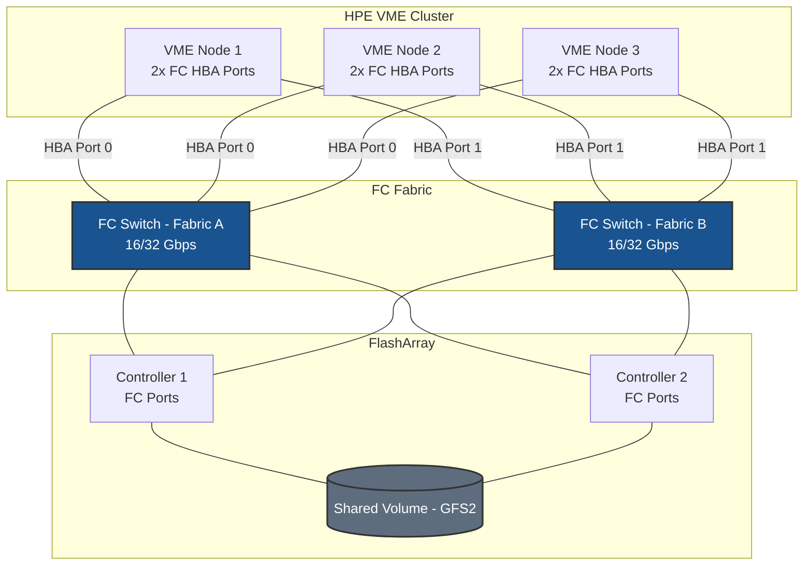

# Fibre Channel on HPE VM Essentials - Best Practices Guide

Comprehensive best practices for deploying Fibre Channel storage on HPE VM Essentials clusters in production environments.

---

## Table of Contents
- [Architecture Overview](#architecture-overview)
- [HPE VME-Specific Considerations](#hpe-vme-specific-considerations)
- [Fabric & Zoning Guidance](#fabric--zoning-guidance)
- [FC Architecture](#fc-architecture)
- [Multipath Configuration](#multipath-configuration)
- [Performance Tuning](#performance-tuning)
- [High Availability](#high-availability)
- [Monitoring & Maintenance](#monitoring--maintenance)
- [Security](#security)
- [Troubleshooting](#troubleshooting)

---

## Architecture Overview

### Deployment Topology



**Key points for HPE VME:**
- VME requires a minimum 3-node cluster for GFS2 shared datastores
- All cluster nodes must see the FC block device before the datastore can be created
- VME Manager has no FC storage configuration UI — all configuration is CLI-only
- GFS2 (Global File System 2) is the cluster filesystem used for shared VM datastores

---

## HPE VME-Specific Considerations

### VME Runs on Ubuntu

HPE VM Essentials hypervisor nodes run Ubuntu, so package management and HBA driver loading follow standard Debian/Ubuntu patterns: `multipath-tools`, `sg3-utils`, and the `lpfc` / `qla2xxx` in-box HBA drivers.

### No FC Target-Discovery UI in VME Manager

Unlike iSCSI, VME Manager has no Fibre Channel target-discovery interface. Host-side FC connectivity is prepared via CLI on each node — the same way iSCSI host setup is performed:

- HBA verification, WWPN collection, and multipath configuration are done via CLI on each node
- The FlashArray-side work (host/WWPN registration, host group, volume connection) and fabric zoning are prerequisites
- Once every node presents the multipath device, the datastore is created in the VME Manager UI as an **HPE Clustered Datastore (Shared LUN)**, which is backed by the GFS2 clustered filesystem

### GFS2 Requires All Nodes

GFS2 is a clustered filesystem that requires every cluster node to have simultaneous access to the block device. The VME Manager datastore wizard silently excludes devices that are not visible on all nodes — no error message is displayed.

**Before creating the datastore, confirm on every node:**
```bash
multipath -ll | grep PURE
```

### Use WWID-Based Device Path

Use the WWID-based device path from `/dev/mapper/` — not the `mpatha` alias — when referencing the block device in the GFS2 datastore wizard. The WWID is consistent across all nodes.

---

## Fabric & Zoning Guidance

### Single-Initiator Zoning (Required)

Each VME node's HBA WWPNs must be in their own zones. Register all cluster node WWPNs in the same host group on the FlashArray.

```
Zone: vme-node1-hba0-to-array
  Members: vme-node1-wwpn-hba0, array-ct0-port0, array-ct0-port1, array-ct1-port0, array-ct1-port1

Zone: vme-node1-hba1-to-array
  Members: vme-node1-wwpn-hba1, array-ct0-port2, array-ct0-port3, array-ct1-port2, array-ct1-port3
```

Repeat for each cluster node.

### Collecting WWPNs from All Nodes

```bash
# Run on each node
hostname && cat /sys/class/fc_host/host*/port_name
```

---

## FC Architecture

```
FC Fabric
  └── HBA Driver (lpfc / qla2xxx)
        └── SCSI Mid-Layer
              └── SCSI Disk (sdX — one per path)
                    └── dm-multipath
                          └── /dev/mapper/<wwid>  ← use this for GFS2 datastore
```

---

## Multipath Configuration

### Deploy Consistently Across All Nodes

`/etc/multipath.conf` must be identical on all cluster nodes.

```bash
tee /etc/multipath.conf > /dev/null <<'EOF'
defaults {
    find_multipaths         no
    polling_interval        10
    path_selector           "service-time 0"
    path_grouping_policy    group_by_prio
    failback                immediate
    no_path_retry           0
}

blacklist {
    devnode "^(ram|raw|loop|fd|md|dm-|sr|scd|st|nvme)[0-9]*"
    devnode "^sd[a]$"
    devnode "^vd[a-z]"
}

#devices {
#    device {
#        vendor               "VENDOR"
#        product              "PRODUCT"
#        path_selector        "service-time 0"
#        hardware_handler     "1 alua"
#        path_grouping_policy group_by_prio
#        prio                 alua
#        failback             immediate
#        path_checker         tur
#        fast_io_fail_tmo     5
#        dev_loss_tmo         60
#        no_path_retry        0
#    }
#}
EOF

systemctl restart multipathd
multipath -ll
```

---

## Performance Tuning

### HBA Queue Depth (Ubuntu/Debian)

**Emulex (lpfc):**
```bash
tee /etc/modprobe.d/lpfc.conf > /dev/null <<'EOF'
options lpfc lpfc_lun_queue_depth=64
EOF
update-initramfs -u
reboot
```

**QLogic (qla2xxx):**
```bash
tee /etc/modprobe.d/qla2xxx.conf > /dev/null <<'EOF'
options qla2xxx ql2xmaxqdepth=64
EOF
update-initramfs -u
reboot
```

> Apply to **all cluster nodes** before creating the GFS2 datastore.

---

## High Availability

### FC and VME Cluster HA

VME cluster HA relies on GFS2 cluster lock management (DLM). For seamless VM migration and failover:

- All nodes must have active FC paths at all times
- `fast_io_fail_tmo 5` and `dev_loss_tmo 60` balance quick path failover with tolerance for transient events
- `failback immediate` ensures optimized paths are restored after a controller failover

### Failover Timers

| Parameter | Recommended | Effect |
|-----------|-------------|--------|
| `fast_io_fail_tmo` | 5 seconds | Fast path failure detection |
| `dev_loss_tmo` | 60 seconds | Device retention during transient events |
| `failback` | `immediate` | Restore optimized paths immediately after recovery |

---

## Monitoring & Maintenance

```bash
# Check HBA state on all nodes
cat /sys/class/fc_host/host*/port_state
cat /sys/class/fc_host/host*/link_failure_count
cat /sys/class/fc_host/host*/speed

# Check multipath (run on every node)
multipath -ll

# GFS2 mount status
mount | grep gfs2
```

---

## Security

Fibre Channel security is implemented at the fabric level — no host-level firewall is required for FC storage traffic.

1. **Fabric zoning** — primary access control
2. **LUN masking / host registration** — enforced by the storage array based on WWPN and host group membership
3. **Hard zoning** — enforce at switch port level for strongest isolation

**Cluster note:** All VME cluster node WWPNs should share a single host group on the FlashArray for the shared GFS2 volume. Separate host groups per node for the same volume can cause inconsistent LUN numbering across nodes.



---

## Troubleshooting

### GFS2 Datastore Not Visible in VME Manager

The block device must be visible on **every** cluster node:

```bash
# Run on each node
multipath -ll | grep PURE
```

If any node shows nothing, complete the FC configuration steps on that node before retrying.

### Fewer Than Expected Paths

```bash
for h in /sys/class/fc_host/host*; do
    echo "$h: $(cat $h/port_state) — WWPN: $(cat $h/port_name)"
done
```

### LUNs Not Appearing After Rescan

```bash
cat /sys/class/fc_host/host*/port_state
rescan-scsi-bus.sh -a -r
lsscsi
multipath -ll
```

### Path Flapping

```bash
cat /sys/class/fc_host/host*/link_failure_count
cat /sys/class/fc_host/host*/loss_of_signal_count
journalctl -k | grep -i "fc\|scsi" | tail -50
```
