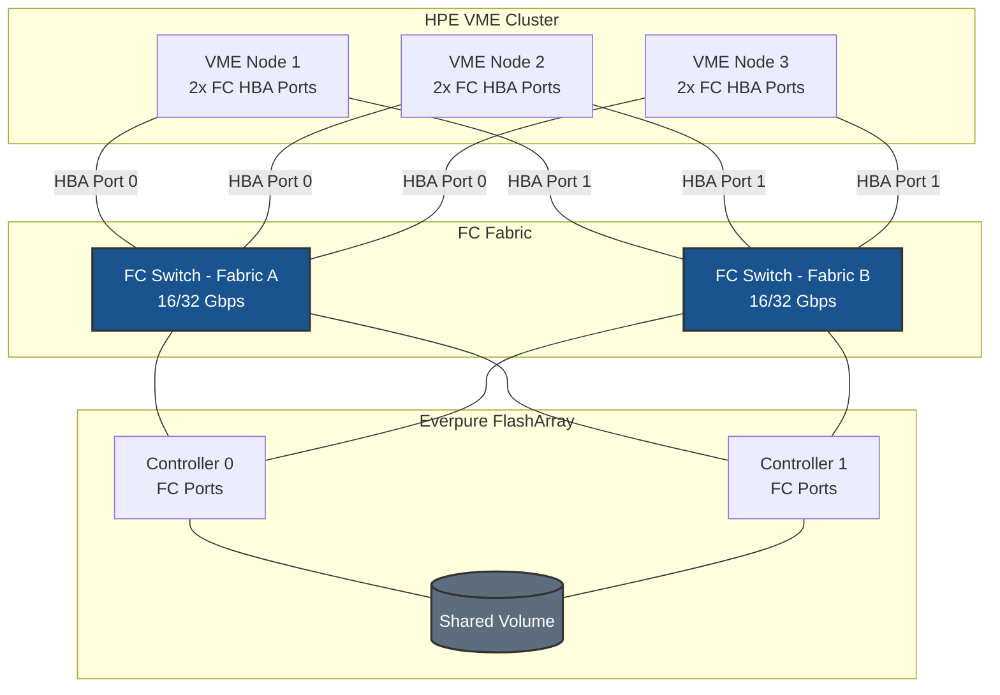
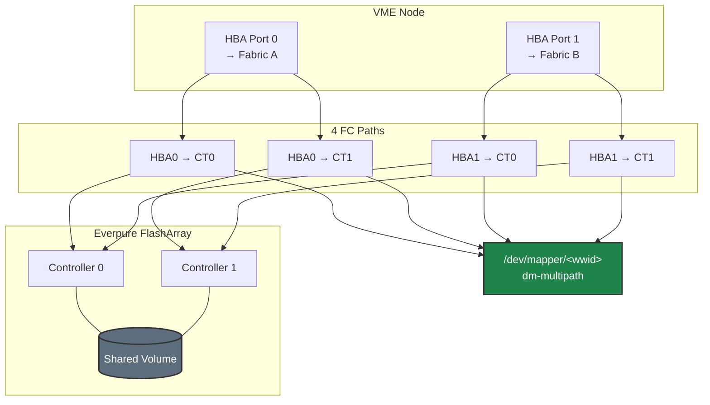

# Fibre Channel on HPE VM Essentials - Best Practices Guide

Production best practices for connecting an Everpure FlashArray to an HPE VM Essentials (VME) cluster over Fibre Channel and running a shared clustered datastore on it. This guide is deliberately scoped to the decisions that matter for VME + FlashArray FC: multipath, host tuning, and cluster high availability. It assumes the fabric zoning and array-side host/volume setup are already complete.

---

> **This guide assumes the FlashArray and FC fabric are already built.** FC ports cabled and online, target ports distributed across both controllers, switches zoned, and at least one volume created. The only array-side work referenced here is host/WWPN registration, Host Group creation, and connecting the volume. For initial FlashArray FC setup, see the [Everpure FlashArray documentation](https://support.purestorage.com). For the step-by-step host workflow, see the [FC Quickstart](./QUICKSTART.md).

---

## Table of Contents
- [Architecture Overview](#architecture-overview)
- [HPE VME-Specific Considerations](#hpe-vme-specific-considerations)
- [How FC Storage Appears in Linux](#how-fc-storage-appears-in-linux)
- [Multipath Configuration](#multipath-configuration)
- [Host Tuning](#host-tuning)
- [High Availability](#high-availability)
- [Monitoring & Maintenance](#monitoring--maintenance)
- [Security](#security)
- [Troubleshooting](#troubleshooting)
- [Quick Reference](#quick-reference)

---

## Architecture Overview

### Deployment Topology



**Design principles:**
- **Dual-fabric** (two physically separate switches). Each HBA port connects to one fabric only — never both ports to the same switch.
- **Minimum 4 paths per node** — 2 HBA ports × 2 FlashArray controllers. This is the smallest topology that survives the loss of either a fabric or a controller.
- **All cluster nodes connect to the same volume** and must present it as the same device before the datastore can be created.
- **No host IP/network config** is involved — FC transport has no TCP/IP layer.

---

## HPE VME-Specific Considerations

These are the points that make VME different from a standalone Linux FC host.

### Tooling ships with the VME install
VME hypervisor nodes run Ubuntu, and the FC + multipath packages (`multipath-tools`, `sg3-utils`) and in-box HBA drivers (`lpfc` for Emulex, `qla2xxx` for QLogic/Marvell) are already present after the VME install. You do not install these — you only configure `multipath.conf` and, optionally, tuning rules.

> **Ubuntu 22.04-based clusters only:** the clustered (GFS2) datastore requires the HWE kernel (`linux-generic-hwe-22.04`). VME's host preparation normally handles this; confirm with `uname -r` if the datastore fails to format. Clusters on Ubuntu 24.04 are unaffected.

### There is no FC target-discovery UI
Unlike iSCSI, VME Manager has no Fibre Channel discovery screen. Host-side FC connectivity — multipath configuration and verification — is done at the CLI on each node, exactly as iSCSI host setup is. **Where the UI comes in:** once every node presents the multipath device, you create the datastore in VME Manager as an **HPE Clustered Datastore (Shared LUN)**, which VME formats with the GFS2 clustered filesystem.

### Every node must see the device — silently
The clustered datastore is orchestrated by the Pacemaker/Corosync cluster stack with DLM (distributed lock manager) coordinating GFS2 access. Because of this, **every** node must present the LUN before the datastore can be created. The VME Manager block-device dropdown silently omits any device not visible on all nodes — no error is shown. **When to check:** immediately before opening the Add Data Store wizard, run on every node:
```bash
multipath -ll | grep -i FlashArray
```

### Reference the volume by WWID, not the mpath alias
The `/dev/mapper/<wwid>` path (e.g. `3624a937...`) is identical on every node; the `mpatha` friendly alias is not guaranteed to be. Always select the WWID device in the datastore wizard. This is why the multipath config below sets `user_friendly_names no`.

---

## How FC Storage Appears in Linux

```
FC Fabric
  └── HBA Driver (lpfc / qla2xxx)
        └── SCSI Mid-Layer
              └── SCSI Disk (sdX — one per path)
                    └── dm-multipath
                          └── /dev/mapper/<wwid>  ← select this in the datastore wizard
```

Each path to the LUN shows up as its own `sdX`. dm-multipath aggregates all of them into one `/dev/mapper/<wwid>` device. **Always target the `/dev/mapper` device** — never a raw `sdX`.

### FlashArray is active/active — expect a single priority group
The FlashArray reports every FC path as **active/optimized** via ALUA. With `path_grouping_policy group_by_prio`, that means `multipath -ll` shows **one** priority group (`prio=50`) containing all paths, all `active ready running`:

```
3624a93701071bf0a0a224a05001e9cbd dm-3 PURE,FlashArray
size=15T features='0' hwhandler='1 alua' wp=rw
`-+- policy='service-time 0' prio=50 status=active
  |- 18:0:0:254 sdm 8:192 active ready running
  |- 19:0:0:254 sdg 8:96  active ready running
  |  ...
```
This is expected and differs from active/passive arrays, which show a second lower-priority (`prio=10`) group for non-optimized paths. If you see only two paths where you expect four (or more), a fabric or HBA port is down — see [Troubleshooting](#troubleshooting).

---

## Multipath Configuration

`/etc/multipath.conf` must be **identical on every node**. Deploy it once, then copy it to each node and restart `multipathd`.

Recent `multipath-tools` ships built-in defaults for the `PURE`/`FlashArray` device, so the `defaults` + `blacklist` below is enough for most clusters. Include the explicit `devices` block when you want to pin the settings regardless of the packaged version — the values shown are Everpure's documented FC recommendations.

```bash
sudo tee /etc/multipath.conf > /dev/null <<'EOF'
defaults {
    user_friendly_names     no
    find_multipaths         no
    polling_interval        10
}

blacklist {
    # Local/boot, virtual, and NVMe devices (NVMe uses native multipath, not dm-multipath)
    devnode "^(ram|raw|loop|fd|md|dm-|sr|scd|st|nvme)[0-9]*"
    devnode "^sd[a]$"      # boot disk — adjust if your boot device differs
    devnode "^vd[a-z]"
}

devices {
    device {
        vendor                  "PURE"
        product                 "FlashArray"
        path_selector           "service-time 0"
        path_grouping_policy    group_by_prio
        prio                    alua
        hardware_handler        "1 alua"
        failback                immediate
        path_checker            tur
        fast_io_fail_tmo        10
        dev_loss_tmo            60
        no_path_retry           0
        user_friendly_names     no
    }
}
EOF

sudo systemctl restart multipathd
sudo multipath -ll
```

**Setting rationale (when each matters):**

| Setting | Value | Why for VME + FlashArray |
|---------|-------|--------------------------|
| `user_friendly_names` | `no` | Forces the `/dev/mapper/<wwid>` name, which is identical on every node — required for the shared datastore |
| `find_multipaths` | `no` | Claims all FlashArray paths immediately instead of waiting to see a second path; avoids the datastore device appearing late |
| `no_path_retry` | `0` | Fails I/O immediately when all paths are down rather than queueing — lets VME/GFS2 react instead of hanging |
| `fast_io_fail_tmo` | `10` | Fails I/O on a path 10 s after the fabric reports link-down, fast enough to fail over before app timeouts |
| `dev_loss_tmo` | `60` | Keeps the device for 60 s during transient events before removing it; raise if using ActiveCluster |
| `prio alua` / `group_by_prio` | — | Honors the array's ALUA state; on active/active FlashArray this yields the single optimized group described above |

> **Blacklist NVMe deliberately.** If the hosts also have NVMe/FC or NVMe/TCP to the array, leave `^nvme` blacklisted — NVMe uses native `nvme_core` multipath, and letting dm-multipath claim it causes conflicts.

---

## Host Tuning

Apply these on **every node**, after multipath is working and before putting the datastore into production. They are Everpure's recommended SCSI-device settings for FlashArray.

```bash
# /etc/udev/rules.d/99-pure-storage.rules
sudo tee /etc/udev/rules.d/99-pure-storage.rules > /dev/null <<'EOF'
# Use the no-op scheduler — FlashArray is all-flash, kernel reordering only adds latency
ACTION=="add|change", KERNEL=="sd*", ENV{ID_VENDOR}=="PURE", ATTR{queue/scheduler}="none"
# Reduce CPU overhead from entropy collection on storage devices
ACTION=="add|change", KERNEL=="sd*", ENV{ID_VENDOR}=="PURE", ATTR{queue/add_random}="0"
# Return I/O completions to the issuing CPU
ACTION=="add|change", KERNEL=="sd*", ENV{ID_VENDOR}=="PURE", ATTR{queue/rq_affinity}="2"
# 60s device timeout to ride out controller failover
ACTION=="add|change", KERNEL=="sd*", ENV{ID_VENDOR}=="PURE", RUN+="/bin/sh -c 'echo 60 > /sys/$DEVPATH/device/timeout'"
EOF

sudo udevadm control --reload-rules
sudo udevadm trigger
```

### HBA queue depth — only if you need it
The in-box driver defaults are adequate for most workloads. Raise queue depth **only** for verified high-IOPS/high-parallelism workloads that are HBA-queue-bound. On VME (Ubuntu) rebuild the initramfs with `update-initramfs` (not `dracut`), then reboot the node:

```bash
# Emulex (lpfc)
echo 'options lpfc lpfc_lun_queue_depth=64' | sudo tee /etc/modprobe.d/lpfc.conf
# QLogic (qla2xxx)
echo 'options qla2xxx ql2xmaxqdepth=64'     | sudo tee /etc/modprobe.d/qla2xxx.conf

sudo update-initramfs -u
sudo reboot   # one node at a time — see High Availability
```

---

## High Availability

### Path redundancy model



### Failover timers (from the multipath config above)

| Parameter | Value | Effect |
|-----------|-------|--------|
| `fast_io_fail_tmo` | 10 s | Fail I/O on a path shortly after link-down, before application/VM timeouts |
| `dev_loss_tmo` | 60 s | Retain the device through transient switch/controller events; remove only on sustained loss |
| `failback` | `immediate` | Return to optimized paths as soon as they recover after a controller failover |

### Enable a datastore heartbeat for VM HA
Path redundancy keeps the LUN reachable; **VME VM-level HA (auto-restart of VMs on a failed host) additionally requires a heartbeat enabled on a shared datastore.** After creating the clustered datastore, enable heartbeat on it so the cluster can detect a lost host and restart its VMs elsewhere.

### Patch and reboot one node at a time
GFS2 needs quorum. When applying kernel/HBA changes that require a reboot, do it **rolling — one node at a time**, confirming `multipath -ll` shows all paths back and the datastore is mounted before moving to the next node.

### Validate failover before production
Prove the path layer works by offlining a single path and confirming I/O continues:
```bash
sudo multipath -ll                                   # note the sdX devices
echo offline | sudo tee /sys/block/sdX/device/state  # drop one path
sudo multipath -ll                                   # path shows failed; I/O continues on the rest
echo running | sudo tee /sys/block/sdX/device/state  # restore; failback is immediate
```

---

## Monitoring & Maintenance

Run per node. HBA counters climbing over time point to a cable/SFP/fabric problem, not a host issue.

```bash
# HBA link — every port should read "Online" at the expected speed
cat /sys/class/fc_host/host*/port_state
cat /sys/class/fc_host/host*/speed

# Error counters — should be stable, not increasing
cat /sys/class/fc_host/host*/link_failure_count
cat /sys/class/fc_host/host*/loss_of_sync_count
cat /sys/class/fc_host/host*/loss_of_signal_count

# Multipath health and live path events
sudo multipath -ll
sudo multipathd -k"show paths"

# Clustered datastore is mounted
mount | grep gfs2
```

---

## Security

FC access control lives in the fabric and the array — there is no host firewall for FC traffic.

1. **Fabric zoning** — the first line of access control. Use **hard (port-based) zoning** on the switches for the strongest isolation.
2. **Host Group / LUN masking** — the FlashArray only presents the volume to WWPNs registered in the connected Host Group.
3. **Single Host Group per cluster** — keep all node WWPNs in one Host Group for the shared volume so LUN numbering stays consistent.



---

## Troubleshooting

| Symptom | Likely cause | Resolution |
|---------|--------------|------------|
| Device missing from the Add Data Store dropdown | Not visible on every node, or VME hasn't rescanned | Run `sudo rescan-scsi-bus.sh` on all nodes; confirm `multipath -ll` shows the WWID everywhere, then reopen the wizard |
| No `PURE`/`FlashArray` device on a node | Zoning incomplete, volume not connected, or HBA port down | Check `port_state` is `Online`; confirm the Host Group connection and both-fabric zoning for that node's WWPNs |
| Fewer paths than expected | A fabric or one HBA port is down | `cat /sys/class/fc_host/host*/port_state` (all `Online`); verify both fabrics are zoned for that node |
| Two priority groups appear (`prio=50` + `prio=10`) | ALUA reporting non-optimized paths | For FlashArray this usually indicates a fabric/config issue — confirm both controllers are reachable on both fabrics |
| Datastore created but I/O errors/hangs | `multipath.conf` inconsistent across nodes | Ensure the file is identical on every node with `no_path_retry 0`; `sudo multipathd reconfigure` |
| GFS2 mount hangs | Cluster quorum lost or a node unreachable | Confirm all nodes are online and can reach each other; check the cluster/DLM state |
| Paths flapping | Cable/SFP or fabric instability | Watch `link_failure_count` / `loss_of_signal_count`; check `journalctl -k` for `fc`/`scsi` link events |

---

## Quick Reference

**Fabric & array (prerequisites)**
- [ ] Dual-fabric, each HBA port on a separate switch
- [ ] Single-initiator zoning on both fabrics for every node's WWPNs
- [ ] All node WWPNs in one FlashArray Host Group; volume connected to the group

**Every node**
- [ ] `multipath.conf` identical on all nodes; `multipath -ll` shows the WWID device, all paths active (single `prio=50` group)
- [ ] `99-pure-storage.rules` udev tuning applied
- [ ] HBA ports `Online` at expected speed

**Cluster / datastore**
- [ ] WWID device visible on **every** node before opening the wizard
- [ ] Datastore created as **HPE Clustered Datastore (Shared LUN)**
- [ ] Heartbeat enabled on the datastore for VM HA
- [ ] Failover validated by offlining a path

---

## Additional Resources
- [FC Quickstart](./QUICKSTART.md)
- [Everpure FlashArray — Linux Recommended Settings](https://support.purestorage.com/Solutions/Linux/Linux_Reference/Linux_Recommended_Settings)
- [HPE VM Essentials Documentation](https://hpevm-docs.morpheusdata.com/)
