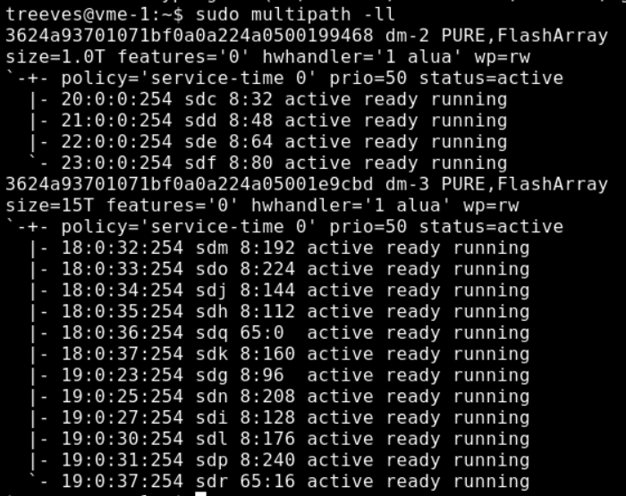
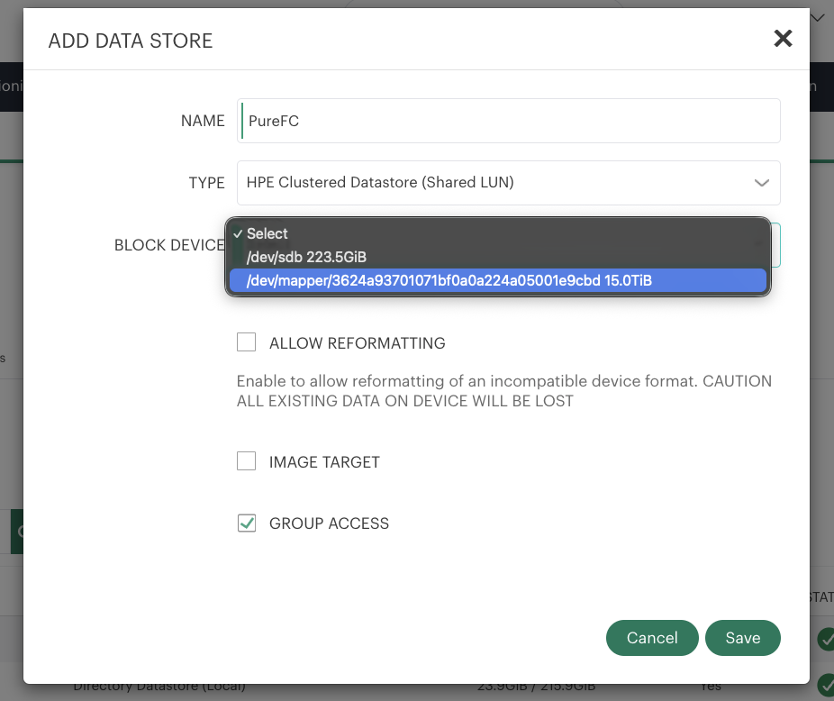

# Everpure FlashArray Fibre Channel Configuration Guide for HPE VM Essentials

This guide covers connecting a Everpure FlashArray Fibre Channel volume to an HPE VM Essentials (VME) cluster and creating a shared clustered datastore.

> **The host side is intentionally short.** Once the FlashArray-side prerequisites are complete (WWPNs registered, host group created, volume connected, and fabric zoning in place), the only work on the VME hosts is installing multipath tooling, confirming the volume is visible, and creating the datastore in VME Manager. VME Manager has no Fibre Channel target-discovery UI — the host-side steps below are done via CLI, then the datastore is created in the UI.

---

## Prerequisites

Complete these on the FlashArray and FC fabric **before** starting — they are outside the scope of this guide:

| Requirement | Details |
|-------------|---------|
| HPE VME Cluster | Deployed and operational (3+ nodes for a shared clustered datastore) |
| FlashArray host setup | A host entry per VME node (OS type `Linux`) with each node's WWPNs, all added to one **Host Group** |
| Volume connected | Target volume connected to that Host Group |
| Fabric zoning | Single-initiator zoning complete on both fabrics for every node's HBA WWPNs |
| HBAs | Installed in each node and cabled to both fabrics |
| Access | Root or sudo on all cluster hosts |

> **Need your WWPNs to register on the array?** Run `cat /sys/class/fc_host/host*/port_name` on each host. See the [FC Best Practices]({{ site.baseurl }}/distributions/hpe-vme/fc/BEST-PRACTICES.html) for HBA verification and zoning guidance.



---

## Step 1: Configure Multipath

Multipath tooling (`multipath-tools`, `sg3-utils`) is already present on HVM hosts from the VME install. Run on **every cluster host** to apply a Pure-appropriate configuration — recent `multipath-tools` ships built-in defaults for `PURE FlashArray`, so a minimal `defaults`/`blacklist` configuration is enough:



---

## Step 2: Rescan and Verify the Volume

Run on **every cluster host**:

```bash
# Scan for the newly presented LUN(s)
sudo rescan-scsi-bus.sh

# Confirm the Pure device and its paths
sudo multipath -ll
```

**Expected output** — the Pure FlashArray is active/active, so every path appears in a **single active/optimized priority group** (`prio=50`), all `active ready running`:



> **Note the WWID** (`3624a9...`) — it must match the volume you connected on the FlashArray, and it must be the **same on every host**. VME Manager will not show the device in the datastore wizard unless it is visible on **all** cluster nodes, and no error is displayed if a host is missing it.

---

## Step 3: Create the Shared Datastore in VME Manager

1. Go to **Infrastructure > Clusters > [Your Cluster] > Storage > Data Stores** and click **+ ADD**.
2. **NAME** — enter a name (e.g. `PureFC`).
3. **TYPE** — select **HPE Clustered Datastore (Shared LUN)**.
4. **BLOCK DEVICE** — select the Pure multipath device (`/dev/mapper/<wwid>`), *not* a local disk.
5. Leave **GROUP ACCESS** enabled so all cluster nodes mount the datastore.
6. Click **Save**.



VME Manager formats the LUN with the GFS2 clustered filesystem, configures cluster locking, and mounts it on all nodes.

> **Only local disks in the dropdown?** The Pure device isn't visible on every node. Confirm `multipath -ll` shows it on **all** hosts (Step 2), then re-run the rescan and reopen the wizard.

---

## Verification

On **each cluster host**:

```bash
cat /sys/class/fc_host/host*/port_state   # all Online
sudo multipath -ll                        # Pure device, all paths active
mount | grep gfs2                         # datastore mounted
```

In VME Manager, confirm the datastore shows **Online** under **Infrastructure > Clusters > [Your Cluster] > Storage > Data Stores**.

---

## Troubleshooting

| Symptom | Cause | Resolution |
|---------|-------|------------|
| Block device not in the datastore wizard | VME Manager doesn't auto-rescan hosts, or the device isn't on every node | Run `sudo rescan-scsi-bus.sh` on **all** hosts; confirm `multipath -ll` shows the device everywhere (Step 2) |
| No PURE device after rescan | Volume not connected, or zoning incomplete | Verify the Host Group connection on the FlashArray and zoning on both fabrics |
| Fewer paths than expected | An HBA port is down or a fabric zone is missing | Check `cat /sys/class/fc_host/host*/port_state` (all `Online`); confirm zoning covers both fabrics |
| Datastore created but I/O errors | `multipath.conf` misconfigured | Verify `find_multipaths no` and `no_path_retry 0` on all hosts (Step 1) |
