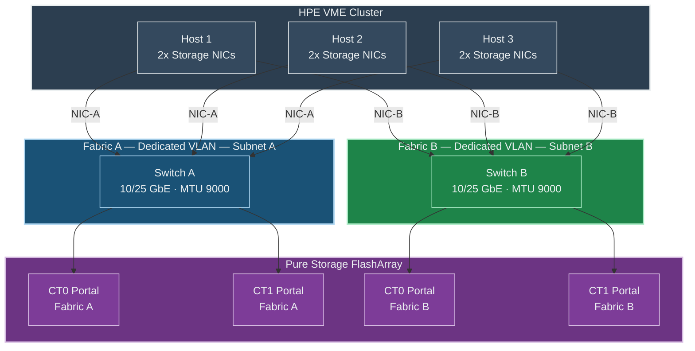

# iSCSI Storage on HPE VM Essentials - Best Practices Guide

Comprehensive best practices for deploying iSCSI storage with GFS2 datastores on HPE Virtual Machine Essentials (VME) clusters in production environments.

---

> **This guide assumes that the Pure Storage FlashArray is already configured and ready for iSCSI connectivity.** This includes iSCSI interfaces enabled and assigned to the correct ports/VLANs, target portal IPs configured on both controllers, storage network configured end-to-end, and at least one volume available. The only Pure FlashArray configuration covered is host IQN registration and Host Group setup. For initial FlashArray iSCSI setup, refer to the [Pure Storage FlashArray documentation](https://support.purestorage.com).

---

## Table of Contents
- [Architecture Overview](#architecture-overview)
- [HPE VME iSCSI Concepts](#hpe-vme-iscsi-concepts)
- [Network Configuration](#network-configuration)
- [iSCSI Initiator Configuration](#iscsi-initiator-configuration)
- [Multipath Configuration](#multipath-configuration)
- [GFS2 Clustered Filesystem](#gfs2-clustered-filesystem)
- [Security](#security)
- [Monitoring & Verification](#monitoring--verification)
- [Troubleshooting](#troubleshooting)

---

## Architecture Overview

### HPE VME iSCSI Dual-Fabric Topology



> Each host has **4 iSCSI paths** to storage (2 controllers × 2 fabrics). Multipath (MPIO) is required for GFS2 datastores.

### Key Design Principles

- **Dual fabric design** with separate switches, VLANs, and subnets per fabric
- **Minimum 2 storage NICs per host** for multipath I/O
- **MTU 9000 (jumbo frames)** end-to-end — host, switch, and array
- **GFS2** clustered filesystem with minimum 3 nodes for quorum

---

## HPE VME iSCSI Concepts

### Storage Architecture

| Component | Function |
|-----------|----------|
| **iSCSI Initiator** | Host-side iSCSI client (open-iscsi) |
| **iSCSI Target** | Storage array iSCSI service |
| **LUN** | Logical Unit - block device presented to hosts |
| **MPIO** | Multipath I/O - aggregates paths to LUN |
| **GFS2** | Clustered filesystem for shared access |

### Clustered Filesystem

GFS2 is the primary clustered filesystem for VME iSCSI datastores. It requires a minimum of 3 cluster nodes for quorum and is managed entirely through the VME Manager UI.

---

## Network Configuration

### Best Practices
- Use **separate NICs per fabric** for true path diversity
- Set **MTU 9000** on all storage interfaces, switches, and Pure FlashArray ports
- Use **dedicated VLANs** for each storage fabric — do not share with management or compute traffic
- Verify jumbo frame connectivity with `ping -M do -s 8972 <portal-ip>` from every host before proceeding with iSCSI setup

---

## iSCSI Initiator Configuration

### Best Practices

- **Register each host's IQN** on the Pure FlashArray under **Storage > Hosts** before discovery
- **Use iface bindings** to bind each fabric's discovery to the correct NIC — this is required for dual-fabric isolation
- **Use `sendtargets` with the `-I` flag** to specify the iface for each discovery (see the [iSCSI Quickstart](./QUICKSTART.md) for the full CLI workflow)
- **Filter unwanted portals** after discovery if the Pure FlashArray has iSCSI portals on multiple networks
- **Enable automatic login** with `node.startup = automatic` so sessions reconnect after reboot
- **Verify 4 sessions per host** (2 controllers × 2 fabrics) with `sudo iscsiadm -m session`

---

## Multipath Configuration

### Pure Storage FlashArray multipath.conf

> **Source:** Based on [Pure Storage Linux Recommended Settings](https://support.purestorage.com/). Verify against the latest Pure documentation for your FlashArray model and Purity version.

```bash
# /etc/multipath.conf
defaults {
    user_friendly_names yes
    find_multipaths no
    enable_foreign "^$"
}

# Blacklist local devices and NVMe (NVMe uses native multipath)
blacklist {
    devnode "^(ram|raw|loop|fd|md|dm-|sr|scd|st|nvme)[0-9]*"
    devnode "^hd[a-z]"
    devnode "^cciss.*"
}

# Add device-specific settings for your storage array
# Consult your storage vendor documentation for recommended values
#devices {
#    device {
#        vendor "VENDOR"
#        product "PRODUCT"
#        path_selector "service-time 0"
#        path_grouping_policy "group_by_prio"
#        prio "alua"
#        failback "immediate"
#        path_checker "tur"
#        fast_io_fail_tmo 10
#        dev_loss_tmo 60
#        no_path_retry 0
#        hardware_handler "1 alua"
#        rr_min_io_rq 1
#    }
#}
```

### Apply Multipath Configuration

```bash
# Restart multipath daemon
sudo systemctl restart multipathd

# Verify multipath devices
sudo multipath -ll

# Expected output shows all paths
# mpath0 (wwid) dm-0 PURE,FlashArray
# size=100G features='0' hwhandler='1 alua' wp=rw
# |-+- policy='service-time 0' prio=50 status=active
# | |- 1:0:0:0 sdb 8:16  active ready running
# | `- 2:0:0:0 sdc 8:32  active ready running
# `-+- policy='service-time 0' prio=10 status=enabled
#   |- 3:0:0:0 sdd 8:48  active ready running
#   `- 4:0:0:0 sde 8:64  active ready running
```

### Multipath Commands

```bash
# Show multipath topology
sudo multipath -ll

# Reconfigure multipath
sudo multipath -r

# Show path status
sudo multipathd show paths

# Flush unused paths
sudo multipath -F
```

---

## GFS2 Clustered Filesystem

GFS2 is the clustered filesystem used for shared iSCSI block storage in VME. Per the [HPE VME documentation](https://hpevm-docs.morpheusdata.com/), GFS2 requires a **minimum of 3 cluster nodes** for quorum. The VME Manager handles all GFS2 filesystem creation and cluster configuration automatically — no manual filesystem commands are required.

### Creating a GFS2 Datastore

1. Navigate to **Infrastructure > Clusters > [Cluster] > Storage > Data Stores**
2. Click **ADD**
3. Select **GFS2 Pool** as TYPE
4. Select the Pure multipath device from the block device dropdown
5. Click **SAVE**

> **Note:** All cluster hosts must have working iSCSI sessions and multipath devices before the block device will appear in the dropdown. See the [iSCSI Quickstart — Step 8](./QUICKSTART.md#step-8-rescan-and-create-gfs2-datastore-in-vme-manager) for the full procedure including the required manual rescan.

---

## Security

- **Dedicated VLANs** for iSCSI traffic — do not share with management or compute networks
- **No routing** between storage and public networks
- **Pure FlashArray Host Groups** restrict volume access to only registered host IQNs

---

## Monitoring & Verification

Key commands for ongoing health checks:

| Command | Purpose |
|---------|---------|
| `sudo iscsiadm -m session` | Verify active iSCSI sessions (expect 4 per host in dual-fabric) |
| `sudo multipath -ll` | Verify all paths are active and healthy |
| `mount \| grep gfs2` | Verify GFS2 datastores are mounted |
| `df -h \| grep mapper` | Check datastore capacity and usage |

---

## Troubleshooting

| Issue | Cause | Resolution |
|-------|-------|------------|
| GFS2 datastore creation fails | Not all hosts have multipath devices | Verify `multipath -ll` on **every** host shows the same device |
| No multipath devices | iSCSI sessions not established | Run `iscsiadm -m session` to check; re-run discovery and login if needed |
| Path shows as failed | Network connectivity lost to a portal | Verify connectivity with `ping <portal-ip>` and check switch/VLAN config |
| GFS2 mount hangs | Cluster quorum lost or DLM issue | Verify all nodes are online and reachable from each other |
| Block device missing in VME UI | Hosts not rescanned after iSCSI login | Run `sudo iscsiadm -m session --rescan` on all hosts |

---

## Additional Resources

- [iSCSI Quick Start](./QUICKSTART.md)
- [HPE VM Essentials Documentation](https://hpevm-docs.morpheusdata.com/)
- [Pure Storage FlashArray Documentation](https://support.purestorage.com)

---

## Quick Reference

### iSCSI Checklist

- [ ] iSCSI initiator IQN registered with storage
- [ ] Storage NICs configured (dual-fabric recommended)
- [ ] MTU 9000 verified end-to-end
- [ ] iSCSI discovery completed on all portals
- [ ] iSCSI sessions established

### Multipath Checklist

- [ ] /etc/multipath.conf configured for storage vendor
- [ ] All paths showing active

### GFS2 Datastore Checklist

- [ ] Minimum 3 cluster nodes
- [ ] GFS2 datastore added in HPE VME Manager
- [ ] Datastore shows Online on all hosts
- [ ] Test VM provisioned successfully
