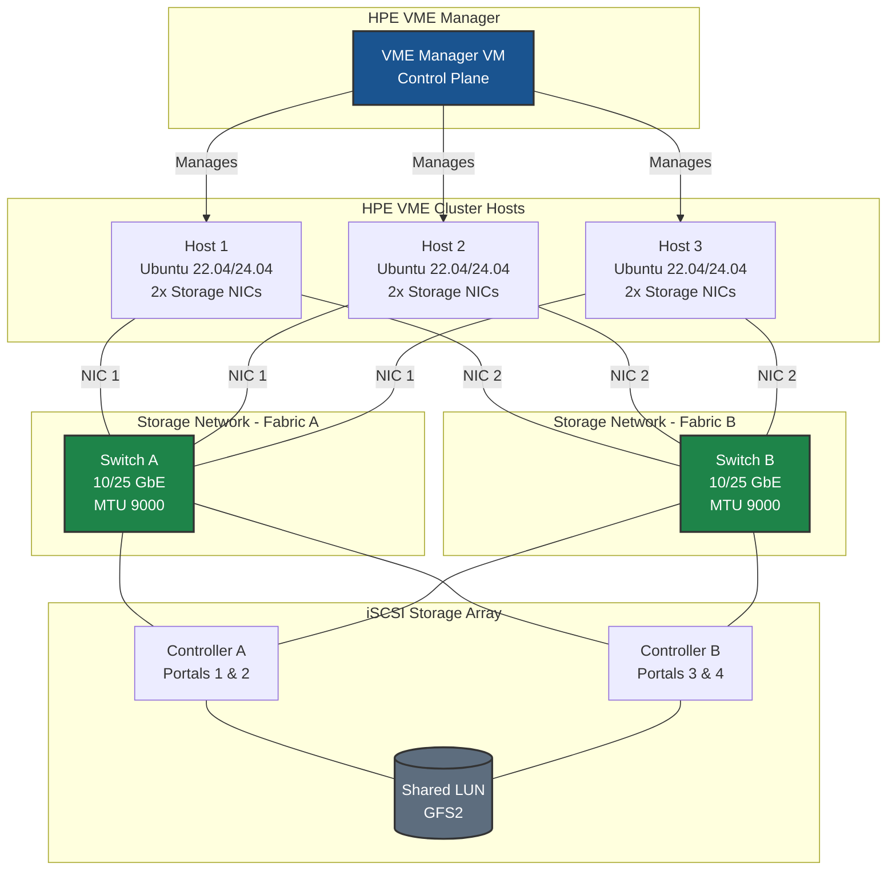
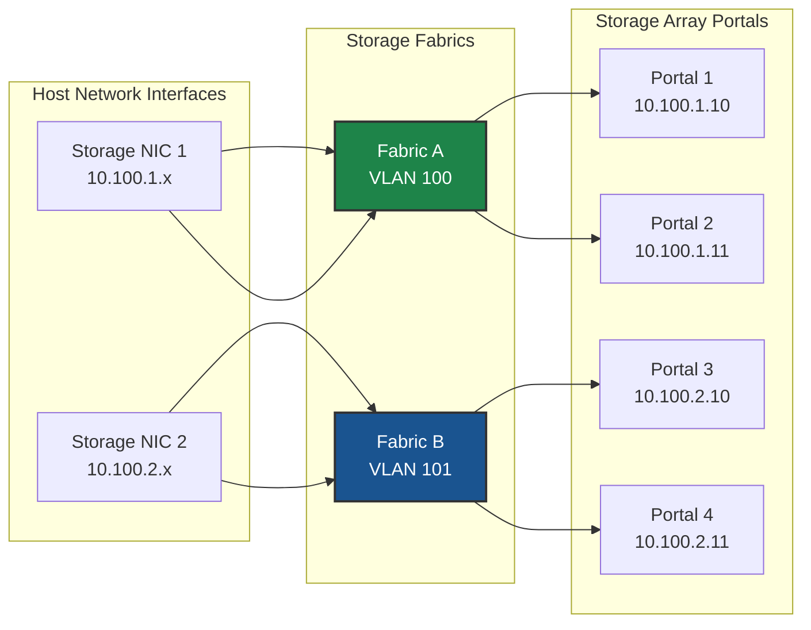
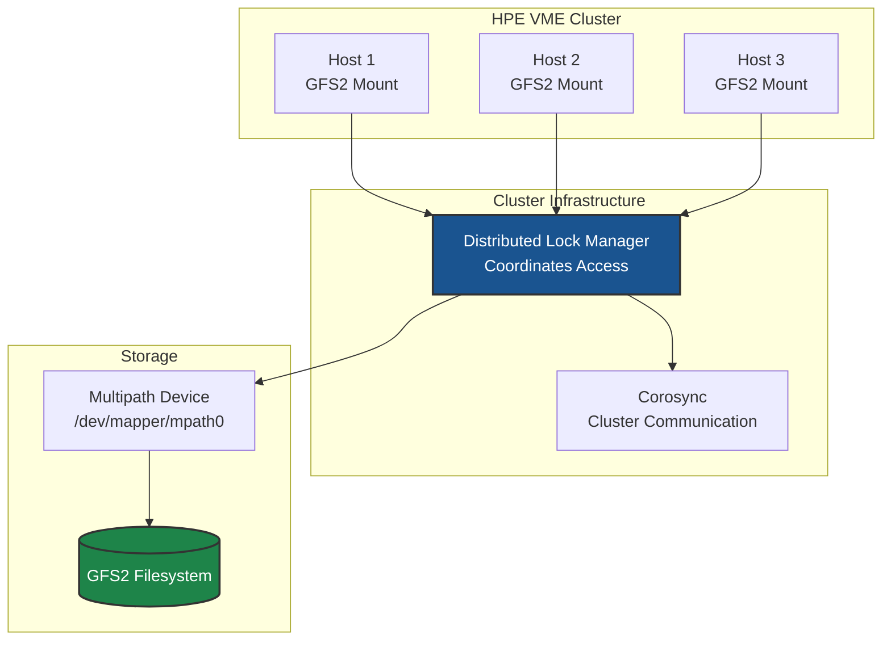

# iSCSI Storage on HPE VM Essentials - Best Practices Guide

Comprehensive best practices for deploying iSCSI storage with GFS2 datastores on HPE Virtual Machine Essentials (VME) clusters in production environments.

---



---

## Table of Contents
- [Architecture Overview](#architecture-overview)
- [HPE VME iSCSI Concepts](#hpe-vme-iscsi-concepts)
- [System Requirements](#system-requirements)
- [Network Configuration](#network-configuration)
- [iSCSI Initiator Configuration](#iscsi-initiator-configuration)
- [Multipath Configuration](#multipath-configuration)
- [GFS2 Clustered Filesystem](#gfs2-clustered-filesystem)
- [HPE VME Manager Configuration](#hpe-vme-manager-configuration)
- [Performance Tuning](#performance-tuning)
- [High Availability](#high-availability)
- [Security](#security)
- [Monitoring & Maintenance](#monitoring--maintenance)
- [Troubleshooting](#troubleshooting)

---

## Architecture Overview

### HPE VME iSCSI Storage Topology



### Key Design Principles

- **Dual fabric design** for network redundancy
- **Minimum 2 NICs per host** for multipath I/O (MPIO)
- **MTU 9000 (jumbo frames)** end-to-end
- **GFS2 or OCFS2** for clustered filesystem access
- **MPIO required** for iSCSI/FC LUNs with GFS2 datastores

---

## HPE VME iSCSI Concepts

### Storage Architecture

| Component | Function |
|-----------|----------|
| **iSCSI Initiator** | Host-side iSCSI client (open-iscsi) |
| **iSCSI Target** | Storage array iSCSI service |
| **LUN** | Logical Unit - block device presented to hosts |
| **MPIO** | Multipath I/O - aggregates paths to LUN |
| **GFS2** | Clustered filesystem for shared access |

### GFS2 vs OCFS2

| Feature | GFS2 | OCFS2 |
|---------|------|-------|
| **Origin** | Red Hat | Oracle |
| **Cluster Support** | Excellent | Good |
| **HPE VME Support** | Primary | Secondary |
| **Max Nodes** | 16 | 32 |
| **Recommendation** | Preferred for VME | Alternative |

### Supported Storage Arrays

Per HPE VME compatibility matrix:
- HPE Alletra (iSCSI, FC, NFS)
- NetApp ONTAP 9.14+ (iSCSI, FC, NFS)
- Dell PowerStore 4.0+ (iSCSI, FC, NFS)
- Pure Storage FlashArray (iSCSI, FC, NFS)

---

## System Requirements

### Host Requirements

```bash
# Operating System
Ubuntu 22.04 LTS or Ubuntu 24.04 LTS

# Kernel (CRITICAL for GFS2)
HWE kernel required: linux-generic-hwe-22.04

# CPU
64-bit x86 with Intel VT or AMD-V enabled

# Memory
Minimum 8GB + 4GB per Ceph disk (HCI)
Minimum 8GB for non-HCI

# Network
2x dedicated storage NICs minimum
10 Gbps or faster recommended
```

### Install HWE Kernel

```bash
# Required for GFS2 compatibility
sudo apt update
sudo apt install -y linux-generic-hwe-22.04

# Reboot
sudo reboot

# Verify
uname -r  # Should show HWE kernel version
```

### Required Packages

```bash
sudo apt install -y \
    open-iscsi \
    multipath-tools \
    sg3-utils \
    lsscsi
```

---

## Network Configuration

> **⚠️ Critical - Ubuntu Installation:** During Ubuntu installation, configure ALL network interfaces you plan to use in the network setup step. Interfaces not configured during installation won't appear in the HPE VM Console and must be configured manually via netplan.

### Dual-Fabric Network Design



### Netplan Configuration

**Option 1: Dual Fabric (Separate NICs)**

Best for maximum redundancy with end-to-end path diversity:

```yaml
# /etc/netplan/01-storage.yaml
network:
  version: 2
  ethernets:
    # Storage Fabric A
    eth1:
      addresses:
        - 10.100.1.101/24
      mtu: 9000
      routes: []
      nameservers: {}
    # Storage Fabric B
    eth2:
      addresses:
        - 10.100.2.101/24
      mtu: 9000
      routes: []
      nameservers: {}
```

**Option 2: Bonded Storage (Recommended for Simplicity)**

Provides NIC/switch redundancy with simpler configuration:

```yaml
# /etc/netplan/01-storage.yaml
network:
  version: 2
  ethernets:
    eth1:
      dhcp4: false  # No IP on member NICs
    eth2:
      dhcp4: false  # No IP on member NICs
  bonds:
    bond1:
      interfaces: [eth1, eth2]
      addresses:
        - 10.100.1.101/24
      mtu: 9000
      parameters:
        mode: 802.3ad        # LACP - requires switch support
        lacp-rate: fast
        mii-monitor-interval: 100
        transmit-hash-policy: layer3+4
```

Alternative bond modes:
- `balance-xor` - Good for storage, no switch LACP needed
- `active-backup` - Simple failover

Apply configuration:
```bash
sudo netplan apply

# Verify bond (if using bonded config)
cat /proc/net/bonding/bond1
```

> **Note:** Even with bonded storage, multipath still provides redundancy through multiple storage array controller portals.

### MTU Verification

```bash
# Verify MTU on interfaces
ip link show eth1 | grep mtu
ip link show eth2 | grep mtu

# Test jumbo frames to each portal
ping -M do -s 8972 10.100.1.10
ping -M do -s 8972 10.100.2.10
```

---

## iSCSI Initiator Configuration

### Initiator IQN

Each host has a unique initiator IQN:

```bash
# View initiator IQN
cat /etc/iscsi/initiatorname.iscsi

# Output example:
# InitiatorName=iqn.2004-10.com.ubuntu:01:a1b2c3d4e5f6
```

**Important:** Register each host's IQN with your storage array for access control.

### iSCSI Configuration

```bash
# /etc/iscsi/iscsid.conf - Key settings

# Automatic session reconnection
node.startup = automatic

# Session timeouts
node.session.timeo.replacement_timeout = 120

# Error recovery level
node.session.err_timeo.abort_timeout = 15
node.session.err_timeo.lu_reset_timeout = 30
node.session.err_timeo.tgt_reset_timeout = 30

# CHAP authentication (if required)
# node.session.auth.authmethod = CHAP
# node.session.auth.username = <initiator_username>
# node.session.auth.password = <initiator_password>
```

### Target Discovery and Login

```bash
# Discover targets on all portals
sudo iscsiadm -m discovery -t sendtargets -p 10.100.1.10:3260
sudo iscsiadm -m discovery -t sendtargets -p 10.100.1.11:3260
sudo iscsiadm -m discovery -t sendtargets -p 10.100.2.10:3260
sudo iscsiadm -m discovery -t sendtargets -p 10.100.2.11:3260

# Login to all discovered targets
sudo iscsiadm -m node -l

# Verify sessions (should show 4 sessions for dual-controller array)
sudo iscsiadm -m session
```

---

## Multipath Configuration

### Ubuntu 24.04 Multipath Configuration

```bash
# /etc/multipath.conf
defaults {
    user_friendly_names yes
    find_multipaths no
    polling_interval 5
    path_selector "service-time 0"
    path_grouping_policy group_by_prio
    failback immediate
    no_path_retry queue
}

blacklist {
    devnode "^(ram|raw|loop|fd|md|dm-|sr|scd|st|nvme)[0-9]*"
    devnode "^hd[a-z]"
    devnode "^sd[a-z]$"  # Blacklist local boot disk
}

devices {
    # HPE Alletra / 3PAR
    device {
        vendor "3PARdata"
        product "VV"
        path_grouping_policy group_by_prio
        path_selector "service-time 0"
        prio alua
        failback immediate
        rr_weight priorities
        no_path_retry 18
    }

    # NetApp ONTAP
    device {
        vendor "NETAPP"
        product "LUN.*"
        path_grouping_policy group_by_prio
        path_selector "service-time 0"
        prio ontap
        failback immediate
        no_path_retry queue
    }
}
```

### Apply Multipath Configuration

```bash
# Restart multipath daemon
sudo systemctl restart multipathd

# Verify multipath devices
sudo multipath -ll

# Expected output shows all paths
# mpath0 (wwid) dm-0 3PARdata,VV
# size=100G features='0' hwhandler='1 alua' wp=rw
# |-+- policy='service-time 0' prio=50 status=active
# | |- 1:0:0:0 sdb 8:16  active ready running
# | `- 2:0:0:0 sdc 8:32  active ready running
# `-+- policy='service-time 0' prio=10 status=enabled
#   |- 3:0:0:0 sdd 8:48  active ready running
#   `- 4:0:0:0 sde 8:64  active ready running
```

### Multipath Commands

```bash
# Show multipath topology
sudo multipath -ll

# Reconfigure multipath
sudo multipath -r

# Show path status
sudo multipathd show paths

# Flush unused paths
sudo multipath -F
```

---

## GFS2 Clustered Filesystem

### GFS2 Architecture



### GFS2 Requirements

- **Minimum 3 cluster nodes** (for quorum)
- **HWE kernel** installed
- **Cluster lock manager** (DLM) configured
- **Corosync** for cluster communication

### HPE VME Manager Creates GFS2

HPE VME Manager handles GFS2 creation automatically:

1. Navigate to **Infrastructure > Clusters > [Cluster] > Storage > Data Stores**
2. Click **ADD**
3. Select **GFS2 Pool** as TYPE
4. Select multipath device
5. HPE VME Manager:
   - Creates filesystem with `mkfs.gfs2`
   - Configures DLM and cluster resources
   - Mounts on all cluster hosts

### Manual GFS2 Commands (Reference Only)

```bash
# Create GFS2 filesystem (DO NOT run manually - HPE VME Manager handles this)
# mkfs.gfs2 -p lock_dlm -t cluster_name:fs_name -j 3 /dev/mapper/mpath0

# Mount GFS2
# mount -t gfs2 /dev/mapper/mpath0 /mnt/gfs2-datastore

# Check GFS2 status
sudo gfs2_tool df /mnt/gfs2-datastore
```

---

## HPE VME Manager Configuration

### Adding iSCSI Storage Settings

1. **Infrastructure > Clusters > [Cluster] > Storage**
2. Under **STORAGE SETTINGS** section:
   - **iSCSI DISCOVERY IPs**: Enter comma-separated portal IPs
   - Example: `10.100.1.10,10.100.1.11,10.100.2.10,10.100.2.11`

### Creating GFS2 Datastore

1. Navigate to **Storage > Data Stores** subtab
2. Click **ADD**
3. Configure:
   - **NAME**: Descriptive name (cannot change later)
   - **TYPE**: GFS2 Pool
   - **DISK**: Select multipath device
4. Click **SAVE**

Initialization takes several minutes. Monitor status until **Online**.

### Storage Verification in VME

After datastore creation, verify:
- Datastore shows **Online** in all cluster hosts
- Capacity and free space displayed correctly
- Test VM creation on the new datastore

---

## Performance Tuning

### iSCSI Tuning

```bash
# /etc/iscsi/iscsid.conf

# Increase queue depth for better throughput
node.session.queue_depth = 128

# Increase max outstanding R2Ts
node.session.iscsi.MaxR2T = 16

# First burst length
node.session.iscsi.FirstBurstLength = 262144

# Max burst length
node.session.iscsi.MaxBurstLength = 16776192

# Max receive segment length
node.session.iscsi.MaxRecvDataSegmentLength = 262144
```

### Kernel Tuning

```bash
# /etc/sysctl.d/99-iscsi-storage.conf

# Network buffer sizes
net.core.rmem_max = 134217728
net.core.wmem_max = 134217728
net.ipv4.tcp_rmem = 4096 87380 67108864
net.ipv4.tcp_wmem = 4096 65536 67108864

# I/O scheduler for iSCSI devices
# Set via udev rules for multipath devices

# VM memory settings
vm.dirty_ratio = 10
vm.dirty_background_ratio = 5
```

Apply:
```bash
sudo sysctl -p /etc/sysctl.d/99-iscsi-storage.conf
```

### I/O Scheduler

```bash
# /etc/udev/rules.d/60-iscsi-scheduler.rules
ACTION=="add|change", KERNEL=="sd[a-z]", ATTR{queue/scheduler}="mq-deadline"
ACTION=="add|change", KERNEL=="dm-*", ATTR{queue/scheduler}="mq-deadline"
```

---

## High Availability

### Cluster Quorum

- **Minimum 3 nodes** for proper quorum
- **Fencing/STONITH** configured for split-brain prevention
- HPE VME Manager handles HA configuration

### Path Failover

Multipath handles automatic failover:

```bash
# Simulate path failure
sudo iscsiadm -m session -r <session_id> -u

# Verify failover
sudo multipath -ll

# Verify I/O continues on remaining paths
dd if=/dev/mapper/mpath0 of=/dev/null bs=1M count=100
```

### GFS2 Node Failure Recovery

If a node fails:
1. Cluster detects failure via Corosync
2. DLM recovers locks held by failed node
3. GFS2 journal replayed
4. Storage access continues on remaining nodes

---

## Security

### iSCSI CHAP Authentication

```bash
# /etc/iscsi/iscsid.conf

# Enable CHAP
node.session.auth.authmethod = CHAP
node.session.auth.username = initiator_user
node.session.auth.password = secure_password_here

# Mutual CHAP (optional)
node.session.auth.username_in = target_user
node.session.auth.password_in = target_password_here
```

### Network Isolation

- **Dedicated VLANs** for iSCSI traffic
- **No routing** between storage and public networks
- **Access control lists** on switches

---

## Monitoring & Maintenance

### Health Check Commands

```bash
# iSCSI sessions
sudo iscsiadm -m session -P 3

# Multipath status
sudo multipath -ll
sudo multipathd show paths

# GFS2 status
mount | grep gfs2
sudo gfs2_tool df /path/to/gfs2/mount

# Cluster status
sudo pcs status  # If using Pacemaker
```

### Monitoring Script

```bash
#!/bin/bash
# iscsi-gfs2-health.sh

echo "=== iSCSI/GFS2 Health Check ==="
echo "Date: $(date)"

echo -e "\n--- iSCSI Sessions ---"
sudo iscsiadm -m session

echo -e "\n--- Multipath Status ---"
sudo multipath -ll

echo -e "\n--- GFS2 Mounts ---"
mount | grep gfs2

echo -e "\n--- Disk Usage ---"
df -h | grep -E "(mapper|gfs2)"

echo "=== End Check ==="
```

---

## Troubleshooting

### Common Issues

**Issue: GFS2 datastore creation fails**
```bash
# Verify HWE kernel
uname -r | grep hwe

# Check multipath device
sudo multipath -ll

# Verify all hosts have iSCSI sessions
sudo iscsiadm -m session
```

**Issue: No multipath devices**
```bash
# Check iSCSI sessions exist
sudo iscsiadm -m session

# Verify multipathd running
sudo systemctl status multipathd

# Reconfigure multipath
sudo multipath -r
```

**Issue: Path shows as failed**
```bash
# Check network connectivity
ping <portal_ip>

# Check iSCSI session status
sudo iscsiadm -m session -P 1

# Reinstate path
sudo multipathd reinstate path <path_id>
```

**Issue: GFS2 mount hangs**
```bash
# Check cluster status
sudo pcs status

# Check DLM status
cat /sys/kernel/debug/dlm/*

# Verify other nodes reachable
ping <other_node_ip>
```

---

## Additional Resources

- [iSCSI Quick Start](./QUICKSTART.md)
- [Common Network Concepts]({{ site.baseurl }}/common/network-concepts.html)
- [Multipath Concepts]({{ site.baseurl }}/common/multipath-concepts.html)
- [iSCSI Architecture]({{ site.baseurl }}/common/iscsi-architecture.html)
- [HPE VM Essentials Documentation](https://hpevm-docs.morpheusdata.com/)

---

## Quick Reference

### iSCSI Checklist

- [ ] HWE kernel installed on all hosts
- [ ] iSCSI initiator IQN registered with storage
- [ ] Storage NICs configured (dual-fabric recommended)
- [ ] MTU 9000 verified end-to-end
- [ ] iSCSI discovery completed on all portals
- [ ] iSCSI sessions established

### Multipath Checklist

- [ ] multipath-tools installed
- [ ] /etc/multipath.conf configured for storage vendor
- [ ] All paths showing active
- [ ] Path failover tested

### GFS2 Datastore Checklist

- [ ] Minimum 3 cluster nodes
- [ ] GFS2 datastore added in HPE VME Manager
- [ ] Datastore shows Online on all hosts
- [ ] Test VM provisioned successfully
- [ ] Cluster fencing configured
