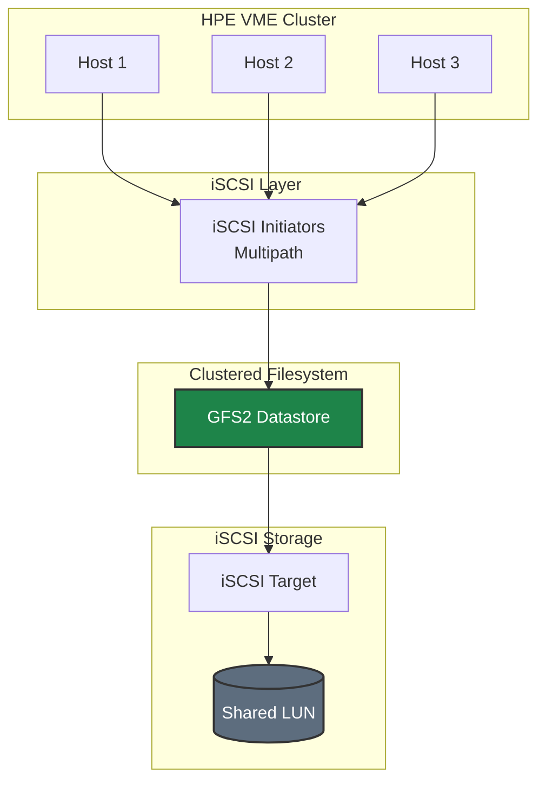

# iSCSI Storage on HPE VM Essentials - Quick Start Guide

This guide provides a streamlined path to configure iSCSI storage with GFS2 datastores for HPE Virtual Machine Essentials (VME) clusters.

> **📘 For detailed explanations, alternative configurations, and troubleshooting:** See [iSCSI Best Practices](./BEST-PRACTICES.md)

---



---

## Prerequisites

- HPE VME cluster deployed and operational (minimum 3 nodes for GFS2)
- Ubuntu 22.04 or 24.04 on cluster hosts with HWE kernel
- iSCSI storage array with LUNs configured
- Target IQN and portal IP addresses
- Access to HPE VME Manager web interface
- Root or sudo access on cluster hosts

> **⚠️ Important - Ubuntu Installation:** During Ubuntu installation, configure ALL network interfaces you plan to use (management, storage, etc.) in the network setup step. Interfaces not configured during installation won't be visible in the HPE VM Console later and must be configured manually via netplan.



## Overview

HPE VME uses **GFS2** (Global File System 2) or **OCFS2** as clustered filesystems on iSCSI LUNs. This enables shared storage access across all cluster hosts for VM live migration and high availability.

### Storage Architecture



## Step 1: Install HWE Kernel (Required for GFS2)

On each HPE VME host:

```bash
# Install Hardware Enablement kernel packages
sudo apt update
sudo apt install -y linux-generic-hwe-22.04

# Reboot to use new kernel
sudo reboot

# Verify kernel version after reboot
uname -r
```

## Step 2: Install iSCSI and Multipath Packages

On each HPE VME host:

```bash
# Install iSCSI initiator and multipath tools
sudo apt install -y open-iscsi multipath-tools

# Enable and start services
sudo systemctl enable --now iscsid open-iscsi multipathd
```

## Step 3: Configure iSCSI Initiator

On each HPE VME host:

```bash
# View the initiator IQN
cat /etc/iscsi/initiatorname.iscsi

# Configure automatic session startup
sudo sed -i 's/^node.startup = manual/node.startup = automatic/' /etc/iscsi/iscsid.conf

# Restart iSCSI service
sudo systemctl restart iscsid
```

**Important:** Register each host's initiator IQN with your storage array.

## Step 4: Configure Storage Network

Configure dedicated storage interfaces on each host.

### Option A: Using HPE VME Console (Recommended)

If you configured the storage interfaces during Ubuntu installation:

```bash
# Enter HPE VME Console
sudo hpe-vm

# Navigate to Network Configuration
# Configure storage interfaces with static IPs and MTU 9000
```

### Option B: Using Netplan (Manual)

If interfaces weren't configured during installation or you prefer manual configuration:

**Dual Fabric (Separate NICs for Redundancy):**
```bash
sudo tee /etc/netplan/01-storage.yaml > /dev/null <<'EOF'
network:
  version: 2
  ethernets:
    eth1:
      addresses:
        - 10.100.1.101/24
      mtu: 9000
    eth2:
      addresses:
        - 10.100.2.101/24
      mtu: 9000
EOF

sudo netplan apply
```

**Bonded Storage (Recommended for Simplicity):**
```bash
sudo tee /etc/netplan/01-storage.yaml > /dev/null <<'EOF'
network:
  version: 2
  ethernets:
    eth1:
      dhcp4: false
    eth2:
      dhcp4: false
  bonds:
    bond1:
      interfaces: [eth1, eth2]
      addresses:
        - 10.100.1.101/24
      mtu: 9000
      parameters:
        mode: 802.3ad        # LACP - requires switch support
        lacp-rate: fast
        mii-monitor-interval: 100
        transmit-hash-policy: layer3+4
EOF

sudo netplan apply

# Verify bond
cat /proc/net/bonding/bond1
```

> **Note:** With bonded storage, you still get multipath redundancy through multiple storage array controller portals.

## Step 5: Discover and Login to iSCSI Targets

### 5a: Create iface Bindings (Recommended for Dual-Fabric)

If you have separate storage NICs on separate subnets (e.g., VLAN-tagged interfaces), bind each NIC to its own iface so iSCSI sessions stay on the correct fabric:

```bash
# Create iface for each storage NIC (adjust interface names to match your environment)
sudo iscsiadm -m iface -I ens1f0np0.2230 --op=new
sudo iscsiadm -m iface -I ens1f0np0.2230 --op=update -n iface.net_ifacename -v ens1f0np0.2230

sudo iscsiadm -m iface -I ens1f1np1.2230 --op=new
sudo iscsiadm -m iface -I ens1f1np1.2230 --op=update -n iface.net_ifacename -v ens1f1np1.2230
```

### 5b: Discover Targets

```bash
# Discover targets on each portal, binding to the appropriate iface
sudo iscsiadm -m discovery -t sendtargets -p <portal1_ip>:3260 -I <iface_name>
sudo iscsiadm -m discovery -t sendtargets -p <portal2_ip>:3260 -I <iface_name>
```

### 5c: Delete Unwanted Portal Nodes Before Login

> **⚠️ Important — Pure Storage Arrays:** `sendtargets` returns **all** portal IPs the array knows about, including portals on subnets you are not using. If you run `iscsiadm -m node -l` without cleaning these up first, it will attempt to login to every portal — the unreachable ones will time out and produce errors.

```bash
# List all discovered nodes
sudo iscsiadm -m node

# Delete nodes on any subnet you are NOT using (example: 10.21.245.x)
sudo iscsiadm -m node -o delete -p <unwanted_portal_ip>:3260

# Repeat for each unwanted portal IP
```

### 5d: Login

```bash
# Login to remaining (correct) targets only
sudo iscsiadm -m node -l

# OR login to specific portals individually for maximum control:
# sudo iscsiadm -m node -T <target_iqn> -p <portal_ip>:3260 -l

# Set automatic login on boot
sudo iscsiadm -m node -o update -n node.startup -v automatic

# Verify active sessions — should show only your intended portals
sudo iscsiadm -m session
```

## Step 6: Configure Multipath

Create multipath configuration:

```bash
sudo tee /etc/multipath.conf > /dev/null <<'EOF'
defaults {
    user_friendly_names yes
    find_multipaths no
}

blacklist {
    devnode "^(ram|raw|loop|fd|md|dm-|sr|scd|st|nvme)[0-9]*"
    devnode "^hd[a-z]"
}
EOF

# Restart multipath daemon
sudo systemctl restart multipathd

# Verify multipath devices
sudo multipath -ll
```

## Step 7: Add GFS2 Datastore in HPE VME Manager

1. Navigate to **Infrastructure > Clusters > [Your Cluster] > Storage**
2. Select the **Data Stores** subtab
3. Click **ADD**
4. Configure:
   - **NAME**: Descriptive name (e.g., `iscsi-gfs2-datastore-01`)
   - **TYPE**: Select `GFS2 Pool` or `OCFS2 Pool`
   - Follow wizard to select the multipath device
5. Click **SAVE**

HPE VME Manager will:
- Format the LUN with GFS2/OCFS2
- Configure cluster locking
- Mount on all cluster hosts

## Step 8: Verify Datastore

```bash
# Check GFS2 mounts
mount | grep gfs2

# Verify multipath status
sudo multipath -ll

# Check cluster status
sudo pcs status  # If using Pacemaker
```

In HPE VME Manager:
1. Navigate to cluster **Storage** tab
2. Verify datastore shows **Online** status
3. Check capacity and free space

---

## Quick Reference

### Essential Commands

```bash
# iSCSI session status
sudo iscsiadm -m session

# Multipath status
sudo multipath -ll

# GFS2 mount status
mount | grep gfs2

# Rescan for new LUNs
sudo iscsiadm -m session --rescan
```

### iSCSI GFS2 Checklist

- [ ] HWE kernel installed on all hosts
- [ ] iSCSI initiator IQN registered with storage array
- [ ] Storage network configured with MTU 9000
- [ ] Unwanted portal nodes deleted before login (e.g., unused VLANs/subnets)
- [ ] iSCSI sessions established to correct portals only
- [ ] Multipath configured and showing all paths
- [ ] GFS2 datastore added in HPE VME Manager
- [ ] Datastore shows Online status
- [ ] Test VM provisioned successfully

---

## Next Steps

For production deployments, see [iSCSI Best Practices](./BEST-PRACTICES.md) for:
- Multipath configuration details
- Network design and VLAN configuration  
- Performance tuning
- High availability considerations
- Monitoring and troubleshooting

**Additional Resources:**
- [Common Network Concepts]({{ site.baseurl }}/common/network-concepts.html)
- [Multipath Concepts]({{ site.baseurl }}/common/multipath-concepts.html)
- [iSCSI Architecture]({{ site.baseurl }}/common/iscsi-architecture.html)
- [Troubleshooting Guide]({{ site.baseurl }}/common/troubleshooting-common.html)

