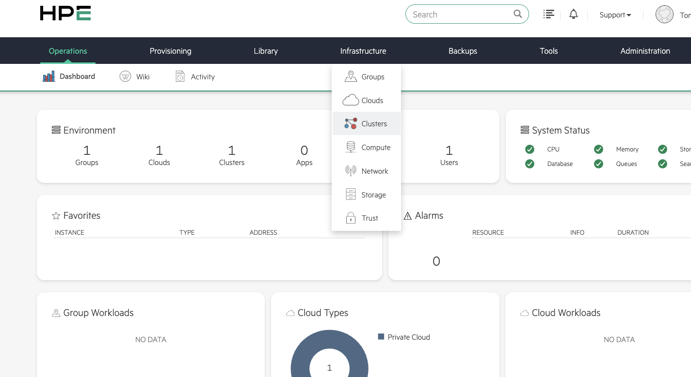
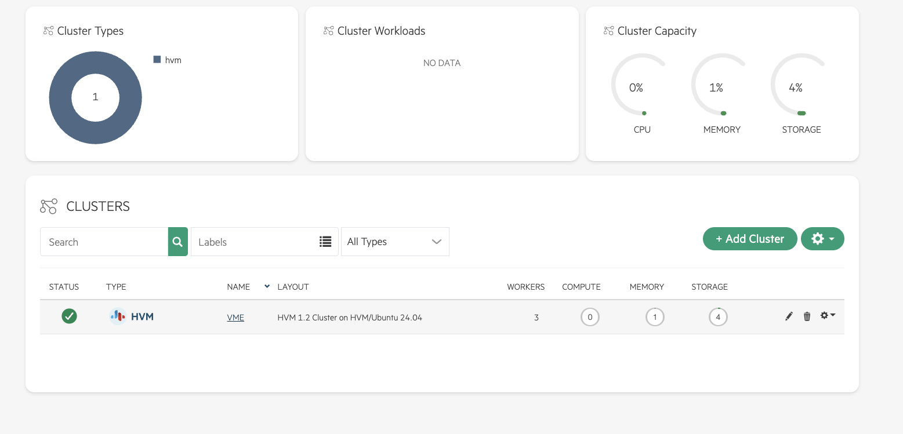
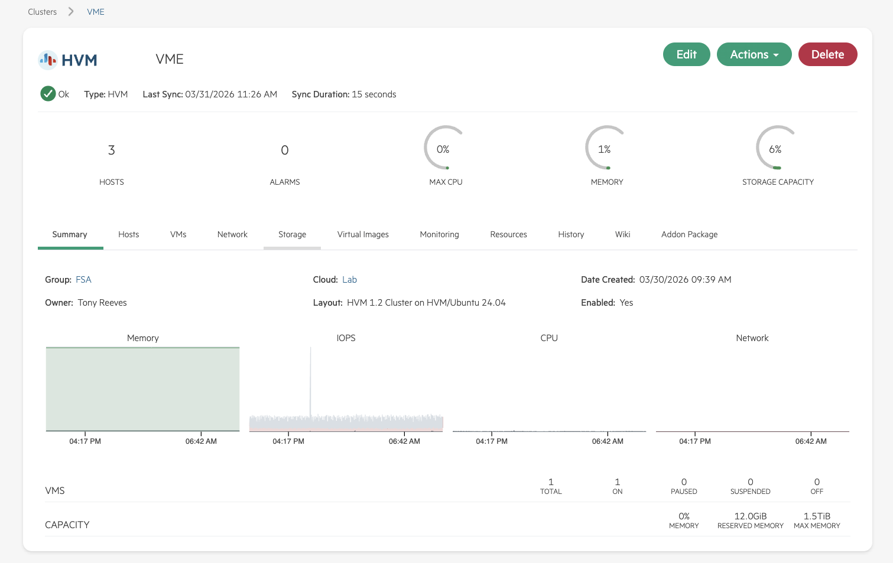
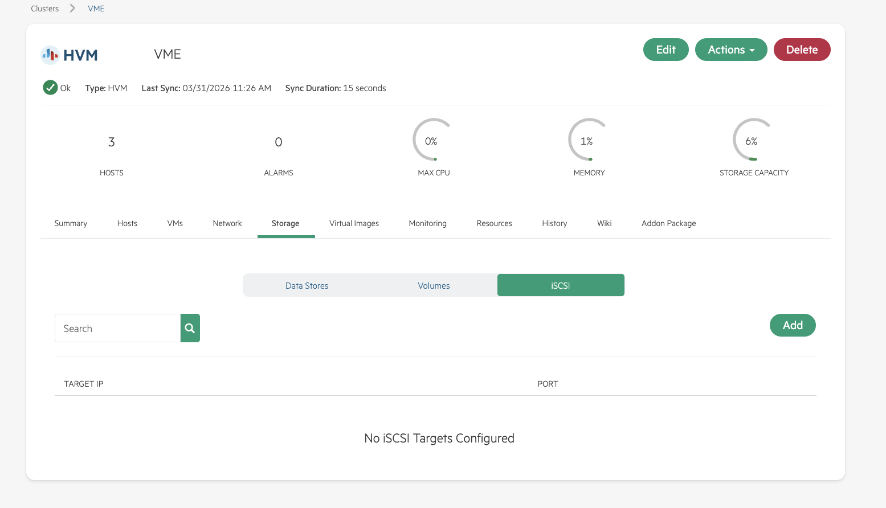
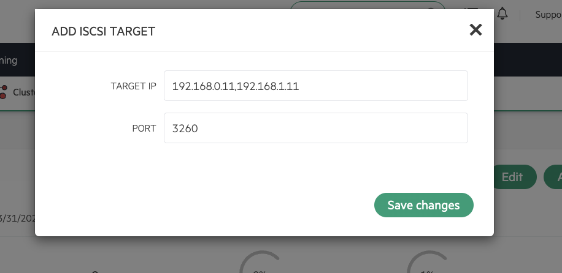
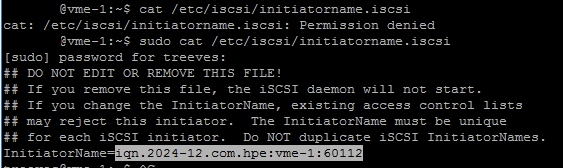
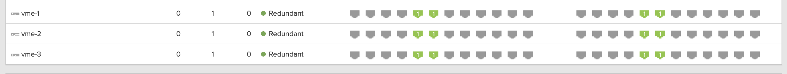
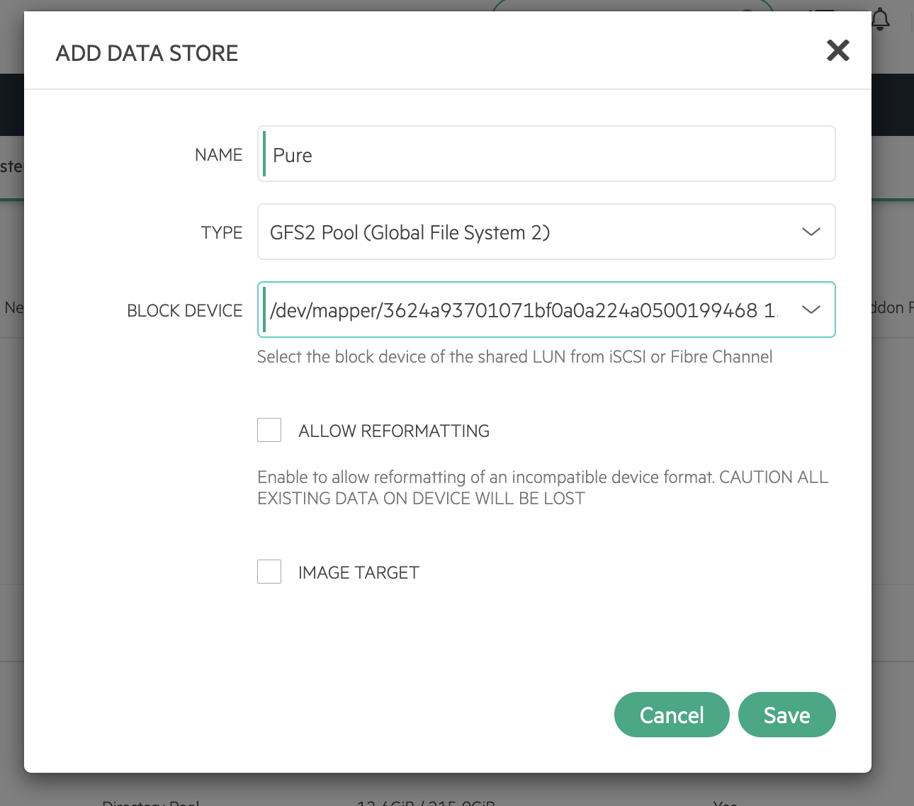

# Pure Storage FlashArray iSCSI Configuration Guide for HPE VM Essentials

This guide provides step-by-step instructions for configuring iSCSI multipath storage from a Pure Storage FlashArray to an HPE VM Essentials (VME) cluster using GFS2 shared datastores. The procedure covers both the VME Manager UI configuration and the **required CLI configuration** for dual-fabric iSCSI environments.

> **⚠️ Important:** The VME Manager UI provides a basic iSCSI target discovery interface, but it does **not** support iface binding or per-fabric portal filtering. When using a dual-fabric or multi-VLAN storage topology with Pure Storage, CLI configuration on each cluster host is **required** to establish proper multipath sessions. This guide covers both the UI and CLI steps needed for a complete deployment.

---

## Disclaimer

> **This guide assumes that the Pure Storage FlashArray is already configured and ready for iSCSI connectivity.** This includes:
> - iSCSI interfaces enabled and assigned to the correct ports/VLANs
> - iSCSI target portal IPs configured on both controllers
> - Storage network (switches, VLANs, MTU) configured end-to-end
> - At least one volume created and available for connection
>
> The **only** Pure FlashArray configuration covered in this guide is registering the VME host IQNs, creating a Host Group, and connecting the volume to that Host Group (Step 3). For initial FlashArray iSCSI setup, refer to the [Pure Storage FlashArray documentation](https://support.purestorage.com).

---

## Prerequisites

| Requirement | Details |
|-------------|---------|
| HPE VME Cluster | Deployed and operational, minimum 3 nodes (required for GFS2) |
| Pure Storage FlashArray | iSCSI volumes provisioned and accessible |
| Storage Network | Dedicated NICs per host, VLAN tagged, MTU 9000 (jumbo frames) |
| Dual-Fabric Topology | Two isolated storage subnets, each with a dedicated NIC per host |
| Access | Root or sudo privileges on all cluster hosts |

## Architecture Overview

Per the [HPE VM Essentials documentation](https://hpevm-docs.morpheusdata.com/en/8.0.3-vme/vme_getting_started/vme_getting_started.html), **multiple storage fabrics are required for multipathing to work properly**. In a dual-fabric iSCSI configuration, each VME host connects to the Pure FlashArray through two independent storage networks (Fabric A and Fabric B). Each fabric uses a dedicated NIC and subnet, providing both redundancy and increased bandwidth. The Pure FlashArray presents iSCSI target portals on both fabrics across both controllers, resulting in four total paths per host.

**Example environment used in this guide:**

| Component | Fabric A | Fabric B |
|-----------|----------|----------|
| Subnet | `<storage-subnet-A>/24` | `<storage-subnet-B>/24` |
| Host NIC | `<nic-fabric-a>` (e.g., `ens1f0np0.2230`) | `<nic-fabric-b>` (e.g., `ens1f1np1.2230`) |
| Pure CT0 Portal | `<ct0-fabric-a-ip>` | `<ct0-fabric-b-ip>` |
| Pure CT1 Portal | `<ct1-fabric-a-ip>` | `<ct1-fabric-b-ip>` |

> **Note:** Replace the placeholder values above with your actual interface names, VLAN IDs, and IP addresses throughout this guide.

---

## Step 1: Verify Storage Network Connectivity

Before beginning iSCSI configuration, confirm that each host has its storage NICs properly configured, the correct MTU set, and end-to-end connectivity to the Pure FlashArray iSCSI portals.

**On each cluster host**, run the following verification steps:

```bash
# 1. Confirm both storage interfaces are UP with correct IPs
ip -br addr show dev <nic-fabric-a>
ip -br addr show dev <nic-fabric-b>

# Expected output (example):
#   <nic-fabric-a>   UP   <fabric-a-host-ip>/24
#   <nic-fabric-b>   UP   <fabric-b-host-ip>/24

# 2. Verify MTU is set to 9000 on each storage interface
ip link show dev <nic-fabric-a> | grep mtu
ip link show dev <nic-fabric-b> | grep mtu

# Expected output:
#   ... mtu 9000 ...

# 3. Test jumbo frame connectivity to all Pure FlashArray iSCSI portals
ping -c 3 -M do -s 8972 <ct0-fabric-a-ip>
ping -c 3 -M do -s 8972 <ct1-fabric-a-ip>
ping -c 3 -M do -s 8972 <ct0-fabric-b-ip>
ping -c 3 -M do -s 8972 <ct1-fabric-b-ip>
```

> **Tip:** The `-M do -s 8972` flags send a full 9000-byte frame with the "don't fragment" bit set. This verifies that jumbo frames are working end-to-end across the host, switch, and Pure FlashArray interfaces. If these pings fail but standard pings (`ping -c 3 <ip>`) succeed, there is an MTU mismatch somewhere in the path.

All four portal pings must succeed from **every host** on the correct fabric interface before proceeding. If a Fabric A portal is only reachable from the Fabric B interface (or vice versa), check your VLAN and subnet assignments.

---

## Step 2: Register iSCSI Target IPs in VME Manager

Log into the VME Manager UI at `https://<manager-ip>`.

**2a.** From the VME dashboard, navigate to **Infrastructure > Clusters**.



**2b.** Select your cluster name to open the cluster detail view (in this example, the cluster is named **VME**).



**2c.** Click the **Storage** tab.



**2d.** Click the **iSCSI** subtab, then click **+ ADD** to add the Pure FlashArray iSCSI target portal IPs. Enter each portal IP and click **Save**.





> **⚠️ Important:** Registering iSCSI targets in the VME Manager UI is only the first step. This does **not** configure iface bindings, fabric isolation, or multipath on the hosts. The CLI configuration in Steps 4–7 below is **required** to establish proper iSCSI sessions for a dual-fabric Pure Storage environment.

---

## Step 3: Retrieve Host IQNs and Register on Pure FlashArray

Each VME host has a unique iSCSI Qualified Name (IQN) that must be registered on the Pure FlashArray to authorize iSCSI access.

**On each cluster host**, retrieve the IQN:

```bash
cat /etc/iscsi/initiatorname.iscsi
# Output: InitiatorName=iqn.2024-12.com.hpe:<hostname>:<id>
```



**In the Pure FlashArray UI:**

1. Navigate to **Storage > Hosts**
2. Click **+** to create a host entry for each VME node
3. Set **OS Type** to `Linux`
4. Under **iSCSI**, paste the IQN from the corresponding host
5. Repeat for all cluster hosts
6. Create a **Host Group** and add all host entries to it
7. Navigate to **Storage > Volumes**, select your volume, and connect it to the Host Group

---

## Step 4: Configure iSCSI iface Bindings (CLI — All Hosts)

> ⚠️ **Repeat this step on every cluster host.** The VME Manager UI cannot perform this configuration.

iface bindings ensure that iSCSI traffic is directed through the dedicated storage NICs rather than the management interface. Without iface bindings, `iscsiadm` uses the host's default route, which typically points to the management NIC — causing session failures and preventing proper multipath operation.

```bash
# Remove any pre-existing iSCSI configuration
sudo iscsiadm -m node -u 2>/dev/null
sudo iscsiadm -m node -o delete 2>/dev/null

# Create iface binding for Fabric A
sudo iscsiadm -m iface -I <nic-fabric-a> --op=new
sudo iscsiadm -m iface -I <nic-fabric-a> --op=update -n iface.net_ifacename -v <nic-fabric-a>

# Create iface binding for Fabric B
sudo iscsiadm -m iface -I <nic-fabric-b> --op=new
sudo iscsiadm -m iface -I <nic-fabric-b> --op=update -n iface.net_ifacename -v <nic-fabric-b>
```

---

## Step 5: Discover iSCSI Targets and Filter Unwanted Portals (CLI — All Hosts)

> ⚠️ **Repeat this step on every cluster host.**

Run `sendtargets` discovery against each Pure portal IP, specifying the appropriate iface binding for each fabric:

```bash
# Discover through Fabric A
sudo iscsiadm -m discovery -t sendtargets -p <ct0-fabric-a-ip>:3260 -I <nic-fabric-a>
sudo iscsiadm -m discovery -t sendtargets -p <ct1-fabric-a-ip>:3260 -I <nic-fabric-a>

# Discover through Fabric B
sudo iscsiadm -m discovery -t sendtargets -p <ct0-fabric-b-ip>:3260 -I <nic-fabric-b>
sudo iscsiadm -m discovery -t sendtargets -p <ct1-fabric-b-ip>:3260 -I <nic-fabric-b>
```

> **⚠️ Important — When is portal filtering required?**
>
> This sub-step only applies if your Pure FlashArray has iSCSI portals on **multiple networks** (e.g., a dedicated replication VLAN, a management network, or additional storage subnets) and you want VME to communicate **only** over specific storage subnets.
>
> When you run `sendtargets`, the Pure FlashArray responds with **all** iSCSI portal IPs configured on the array — not just the portals on your target storage subnet. If you only have one storage network and no other iSCSI-enabled interfaces on the array, all returned portals will be valid and you can **skip the filtering below** and proceed directly to Step 6.
>
> If the array returns portals on subnets that your VME hosts cannot or should not reach, you **must** remove those nodes before login. Otherwise, `iscsiadm` will attempt to connect to every returned portal — portals on unreachable subnets will time out, cause errors, and create invalid session entries.

**Identify and remove unwanted portal nodes (if applicable):**

```bash
# List all discovered nodes — review the portal IPs
sudo iscsiadm -m node

# Delete nodes on subnets that are NOT your intended storage fabrics
# Example: removing portals on a replication or management subnet
sudo iscsiadm -m node -o delete -p <unwanted-portal-ip-1>:3260
sudo iscsiadm -m node -o delete -p <unwanted-portal-ip-2>:3260
# ... repeat for each unwanted portal
```

After cleanup, verify that only the correct portal nodes remain (two per fabric in a dual-fabric configuration, or all portals if single-network).

---

## Step 6: Login to iSCSI Targets (CLI — All Hosts)

> ⚠️ **Repeat this step on every cluster host.**

With only the correct portal nodes remaining, login to all targets and configure automatic reconnection on boot:

```bash
# Login to all remaining target nodes
sudo iscsiadm -m node -l

# Configure automatic login on boot
sudo iscsiadm -m node -o update -n node.startup -v automatic

# Verify active sessions
sudo iscsiadm -m session
```

**Expected output** — four active sessions (two per fabric, one per controller):

```
tcp: [1] <ct0-fabric-a-ip>:3260,1 iqn.2010-06.com.purestorage:flasharray.xxxx (non-flash)
tcp: [2] <ct1-fabric-a-ip>:3260,1 iqn.2010-06.com.purestorage:flasharray.xxxx (non-flash)
tcp: [3] <ct0-fabric-b-ip>:3260,1 iqn.2010-06.com.purestorage:flasharray.xxxx (non-flash)
tcp: [4] <ct1-fabric-b-ip>:3260,1 iqn.2010-06.com.purestorage:flasharray.xxxx (non-flash)
```

---

## Step 7: Verify Multipath

> ⚠️ **Verify on every cluster host.** All hosts must show the multipath device before proceeding to GFS2 datastore creation.

```bash
sudo multipath -ll
```

**Expected output** — four paths across two priority groups (active/optimized and active/non-optimized per ALUA):

```
mpathX (3624a937...) dm-X PURE,FlashArray
size=XXG features='0' hwhandler='1 alua' wp=rw
|-+- policy='service-time 0' prio=50 status=active
| |- X:0:0:1 sdX  X:X  active ready running
| `- X:0:0:1 sdX  X:X  active ready running
`-+- policy='service-time 0' prio=10 status=enabled
  |- X:0:0:1 sdX  X:X  active ready running
  `- X:0:0:1 sdX  X:X  active ready running
```

Verify the connections from the Pure FlashArray side:



> **Note:** If `multipath -ll` shows no devices, verify that all four iSCSI sessions are active (`iscsiadm -m session`) and that the volume is connected to the Host Group on the Pure FlashArray.

---

## Step 8: Rescan and Create GFS2 Datastore in VME Manager

> ⚠️ **All cluster hosts must have working iSCSI sessions and multipath before this step.** The VME Manager requires every host in the cluster to see the block device before it will appear in the datastore creation wizard. If even one host is missing the multipath device, it will silently not appear in the dropdown — no error message is displayed.

### 8a. Rescan iSCSI Sessions on All Hosts

The VME Manager does not automatically discover new block devices on hypervisor hosts. Unlike guest VMs, there is no `morpheus-node-agent` running on hypervisors to trigger automatic rescans. A manual rescan is required.

**On every cluster host:**

```bash
sudo iscsiadm -m session --rescan
```

### 8b. Create the GFS2 Datastore

In the VME Manager UI:

1. Navigate to **Infrastructure > Clusters > [Your Cluster] > Storage > Data Stores**
2. Click **+ ADD**
3. Select **GFS2 Pool** (Global File System 2) as the type
4. In the **BLOCK DEVICE** dropdown, select the Pure multipath device (`/dev/mapper/<wwid>`)
5. Click **Save**



The VME Manager will automatically:
- Format the LUN with the GFS2 clustered filesystem
- Configure Distributed Lock Manager (DLM) for cluster coordination
- Mount the filesystem on all cluster hosts

> **Note:** If the block device dropdown only shows local disks, verify that `multipath -ll` shows the Pure device on **every** cluster host, then re-run the rescan command above.

---

## Verification

After completing the setup, verify the following on **each cluster host**:

```bash
# Verify iSCSI sessions (expect 4 per host)
sudo iscsiadm -m session

# Verify multipath (expect 4 active paths)
sudo multipath -ll

# Verify GFS2 mount
mount | grep gfs2
```

In the VME Manager UI, navigate to **Infrastructure > Clusters > [Your Cluster] > Storage > Data Stores** and confirm the datastore status shows **Online**.

---

## Troubleshooting

| Symptom | Cause | Resolution |
|---------|-------|------------|
| Block device not visible in VME datastore wizard | VME Manager does not auto-rescan hypervisor hosts for new block devices | Run `sudo iscsiadm -m session --rescan` on **all** cluster hosts and retry |
| Block device still missing after rescan | One or more hosts are missing the multipath device; GFS2 requires all cluster hosts to see the LUN | Complete Steps 4–7 on the affected host(s); verify with `multipath -ll` on every host |
| iSCSI login timeouts on some portals | Pure `sendtargets` returned portal IPs on unreachable subnets (management, replication, or other non-storage interfaces) | Identify and delete unwanted nodes with `iscsiadm -m node -o delete -p <ip>:3260` before login (Step 5) |
| Fewer than 4 multipath paths | iface binding not configured for one fabric, or discovery was only performed against one subnet | Verify iface bindings for both fabrics (Step 4), then re-run discovery (Step 5) |
| iSCSI sessions not restored after host reboot | Automatic login not enabled | Run `sudo iscsiadm -m node -o update -n node.startup -v automatic` on affected hosts |
| VME UI iSCSI tab shows targets but no working sessions | The VME Manager's built-in iSCSI discovery does not support iface binding or per-fabric portal filtering | CLI configuration (Steps 4–6) on each host is required for dual-fabric / multi-VLAN topologies |

---

## Important Considerations

1. **CLI configuration is mandatory for dual-fabric environments.** The VME Manager UI's iSCSI tab provides basic single-subnet `sendtargets` discovery. For dual-fabric or multi-VLAN iSCSI topologies with Pure Storage, iface bindings and per-fabric discovery must be configured via CLI on each host.

2. **Pure FlashArray `sendtargets` returns all array portals.** The discovery response includes every iSCSI-enabled interface on the array, regardless of subnet reachability. Always review discovered nodes (`iscsiadm -m node`) and delete entries on non-storage subnets before initiating login.

3. **GFS2 datastore creation requires all cluster hosts.** The VME Manager will not display the block device in the datastore wizard unless every host in the cluster reports the multipath device. There is no error message — the device simply does not appear.

4. **Manual rescan is required after CLI iSCSI setup.** Hypervisor hosts do not run the `morpheus-node-agent` service, so there is no automatic block device discovery. Always run `iscsiadm -m session --rescan` on all hosts before attempting to create a datastore.

5. **iface bindings isolate storage traffic to dedicated NICs.** Without iface bindings, iSCSI operations use the host's default route (typically the management interface). This prevents proper fabric isolation and causes multipath to route all paths through a single NIC.

---

## Pre-Flight Checklist

- [ ] Storage NICs configured with correct IPs and MTU 9000 on all hosts
- [ ] Jumbo frame connectivity verified to all Pure portals (`ping -M do -s 8972`)
- [ ] iSCSI target IPs registered in VME Manager UI (Step 2)
- [ ] Host IQNs retrieved and registered on Pure FlashArray (Step 3)
- [ ] Host Group created on Pure with all cluster hosts
- [ ] Volume connected to Host Group on Pure
- [ ] iface bindings created on all hosts (Step 4)
- [ ] Target discovery completed on all hosts (Step 5)
- [ ] Unwanted portal nodes removed on all hosts (Step 5)
- [ ] iSCSI login successful — 4 sessions per host (Step 6)
- [ ] Automatic login on boot enabled on all hosts (Step 6)
- [ ] Multipath verified — 4 paths on all hosts (Step 7)
- [ ] iSCSI session rescan completed on all hosts (Step 8)
- [ ] GFS2 datastore created and shows Online in VME Manager (Step 8)
- [ ] Pure FlashArray shows multipath connections from all cluster hosts

