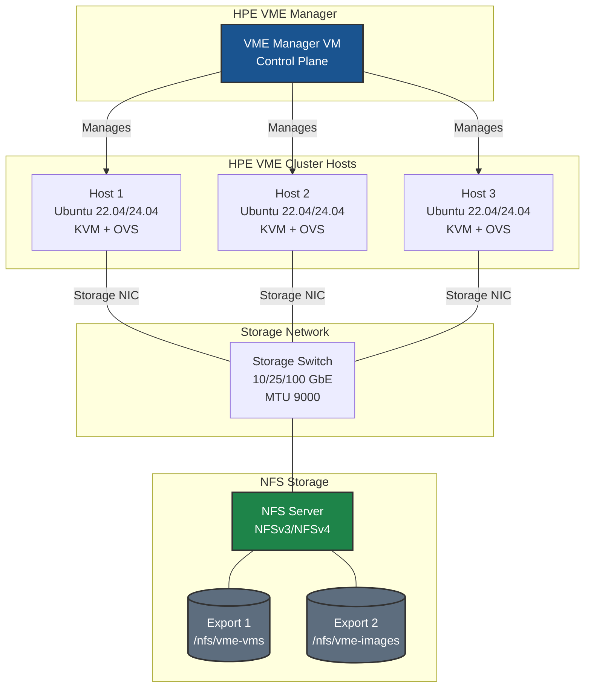
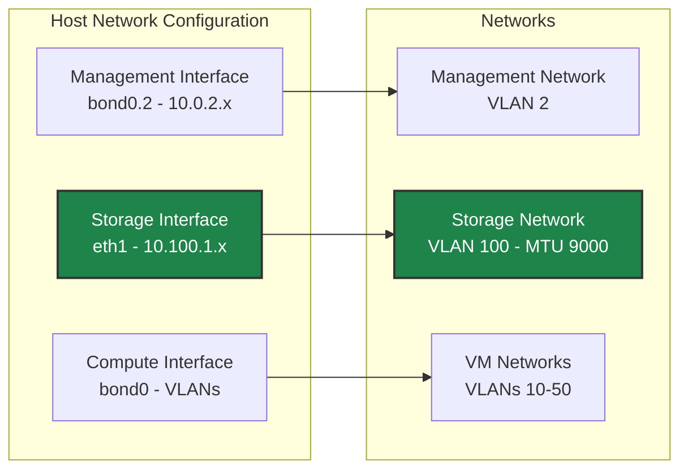

# NFS Storage on HPE VM Essentials - Best Practices Guide

Comprehensive best practices for deploying NFS storage with HPE Virtual Machine Essentials (VME) clusters in production environments.

---



---

## Table of Contents
- [Architecture Overview](#architecture-overview)
- [HPE VME Storage Concepts](#hpe-vme-storage-concepts)
- [Network Configuration](#network-configuration)
- [NFS Server Configuration](#nfs-server-configuration)
- [HPE VME Manager Configuration](#hpe-vme-manager-configuration)
- [Performance Tuning](#performance-tuning)
- [Virtual Image Management](#virtual-image-management)
- [Security](#security)
- [Monitoring & Maintenance](#monitoring--maintenance)
- [Troubleshooting](#troubleshooting)

---

## Architecture Overview

### HPE VME NFS Storage Topology



### Key Design Principles

- **Dedicated storage network** for NFS traffic (separate VLAN or physical network)
- **MTU 9000 (jumbo frames)** end-to-end for optimal throughput
- **NFSv3 recommended** for VME (simpler, better performance for VM workloads)
- **Sync exports** for data integrity with VM storage
- **Proper export permissions** for all cluster hosts and VME Manager

---

## HPE VME Storage Concepts

### Storage Layouts

HPE VME supports two primary storage configurations:

| Layout | Storage Type | Use Case |
|--------|-------------|----------|
| **Converged (HCI)** | Ceph | 3+ node clusters with local storage |
| **Non-converged** | NFS, iSCSI, FC | External storage arrays, NAS appliances |

### When to Use NFS

**Recommended for:**
- Environments with existing NFS infrastructure
- Smaller deployments (1-2 node clusters)
- Integration with NAS appliances (NetApp, Pure, HPE Alletra)
- Shared storage for VM images and templates

**Consider iSCSI/FC instead for:**
- Highest performance requirements
- Block-level features (snapshots, replication at array level)
- GFS2/OCFS2 clustered filesystem requirements

### NFS Datastore Types in HPE VME

1. **VM Storage (Datastore)**: For virtual machine disks
2. **Image Repository**: For QCOW2 templates and ISOs
3. **Backup Target**: For VM backup storage

---

## Network Configuration

### Dedicated Storage Network Design



### Host Network Configuration

> **⚠️ Critical - Ubuntu Installation:** During Ubuntu installation, configure ALL network interfaces you plan to use in the network setup step. Interfaces not configured during installation won't appear in the HPE VM Console and must be configured manually via netplan.

#### Using HPE VME Console (Recommended)

The HPE VME Console (`hpe-vm` command) provides network configuration:

```bash
# Enter HPE VME Console
sudo hpe-vm

# Navigate to Network Configuration
# Set MTU 9000 on storage interfaces
# Configure static IP addressing
```

#### Manual Netplan Configuration

**Single Storage Interface:**
```yaml
# /etc/netplan/01-storage.yaml
network:
  version: 2
  ethernets:
    eth1:
      addresses:
        - 10.100.1.101/24
      mtu: 9000
      routes: []
      nameservers: {}
```

**Bonded Storage Interfaces (Recommended):**
```yaml
# /etc/netplan/01-storage.yaml
network:
  version: 2
  ethernets:
    eth1:
      dhcp4: false  # No IP on member NICs
    eth2:
      dhcp4: false  # No IP on member NICs
  bonds:
    bond1:
      interfaces: [eth1, eth2]
      addresses:
        - 10.100.1.101/24
      mtu: 9000
      parameters:
        mode: 802.3ad        # LACP - requires switch support
        lacp-rate: fast
        mii-monitor-interval: 100
        transmit-hash-policy: layer3+4
```

Alternative bond modes if LACP not available:
- `balance-xor` (mode 2) - Good for storage, no switch config needed
- `active-backup` (mode 1) - Simple failover

Apply with:
```bash
sudo netplan apply

# Verify bond status
cat /proc/net/bonding/bond1
```

### MTU Configuration Checklist

Ensure MTU 9000 is configured on:
- [ ] Host storage interfaces
- [ ] Storage network switches
- [ ] NFS server interfaces
- [ ] Any intermediate routing devices

**Test MTU:**
```bash
ping -M do -s 8972 <nfs_server_ip>
```

---

## NFS Server Configuration

### Export Configuration

**Example /etc/exports for HPE VME:**

```bash
# VM storage datastore
/nfs/vme-vms       10.100.1.0/24(rw,sync,no_subtree_check,no_root_squash)

# Image repository (for QCOW2 templates)
/nfs/vme-images    10.100.1.0/24(rw,sync,no_subtree_check,no_root_squash)

# Also allow VME Manager access for image management
/nfs/vme-images    10.0.2.10/32(rw,sync,no_subtree_check,no_root_squash)
```

### Critical Export Options

| Option | Required | Purpose |
|--------|----------|---------|
| `rw` | Yes | Read/write access for VMs |
| `sync` | Yes | Synchronous writes for data integrity |
| `no_root_squash` | Yes | Allow libvirt/KVM root access |
| `no_subtree_check` | Recommended | Improves reliability |
| `no_all_squash` | Default | Preserve UID/GID |

### NFS Server Tuning

**Kernel parameters for NFS server:**
```bash
# /etc/sysctl.d/99-nfs-server.conf
net.core.rmem_max = 134217728
net.core.wmem_max = 134217728
net.ipv4.tcp_rmem = 4096 87380 67108864
net.ipv4.tcp_wmem = 4096 65536 67108864
net.core.netdev_max_backlog = 30000

# NFS-specific
sunrpc.tcp_slot_table_entries = 128
```

Apply: `sudo sysctl -p /etc/sysctl.d/99-nfs-server.conf`

**NFS daemon threads:**
```bash
# /etc/nfs.conf (Ubuntu)
[nfsd]
threads = 16  # Increase for heavy workloads
```

---

## HPE VME Manager Configuration

### Adding NFS Datastore via UI

1. **Infrastructure > Clusters > [Your Cluster] > Storage > Data Stores**
2. Click **ADD**
3. Configure:
   - **NAME**: Descriptive, permanent name (cannot be changed)
   - **TYPE**: NFS Pool
   - **SOURCE HOST**: NFS server IP or hostname
   - **SOURCE DIRECTORY**: Export path

### Integrating NFS File Share for Images

For using NFS as an image repository:

1. **Infrastructure > Storage > File Shares**
2. Click **+ ADD > NFSv3**
3. Configure:
   - **NAME**: Display name
   - **HOST**: NFS server IP
   - **EXPORT FOLDER**: Path to image exports
   - **ACTIVE**: Check to enable
   - **DEFAULT VIRTUAL IMAGE STORE**: Optional, makes this the default

### Creating Virtual Images from NFS

```bash
# Path format for QCOW images in file share
# Don't include file share name or filename in path
# Example: templates/qcow/ubuntu/server/2204/011025
```

> **Important:** Deleting a Virtual Image backed by an NFS file deletes the actual file on the NFS share.

---

## Performance Tuning

### Host NFS Mount Options

HPE VME handles mounts automatically, but understanding optimal options helps troubleshooting:

```bash
# Optimal NFS mount options for VM storage
rw,hard,intr,rsize=1048576,wsize=1048576,timeo=600,retrans=2
```

### Network Tuning on Hosts

```bash
# /etc/sysctl.d/99-nfs-client.conf
net.core.rmem_max = 134217728
net.core.wmem_max = 134217728
net.ipv4.tcp_rmem = 4096 87380 67108864
net.ipv4.tcp_wmem = 4096 65536 67108864

# Disable TCP timestamps for lower latency
net.ipv4.tcp_timestamps = 0
```

### Performance Expectations

| Configuration | Expected Throughput | Latency |
|--------------|---------------------|---------|
| 10 GbE, MTU 9000, NFSv3 | 800+ MB/s | < 1ms |
| 25 GbE, MTU 9000, NFSv3 | 2+ GB/s | < 0.5ms |
| 1 GbE (not recommended) | ~100 MB/s | 2-5ms |

---

## Virtual Image Management

### Saving VMs to NFS-backed Images

1. From Instance detail page, click **Actions > Import as Image**
2. Set image name
3. Select NFS file share as target bucket
4. Image saved as QCOW2 to NFS share

### Using NFS Images for Provisioning

1. Create Virtual Image pointing to NFS QCOW file
2. Configure OS type, minimum memory
3. Select NFS bucket for storage
4. Image available in provisioning wizard

---

## Security

### Network Isolation

- **Dedicated VLAN** for NFS storage traffic
- **No routing** from storage network to public networks
- **Firewall rules** on NFS server limiting source IPs

### NFS Security Options

```bash
# Restrict to specific subnet
/nfs/vme-vms  10.100.1.0/24(rw,sync,no_subtree_check,no_root_squash,sec=sys)

# For NFSv4 with Kerberos (if supported)
/nfs/vme-vms  10.100.1.0/24(rw,sync,no_subtree_check,no_root_squash,sec=krb5p)
```

---

## Monitoring & Maintenance

### Health Check Commands

```bash
# Check NFS mounts on host
mount | grep nfs
df -h | grep nfs

# NFS client statistics
nfsstat -c

# Check RPC status
rpcinfo -p <nfs_server_ip>

# NFS server statistics (on server)
nfsstat -s
```

### Monitoring Script

```bash
#!/bin/bash
# nfs-health-check.sh

echo "=== NFS Health Check ==="
echo "Date: $(date)"

echo -e "\n--- NFS Mounts ---"
mount | grep nfs

echo -e "\n--- NFS Statistics ---"
nfsstat -c | head -20

echo -e "\n--- Mount Point Space ---"
df -h | grep nfs

echo "=== End Check ==="
```

---

## Troubleshooting

### Common Issues

**Issue: Datastore shows offline in VME Manager**
```bash
# Verify NFS server accessibility from host
showmount -e <nfs_server_ip>

# Check if export permissions include this host
# Verify no_root_squash is set
```

**Issue: Permission denied when creating VMs**
```bash
# On NFS server, verify export options
exportfs -v | grep <export_path>

# Ensure no_root_squash is present
# Check directory permissions: should be 755 or more permissive
```

**Issue: Slow NFS performance**
```bash
# Verify MTU 9000 end-to-end
ping -M do -s 8972 <nfs_server_ip>

# Check for network errors
ip -s link show <storage_interface>

# Verify rsize/wsize
mount | grep <nfs_mount> | grep -o 'rsize=[0-9]*'
```

**Issue: NFS mount hangs**
```bash
# Check RPC services
rpcinfo -p <nfs_server_ip>

# Check firewall on server
# Required ports: 111 (portmapper), 2049 (NFS), plus mountd port
```

---

## Additional Resources

- [NFS Quick Start](./QUICKSTART.md)
- [Common Network Concepts]({{ site.baseurl }}/common/network-concepts.html)
- [Troubleshooting Guide]({{ site.baseurl }}/common/troubleshooting-common.html)
- [HPE VM Essentials Documentation](https://hpevm-docs.morpheusdata.com/)

---

## Quick Reference

### NFS Server Checklist

- [ ] Exports configured with proper permissions
- [ ] `no_root_squash` option set
- [ ] NFS service running and enabled
- [ ] Firewall allows NFS ports from cluster hosts

### HPE VME Host Checklist

- [ ] `nfs-common` package installed
- [ ] Storage network interface configured
- [ ] MTU 9000 set on storage interface
- [ ] Can mount NFS share manually

### HPE VME Manager Checklist

- [ ] NFS datastore added and online
- [ ] File share integrated for images (optional)
- [ ] Virtual images accessible for provisioning

