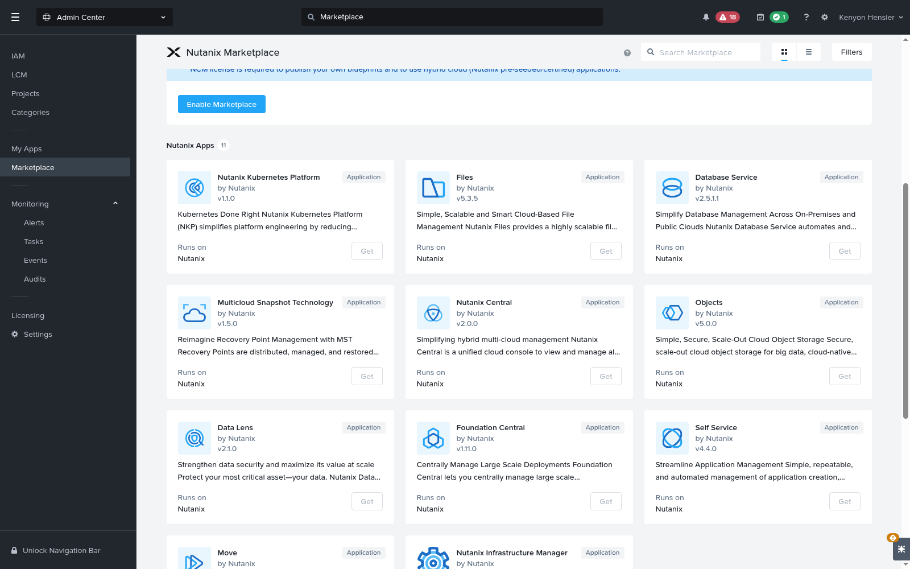
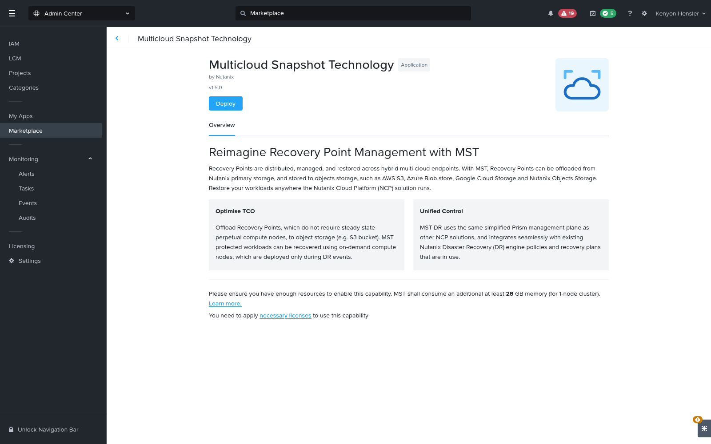
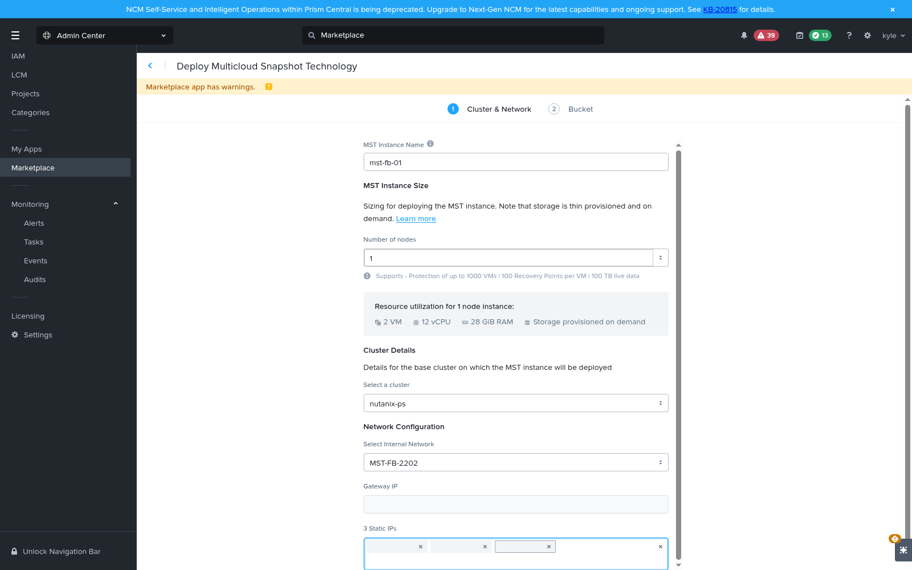
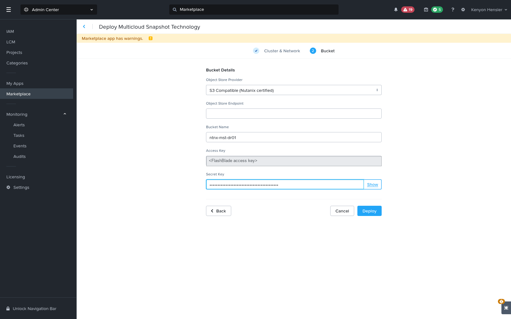

# Using FlashBlade Object Storage as a Nutanix MST Snapshot Target

---



---

## Overview

Nutanix **Multicloud Snapshot Technology (MST)** replicates virtual machine and volume
group snapshots from a Nutanix cluster directly into S3-compatible object storage, so
recovery points live off the cluster's primary storage. This guide configures an Everpure
**FlashBlade** bucket as that target and deploys MST against it from the Prism Central
Marketplace.

MST addresses the object-storage backup target question for Nutanix: rather than exporting
to a file share, Prism Central manages recovery points natively and stores their data in
your bucket.

> **Support status — read before you plan a deployment.** Nutanix restricts MST's
> **S3 Compatible** provider to *Nutanix-certified* S3-compatible object stores. As of
> pc.7.6 the documentation names only OVHcloud, Wasabi, and Backblaze B2, and the
> documented on-premises-to-on-premises MST path is via Nutanix Objects. **FlashBlade is
> not currently on the Nutanix certified list.** The procedure below is accurate and the
> FlashBlade side is verified, but treat the combination as unqualified until Nutanix
> certifies it. Confirm supportability with both vendors before committing a production
> design.

> **Validation status — read this before relying on the guide.** Every step below was
> executed against a FlashBlade//S500 (Purity//FB 4.6.9) and Prism Central pc.7.6 / AOS
> 7.6. What was confirmed working: the FlashBlade configuration and its S3 requirements
> (all ten operations MST's IAM policy implies passed), MST deploying successfully from the
> Marketplace against the FlashBlade bucket **including successful pre-checks**, and a
> protection policy accepting the bucket as a recovery target and generating recovery
> points on schedule.
>
> **What did not work, and why:** recovery-point data never reached the bucket. Across
> three completed recovery points the bucket stayed at 4 objects and 5,179 bytes — MST
> wrote its manifests but transferred no VM disk data, with no error reported. **The cause
> was the source cluster: MST cannot protect VMs on a Nutanix cluster that uses external
> storage**, and the validation cluster is FlashArray-backed. See
> [Prerequisites](#prerequisites) and [Troubleshooting](#troubleshooting).
>
> So the storage side of this guide is sound and MST accepts a FlashBlade bucket, but an
> end-to-end backup was never demonstrated, because no eligible source cluster was
> available. Repeating this against a cluster on **native Nutanix storage** is the
> outstanding work.

## Prerequisites

- **A source cluster on native Nutanix storage.** MST cannot protect VMs running on a
  Nutanix cluster that uses **external storage** — FlashArray, Dell PowerFlex or PowerStore.
  On such a cluster the bucket still appears in the protection policy's recovery-location
  list but is **greyed out and not selectable**, and no network or licensing change alters
  that. Check this before anything else.

  > **This rules MST out for FlashArray-backed Nutanix clusters.** If your Nutanix cluster
  > uses a FlashArray as its storage, MST is not an available route to a FlashBlade backup
  > target, and you need a different mechanism. All six Nutanix clusters across the two
  > validation labs are external-storage clusters, which is why this guide could not be
  > completed end to end.

  To check a cluster, look at its node types — a cluster whose nodes are **all
  `COMPUTE_ONLY`** has no local storage pool and is externally backed:

  ```bash
  curl -sk -u '<user>' -X POST "https://<prism-central>:9440/api/nutanix/v3/hosts/list" \
    -H 'Content-Type: application/json' -d '{"kind":"host","length":200}'
  ```

  A storage container named after a storage array is a second strong signal. Do **not** rely
  on `externalStorageProviderInfo` from
  `GET /api/clustermgmt/v4.3/config/clusters/<uuid>` — it lists provider types the release
  supports, reporting `isInstalled: false` even on clusters that are externally backed.
  Ignore the single nameless `HYPER_CONVERGED` host entity each Prism Central returns with
  no cores and no cluster reference; it is an artifact, not a node.
- **Prism Central pc.7.5.1 or later and AOS 7.5.1 or later.** The S3-Compatible object
  store provider was introduced in 7.5.1. Marketplace-based MST deployment requires 7.3 or
  later; earlier releases used an OSM/YAML method that Marketplace replaces.
- **A license that entitles MST.** MST DR is a Nutanix Disaster Recovery capability and
  requires NCI licensing with the DR entitlement, or an equivalent add-on. A storage-only
  entitlement such as NUS is not sufficient. Verify under **Admin Center > Licensing**
  before you begin.
- **The Prism Central Marketplace enabled.** MST is delivered as a Marketplace app, and
  its **Get** button stays disabled until Marketplace is turned on. Enabling it consumes
  roughly 2 GB of additional Prism Central memory.
- **Spare capacity on the target Prism Element cluster** for the instance size you pick —
  at minimum 2 VMs, 12 vCPU, and 28 GiB RAM for a 1-node instance.
- **A FlashBlade with the object store enabled**, reachable from the MST subnet, and a
  data VIP serving S3 on TCP 443.
- **A dedicated subnet for MST** with IPAM enabled, a DHCP pool, and three spare static
  addresses. See [Step 6](#step-6-reserve-addresses-and-create-the-mst-subnet).
- Administrator credentials for Prism Central. Only an admin user can deploy the MST app.

## Background

An MST deployment is a small Kubernetes-based appliance — Nutanix calls the nodes SMSP VMs
— that Prism Central provisions onto one of your Prism Element clusters. Prism Central
Service Manager installs it with Helm charts; you do not handle manifests directly.

Two characteristics drive the rest of this guide:

- **Each MST cluster requires its own dedicated bucket.** MST clusters share neither
  buckets nor snapshot data, there is no cross-cluster deduplication, and Nutanix warns
  that sharing a bucket between MST instances risks data loss or corruption.
- **MST addresses the bucket path-style by default.** It issues requests as
  `https://<endpoint>/<bucket>/<key>` rather than
  `https://<bucket>.<endpoint>/<key>`. FlashBlade serves path-style natively, so no
  wildcard DNS or virtual-host configuration is needed. Nutanix KB-21112 covers switching
  to virtual-host addressing if you ever need it.

Sizing, which you choose in [Step 8](#step-8-deploy-mst-from-the-marketplace):

| Instance size | VMs | vCPU | RAM | IPs needed | Capacity |
| --- | --- | --- | --- | --- | --- |
| 1-Node (formerly Tiny) | 2 | 12 | 28 GiB | 5 | 1,000 entities, 100 TB live data |
| 3-Node (formerly Small) | 4 | 32 | 76 GiB | 7 | 2,000 entities, 300 TB live data |
| 5-Node (formerly Medium) | 6 | 52 | 124 GiB | 9 | 10,000 entities, 1 PB live data |

From pc.7.6 every size supports 100 recovery points per entity. Storage is thin
provisioned and consumed on demand. A single Prism Central supports at most 10,000
entities across all of its MST clusters.

## Step 1: Create the object store account and user on the FlashBlade

In the FlashBlade UI, go to **Storage > Object Store** and create an account, then a user
inside it. The account is the namespace that owns the bucket; the user is the identity MST
authenticates as.

The validated lab used account `nutanix-mst` and user `nutanix-mst/mst-svc`. Equivalent
REST calls against the array management endpoint:

```bash
# Authenticate and capture a session token
curl -sk -X POST "https://<flashblade-mgmt>/api/login" \
  -H "api-token: <your-api-token>" -D - -o /dev/null | grep -i x-auth-token

# Create the account and the user inside it
curl -sk -X POST "https://<flashblade-mgmt>/api/2.16/object-store-accounts?names=nutanix-mst" \
  -H "x-auth-token: <session-token>"

curl -sk -X POST "https://<flashblade-mgmt>/api/2.16/object-store-users?names=nutanix-mst%2Fmst-svc" \
  -H "x-auth-token: <session-token>"
```

## Step 2: Generate an access key for the user

MST authenticates with a static access key and secret key pair, so create one for the
service user.

```bash
curl -sk -X POST "https://<flashblade-mgmt>/api/2.16/object-store-access-keys" \
  -H "x-auth-token: <session-token>" \
  -H "Content-Type: application/json" \
  -d '{"user": {"name": "nutanix-mst/mst-svc"}}'
```

> **Important:** the secret key is returned **only** in the response to this call and
> cannot be retrieved afterwards. Record it before you continue. If you lose it, delete the
> key and create a new one.

## Step 3: Create the bucket

Create one bucket inside the account, reserved exclusively for this MST instance.

```bash
curl -sk -X POST "https://<flashblade-mgmt>/api/2.16/buckets?names=ntnx-mst-dr01" \
  -H "x-auth-token: <session-token>" \
  -H "Content-Type: application/json" \
  -d '{"account": {"name": "nutanix-mst"}}'
```

MST places three hard requirements on the bucket:

- **Versioning must be disabled.** MST does not support versioned buckets. A new
  FlashBlade bucket reports `versioning: none`, which is correct — leave it alone.
- **Object Lock must be disabled.** Retention locking interferes with MST's snapshot
  expiry and cleanup. A new bucket reports `retention_lock: unlocked`.
- **The bucket must be used by nothing else** — not another MST instance, not another
  workload.

Confirm the state before moving on:

```bash
curl -sk "https://<flashblade-mgmt>/api/2.16/buckets?names=ntnx-mst-dr01" \
  -H "x-auth-token: <session-token>"
```

## Step 4: Grant the user least-privilege access

Nutanix documents the S3 permissions MST needs as `PutObject`, `GetObject`,
`AbortMultipartUpload`, `ListBucket`, `DeleteObject`, and `GetBucketLocation`. Those map
onto six built-in Purity policies, which together are sufficient — `pure:policy/full-access`
is not required.

| Purity policy | Covers |
| --- | --- |
| `pure:policy/object-write` | `PutObject`, `AbortMultipartUpload` |
| `pure:policy/object-read` | `GetObject` |
| `pure:policy/object-list` | `ListBucket` |
| `pure:policy/object-delete` | `DeleteObject` |
| `pure:policy/bucket-info` | `GetBucketLocation` |
| `pure:policy/bucket-list` | `ListAllMyBuckets`, used for endpoint validation |

Attach each one to the user:

```bash
for POLICY in object-write object-read object-list object-delete bucket-info bucket-list; do
  curl -sk -X POST \
    "https://<flashblade-mgmt>/api/2.16/object-store-access-policies/object-store-users?policy_names=pure%3Apolicy%2F${POLICY}&member_names=nutanix-mst%2Fmst-svc" \
    -H "x-auth-token: <session-token>"
done
```

## Step 5: Verify the S3 endpoint before touching Prism Central

MST's pre-checks validate the credentials and the bucket, but they report failures without
much detail. Prove the data path first — it is far quicker to debug here.

Confirm the data VIP is serving S3. An unauthenticated request should return an S3
`AccessDenied` XML document, which shows the service is listening and speaking S3:

```bash
curl -sk https://<flashblade-data-vip>/
```

```
<?xml version="1.0" encoding="UTF-8" standalone="yes"?><Error><Code>AccessDenied</Code><Resource>/null</Resource><Message>Access Denied</Message></Error>
```

Then exercise the operations MST actually uses, path-style and signed with SigV4. Any S3
client will do; with the AWS CLI:

```bash
export AWS_ACCESS_KEY_ID=<access-key>
export AWS_SECRET_ACCESS_KEY=<secret-key>
export AWS_EC2_METADATA_DISABLED=true
ENDPOINT=https://<flashblade-data-vip>

aws --no-verify-ssl --endpoint-url "$ENDPOINT" s3api get-bucket-location --bucket ntnx-mst-dr01
aws --no-verify-ssl --endpoint-url "$ENDPOINT" s3 ls
aws --no-verify-ssl --endpoint-url "$ENDPOINT" s3 cp ./testfile s3://ntnx-mst-dr01/preflight/testfile
aws --no-verify-ssl --endpoint-url "$ENDPOINT" s3 cp s3://ntnx-mst-dr01/preflight/testfile ./roundtrip
aws --no-verify-ssl --endpoint-url "$ENDPOINT" s3 rm s3://ntnx-mst-dr01/preflight/testfile
```

Also push an object larger than 5 MiB so the multipart path is covered — MST relies on
multipart uploads for large snapshots. Remove any test objects afterwards, since MST
expects sole ownership of the bucket.

In validation, all ten operations MST's policy set implies — `GetBucketLocation`,
`ListAllMyBuckets`, `ListBucket`, `PutObject`, `GetObject`, `CreateMultipartUpload`,
`UploadPart`, `CompleteMultipartUpload`, and two `DeleteObject` calls — succeeded against
the six-policy user.

## Step 6: Reserve addresses and create the MST subnet

MST needs its own IPAM-managed subnet. Nutanix recommends a dedicated **/27** that is not
shared with the Prism Central or Prism Element management network, and requires:

- **IP Address Management enabled** on the subnet.
- A **DHCP pool of at least 4 addresses** for the SMSP nodes and the internal load
  balancer.
- **Three static addresses reserved outside that pool**, which you type into the wizard —
  they become the load balancer, DNS, and VIP.
- A **DNS server reachable from the subnet** that resolves your object store endpoint, if
  you use an FQDN rather than an IP.
- **Routable connectivity** to Prism Central, to every Prism Element cluster that will run
  MST, and to the FlashBlade data VIP.

Reserve the addresses in whatever IPAM system of record you use, then in Prism Central go
to **Network & Security > Subnets** and click **Create Subnet**:

1. Enter a **Name**.
2. Leave **Type** as **VLAN**.
3. Choose the **Virtual Switch** belonging to the cluster you intend to host MST on. There
   is no separate cluster field, so this selection determines placement — check the cluster
   name shown beneath the dropdown.
4. Enter the **VLAN ID**.
5. Under **IP Address Management**, select the IP assignment service, then supply the
   network address and prefix, the gateway, the DHCP pool range, and a DNS server.

If you would rather not drive the dialog by hand, the v3 API is equivalent:

```bash
curl -sk -u '<user>' -X POST "https://<prism-central>:9440/api/nutanix/v3/subnets" \
  -H 'Content-Type: application/json' -d '{
  "metadata": {"kind": "subnet"},
  "spec": {
    "name": "MST-FLASHBLADE-2202",
    "cluster_reference": {"kind": "cluster", "uuid": "<pe-cluster-uuid>"},
    "resources": {
      "subnet_type": "VLAN",
      "vlan_id": 2202,
      "ip_config": {
        "subnet_ip": "10.21.202.0",
        "prefix_length": 24,
        "default_gateway_ip": "10.21.202.1",
        "pool_list": [{"range": "10.21.202.37 10.21.202.41"}],
        "dhcp_options": {"domain_name_server_list": ["10.21.234.10"]}
      }
    }
  }
}'
```

> **Note:** enabling IPAM makes AHV a DHCP server on that VLAN. AHV only answers for VMs
> attached to its own subnet and only leases from `pool_list`, so it will not hand out
> addresses belonging to other devices — but on a shared VLAN, confirm the pool does not
> overlap anything before you create it.

## Step 7: Enable the Prism Central Marketplace

MST ships as a Marketplace app, and until Marketplace is enabled its **Get** button is
greyed out. This step is easy to miss because the Nutanix deployment topic starts at
"click Get."

1. Select **Admin Center** in the application switcher.
2. Click **Marketplace** in the left navigation.
3. Click **Enable Marketplace** and wait. Enablement resizes the Prism Central VM and took
   roughly two minutes in validation.



## Step 8: Deploy MST from the Marketplace

In the **Nutanix Apps** section, click **Get** on **Multicloud Snapshot Technology**. The
app's overview page appears; note its resource warning and any licensing warning shown at
the bottom.



Click **Deploy**, confirm the prompt, and complete the **Cluster & Network** tab:

1. **MST Instance Name** — 1 to 16 characters, alphanumeric and hyphens only, and it may
   not start or end with a hyphen. Names longer than 16 characters are rejected.
2. **Number of nodes** — choose 1, 3, or 5 per the sizing table above. The panel below
   restates the VM, vCPU, and RAM cost for the size you pick.
3. **Cluster** — the Prism Element cluster that will host the SMSP VMs.
4. **Internal Network** — the subnet from Step 6. **Gateway IP** populates automatically
   from that subnet's IPAM configuration, which is a useful confirmation that you picked a
   managed subnet.
5. **3 Static IPs** — enter the three reserved addresses. This is a tag field: type each
   address and press Enter.



Click **Next**.

## Step 9: Point MST at the FlashBlade bucket

On the **Bucket** tab, set **Object Store Provider** to **S3 Compatible (Nutanix
certified)**, then fill in:

| Field | Value |
| --- | --- |
| Object Store Endpoint | The FlashBlade **data VIP or its FQDN** — an address, not a URL. Do not include a `https://` scheme or a trailing path. |
| Bucket Name | The bucket from Step 3, for example `ntnx-mst-dr01`. |
| Access Key | The access key ID from Step 2. |
| Secret Key | The matching secret key. |



Click **Deploy**. Prism Central runs pre-checks before provisioning any VM, validating the
credentials, the existence of the bucket, the static IPs, the availability of free
addresses in the pool, and the selected subnet and network. If a pre-check fails, download
the failure report, correct the inputs, and start again.

> **Do not abort a deployment that is under way, and do not click Retry on a failure.**
> Nutanix warns that aborting can prevent MST from being redeployed from the Marketplace UI
> and can leave orphaned SMSP VMs behind. On failure, delete the failed deployment and
> deploy again.

Once pre-checks pass, the app appears on the **My Apps** page as **Provisioning**. Use
**Audit** to follow progress; the status becomes **Success** when the services are up.

## Troubleshooting

**The bucket is listed as a recovery location but greyed out.** The source cluster uses
external storage (FlashArray, PowerFlex, PowerStore), which MST cannot protect. That is a
supportability limit, not a UI defect — treat a disabled control here as Prism Central
telling you the configuration is ineligible. Two warnings from validation:

- The v3 API will happily create the policy anyway if you supply the repository UUID
  directly, producing a policy that looks correct and silently backs nothing up. Do not
  work around the greyed-out control.
- Confirm eligibility with the cluster's own storage configuration or with whoever built the
  cluster. Do **not** rely on `externalStorageProviderInfo` from
  `GET /api/clustermgmt/v4.3/config/clusters/<uuid>` — it lists provider types the release
  *supports*, all with `isInstalled: false`, and says nothing about what the cluster uses.

**Recovery points are created but the bucket never grows.** The same root cause produces
this quieter symptom, and Prism Central reports no error. Check the bucket's **physical
space**, not its object count: MST writes small manifest objects as soon as it is deployed,
so object count alone will look like success while no data has moved. A useful tell is the
key layout — `RecoveryPoint/<uuid>.meta` and `disks/config/<uuid>.meta` with **no `disks/`
data objects** means the recovery point and disk layout were registered but no blocks were
ever transferred.

```bash
curl -sk "https://<flashblade-mgmt>/api/2.16/buckets?names=ntnx-mst-dr01" \
  -H "x-auth-token: <session-token>"
```

If `space.total_physical` stays in the kilobytes across several recovery points, no disk
data is being transferred. Work through:

- **Data-plane reachability from the MST subnet.** Pre-checks are validated by Prism
  Central, so they can pass while the MST nodes themselves cannot reach the FlashBlade data
  VIP. SSH to an SMSP VM and fetch the endpoint from there — an S3 `AccessDenied` XML
  response proves the data path. Do not infer reachability from a TCP connect test run
  elsewhere (see below).
- **Licensing.** A deployment can complete where `enforcementPolicy` is `NONE` even without
  a Disaster Recovery entitlement. Replication may be gated silently. Check the licence API
  below.
- **Supportability.** MST's S3-Compatible provider is restricted to Nutanix-certified
  stores, and on-premises-to-on-premises is documented only via Nutanix Objects.

## Additional Notes

- **One bucket per MST instance, always.** Nutanix supports multiple MST instances on a
  single Prism Central from pc.7.6 — useful for isolating tenants or edge sites — but each
  needs its own bucket, its own dedicated IP allocation, and its own subnet planning. There
  is no deduplication or storage optimization across MST clusters.
- **MST DR and Cluster Protect are mutually exclusive.** Multiple MST instances are
  supported only for MST DR. If you use Cluster Protect you are limited to a single MST
  instance.
- **Connecting a new MST instance to a bucket that already holds recovery points** triggers
  a background synchronization to backfill them into Prism Central. This can take hours,
  and until it finishes the snapshot count on the VM Recovery Points page reads low. Filter
  by bucket on a specific VM to see the true count sooner.
- **Keep the FlashBlade credentials rotatable.** MST stores the key pair it was given at
  deployment; Nutanix documents a separate procedure for updating MST's credentials, so
  plan key rotation around it rather than deleting the FlashBlade access key first.
- **Prefer an FQDN and a matching signed certificate** on the FlashBlade data VIP over a
  bare IP address. It avoids any certificate-name mismatch and lets you move the VIP
  without reconfiguring MST.

## Next Steps

- Protect a VM or volume group with a protection policy that targets the MST instance, then
  confirm on **Data Protection > VM Recovery Points** that recovery points are being
  created and that object count and space consumption are growing on the FlashBlade bucket.
- Review the recovery workflow you intend to rely on, including Instant Recovery, which
  restores a VM before its data is fully hydrated and fetches the remainder on demand.
- Size the bucket against your retention: entity count multiplied by recovery points per
  entity, bounded by the live-data ceiling for your instance size.
- Set a monitoring baseline on the bucket, so that a replication stall shows up as flat
  object growth rather than as a failed recovery months later.

## Related Articles

- [Everpure FlashBlade documentation](https://support.everpuredata.com/)
- [Nutanix — DR Using Multicloud Snapshot Technology (MST)](https://portal.nutanix.com/page/documents/details?targetId=Disaster-Recovery-DRaaS-Guide-vpc_7_6:ecd-dr-using-mst-azure-c.html)
- [Nutanix — Deploying MST from Prism Central Marketplace](https://portal.nutanix.com/page/documents/details?targetId=Disaster-Recovery-DRaaS-Guide-vpc_7_6:ecd-dr-mst-azure-deploy-mst-from-marketplace-t.html)
- [Nutanix — S3 bucket requirements for MST](https://portal.nutanix.com/page/documents/details?targetId=Disaster-Recovery-DRaaS-Guide-vpc_7_6:ecd-mst-aws-s3-bucket-requirement-c.html)
- [Nutanix — Creating the MST subnet in Prism Central](https://portal.nutanix.com/page/documents/details?targetId=Disaster-Recovery-DRaaS-Guide-vpc_7_6:ecd-creating-mst-subnet-pc-t.html)
- [Nutanix — Scale requirements for MST DR](https://portal.nutanix.com/page/documents/details?targetId=Disaster-Recovery-DRaaS-Guide-vpc_7_6:ecd-scale-requirements-mst-dr-c.html)
- [Nutanix and Everpure requirements, limits, and compatibility](https://support.everpuredata.com/bundle/m_nutanix/page/Solutions/Nutanix/topics/r_nutanix_and_pure_storage_requirements_limits_and_compatibility.html)
- [Data protection for Nutanix AHV with FlashArray](https://support.everpuredata.com/bundle/m_nutanix/page/Solutions/Nutanix/topics/c_data_protection_solution_for_nutanix_ahv_with_flashArray.html)
