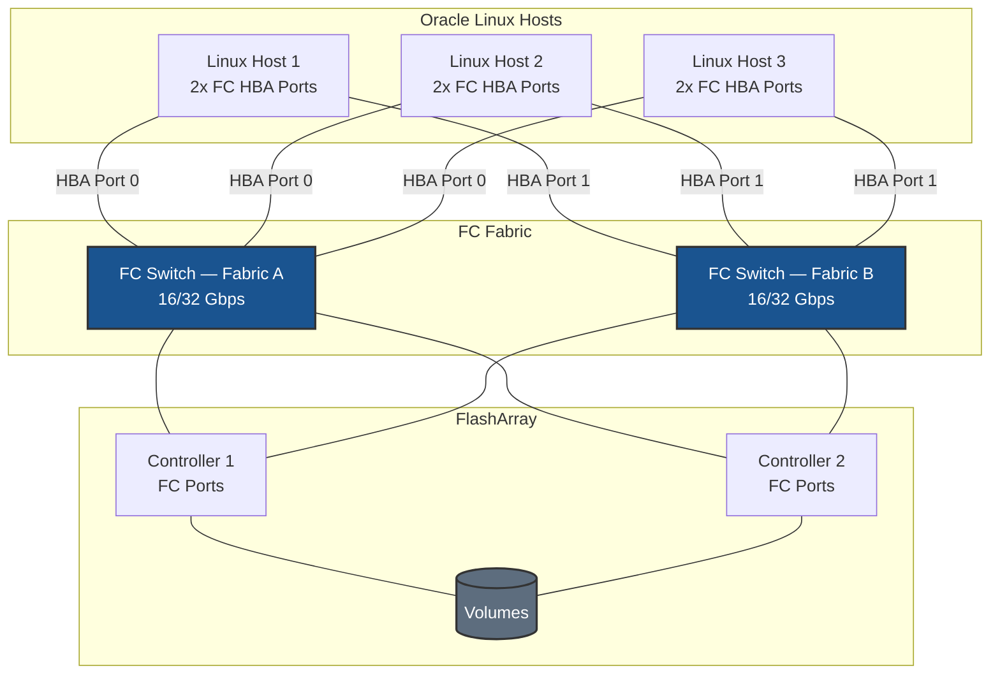

# Fibre Channel on Oracle Linux - Best Practices Guide

Comprehensive best practices for deploying Fibre Channel storage on Oracle Linux in production environments.

---



---

## Table of Contents
- [Architecture Overview](#architecture-overview)
- [Oracle Linux-Specific Considerations](#oracle-linux-specific-considerations)
- [Fabric & Zoning Guidance](#fabric--zoning-guidance)
- [SELinux Configuration](#selinux-configuration)
- [FC Architecture](#fc-architecture)
- [Multipath Configuration](#multipath-configuration)
- [Performance Tuning](#performance-tuning)
- [High Availability](#high-availability)
- [Monitoring & Maintenance](#monitoring--maintenance)
- [Security](#security)
- [Troubleshooting](#troubleshooting)

---

## Architecture Overview

### Deployment Topology



---

## Oracle Linux-Specific Considerations

### UEK vs. RHCK Kernels

Oracle Linux ships two kernels:

| Kernel | Name | Notes |
|--------|------|-------|
| **UEK** (Unbreakable Enterprise Kernel) | `kernel-uek` | Oracle's custom kernel; updated frequently; often has newer driver versions than RHCK |
| **RHCK** (Red Hat Compatible Kernel) | `kernel` | Follows RHEL kernel; maximizes RHEL compatibility |

**For FC storage:** Both kernels include `lpfc` and `qla2xxx`. However, **HBA driver versions differ between UEK and RHCK**. If you experience an HBA-specific issue, check whether the problem reproduces on both kernels before engaging vendor support.

**Check active kernel and HBA driver version:**
```bash
uname -r

# Check lpfc driver version
modinfo lpfc | grep ^version

# Check qla2xxx driver version
modinfo qla2xxx | grep ^version
```

### Subscription and Packages

**Oracle Linux Premier or Basic support:**
```bash
# Register with Oracle ULN (optional — free updates available via public yum)
# Update system
sudo dnf update -y
```

**Install essential packages:**
```bash
sudo dnf install -y \
    device-mapper-multipath \
    lvm2 \
    sg3_utils \
    sysfsutils

sudo dnf install -y sysstat iotop htop
```

---

## Fabric & Zoning Guidance

### Single-Initiator Zoning (Required)

Each host WWPN must be in its own zone paired with the array's target ports.

```
Zone: host1-hba0-to-array
  Members: host1-wwpn-hba0, array-ct0-port0, array-ct0-port1, array-ct1-port0, array-ct1-port1

Zone: host1-hba1-to-array
  Members: host1-wwpn-hba1, array-ct0-port2, array-ct0-port3, array-ct1-port2, array-ct1-port3
```

### Discovering WWPNs

```bash
cat /sys/class/fc_host/host*/port_name
```

---

## SELinux Configuration

### SELinux with FC Storage

SELinux does not directly govern FC transport, but it controls access to block device nodes and LVM operations.

```bash
getenforce
sestatus

# Check for denials related to multipath or block devices
sudo ausearch -m avc -ts recent | grep -E "multipath|dm-"

# If denials found, generate policy
sudo ausearch -m avc -ts recent | audit2allow -M fc_multipath
sudo semodule -i fc_multipath.pp
```

**Allow raw block device access if needed:**
```bash
sudo setsebool -P virt_use_rawio 1
```

---

## FC Architecture

```
FC Fabric
  └── HBA Driver (lpfc / qla2xxx)
        └── SCSI Mid-Layer
              └── SCSI Disk (sdX — one per path)
                    └── dm-multipath
                          └── /dev/mapper/mpathX  ← application uses this
                                └── LVM (optional)
```

Always target `/dev/mapper/` devices. ALUA identifies preferred (active/optimized) vs. available (active/non-optimized) paths.

---

## Multipath Configuration

```bash
sudo systemctl enable --now multipathd

sudo tee /etc/multipath.conf > /dev/null <<'EOF'
defaults {
    user_friendly_names     yes
    find_multipaths         no
    enable_foreign          "^$"
    polling_interval        10
    path_selector           "service-time 0"
    path_grouping_policy    group_by_prio
    failback                immediate
    no_path_retry           0
}

blacklist {
    devnode "^(ram|raw|loop|fd|md|dm-|sr|scd|st|nvme)[0-9]*"
    devnode "^hd[a-z]"
    devnode "^sd[a]$"
    devnode "^vd[a-z]"
}

#devices {
#    device {
#        vendor               "VENDOR"
#        product              "PRODUCT"
#        path_selector        "service-time 0"
#        hardware_handler     "1 alua"
#        path_grouping_policy group_by_prio
#        prio                 alua
#        failback             immediate
#        path_checker         tur
#        fast_io_fail_tmo     5
#        dev_loss_tmo         60
#        no_path_retry        0
#    }
#}
EOF

sudo systemctl restart multipathd
sudo multipath -ll
```

---

## Performance Tuning

### HBA Queue Depth

**Tune Emulex (lpfc):**
```bash
sudo tee /etc/modprobe.d/lpfc.conf > /dev/null <<'EOF'
options lpfc lpfc_lun_queue_depth=64
EOF

sudo dracut -f
sudo reboot
```

**Tune QLogic (qla2xxx):**
```bash
sudo tee /etc/modprobe.d/qla2xxx.conf > /dev/null <<'EOF'
options qla2xxx ql2xmaxqdepth=64
EOF

sudo dracut -f
sudo reboot
```

> **UEK note:** After changing `modprobe.d` settings, always regenerate the initramfs with `sudo dracut -f` for the **active kernel**. If you run both UEK and RHCK, run `dracut -f` once per kernel or specify: `sudo dracut -f /boot/initramfs-$(uname -r).img $(uname -r)`.

### Device-Level Queue Depth

```bash
sudo tee /etc/udev/rules.d/99-pure-fc-queue-depth.rules > /dev/null <<'EOF'
ACTION=="add|change", SUBSYSTEM=="block", ATTRS{model}=="FlashArray*", ATTR{device/queue_depth}="64"
EOF

sudo udevadm control --reload-rules
sudo udevadm trigger
```

---

## High Availability

### Failover Timers

| Parameter | Recommended | Effect |
|-----------|-------------|--------|
| `fast_io_fail_tmo` | 5 seconds | Time to fail I/O after fabric reports link down |
| `dev_loss_tmo` | 60 seconds | Time before device is removed after persistent failure |
| `failback` | `immediate` | Restore preferred paths as soon as they come back online |

### Testing Path Failover

```bash
echo offline | sudo tee /sys/block/sdb/device/state
sudo multipath -ll
echo running | sudo tee /sys/block/sdb/device/state
```

---

## Monitoring & Maintenance

```bash
cat /sys/class/fc_host/host*/port_state
cat /sys/class/fc_host/host*/link_failure_count
cat /sys/class/fc_host/host*/speed

sudo multipath -ll
sudo multipathd -k"show paths"
sudo journalctl -u multipathd -f
```

---

## Security

Fibre Channel security is implemented at the fabric level — no host-level firewall is required for FC storage traffic. Security controls:

1. **Fabric zoning** — primary access control
2. **LUN masking / host registration** — enforced by the storage array based on WWPN and host group
3. **Hard zoning** — enforce at the switch port level for strongest isolation

---

## Troubleshooting

### LUNs Not Appearing After Rescan

```bash
cat /sys/class/fc_host/host*/port_state
cat /sys/class/fc_host/host*/link_failure_count

sudo rescan-scsi-bus.sh -a -r
lsscsi
sudo multipath -ll
```

### UEK Driver Issues

If an HBA driver problem appears only on one kernel:

```bash
# Check which kernel is active
uname -r

# Boot to the other kernel and retest
# From grub menu or:
sudo grubby --info=ALL | grep -E "^kernel|^title"
```

### Fewer Than Expected Paths

```bash
for h in /sys/class/fc_host/host*; do
    echo "$h: $(cat $h/port_state) — WWPN: $(cat $h/port_name)"
done
```

### Path Flapping

```bash
cat /sys/class/fc_host/host*/link_failure_count
cat /sys/class/fc_host/host*/loss_of_signal_count
sudo grep -i "fc\|scsi" /var/log/messages | tail -50
```
