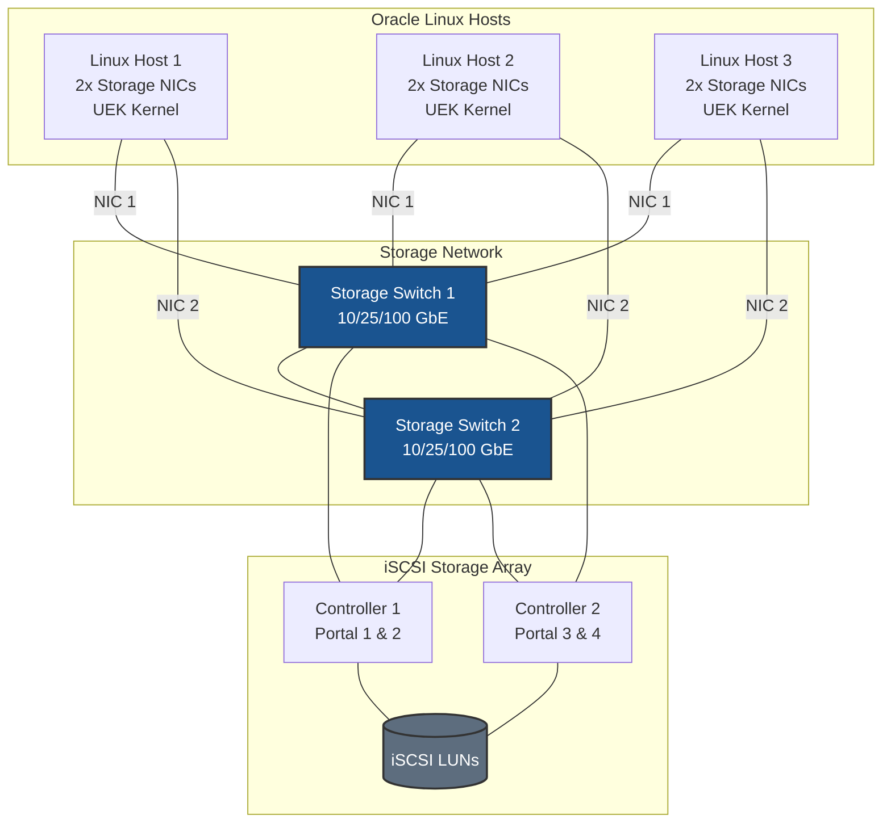
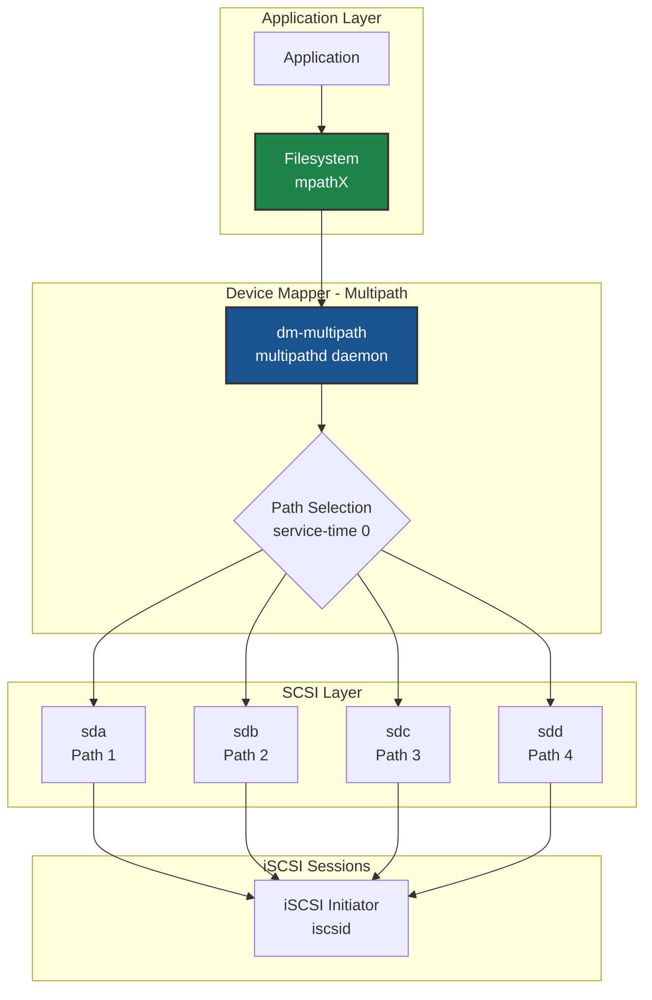
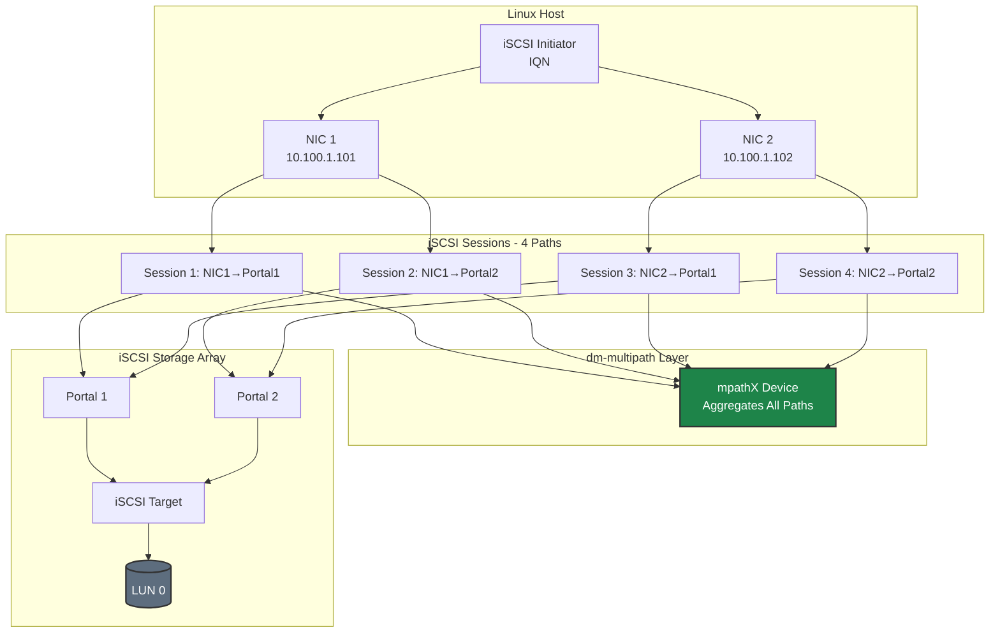
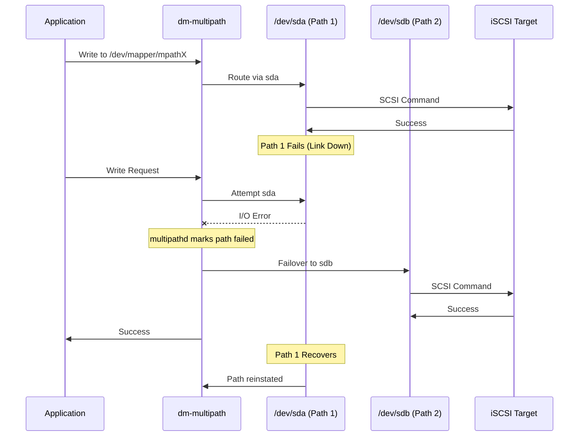
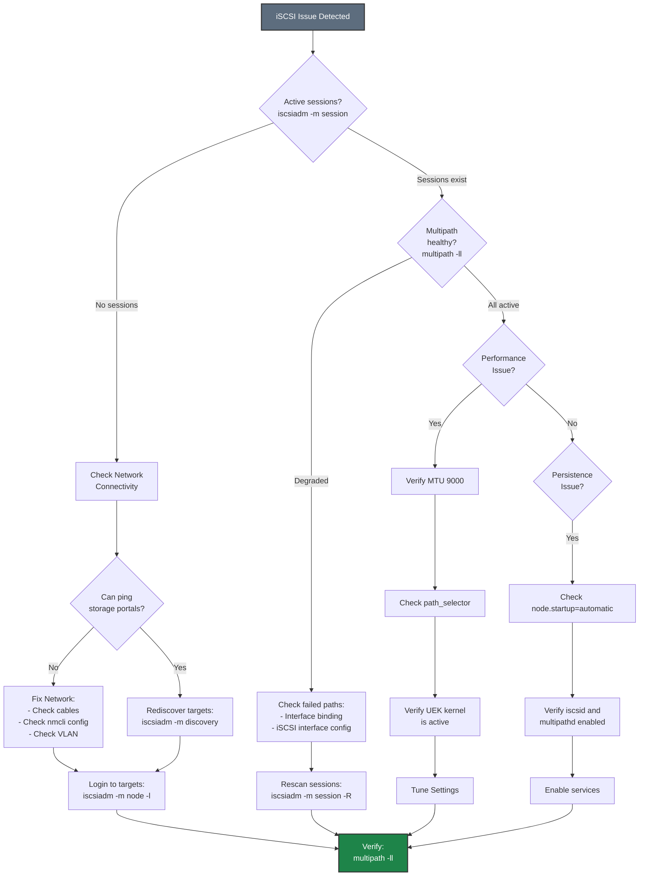

# iSCSI on Oracle Linux - Best Practices Guide

Comprehensive best practices for deploying iSCSI storage on Oracle Linux with Unbreakable Enterprise Kernel (UEK) and Ksplice.

---



---

## Table of Contents
- [Architecture Overview](#architecture-overview)
- [Oracle Linux-Specific Considerations](#oracle-linux-specific-considerations)
- [Kernel Selection Strategy](#kernel-selection-strategy)
- [Network Configuration](#network-configuration)
- [SELinux Configuration](#selinux-configuration)
- [Firewall Configuration](#firewall-configuration)
- [iSCSI Architecture](#iscsi-architecture)
- [Multipath Configuration](#multipath-configuration)
- [UEK-Specific Optimizations](#uek-specific-optimizations)
- [High Availability with Ksplice](#high-availability-with-ksplice)
- [Performance Tuning](#performance-tuning)
- [Monitoring & Maintenance](#monitoring--maintenance)
- [Security](#security)
- [Troubleshooting](#troubleshooting)

---

## Architecture Overview

### Deployment Topology



### dm-multipath Architecture



**Key Design Principles:**
- **Dual switches** for network redundancy
- **Minimum 2 NICs per host** for multipath
- **Dual controller array** for storage HA
- **dm-multipath** aggregates all paths into single device
- **UEK kernel** for optimized iSCSI performance





---

## Oracle Linux-Specific Considerations

### Why Oracle Linux for iSCSI Storage?

**Key advantages:**
1. **Unbreakable Enterprise Kernel (UEK)**: Optimized for performance and latest features
2. **Ksplice**: Zero-downtime kernel updates (no reboots required)
3. **RHEL Compatibility**: Binary compatible with RHEL
4. **Oracle Support**: Enterprise-grade support for Oracle workloads
5. **Free to use**: No subscription required for updates

### Distribution Versions

**Recommended versions:**
- **Oracle Linux 8**: Stable, long-term support
- **Oracle Linux 9**: Latest features, recommended for new deployments

**Check version:**
```bash
cat /etc/oracle-release
```

### Package Management

**Update system:**
```bash
# Update all packages
sudo dnf update -y

# Enable Oracle Linux repositories
sudo dnf config-manager --enable ol8_baseos_latest ol8_appstream
# Or for OL9:
sudo dnf config-manager --enable ol9_baseos_latest ol9_appstream
```

**Essential packages:**
```bash
# Core iSCSI and multipath tools
sudo dnf install -y \
    iscsi-initiator-utils \
    device-mapper-multipath \
    lvm2 \
    sg3_utils

# Performance monitoring tools
sudo dnf install -y \
    sysstat \
    iotop \
    iftop \
    htop \
    perf

# Network tools
sudo dnf install -y \
    NetworkManager \
    NetworkManager-tui \
    ethtool \
    iproute \
    iputils \
    bind-utils

# Oracle-specific tools
sudo dnf install -y \
    oracle-epel-release-el8 \
    tuned \
    tuned-utils

# Ksplice (requires Oracle Linux support subscription)
# sudo dnf install -y uptrack
```

**Verify installation:**
```bash
# Check iSCSI initiator
iscsiadm --version

# Check multipath
multipath -ll

# Check services
systemctl status iscsid
systemctl status multipathd
```

---

## Kernel Selection Strategy

### UEK vs RHCK Decision Matrix

| Factor | UEK (Recommended) | RHCK |
|--------|-------------------|------|
| **Performance** | ✅ 5-10% better storage I/O | ⚠️ Standard performance |
| **Latest Features** | ✅ Newer iSCSI drivers | ⚠️ Conservative updates |
| **Ksplice Support** | ✅ Zero-downtime updates | ❌ Not available |
| **RHEL Compatibility** | ⚠️ Oracle-specific | ✅ Binary compatible |
| **Oracle Support** | ✅ Full support | ✅ Full support |
| **Stability** | ✅ Production-ready | ✅ Very stable |

**Recommendation:** Use UEK for better iSCSI performance and Ksplice support.

### UEK Version Recommendations

**For iSCSI workloads:**

- **UEK R7 (5.15+)**: Recommended for Oracle Linux 8 and 9
  - Enhanced multipath performance
  - Better TCP performance
  - Improved NUMA awareness
  - Latest security fixes

- **UEK R6 (5.4)**: Minimum for production
  - Stable iSCSI support
  - Good performance
  - Long-term support

**Check and upgrade UEK:**
```bash
# Check current kernel version
uname -r

# List available UEK versions
sudo dnf list available kernel-uek

# Install latest UEK
sudo dnf install -y kernel-uek

# Set UEK as default
sudo grubby --set-default=/boot/vmlinuz-$(rpm -q --qf '%{VERSION}-%{RELEASE}.%{ARCH}\n' kernel-uek | tail -1)

# Verify default kernel
sudo grubby --default-kernel

# Reboot
sudo reboot
```

### Kernel Boot Parameters for Storage

**Recommended boot parameters for UEK:**
```bash
# Edit GRUB configuration
sudo nano /etc/default/grub

# Add to GRUB_CMDLINE_LINUX:
# intel_iommu=on iommu=pt

# For NUMA systems, add:
# numa_balancing=disable

# Update GRUB
sudo grub2-mkconfig -o /boot/grub2/grub.cfg

# Reboot
sudo reboot
```

**Why these parameters:**
- `intel_iommu=on iommu=pt`: Enables IOMMU passthrough for better performance
- `numa_balancing=disable`: Prevents automatic NUMA balancing which can hurt storage performance

> **⚠️ Note:** These are general CPU and NUMA optimizations that improve overall system performance for I/O-intensive workloads. They do not directly affect iSCSI protocol behavior. Measure baseline performance before and after changes to validate impact in your environment.

---

## Network Configuration

### Oracle Linux Network Best Practices

**Use NetworkManager for consistency:**
```bash
# Ensure NetworkManager is running
sudo systemctl enable --now NetworkManager

# Disable legacy network service if present
sudo systemctl disable network
```

### Storage Network Configuration

**Configure storage interfaces with nmcli:**
```bash
# Create connection for storage interface
sudo nmcli connection add type ethernet \
    con-name storage-iscsi-1 \
    ifname ens1f0 \
    ipv4.method manual \
    ipv4.addresses 10.100.1.101/24 \
    ipv4.never-default yes \
    ipv4.may-fail no \
    802-3-ethernet.mtu 9000 \
    connection.autoconnect yes \
    connection.autoconnect-priority 10

# Optimize for storage
sudo nmcli connection modify storage-iscsi-1 \
    ethtool.ring-rx 4096 \
    ethtool.ring-tx 4096 \
    ethtool.coalesce-rx-usecs 50 \
    ethtool.coalesce-tx-usecs 50

# Activate
sudo nmcli connection up storage-iscsi-1

# Repeat for second interface
sudo nmcli connection add type ethernet \
    con-name storage-iscsi-2 \
    ifname ens1f1 \
    ipv4.method manual \
    ipv4.addresses 10.100.2.101/24 \
    ipv4.never-default yes \
    ipv4.may-fail no \
    802-3-ethernet.mtu 9000 \
    connection.autoconnect yes \
    connection.autoconnect-priority 10

sudo nmcli connection up storage-iscsi-2
```

### MTU Configuration

```bash
# Verify MTU
ip link show ens1f0 | grep mtu

# Test MTU (jumbo frames)
ping -M do -s 8972 <storage_portal_ip>
```

**Important:** MTU must be 9000 end-to-end (host → switch → storage)

---

## SELinux Configuration

### Understanding SELinux with iSCSI

**SELinux modes:**
- `enforcing` - SELinux policy is enforced (recommended for production)
- `permissive` - SELinux logs violations but doesn't block (testing)
- `disabled` - SELinux is disabled (not recommended)

**Check SELinux status:**
```bash
getenforce
sestatus
```

### SELinux Policies for iSCSI

**Allow iSCSI connections:**
```bash
# iSCSI should work out-of-the-box with default policies
# Check for denials
sudo ausearch -m avc -ts recent | grep iscsi

# If denials found, generate policy
sudo ausearch -m avc -ts recent | audit2allow -M iscsi_policy

# Review the policy
cat iscsi_policy.te

# Install policy
sudo semodule -i iscsi_policy.pp
```

### Common SELinux Issues

**Issue: iSCSI connections blocked**
```bash
# Check for denials
sudo ausearch -m avc -ts recent

# Temporary: Set to permissive for testing
sudo setenforce 0

# Test iSCSI connection
sudo iscsiadm -m discovery -t sendtargets -p <portal_ip>:3260

# Check for new denials
sudo ausearch -m avc -ts recent

# Generate and install policy
sudo ausearch -m avc -ts recent | audit2allow -M iscsi_fix
sudo semodule -i iscsi_fix.pp

# Re-enable enforcing
sudo setenforce 1
```

**Issue: Multipath device access denied**
```bash
# Allow multipath to access devices
sudo setsebool -P virt_use_rawio 1

# Or create custom policy
sudo ausearch -m avc -ts recent | grep multipath | audit2allow -M multipath_iscsi
sudo semodule -i multipath_iscsi.pp
```

---

## Firewall Configuration

### Option 1: Trusted Zone (Recommended for Dedicated Storage Networks)

For dedicated storage networks, **disable firewall filtering** on storage interfaces to eliminate CPU overhead from packet inspection. This is important for high-throughput iSCSI storage.

**Why disable filtering on storage interfaces:**
- **CPU overhead**: Firewall packet inspection adds latency and consumes CPU cycles
- **Performance impact**: At high IOPS, filtering overhead becomes significant
- **Network isolation**: Dedicated storage VLANs provide security at the network layer
- **Simplicity**: No port rules to maintain for storage traffic

```bash
# Add storage interfaces to trusted zone (no packet filtering)
sudo firewall-cmd --permanent --zone=trusted --add-interface=ens1f0
sudo firewall-cmd --permanent --zone=trusted --add-interface=ens1f1

# Reload
sudo firewall-cmd --reload

# Verify
sudo firewall-cmd --zone=trusted --list-all
```

### Option 2: Port Filtering (For Shared or Non-Isolated Networks)

Use port filtering only when storage interfaces share a network with other traffic or when additional host-level security is required by policy.

> **⚠️ Performance Note:** Port filtering adds CPU overhead for every packet. For production storage with high IOPS requirements, use Option 1 with network-level isolation instead.

#### Basic firewalld Configuration

```bash
# Enable firewalld
sudo systemctl enable --now firewalld

# Check status
sudo firewall-cmd --state

# Allow iSCSI traffic
sudo firewall-cmd --permanent --add-service=iscsi-target

# Or add port directly
sudo firewall-cmd --permanent --add-port=3260/tcp

# Reload firewall
sudo firewall-cmd --reload

# Verify
sudo firewall-cmd --list-all
```

#### Zone-Based Configuration with Port Filtering

**Dedicated storage zone with port filtering:**
```bash
# Create storage zone
sudo firewall-cmd --permanent --new-zone=storage

# Add storage interfaces to zone
sudo firewall-cmd --permanent --zone=storage --add-interface=ens1f0
sudo firewall-cmd --permanent --zone=storage --add-interface=ens1f1

# Allow iSCSI in storage zone
sudo firewall-cmd --permanent --zone=storage --add-port=3260/tcp

# Set target to DROP (deny by default except allowed ports)
sudo firewall-cmd --permanent --zone=storage --set-target=DROP

# Reload
sudo firewall-cmd --reload

# Verify
sudo firewall-cmd --zone=storage --list-all
```

---

## iSCSI Architecture



**Key points for Oracle Linux:**
- Use dedicated storage networks (VLANs or physical)
- Minimum 2×2 topology (2 NICs × 2 portals = 4 paths)
- Static IP addressing (no DHCP)
- No default gateway on storage interfaces
- MTU 9000 end-to-end

---

## Multipath Configuration



### Oracle Linux-Specific Multipath Setup

**Enable and configure multipath:**
```bash
# Enable multipath
sudo systemctl enable --now multipathd

# Generate default configuration
sudo mpathconf --enable --with_multipathd y

# Edit configuration
sudo vi /etc/multipath.conf
```

**Oracle Linux-optimized multipath.conf:**
```bash
# /etc/multipath.conf
defaults {
    user_friendly_names yes
    find_multipaths no
    enable_foreign "^$"
}

# Blacklist local devices and NVMe (NVMe uses native multipath)
blacklist {
    devnode "^(ram|raw|loop|fd|md|dm-|sr|scd|st|nvme)[0-9]*"
    devnode "^hd[a-z]"
    devnode "^cciss.*"
}

# Add device-specific settings for your storage array
# Consult your storage vendor documentation for recommended values
#devices {
#    device {
#        vendor "VENDOR"
#        product "PRODUCT"
#        path_selector "service-time 0"
#        path_grouping_policy "group_by_prio"
#        prio "alua"
#        failback "immediate"
#        path_checker "tur"
#        fast_io_fail_tmo 10
#        dev_loss_tmo 60
#        no_path_retry 0
#        hardware_handler "1 alua"
#        rr_min_io_rq 1
#    }
#}
```

**Apply configuration:**
```bash
# Restart multipathd
sudo systemctl restart multipathd

# Verify configuration
sudo multipath -ll

# Check for errors
sudo journalctl -u multipathd -n 50
```

---

## UEK-Specific Optimizations

### UEK Kernel Parameters

**Optimize UEK for iSCSI:**
```bash
# Create sysctl configuration
sudo tee /etc/sysctl.d/99-iscsi-uek.conf > /dev/null <<'EOF'
# Network performance (UEK-optimized)
net.core.netdev_max_backlog = 10000
net.core.rmem_max = 268435456
net.core.wmem_max = 268435456
net.ipv4.tcp_rmem = 4096 87380 134217728
net.ipv4.tcp_wmem = 4096 65536 134217728

# Connection tracking
net.netfilter.nf_conntrack_max = 2097152

# Low latency
net.ipv4.tcp_low_latency = 1

# VM tuning for storage
vm.dirty_ratio = 10
vm.dirty_background_ratio = 5
vm.swappiness = 10

# UEK-specific optimizations
kernel.numa_balancing = 0

# ARP settings for same-subnet multipath (CRITICAL)
# Prevents ARP responses on wrong interface when multiple NICs share same subnet
# See: Network Concepts documentation for detailed explanation
net.ipv4.conf.all.arp_ignore = 2
net.ipv4.conf.default.arp_ignore = 2
net.ipv4.conf.all.arp_announce = 2
net.ipv4.conf.default.arp_announce = 2
# Interface-specific (adjust interface names as needed)
net.ipv4.conf.ens1f0.arp_ignore = 2
net.ipv4.conf.ens1f1.arp_ignore = 2
net.ipv4.conf.ens1f0.arp_announce = 2
net.ipv4.conf.ens1f1.arp_announce = 2
EOF

# Apply settings
sudo sysctl -p /etc/sysctl.d/99-iscsi-uek.conf
```

### UEK I/O Scheduler

**Set I/O scheduler for iSCSI devices:**
```bash
# Create udev rule
sudo tee /etc/udev/rules.d/99-iscsi-scheduler-uek.rules > /dev/null <<'EOF'
# Set I/O scheduler for iSCSI devices (SSD/Flash)
ACTION=="add|change", KERNEL=="sd[a-z]", ATTR{queue/rotational}=="0", ATTR{queue/scheduler}="none"

# Set queue depth (UEK supports higher values, adjust vendor to match your storage)
ACTION=="add|change", KERNEL=="sd[a-z]", ATTR{device/vendor}=="VENDOR*", ATTR{device/queue_depth}="256"

# Set read-ahead (adjust vendor to match your storage)
ACTION=="add|change", KERNEL=="sd[a-z]", ATTR{device/vendor}=="VENDOR*", ATTR{bdi/read_ahead_kb}="128"

# Enable write cache (adjust vendor to match your storage)
ACTION=="add|change", KERNEL=="sd[a-z]", ATTR{device/vendor}=="VENDOR*", ATTR{queue/write_cache}="write back"
EOF

# Reload udev rules
sudo udevadm control --reload-rules
sudo udevadm trigger
```

---

## High Availability with Ksplice

### iSCSI Path Redundancy Model



### Failover Behavior





### What is Ksplice?

**Ksplice benefits:**
- Zero-downtime kernel updates
- No reboots required for security patches
- Maintains iSCSI connections during updates
- Reduces maintenance windows
- Improves uptime SLAs

**Requires:** Oracle Linux Premier Support subscription

### Enable Ksplice

**Install and configure Ksplice:**
```bash
# Install uptrack (Ksplice client)
sudo dnf install -y uptrack

# Register with Oracle (requires support subscription)
sudo uptrack-upgrade --register <access_key>

# Enable automatic updates
sudo systemctl enable --now uptrack-upgrade.timer

# Check Ksplice status
sudo uptrack-show

# View available updates
sudo uptrack-upgrade --check
```

### Ksplice Best Practices

**1. Monitor Ksplice updates:**
```bash
# Check what patches are applied
sudo uptrack-show

# View update history
sudo uptrack-show --history

# Check for available updates
sudo uptrack-upgrade --check
```

**2. Schedule updates during low-activity periods:**
```bash
# Configure update schedule
sudo systemctl edit uptrack-upgrade.timer

# Add:
[Timer]
OnCalendar=
OnCalendar=Sun 02:00
```

**3. Test in non-production first:**
- Apply Ksplice updates to dev/test systems first
- Monitor for any issues
- Roll out to production after validation

**4. Understand limitations:**
- Some updates still require reboot (rare)
- Major kernel upgrades require reboot
- Check `uptrack-show` for reboot-required updates

---

## Performance Tuning





### Oracle Linux-Specific Tuning

#### Tuned Profiles

**Use tuned for automated tuning:**
```bash
# Install tuned
sudo dnf install -y tuned tuned-utils

# Enable tuned
sudo systemctl enable --now tuned

# List available profiles
sudo tuned-adm list

# Apply throughput-performance profile
sudo tuned-adm profile throughput-performance

# Or network-latency for low-latency workloads
sudo tuned-adm profile network-latency

# Verify active profile
sudo tuned-adm active
```

**Create custom tuned profile for iSCSI on UEK:**
```bash
# Create custom profile directory
sudo mkdir -p /etc/tuned/iscsi-storage-uek

# Create tuned.conf
sudo tee /etc/tuned/iscsi-storage-uek/tuned.conf > /dev/null <<'EOF'
[main]
summary=Optimized for iSCSI storage workloads on UEK
include=throughput-performance

[sysctl]
# Network tuning (UEK-optimized)
net.core.rmem_max = 268435456
net.core.wmem_max = 268435456
net.ipv4.tcp_rmem = 4096 87380 134217728
net.ipv4.tcp_wmem = 4096 65536 134217728
net.ipv4.tcp_low_latency = 1

# iSCSI tuning
net.ipv4.tcp_timestamps = 1
net.ipv4.tcp_sack = 1

# NUMA
kernel.numa_balancing = 0

[disk]
# I/O scheduler for iSCSI devices
devices_udev_regex=^sd[a-z]+$
elevator=none

[script]
script=${i:PROFILE_DIR}/script.sh
EOF

# Create script
sudo tee /etc/tuned/iscsi-storage-uek/script.sh > /dev/null <<'EOF'
#!/bin/bash
. /usr/lib/tuned/functions

start() {
    # Set queue depth for iSCSI devices (UEK supports higher values)
    for dev in /sys/block/sd*/device/queue_depth; do
        if [ -f "$dev" ]; then
            echo 256 > "$dev"
        fi
    done
    return 0
}

stop() {
    return 0
}

process $@
EOF

# Make script executable
sudo chmod +x /etc/tuned/iscsi-storage-uek/script.sh

# Apply custom profile
sudo tuned-adm profile iscsi-storage-uek

# Verify
sudo tuned-adm active
```

---

## Monitoring & Maintenance



### Oracle Linux-Specific Monitoring

#### Using systemd Journal

**Monitor iSCSI services:**
```bash
# View iSCSI logs
sudo journalctl -u iscsid -f

# View multipath logs
sudo journalctl -u multipathd -f

# View all storage-related logs
sudo journalctl -u iscsid -u multipathd -u lvm2-* --since "1 hour ago"
```

#### Performance Monitoring with sysstat

**Install and configure sysstat:**
```bash
# Install
sudo dnf install -y sysstat

# Enable data collection
sudo systemctl enable --now sysstat

# View I/O statistics
sar -d 1 10

# View network statistics
sar -n DEV 1 10

# Generate daily report
sar -A
```

#### Monitoring Ksplice

**Monitor Ksplice status:**
```bash
# Check Ksplice status
sudo uptrack-show

# View update history
sudo uptrack-show --history

# Check for available updates
sudo uptrack-upgrade --check

# View Ksplice logs
sudo journalctl -u uptrack-upgrade -f
```

#### Monitoring Scripts

**Create comprehensive monitoring script:**
```bash
sudo tee /usr/local/bin/iscsi-health-check-oracle.sh > /dev/null <<'EOF'
#!/bin/bash
# iSCSI Health Check Script for Oracle Linux

echo "=== iSCSI Health Check (Oracle Linux) ==="
echo "Date: $(date)"
echo

echo "--- Kernel Information ---"
uname -r
echo "Ksplice Status:"
uptrack-show 2>/dev/null || echo "Ksplice not installed"

echo
echo "--- iSCSI Sessions ---"
iscsiadm -m session

echo
echo "--- Multipath Status ---"
multipath -ll | head -50

echo
echo "--- Failed Paths ---"
multipath -ll | grep -i "failed\|faulty" || echo "No failed paths"

echo
echo "--- Disk I/O ---"
iostat -x 1 2 | tail -20

echo
echo "--- Network Interfaces ---"
ip -s link show | grep -A 3 "ens1f"

echo
echo "--- Tuned Profile ---"
tuned-adm active

echo
echo "=== End Health Check ==="
EOF

sudo chmod +x /usr/local/bin/iscsi-health-check-oracle.sh

# Run health check
sudo /usr/local/bin/iscsi-health-check-oracle.sh
```

**Schedule with cron:**
```bash
# Add to crontab
echo "0 */6 * * * /usr/local/bin/iscsi-health-check-oracle.sh >> /var/log/iscsi-health.log 2>&1" | sudo crontab -
```

---

## Security



### Oracle Linux-Specific Security

#### CHAP Authentication

**Configure CHAP on initiator:**
```bash
# Set CHAP credentials
sudo iscsiadm -m node -T <target_iqn> -p <portal_ip>:3260 \
    -o update -n node.session.auth.authmethod -v CHAP

sudo iscsiadm -m node -T <target_iqn> -p <portal_ip>:3260 \
    -o update -n node.session.auth.username -v <username>

sudo iscsiadm -m node -T <target_iqn> -p <portal_ip>:3260 \
    -o update -n node.session.auth.password -v <password>

# For mutual CHAP
sudo iscsiadm -m node -T <target_iqn> -p <portal_ip>:3260 \
    -o update -n node.session.auth.username_in -v <target_username>

sudo iscsiadm -m node -T <target_iqn> -p <portal_ip>:3260 \
    -o update -n node.session.auth.password_in -v <target_password>

# Reconnect with CHAP
sudo iscsiadm -m node -T <target_iqn> -p <portal_ip>:3260 --logout
sudo iscsiadm -m node -T <target_iqn> -p <portal_ip>:3260 --login
```

#### Audit Logging

**Enable audit logging for iSCSI:**
```bash
# Add audit rules
sudo tee -a /etc/audit/rules.d/iscsi.rules > /dev/null <<'EOF'
# Monitor iSCSI configuration changes
-w /etc/iscsi/ -p wa -k iscsi_config
-w /etc/multipath.conf -p wa -k multipath_config

# Monitor iSCSI commands
-a always,exit -F arch=b64 -S execve -F path=/usr/sbin/iscsiadm -k iscsi_commands

# Monitor Ksplice updates
-w /var/log/uptrack.log -p wa -k ksplice_updates
EOF

# Reload audit rules
sudo augenrules --load

# View iSCSI audit events
sudo ausearch -k iscsi_config
sudo ausearch -k iscsi_commands
sudo ausearch -k ksplice_updates
```

---

## Troubleshooting

### Troubleshooting Flowchart







### Oracle Linux-Specific Troubleshooting

#### Check Service Status

```bash
# Check all iSCSI-related services
sudo systemctl status iscsid
sudo systemctl status iscsi
sudo systemctl status multipathd

# Check for failed services
sudo systemctl --failed | grep -E "iscsi|multipath"

# View detailed service logs
sudo journalctl -xe -u iscsid
```

#### Kernel and UEK Troubleshooting

**Verify UEK is running:**
```bash
# Check current kernel
uname -r

# Should show "uek" in the name
# Example: 5.15.0-100.96.32.el8uek.x86_64

# If not running UEK, check boot order
sudo grubby --default-kernel

# List all installed kernels
sudo grubby --info=ALL | grep title

# Set UEK as default
sudo grubby --set-default=/boot/vmlinuz-<uek-version>
```

#### Ksplice Troubleshooting

**Ksplice not applying updates:**
```bash
# Check Ksplice status
sudo uptrack-show

# Check for errors
sudo journalctl -u uptrack-upgrade -n 50

# Manually check for updates
sudo uptrack-upgrade --check

# Manually apply updates
sudo uptrack-upgrade

# If issues persist, check registration
sudo uptrack-upgrade --register <access_key>
```

#### Network Troubleshooting

```bash
# Check interface status
nmcli device status

# Check connection status
nmcli connection show

# Test connectivity to storage
ping -c 4 <portal_ip>

# Test iSCSI port
nc -zv <portal_ip> 3260

# Check routing
ip route get <portal_ip>

# Verify MTU
ip link show ens1f0 | grep mtu
```

#### Multipath Troubleshooting

```bash
# Verbose multipath output
sudo multipath -v3

# Reload multipath configuration
sudo systemctl reload multipathd

# Reconfigure all devices
sudo multipath -r

# Check for blacklisted devices
sudo multipath -v3 | grep -i blacklist

# View device mapper tables
sudo dmsetup table
sudo dmsetup status
```

#### SELinux Troubleshooting

```bash
# Check for recent denials
sudo ausearch -m avc -ts recent | grep iscsi

# Generate policy from denials
sudo ausearch -m avc -ts recent | audit2allow -M iscsi_troubleshoot

# Review generated policy
cat iscsi_troubleshoot.te

# Install if appropriate
sudo semodule -i iscsi_troubleshoot.pp
```

---

## Additional Resources

- [Oracle Linux Documentation](https://docs.oracle.com/en/operating-systems/oracle-linux/)
- [UEK Release Notes](https://docs.oracle.com/en/operating-systems/uek/)
- [Ksplice Documentation](https://docs.oracle.com/en/operating-systems/ksplice/)
- [iSCSI Quick Start](./QUICKSTART.md)
- [Common Network Concepts]({{ site.baseurl }}/common/network-concepts.html)
- [Multipath Concepts]({{ site.baseurl }}/common/multipath-concepts.html)

---



**Restart services:**
```bash
sudo systemctl restart iscsid multipathd
```

**Check logs:**
```bash
sudo journalctl -u iscsid -u multipathd -f
```

**Check Ksplice:**
```bash
sudo uptrack-show
sudo uptrack-upgrade --check
```

**Check UEK version:**
```bash
uname -r
```

