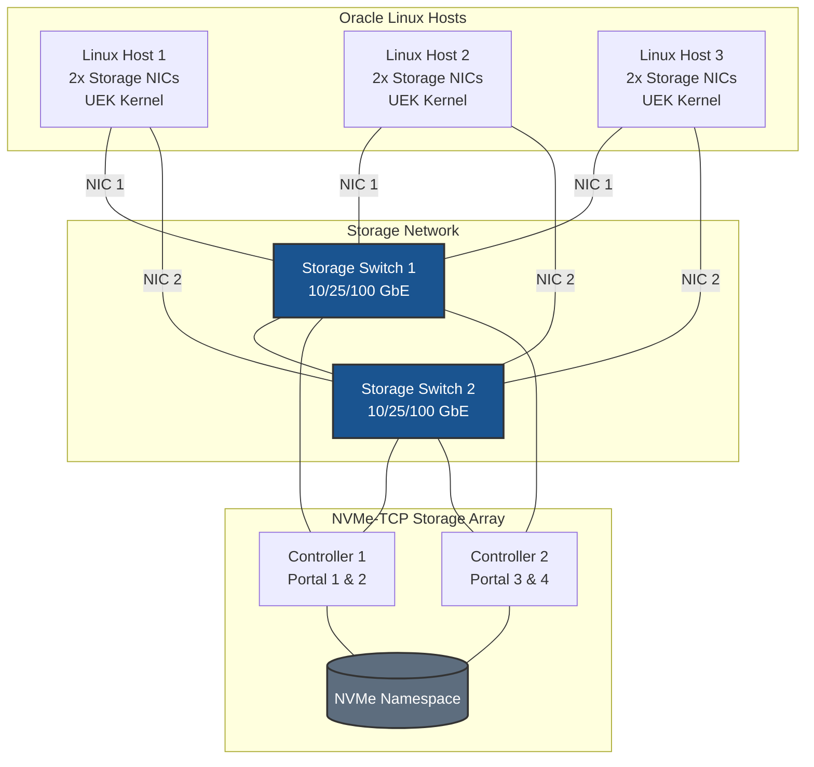
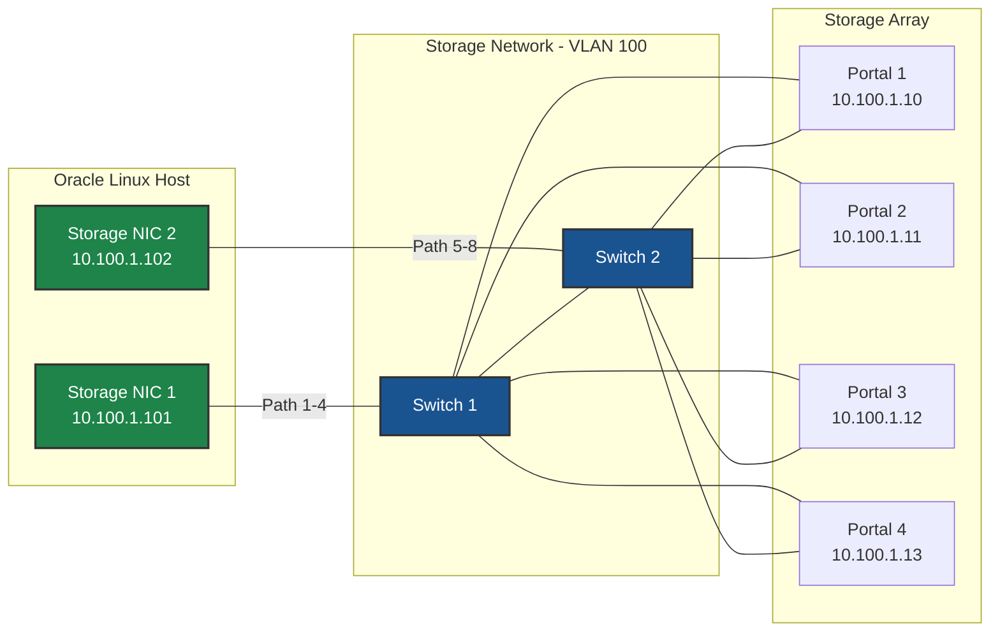
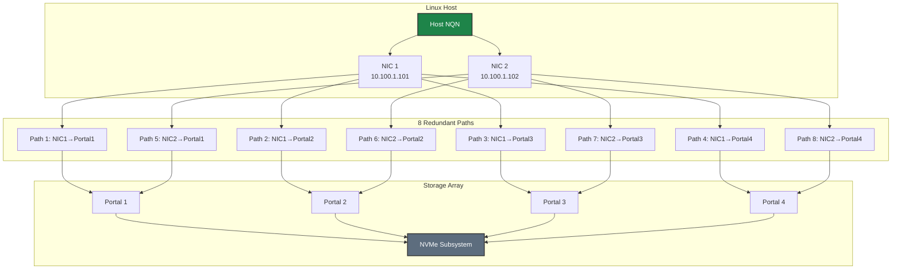
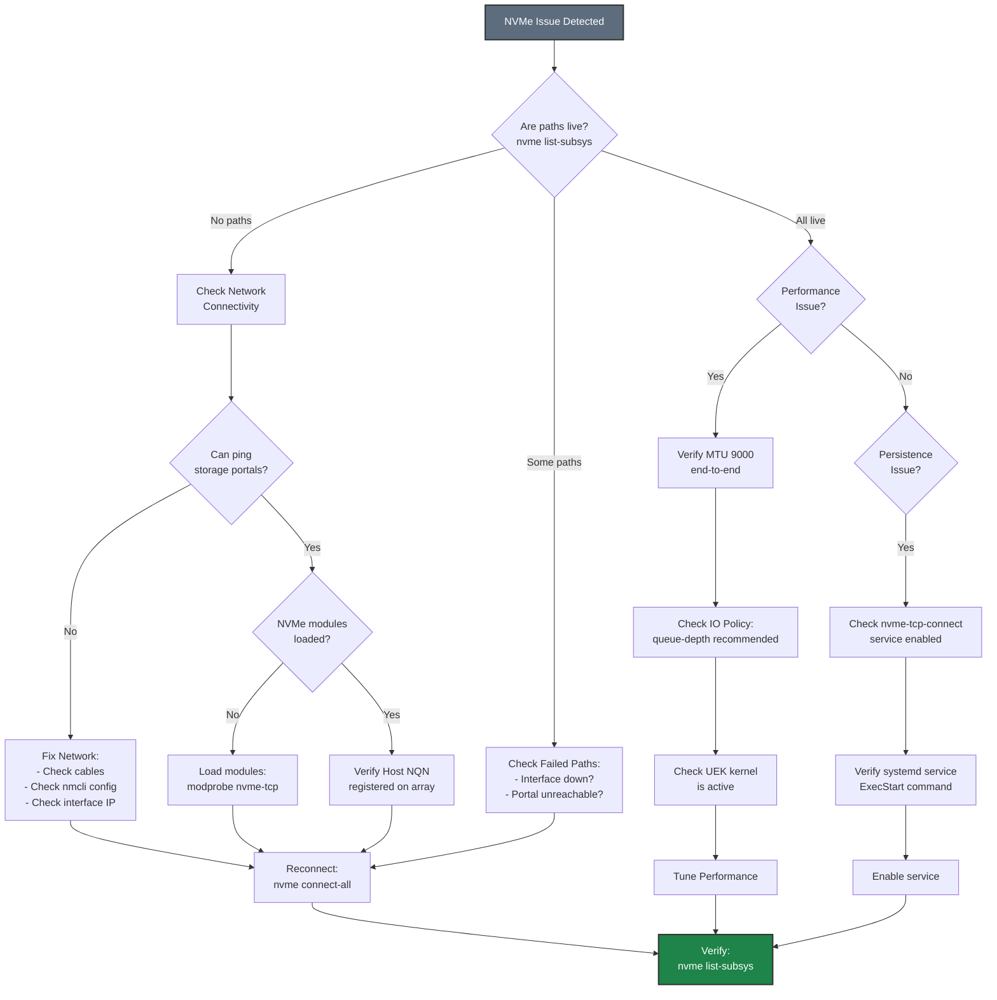

# NVMe-TCP on Oracle Linux - Best Practices Guide

Comprehensive best practices for deploying NVMe over TCP storage on Oracle Linux with Unbreakable Enterprise Kernel (UEK).

---



---

> **Common Reference Documentation:** This guide references common best practices. See also:
> - [Network Concepts]({{ site.baseurl }}/common/network-concepts.html)
> - [Multipath Concepts]({{ site.baseurl }}/common/multipath-concepts.html)
> - [Performance Tuning]({{ site.baseurl }}/common/performance-tuning.html)
> - [Security Best Practices]({{ site.baseurl }}/common/security-best-practices.html)
> - [Monitoring & Maintenance]({{ site.baseurl }}/common/monitoring-maintenance.html)
> - [Troubleshooting Common Issues]({{ site.baseurl }}/common/troubleshooting-common.html)

## Table of Contents

- [Architecture Overview](#architecture-overview)
- [Kernel Selection Strategy](#kernel-selection-strategy)
- [Network Configuration](#network-configuration)
- [UEK-Specific Optimizations](#uek-specific-optimizations)
- [High Availability with Ksplice](#high-availability-with-ksplice)
- [Performance Tuning](#performance-tuning)
- [Security](#security)
- [Monitoring & Maintenance](#monitoring--maintenance)
- [Troubleshooting](#troubleshooting)

---

## Architecture Overview

### Deployment Topology



### Network Architecture



**Key Design Principles:**
- **Dual switches** for network redundancy
- **Minimum 2 NICs per host** for multipath
- **Dual controller array** for storage HA
- **8 paths** (2 NICs × 4 portals) for maximum redundancy
- **UEK kernel** for optimized NVMe-TCP performance





---

## Kernel Selection Strategy

### UEK vs RHCK Decision Matrix

| Factor | UEK (Recommended) | RHCK |
|--------|-------------------|------|
| **Performance** | ✅ 5-10% better storage I/O | ⚠️ Standard performance |
| **Latest Features** | ✅ Newer NVMe drivers | ⚠️ Conservative updates |
| **Ksplice Support** | ✅ Zero-downtime updates | ❌ Not available |
| **RHEL Compatibility** | ⚠️ Oracle-specific | ✅ Binary compatible |
| **Oracle Support** | ✅ Full support | ✅ Full support |
| **Stability** | ✅ Production-ready | ✅ Very stable |

### UEK Version Recommendations

**For NVMe-TCP workloads:**

- **UEK R7 (5.15+)**: Recommended for Oracle Linux 8 and 9
  - Enhanced NVMe multipath
  - Better TCP performance
  - Improved NUMA awareness
  - Latest security fixes

- **UEK R6 (5.4)**: Minimum for production
  - Stable NVMe-TCP support
  - Good performance
  - Long-term support

**Check and upgrade UEK:**
```bash
# Check current UEK version
uname -r

# List available UEK versions
sudo dnf list available kernel-uek

# Install latest UEK
sudo dnf install -y kernel-uek

# Set as default
sudo grubby --set-default=/boot/vmlinuz-$(rpm -q --qf '%{VERSION}-%{RELEASE}.%{ARCH}\n' kernel-uek | tail -1)

# Reboot
sudo reboot
```

### Kernel Boot Parameters for Storage

**Recommended boot parameters for UEK:**
```bash
# Edit GRUB configuration
sudo nano /etc/default/grub

# Add to GRUB_CMDLINE_LINUX:
# intel_iommu=on iommu=pt nvme_core.multipath=Y

# For NUMA systems, add:
# numa_balancing=disable

# Update GRUB
sudo grub2-mkconfig -o /boot/grub2/grub.cfg

# Reboot
sudo reboot
```

**Why these parameters:**
- `intel_iommu=on iommu=pt`: Enables IOMMU passthrough for better performance
- `nvme_core.multipath=Y`: Ensures NVMe native multipath is enabled (directly affects NVMe behavior)
- `numa_balancing=disable`: Prevents automatic NUMA balancing which can hurt storage performance

> **⚠️ Note:** The `intel_iommu` and `numa_balancing` parameters are general CPU and NUMA optimizations that improve overall system performance for I/O-intensive workloads. They do not directly affect NVMe-TCP protocol behavior. Measure baseline performance before and after changes to validate impact in your environment. Only `nvme_core.multipath=Y` directly affects NVMe multipath behavior.

---

## Network Configuration



### Oracle Linux Network Best Practices

**Use NetworkManager for consistency:**
```bash
# Ensure NetworkManager is running
sudo systemctl enable --now NetworkManager

# Disable legacy network service if present
sudo systemctl disable network
```

### Jumbo Frames Configuration

**Verify MTU end-to-end:**
```bash
# Test MTU to storage portal (should not fragment)
ping -M do -s 8972 <PORTAL_IP>

# If successful, packets are not fragmented
# If fails, check switch configuration
```

### Network Interface Bonding (Optional)

For additional redundancy, consider bonding:

```bash
# Create bond interface
sudo nmcli connection add type bond \
    con-name bond-storage \
    ifname bond0 \
    mode active-backup \
    miimon 100

# Add slave interfaces
sudo nmcli connection add type ethernet \
    con-name bond-storage-slave1 \
    ifname ens1f0 \
    master bond0

sudo nmcli connection add type ethernet \
    con-name bond-storage-slave2 \
    ifname ens1f1 \
    master bond0

# Configure IP on bond
sudo nmcli connection modify bond-storage \
    ipv4.method manual \
    ipv4.addresses 10.100.1.101/24 \
    802-3-ethernet.mtu 9000

# Activate
sudo nmcli connection up bond-storage
```

**Note:** Bonding provides NIC-level redundancy in addition to NVMe multipath.

---

## UEK-Specific Optimizations

### UEK Kernel Parameters

UEK includes optimizations, but you can tune further:

```bash
sudo tee /etc/sysctl.d/90-uek-nvme-tcp.conf > /dev/null <<'EOF'
# UEK-specific NVMe optimizations
# (UEK has better defaults than RHCK, these are additional tuning)

# Network performance
net.core.rmem_max = 134217728
net.core.wmem_max = 134217728
net.core.rmem_default = 16777216
net.core.wmem_default = 16777216
net.ipv4.tcp_rmem = 4096 87380 67108864
net.ipv4.tcp_wmem = 4096 65536 67108864

# Network stack
net.core.netdev_max_backlog = 30000
net.core.somaxconn = 4096
net.ipv4.tcp_window_scaling = 1
net.ipv4.tcp_timestamps = 0
net.ipv4.tcp_sack = 1

# VM tuning for storage
vm.dirty_ratio = 10
vm.dirty_background_ratio = 5
vm.swappiness = 10

# NVMe-specific (UEK R7+)
# These are typically good defaults in UEK, but can be tuned
# vm.nvme_core.multipath = Y (set via kernel parameter instead)
EOF

# Apply settings
sudo sysctl -p /etc/sysctl.d/90-uek-nvme-tcp.conf
```

### UEK I/O Scheduler

UEK uses better default I/O schedulers:

```bash
# Check current scheduler (should be 'none' for NVMe)
cat /sys/block/nvme0n1/queue/scheduler

# UEK typically sets this correctly, but verify
# If not 'none', set it:
echo none | sudo tee /sys/block/nvme*/queue/scheduler

# Make persistent with udev
sudo tee /etc/udev/rules.d/60-nvme-scheduler.rules > /dev/null <<'EOF'
ACTION=="add|change", KERNEL=="nvme[0-9]n[0-9]", ATTR{queue/scheduler}="none"
EOF

# Reload udev
sudo udevadm control --reload-rules
sudo udevadm trigger
```

### CPU Frequency Scaling

UEK benefits from performance governor:

```bash
# Install cpupower
sudo dnf install -y kernel-uek-tools

# Set performance governor
sudo cpupower frequency-set -g performance

# Make persistent
echo 'CPUPOWER_START_OPTS="frequency-set -g performance"' | \
    sudo tee /etc/sysconfig/cpupower

# Enable service
sudo systemctl enable --now cpupower
```

---

## High Availability with Ksplice

### Path Redundancy Model







### Ksplice Overview

**What is Ksplice:**
- Zero-downtime kernel updates
- Apply security patches without rebooting
- Maintain NVMe-TCP connections during updates
- Requires Oracle Linux Premier Support

**Why it matters for storage:**
- No storage downtime for kernel updates
- Maintain SLAs during patching windows
- Reduce planned maintenance windows
- Critical for 24/7 storage environments

### Ksplice Setup

```bash
# Check if Ksplice is available (requires Premier Support)
sudo dnf list available | grep ksplice

# Install Ksplice
sudo dnf install -y uptrack

# Enable Ksplice
sudo uptrack-upgrade -y

# Check status
sudo uptrack-uname -r
```

### Ksplice Best Practices for Storage

**Before applying Ksplice updates:**
```bash
# 1. Verify storage health
sudo nvme list-subsys
sudo nvme list

# 2. Check all paths are active
for subsys in /sys/class/nvme-subsystem/nvme-subsys*; do
    echo "Subsystem: $(basename $subsys)"
    cat $subsys/iopolicy
    ls $subsys/nvme*/state
done

# 3. Apply Ksplice update
sudo uptrack-upgrade -y

# 4. Verify storage still healthy
sudo nvme list-subsys

# 5. Check for any disconnections
sudo journalctl -k | grep nvme | tail -20
```

**Monitoring Ksplice:**
```bash
# Check what updates are available
sudo uptrack-show --available

# Check what updates are installed
sudo uptrack-show

# View Ksplice logs
sudo journalctl -u uptrack
```

### Ksplice Automation

**Automatic Ksplice updates:**
```bash
# Enable automatic updates
sudo tee /etc/uptrack/uptrack.conf > /dev/null <<'EOF'
# Automatically install updates
autoinstall = yes

# Check for updates every 6 hours
check_interval = 6h

# Email notifications
#notify_email = admin@example.com
EOF

# Enable uptrack service
sudo systemctl enable --now uptrack-upgrade.timer

# Verify timer
systemctl status uptrack-upgrade.timer
```

---

## Performance Tuning



### Oracle-Specific Tuning Profiles

Oracle Linux includes tuned profiles optimized for different workloads:

```bash
# Install tuned
sudo dnf install -y tuned

# List available profiles
tuned-adm list

# Recommended profiles for storage:
# - throughput-performance (general high-throughput)
# - latency-performance (low-latency workloads)
# - network-latency (network-intensive)

# Set profile
sudo tuned-adm profile throughput-performance

# Verify
tuned-adm active
```

### Custom Tuned Profile for NVMe-TCP

Create a custom profile combining best practices:

```bash
# Create custom profile directory
sudo mkdir -p /etc/tuned/nvme-tcp-storage

# Create tuned.conf
sudo tee /etc/tuned/nvme-tcp-storage/tuned.conf > /dev/null <<'EOF'
[main]
summary=Optimized for NVMe-TCP storage workloads on UEK
include=throughput-performance

[cpu]
governor=performance
energy_perf_bias=performance
min_perf_pct=100

[sysctl]
# Network buffers
net.core.rmem_max=134217728
net.core.wmem_max=134217728
net.core.rmem_default=16777216
net.core.wmem_default=16777216
net.ipv4.tcp_rmem=4096 87380 67108864
net.ipv4.tcp_wmem=4096 65536 67108864

# Network stack
net.core.netdev_max_backlog=30000
net.core.somaxconn=4096
net.ipv4.tcp_window_scaling=1
net.ipv4.tcp_timestamps=0
net.ipv4.tcp_sack=1

# VM tuning
vm.dirty_ratio=10
vm.dirty_background_ratio=5
vm.swappiness=10

# ARP cache
net.ipv4.neigh.default.gc_thresh1=4096
net.ipv4.neigh.default.gc_thresh2=8192
net.ipv4.neigh.default.gc_thresh3=16384

# ARP settings for same-subnet multipath (CRITICAL)
# Prevents ARP responses on wrong interface when multiple NICs share same subnet
# See: Network Concepts documentation for detailed explanation
net.ipv4.conf.all.arp_ignore=2
net.ipv4.conf.default.arp_ignore=2
net.ipv4.conf.all.arp_announce=2
net.ipv4.conf.default.arp_announce=2
# Interface-specific (adjust interface names as needed)
net.ipv4.conf.ens1f0.arp_ignore=2
net.ipv4.conf.ens1f1.arp_ignore=2
net.ipv4.conf.ens1f0.arp_announce=2
net.ipv4.conf.ens1f1.arp_announce=2

[disk]
# NVMe devices use 'none' scheduler
elevator=none

[script]
script=${i_path}/script.sh
EOF

# Create script for additional tuning
sudo tee /etc/tuned/nvme-tcp-storage/script.sh > /dev/null <<'EOF'
#!/bin/bash

. /usr/lib/tuned/functions

start() {
    # Set NVMe IO policy to numa
    for ctrl in /sys/class/nvme-subsystem/nvme-subsys*/iopolicy; do
        [ -f "$ctrl" ] && echo "numa" > "$ctrl"
    done

    # Tune network interfaces
    for iface in ens1f0 ens1f1; do
        if [ -d "/sys/class/net/$iface" ]; then
            ethtool -G $iface rx 4096 tx 4096 2>/dev/null || true
            ethtool -C $iface rx-usecs 50 tx-usecs 50 2>/dev/null || true
            ethtool -K $iface tso on gso on gro on 2>/dev/null || true
        fi
    done

    return 0
}

stop() {
    return 0
}

process $@
EOF

sudo chmod +x /etc/tuned/nvme-tcp-storage/script.sh

# Activate custom profile
sudo tuned-adm profile nvme-tcp-storage

# Verify
tuned-adm active
tuned-adm verify
```

> **⚠️ Note:** The values in this custom tuned profile are **starting points** for testing. Actual optimal values depend on:
> - **Driver/firmware limitations**: Check NIC and UEK driver documentation for supported buffer sizes and queue depths
> - **Hardware capabilities**: Use `ethtool -g <interface>` to verify ring buffer limits
> - **Workload characteristics**: Sequential vs. random I/O, block sizes, concurrency
>
> **Always validate with performance monitoring** (`iostat -x 1`, `sar -n DEV 1`, `perf`, Oracle OSWatcher) before deploying to production. Measure baseline performance first, then test changes incrementally.

### IRQ Affinity for UEK

UEK has better IRQ handling, but you can optimize further:

```bash
# Install irqbalance
sudo dnf install -y irqbalance

# Configure irqbalance
sudo tee /etc/sysconfig/irqbalance > /dev/null <<'EOF'
# Ban CPU 0 from handling IRQs (reserve for system)
IRQBALANCE_BANNED_CPUS=00000001

# Enable for NUMA systems
IRQBALANCE_ARGS="--policyscript=/usr/local/bin/irq-policy.sh"
EOF

# Create policy script for storage NICs
sudo tee /usr/local/bin/irq-policy.sh > /dev/null <<'EOF'
#!/bin/bash
# Pin storage NIC IRQs to specific CPUs
case "$1" in
    ens1f0|ens1f1)
        echo "storage"
        ;;
    *)
        echo "default"
        ;;
esac
EOF

sudo chmod +x /usr/local/bin/irq-policy.sh

# Enable and start
sudo systemctl enable --now irqbalance
```

---

## Security



### SELinux Configuration

Oracle Linux has SELinux enabled by default (enforcing mode).

**Verify SELinux status:**
```bash
# Check status
getenforce

# Should return: Enforcing
```

**SELinux policy for NVMe-TCP:**
```bash
# Check for denials
sudo ausearch -m avc -ts recent | grep nvme

# If denials found, generate policy
sudo ausearch -m avc -ts recent | grep nvme | audit2allow -M nvme_tcp_policy

# Review the policy
cat nvme_tcp_policy.te

# Install policy
sudo semodule -i nvme_tcp_policy.pp

# Verify
sudo semodule -l | grep nvme
```

**Common SELinux contexts for storage:**
```bash
# Set correct context for NVMe devices
sudo restorecon -Rv /dev/nvme*

# Set context for mount points
sudo semanage fcontext -a -t var_t "/mnt/nvme-storage(/.*)?"
sudo restorecon -Rv /mnt/nvme-storage
```

### Firewall Configuration

#### Option 1: Trusted Zone (Recommended for Dedicated Storage Networks)

For dedicated storage networks, **disable firewall filtering** on storage interfaces to eliminate CPU overhead from packet inspection. This is critical for high-throughput NVMe-TCP storage.

**Why disable filtering on storage interfaces:**
- **CPU overhead**: Firewall packet inspection adds latency and consumes CPU cycles
- **Performance impact**: At high IOPS (millions with NVMe-TCP), filtering overhead becomes significant
- **Network isolation**: Dedicated storage VLANs provide security at the network layer
- **Simplicity**: No port rules to maintain for storage traffic

```bash
# Add storage interfaces to trusted zone (no packet filtering)
sudo firewall-cmd --permanent --zone=trusted --add-interface=ens1f0
sudo firewall-cmd --permanent --zone=trusted --add-interface=ens1f1

# Reload
sudo firewall-cmd --reload

# Verify
sudo firewall-cmd --zone=trusted --list-all
```

#### Option 2: Port Filtering (For Shared or Non-Isolated Networks)

Use port filtering only when storage interfaces share a network with other traffic or when additional host-level security is required by policy.

> **⚠️ Performance Note:** Port filtering adds CPU overhead for every packet. For production storage with high IOPS requirements, use Option 1 with network-level isolation instead.

```bash
# Create dedicated zone for storage with port filtering
sudo firewall-cmd --permanent --new-zone=storage
# Port 4420 = Data port (connections)
# Port 8009 = Discovery port (optional, for nvme discover)
sudo firewall-cmd --permanent --zone=storage --add-port=4420/tcp
sudo firewall-cmd --permanent --zone=storage --add-port=8009/tcp

# Add storage interfaces to storage zone
sudo firewall-cmd --permanent --zone=storage --add-interface=ens1f0
sudo firewall-cmd --permanent --zone=storage --add-interface=ens1f1

# Set target to DROP (deny by default except allowed ports)
sudo firewall-cmd --permanent --zone=storage --set-target=DROP

# Reload
sudo firewall-cmd --reload

# Verify
sudo firewall-cmd --list-all-zones
```

### Oracle Linux Security Features

**Enable automatic security updates:**
```bash
# Install dnf-automatic
sudo dnf install -y dnf-automatic

# Configure for security updates only
sudo nano /etc/dnf/automatic.conf
# Set: upgrade_type = security
# Set: apply_updates = yes

# Enable and start
sudo systemctl enable --now dnf-automatic.timer

# Verify
systemctl status dnf-automatic.timer
```

**Audit daemon for compliance:**
```bash
# Install auditd
sudo dnf install -y audit

# Add rules for storage access
sudo tee -a /etc/audit/rules.d/storage.rules > /dev/null <<'EOF'
# Monitor NVMe device access
-w /dev/nvme0n1 -p rwa -k nvme_access

# Monitor NVMe configuration changes
-w /etc/nvme/ -p wa -k nvme_config
-w /etc/nvme/hostnqn -p wa -k nvme_hostnqn

# Monitor network configuration changes
-w /etc/sysconfig/network-scripts/ -p wa -k network_config
EOF

# Reload rules
sudo augenrules --load

# Enable and start
sudo systemctl enable --now auditd
```

---

## Monitoring & Maintenance



### Oracle Linux Monitoring Tools

**Using Oracle Linux Automation Manager (if available):**
```bash
# OLAM provides centralized monitoring
# Requires Oracle Linux Premier Support

# Install OLAM agent
sudo dnf install -y olam-agent

# Configure (requires OLAM server)
# Follow Oracle documentation for setup
```

**Using built-in tools:**
```bash
# Install monitoring tools
sudo dnf install -y sysstat iotop nvme-cli

# Enable sysstat
sudo systemctl enable --now sysstat

# View I/O statistics
iostat -x 1

# View NVMe-specific stats
sudo nvme smart-log /dev/nvme0n1

# View network statistics
sar -n DEV 1
```

### Health Monitoring Script

```bash
# Create monitoring script
sudo tee /usr/local/bin/nvme-health-check.sh > /dev/null <<'EOF'
#!/bin/bash

LOG_FILE="/var/log/nvme-health.log"
ALERT_EMAIL="admin@example.com"

# Function to log messages
log_message() {
    echo "$(date '+%Y-%m-%d %H:%M:%S') - $1" | tee -a "$LOG_FILE"
}

# Check NVMe subsystems
log_message "Checking NVMe subsystems..."
SUBSYS_COUNT=$(ls -1d /sys/class/nvme-subsystem/nvme-subsys* 2>/dev/null | wc -l)
log_message "Found $SUBSYS_COUNT NVMe subsystems"

# Check for dead paths
DEAD_PATHS=$(sudo nvme list-subsys | grep -c "state=dead" || echo 0)
if [ "$DEAD_PATHS" -gt 0 ]; then
    log_message "WARNING: $DEAD_PATHS dead paths detected!"
    # Send alert
    echo "Dead NVMe paths detected on $(hostname)" | mail -s "NVMe Alert" "$ALERT_EMAIL"
fi

# Check SMART status
for dev in /dev/nvme*n1; do
    if [ -b "$dev" ]; then
        SMART_STATUS=$(sudo nvme smart-log "$dev" | grep "critical_warning" | awk '{print $3}')
        if [ "$SMART_STATUS" != "0x0" ]; then
            log_message "WARNING: SMART warning on $dev: $SMART_STATUS"
        fi
    fi
done

# Check UEK version
KERNEL_VERSION=$(uname -r)
log_message "Running kernel: $KERNEL_VERSION"

# Check if Ksplice updates available
if command -v uptrack-show &> /dev/null; then
    KSPLICE_UPDATES=$(uptrack-show --available 2>/dev/null | wc -l)
    log_message "Ksplice updates available: $KSPLICE_UPDATES"
fi

log_message "Health check complete"
EOF

sudo chmod +x /usr/local/bin/nvme-health-check.sh

# Create systemd timer
sudo tee /etc/systemd/system/nvme-health-check.service > /dev/null <<'EOF'
[Unit]
Description=NVMe Health Check
After=network-online.target

[Service]
Type=oneshot
ExecStart=/usr/local/bin/nvme-health-check.sh
StandardOutput=journal
EOF

sudo tee /etc/systemd/system/nvme-health-check.timer > /dev/null <<'EOF'
[Unit]
Description=Run NVMe health check every 5 minutes

[Timer]
OnBootSec=5min
OnUnitActiveSec=5min

[Install]
WantedBy=timers.target
EOF

# Enable timer
sudo systemctl enable --now nvme-health-check.timer
```

---

## Troubleshooting

### Troubleshooting Flowchart







### UEK-Specific Issues

**Issue: Performance degradation after UEK update**

```bash
# Check if new kernel has different defaults
uname -r

# Compare sysctl settings
sysctl -a > /tmp/sysctl-current.txt
# Compare with known-good configuration

# Check if tuned profile is still active
tuned-adm active

# Reapply tuned profile
sudo tuned-adm profile nvme-tcp-storage

# Verify NVMe IO policy
cat /sys/class/nvme-subsystem/nvme-subsys*/iopolicy
```

**Issue: Ksplice update causes connection issues**

```bash
# Check Ksplice status
sudo uptrack-show

# Check for NVMe errors after update
sudo journalctl -k | grep nvme | tail -50

# If issues persist, remove last Ksplice update
sudo uptrack-remove <update-id>

# Or reboot to fully reload kernel
sudo reboot
```

**Issue: UEK vs RHCK compatibility**

```bash
# Some applications may require RHCK
# Switch to RHCK:

# List available kernels
sudo grubby --info=ALL | grep title

# Set RHCK as default
sudo grubby --set-default=/boot/vmlinuz-<rhck-version>

# Reboot
sudo reboot

# After reboot, verify
uname -r
```

### NVMe-TCP Persistence Issues

> **Important:** On Oracle Linux (and all RHEL-based systems), the standard `nvmf-autoconnect.service` does **not** work for NVMe-TCP connections.

**Issue: Connections not restored after reboot**

The `nvmf-autoconnect.service` is primarily designed for NVMe/FC, not NVMe/TCP. For TCP connections, use a custom systemd service:

```bash
# Create persistent connection service
sudo tee /etc/systemd/system/nvme-tcp-connect.service > /dev/null <<'EOF'
[Unit]
Description=Connect NVMe-TCP subsystems at boot
After=network-online.target
Wants=network-online.target
After=modprobe@nvme_fabrics.service

[Service]
Type=oneshot
ExecStart=/usr/sbin/nvme connect-all -t tcp -a <PORTAL_IP> -s 4420 --ctrl-loss-tmo=-1 --reconnect-delay=5
RemainAfterExit=yes

[Install]
WantedBy=multi-user.target
EOF

# Enable and start
sudo systemctl daemon-reload
sudo systemctl enable --now nvme-tcp-connect.service

# Verify
sudo systemctl status nvme-tcp-connect.service
```

**Issue: Service starts but no connections**

```bash
# Check service logs
sudo journalctl -u nvme-tcp-connect.service

# Verify network is ready before NVMe service starts
sudo systemctl status network-online.target

# Test manual connection
sudo nvme connect-all -t tcp -a <PORTAL_IP> -s 4420

# Verify Host NQN is registered on storage array
cat /etc/nvme/hostnqn
```

### Oracle Support Integration

**Collecting diagnostic information for Oracle Support:**

```bash
# Install sosreport
sudo dnf install -y sos

# Generate report
sudo sosreport --batch \
    --plugin-option=nvme.namespaces=all \
    --plugin-option=networking.ethtool_namespaces=all

# Report will be saved to /var/tmp/
# Upload to Oracle Support via My Oracle Support portal
```

---

## Additional Resources

- [Oracle Linux Documentation](https://docs.oracle.com/en/operating-systems/oracle-linux/)
- [UEK Documentation](https://docs.oracle.com/en/operating-systems/uek/)
- [Ksplice User Guide](https://docs.oracle.com/en/operating-systems/ksplice/)
- [Oracle Linux Automation Manager](https://docs.oracle.com/en/operating-systems/oracle-linux-automation-manager/)
- [Quick Start Guide](./QUICKSTART.md)
- [My Oracle Support](https://support.oracle.com/)

---

## Summary Checklist

### Initial Deployment
- [ ] Install UEK R7 or later
- [ ] Configure dedicated storage network interfaces
- [ ] Enable jumbo frames (MTU 9000)
- [ ] Configure firewall rules
- [ ] Set up NVMe-TCP connections with interface binding
- [ ] Configure NVMe IO policy (queue-depth or numa)
- [ ] Set up persistent connections (custom systemd service, NOT nvmf-autoconnect)
- [ ] Apply custom tuned profile
- [ ] Configure SELinux policies
- [ ] Set up monitoring

### Ongoing Maintenance
- [ ] Monitor Ksplice updates (if available)
- [ ] Check NVMe path health daily
- [ ] Review SMART logs weekly
- [ ] Apply security updates monthly
- [ ] Verify backup completion
- [ ] Test failover procedures quarterly
- [ ] Review and update tuned profiles
- [ ] Check for UEK updates

### Performance Optimization
- [ ] Verify IO policy is set to numa
- [ ] Confirm CPU governor is performance
- [ ] Check IRQ affinity
- [ ] Verify network interface tuning
- [ ] Monitor I/O latency
- [ ] Review sysctl parameters
- [ ] Test with fio or similar tools

### Security
- [ ] SELinux in enforcing mode
- [ ] Firewall configured correctly
- [ ] Audit rules in place
- [ ] Automatic security updates enabled
- [ ] Regular security scans
- [ ] Access controls reviewed

