# Platform9 Private Cloud Director — Pure Storage FlashArray iSCSI Integration

This guide covers the complete process of integrating Pure Storage FlashArray with Platform9 Private Cloud Director (PCD) using iSCSI and DM-Multipath. Substitute all placeholder values (shown in `<ANGLE_BRACKETS>`) with your environment's actual values.

> **📘 Note:** Many configuration steps are performed in the PCD UI. This guide assumes PCD is already deployed and your hypervisor nodes are running Ubuntu 24.04 and are reachable from the PCD controller.

---



---

## Prerequisites

- Platform9 PCD environment deployed and accessible
- Pure Storage FlashArray with:
  - Management IP reachable from PCD and hypervisors
  - API token generated
  - iSCSI ports configured
- Two or more hypervisor nodes running **Ubuntu 24.04**
- Network connectivity between hypervisors and FlashArray iSCSI ports
- SSH access to each hypervisor node

---

## Step 1: Create a Cluster Blueprint

The Cluster Blueprint defines the network, storage, and host configuration for your PCD cluster. This is configured once and applied when you create the cluster.

### 1.1 Navigate to Cluster Blueprint

1. Log in to the PCD UI: `https://<PCD_MANAGEMENT_URL>`
2. Navigate to **Infrastructure > Cluster Blueprint**
3. Click **+ New Blueprint** and name it (e.g., `pcd-pure-storage-blueprint`)

### 1.2 Configure Network Segmentation

PCD supports three segmentation technologies. Select the one that matches your network design:


| Option | Description | Best For |
|--------|-------------|----------|
| **VLAN Underlay** | Traditional VLAN-based segmentation | Environments with managed switches |
| **IP Underlay for VXLAN Overlay** | Overlay network (up to 16M segments) | Scalable multi-tenant environments |
| **IP Underlay for GENEVE Overlay** | Flexible overlay, no VLAN config required | Nested virtualization, lab environments |


**Example GENEVE configuration:**
- **DNS Domain:** `localdomain`
- **Geneve Tunnel ID Range:** `2-100`

### 1.3 Configure Host Network Interfaces

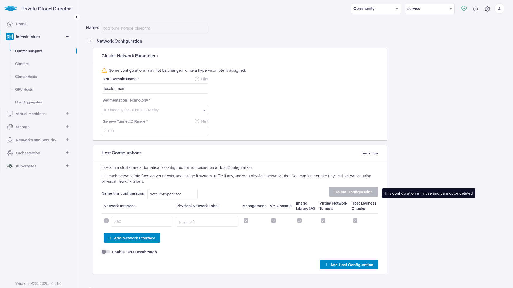

Under **Host Configuration**, add an entry (e.g., `default-hypervisor`) and map your management interface:

- **Interface:** `eth0` (or the interface carrying management traffic)
- **Physical Network Label:** `physnet1`
- **Traffic Types:** Management, VM Console, Image Library I/O, Virtual Network Tunnels, Host Liveness Checks

### 1.4 Configure Pure Storage Backend

Navigate to **Persistent Storage Connectivity** in the blueprint.

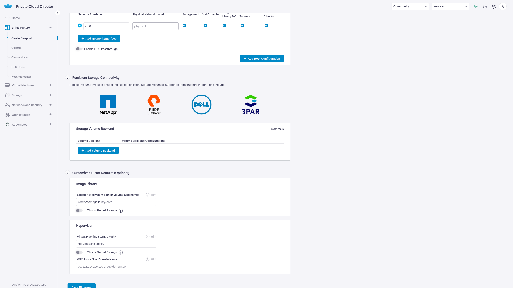

1. Click **+ Add Volume Backend** → Name it `pure-flasharray`
2. Click **+ Add Configuration** → Name it `pure-flasharray-backend`


3. Select the storage driver:

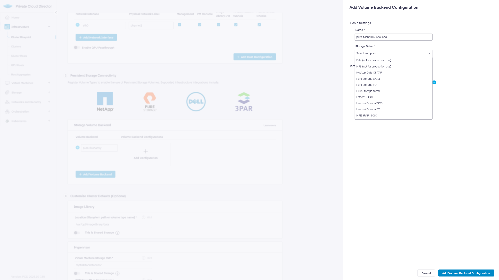

**Driver:** `Pure Storage ISCSI`

4. Configure the key-value pairs:


| Key | Value | Description |
|-----|-------|-------------|
| `san_ip` | `<PURE_STORAGE_IP>` | FlashArray management IP |
| `pure_api_token` | `<PURE_API_TOKEN>` | API authentication token |
| `pure_iscsi_cidr` | `0.0.0.0/0` | iSCSI network CIDR (use a specific CIDR in production) |
| `use_multipath_for_image_xfer` | `true` | **Required** — enables multipath for image transfers |
| `image_volume_cache_enabled` | `true` | Enable image volume caching |
| `image_volume_cache_max_count` | `50` | Maximum cached images |
| `image_volume_cache_max_size_gb` | `200` | Maximum cache size (GB) |
| `volumes_dir` | `/opt/pf9/etc/pf9-cindervolume-base/volumes/` | Volume storage directory |

5. Click **Save Blueprint**


---

## Step 2: Create a Cluster and Authorize Hosts

### 2.1 Create the Cluster

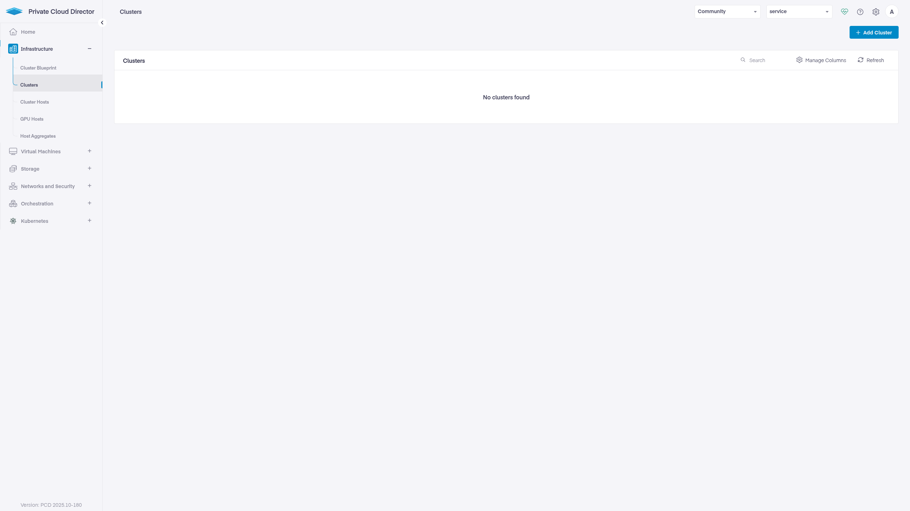

1. Navigate to **Infrastructure > Clusters**
2. Click **+ Add Cluster**

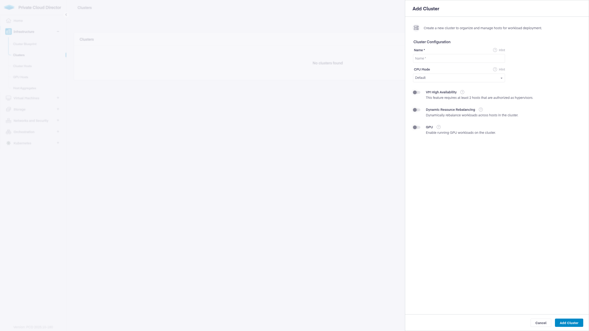

3. Enter a cluster name (e.g., `pcd-pure-cluster`) and click **Add Cluster**

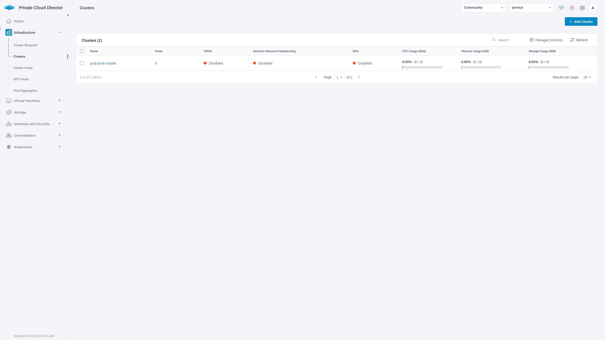

### 2.2 Authorize Hypervisors

Navigate to **Infrastructure > Cluster Hosts**. Newly discovered hypervisors appear as unauthorized.

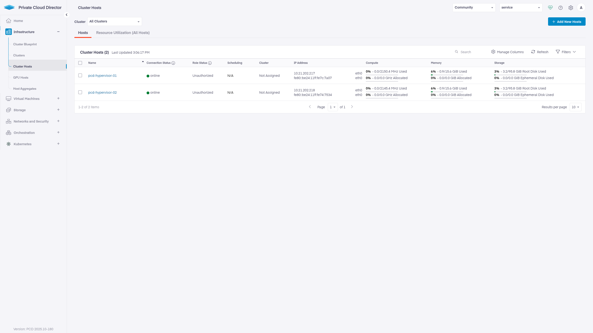

For **each** hypervisor:

1. Click the hypervisor name

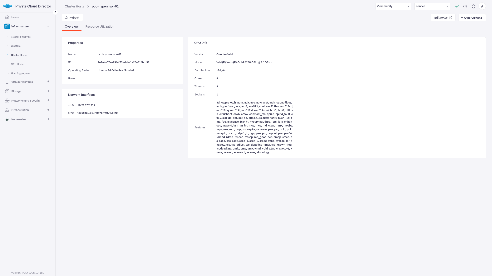

2. Click **Edit Roles**

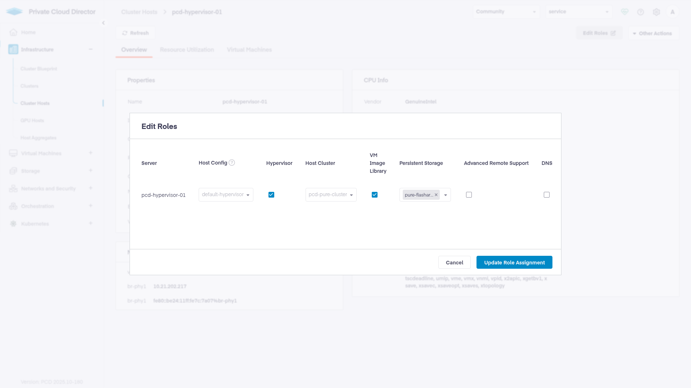

3. Configure:
   - **Host Config:** `default-hypervisor`
   - **Enable Roles:**
     - ✅ **Hypervisor** — required to run VMs
     - ✅ **Persistent Storage** — required to attach Pure Storage volumes
     - ✅ **Image Library** — required on at least one host to serve Glance images
   - **Assign to Cluster:** `pcd-pure-cluster`

4. Click **Update**

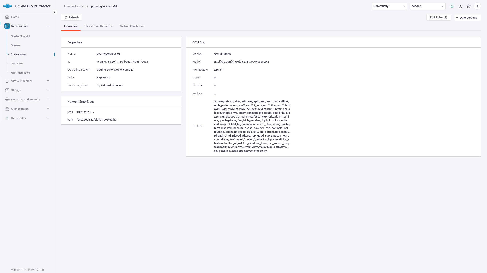

Repeat for all hypervisor nodes.

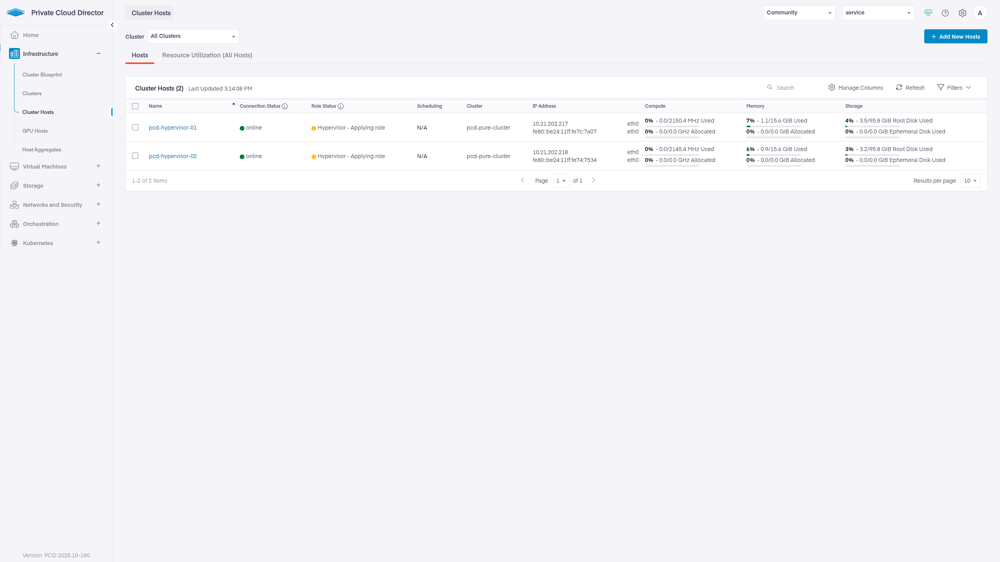

> **Production note:** The **Image Library** role needs to be enabled on at least one host. For production, use a shared image backend (NFS or Pure Storage-backed Glance) rather than local image storage on a single hypervisor.

---

## Step 3: Configure Multipath on Hypervisors

DM-Multipath must be configured on every hypervisor before Pure Storage volumes can be attached. Perform these steps on **all** hypervisor nodes.

### 3.1 Install Required Packages

```bash
sudo apt-get update
sudo apt-get install -y multipath-tools open-iscsi
```

### 3.2 Create `/etc/multipath.conf`

```conf
# /etc/multipath.conf — Pure Storage FlashArray configuration

defaults {
    user_friendly_names yes
    find_multipaths no
    polling_interval 10
}

blacklist {
    devnode "^(ram|raw|loop|fd|md|dm-|sr|scd|st)[0-9]*"
    devnode "^hd[a-z]"
    devnode "^cciss!c[0-9]d[0-9]*"
}

blacklist_exceptions {
    device {
        vendor "PURE"
        product "FlashArray"
    }
}

devices {
    device {
        vendor                "PURE"
        product               "FlashArray"
        path_selector         "service-time 0"
        path_grouping_policy  "group_by_prio"
        prio                  "alua"
        failback              "immediate"
        path_checker          "tur"
        hardware_handler      "1 alua"
        fast_io_fail_tmo      10
        dev_loss_tmo          60
        no_path_retry         0
    }
}
```

**Key settings explained:**

| Setting | Value | Reason |
|---------|-------|--------|
| `find_multipaths no` | Required for Pure Storage | Ensures all paths are discovered, not just the first one found |
| `blacklist` | All non-storage devices | Prevents multipath from managing system disks |
| `blacklist_exceptions` | `PURE / FlashArray` | Only Pure Storage devices are managed by multipath |
| `prio alua` | ALUA | Uses array-reported path priority for active/optimized selection |
| `fast_io_fail_tmo 10` | 10 seconds | Fail fast on a broken path; PCD re-routes I/O quickly |

### 3.3 Enable and Start Services

```bash
sudo systemctl enable multipathd open-iscsi iscsid
sudo systemctl restart multipathd open-iscsi iscsid
```

### 3.4 Validate Configuration

```bash
# Validate multipath configuration syntax
sudo multipath -t

# Check service status
sudo systemctl status multipathd --no-pager
sudo systemctl status open-iscsi --no-pager

# Check for multipath devices (none expected before volumes are attached)
sudo multipath -ll
```

### 3.5 Verify PCD Plugin Multipath Setting

In the PCD UI, navigate to **Infrastructure > Cluster Blueprint > Persistent Storage Connectivity** and confirm the `pure-flasharray-backend` configuration includes:

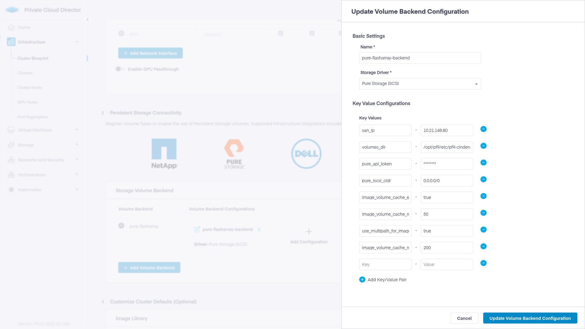

| Key | Required Value |
|-----|----------------|
| `use_multipath_for_image_xfer` | `true` |

This setting directs PCD to route all volume I/O through `/dev/mapper/mpatha` rather than raw block devices.

---

## Step 4: Upload an Image

Before deploying VMs, upload an image to the Image Library.

1. Navigate to **Virtual Machines > Images**
2. Click **+ Add Image**
3. Select your image file (e.g., `ubuntu-24.04-server-cloudimg-amd64.img`)

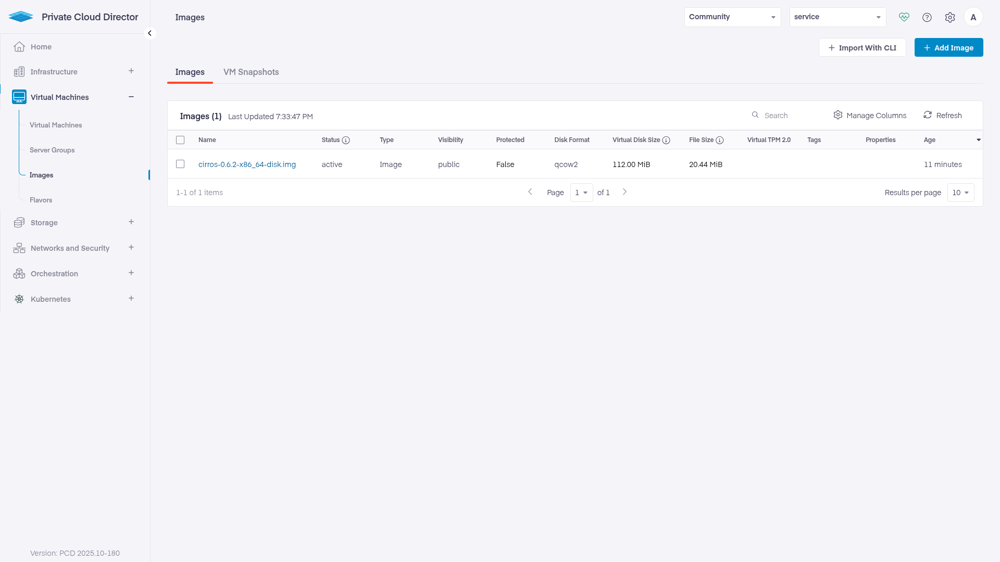

**Supported formats:** `qcow2`, `raw`, `vmdk`

---

## Step 5: Deploy a VM with a Pure Storage Boot Volume

### 5.1 Start the Deploy Wizard

Navigate to **Virtual Machines** and click **+ Deploy New VM**.

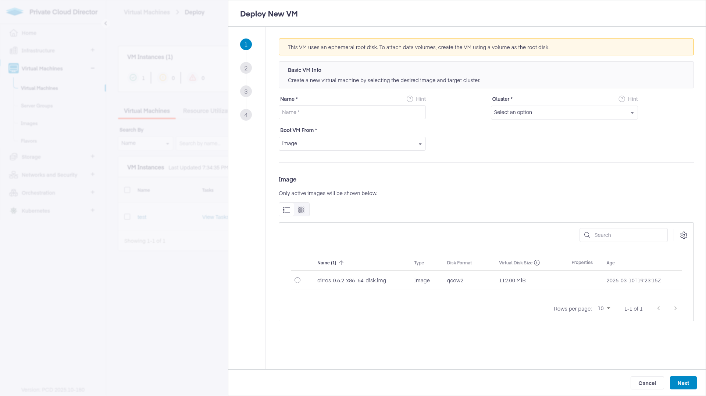

- **Name:** Choose a VM name
- **Cluster:** `pcd-pure-cluster`
- **Boot VM From:** `New Volume`

### 5.2 Configure Boot Volume

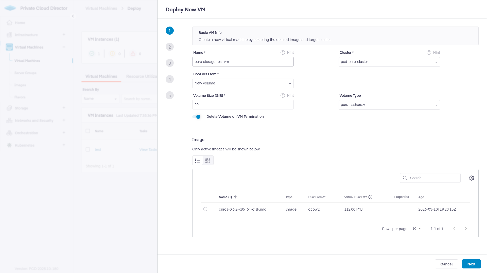

- **Volume Size:** Set appropriate size (e.g., `20 GiB`)
- **Volume Type:** `pure-flasharray`
- **Image:** Select your uploaded image
- **Delete Volume on VM Termination:** Enable for test VMs; disable for production

### 5.3 Attach Additional Volumes (Optional)

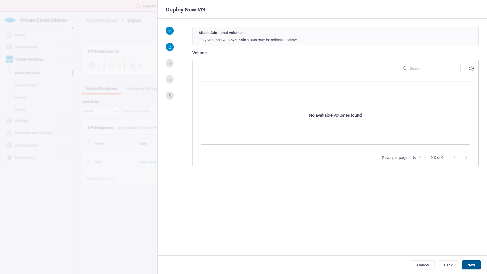

Additional data volumes can be attached at this step. Click **Next** to skip.

### 5.4 Select a Flavor

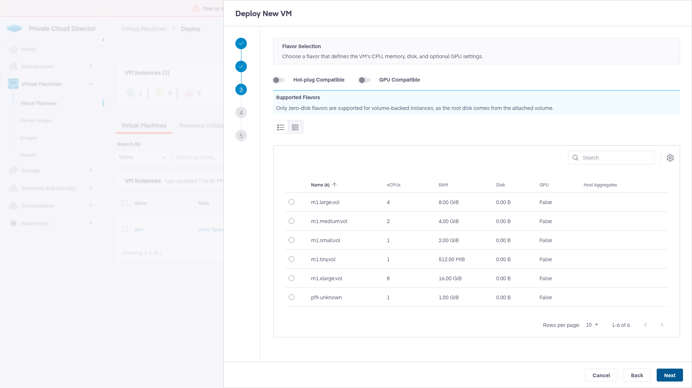

For volume-backed VMs, select a **zero-disk flavor** (disk size = 0). These are typically named with a `.vol` suffix in PCD.

### 5.5 Configure Networking

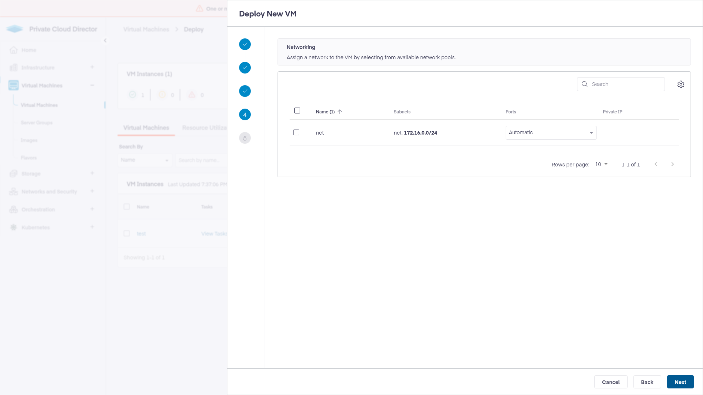

Select the network for the VM. Assign a static IP or use automatic port assignment.

### 5.6 Deploy

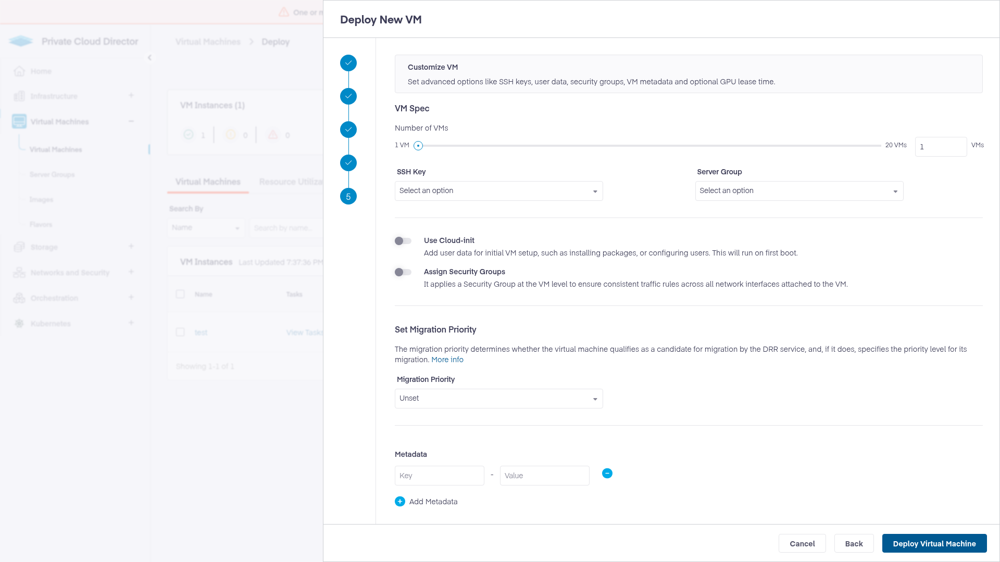

Review advanced options and click **Deploy Virtual Machine**.

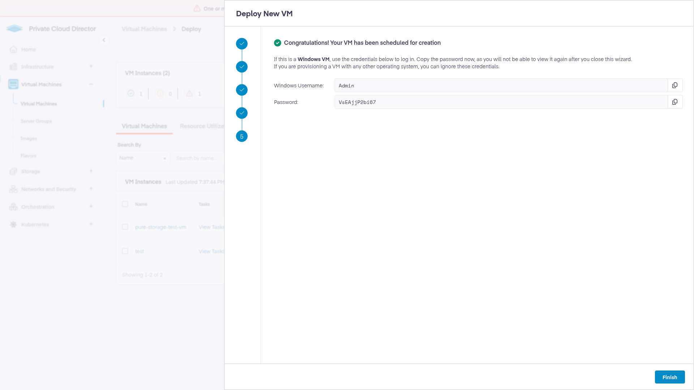

The VM is scheduled for creation. The boot volume is created on the FlashArray, formatted, and attached before the VM boots.

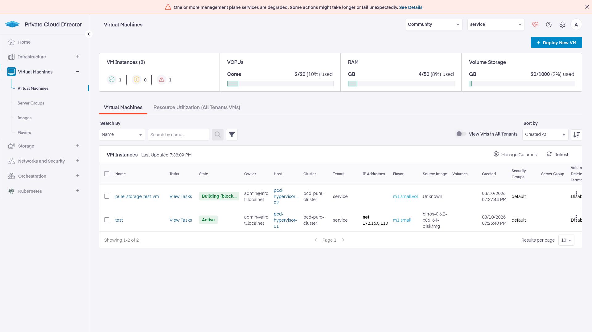

---

## Step 6: Verify the Integration

After the VM is running, SSH to the hypervisor where it was placed (visible in the VM details) and verify the iSCSI and multipath configuration.

### Check iSCSI Sessions

```bash
sudo iscsiadm -m session
```

**Expected:** Multiple sessions to the FlashArray target IQN (one per iSCSI port/path).

```
tcp: [1] <PURE_STORAGE_IP>:3260,1 iqn.2010-06.com.purestorage:flasharray.<SERIAL> (non-flash)
tcp: [2] <PURE_STORAGE_IP>:3260,2 iqn.2010-06.com.purestorage:flasharray.<SERIAL> (non-flash)
```

### Check Multipath Devices

```bash
sudo multipath -ll
```

**Expected:** A multipath device with multiple active paths for each attached volume.

```
mpatha (360002ac000000000000000000000001) dm-0 PURE,FlashArray
size=20G features='1 queue_if_no_path' hwhandler='1 alua' wp=rw
|-+- policy='service-time 0' prio=50 status=active
| `- 3:0:0:0 sdb 8:16 active ready running
`-+- policy='service-time 0' prio=10 status=enabled
  `- 4:0:0:0 sdc 8:32 active ready running
```

- `prio=50` — active/optimized path (preferred)
- `prio=10` — active/non-optimized path (standby)
- Both paths `active ready running` — healthy multipath

### Check Block Devices

```bash
lsblk
```

```
sdb       8:16   0   20G  0 disk
└─mpatha 253:0    0   20G  0 mpath
sdc       8:32   0   20G  0 disk
└─mpatha 253:0    0   20G  0 mpath
```

### Confirm Pure Storage Device Detection

```bash
sudo lsscsi | grep PURE
```

```
[3:0:0:0]    disk    PURE     FlashArray       1.0   /dev/sdb
[4:0:0:0]    disk    PURE     FlashArray       1.0   /dev/sdc
```

---

## Troubleshooting

### No multipath devices visible (`multipath -ll` shows nothing)

This is expected when no Pure Storage volumes are attached. Attach a volume via PCD, then recheck.

### `multipathd` fails to start

```bash
sudo multipath -t          # Validate configuration syntax
sudo journalctl -u multipathd -n 50  # Check logs for errors
```

Verify `/etc/multipath.conf` has no syntax errors and that `find_multipaths no` is set.

### Only one iSCSI path visible

```bash
# Check network connectivity to FlashArray iSCSI ports
ping <PURE_STORAGE_IP>

# Restart iSCSI services and re-discover
sudo systemctl restart open-iscsi iscsid
sudo iscsiadm -m discovery -t sendtargets -p <PURE_STORAGE_IP>
sudo iscsiadm -m node --loginall=all
```

Verify that the hypervisor has network access to all configured iSCSI ports on the FlashArray.

### Paths show as `failed` or `faulty`

```bash
sudo multipath -ll          # Identify failed paths
sudo journalctl -u multipathd -f  # Watch live path events
sudo multipath -r           # Force path re-evaluation
```

Check physical network connectivity and FlashArray port status.

### Volume type `pure-flasharray` not available in VM deploy wizard

- Verify the blueprint was saved successfully with the Pure Storage backend configured
- Verify the cluster was created using that blueprint
- Verify the **Persistent Storage** role is applied on the hypervisor

---

## Architecture Summary

```
PCD Controller
     │
     ▼
Cluster Blueprint ──► pure-flasharray backend (Pure Storage ISCSI driver)
     │
     ▼
pcd-pure-cluster
     ├── pcd-hypervisor-01  (Hypervisor + Persistent Storage + Image Library)
     │        └── /etc/multipath.conf  →  /dev/mapper/mpatha ──► FlashArray vol
     └── pcd-hypervisor-02  (Hypervisor + Persistent Storage)
              └── /etc/multipath.conf  →  /dev/mapper/mpatha ──► FlashArray vol
                                                                        │
                                                            Pure Storage FlashArray
                                                            iSCSI (multi-path, ALUA)
```

---

## References

- [Platform9 PCD Documentation](https://platform9.com/docs/private-cloud-director/)
- [Pure Storage Linux Recommended Settings](https://support.purestorage.com/Solutions/Linux/Reference/Linux_Recommended_Settings)
- [Linux DM-Multipath Documentation](https://www.kernel.org/doc/html/latest/admin-guide/device-mapper/dm-multipath.html)
