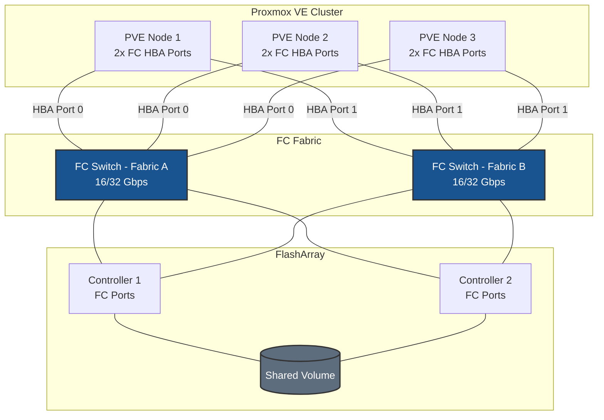

# Fibre Channel on Proxmox VE - Best Practices Guide

Comprehensive best practices for deploying Fibre Channel storage on Proxmox VE clusters in production environments.

---



---

## Table of Contents
- [Architecture Overview](#architecture-overview)
- [Proxmox VE-Specific Considerations](#proxmox-ve-specific-considerations)
- [Fabric & Zoning Guidance](#fabric--zoning-guidance)
- [FC Architecture](#fc-architecture)
- [Multipath Configuration](#multipath-configuration)
- [Performance Tuning](#performance-tuning)
- [High Availability](#high-availability)
- [Monitoring & Maintenance](#monitoring--maintenance)
- [Security](#security)
- [Troubleshooting](#troubleshooting)

---

## Architecture Overview

### Deployment Topology



**Key points for Proxmox VE:**
- All cluster nodes must have HBAs installed and zoned — a shared LVM storage pool requires every node to see the device
- Use a single consistent WWID-based device path (`/dev/mapper/<wwid>`) rather than `mpatha` — the alias may differ between nodes
- The Proxmox storage framework adds the LVM storage at the cluster level; Proxmox replicates the `pvesm` configuration to all nodes automatically

---

## Proxmox VE-Specific Considerations

### Proxmox is Debian-Based

Proxmox VE runs on Debian. Package management and HBA driver loading follow the same patterns as [Debian FC Best Practices](../../debian/fc/BEST-PRACTICES.md):

```bash
apt install -y multipath-tools sg3-utils sysfsutils
```

### All Nodes Must Be Configured Before Creating the Datastore

The Proxmox storage UI will not display the FC block device in the LVM datastore wizard unless **every node in the cluster** reports the multipath device. There is no error message — the device simply does not appear.

**Before creating the datastore, verify on each node:**
```bash
multipath -ll    # Must show the FC device on every node
```

### Use WWID-Based Device Path for LVM

When creating the LVM physical volume, use the WWID-based path from `/dev/mapper/` — not the `mpatha` alias. The alias name is assigned locally and may differ between nodes; the WWID is consistent.

```bash
# Find the WWID-based path
multipath -ll
# Example: mpatha (3624a937abc123...) dm-0 PURE,FlashArray

# Use the WWID path for LVM
pvcreate /dev/mapper/3624a937abc123...
vgcreate vg_fc /dev/mapper/3624a937abc123...
```

### Proxmox HA and FC Storage

For Proxmox HA to migrate VMs across nodes using FC storage:

- The FC volume must be added as a **shared** storage pool (`--shared 1` in `pvesm`)
- All nodes must have active multipath paths to the volume at all times
- Proxmox HA uses STONITH fencing — ensure your cluster has a working fencing device so HA can safely recover VMs from a failed node

---

## Fabric & Zoning Guidance

### Single-Initiator Zoning (Required)

Each node's HBA WWPNs must be in their own zones. Register all cluster node WWPNs in the same host group on the FlashArray so the shared volume is accessible from every node.

**Correct pattern:**
```
Zone: pve-node1-hba0-to-array
  Members: pve-node1-wwpn-hba0, array-ct0-port0, array-ct0-port1, array-ct1-port0, array-ct1-port1

Zone: pve-node1-hba1-to-array
  Members: pve-node1-wwpn-hba1, array-ct0-port2, array-ct0-port3, array-ct1-port2, array-ct1-port3
```

Repeat for each cluster node.

### Discovering WWPNs on All Nodes

```bash
# Run on each node and collect all WWPNs for SAN admin
hostname && cat /sys/class/fc_host/host*/port_name
```

---

## FC Architecture

```
FC Fabric
  └── HBA Driver (lpfc / qla2xxx)
        └── SCSI Mid-Layer
              └── SCSI Disk (sdX — one per path)
                    └── dm-multipath
                          └── /dev/mapper/<wwid>  ← use this for LVM
                                └── LVM Volume Group (vg_fc)
                                      └── Proxmox LVM Storage Pool
```

---

## Multipath Configuration

### Configure on Every Node

```bash
sudo systemctl enable --now multipathd
```

`/etc/multipath.conf` must be identical on all cluster nodes. Consider using a configuration management tool (Ansible, Puppet, Salt) to deploy and keep it in sync.

```bash
tee /etc/multipath.conf > /dev/null <<'EOF'
defaults {
    find_multipaths         no
    polling_interval        10
    path_selector           "service-time 0"
    path_grouping_policy    group_by_prio
    failback                immediate
    no_path_retry           0
}

blacklist {
    devnode "^(ram|raw|loop|fd|md|dm-|sr|scd|st|nvme)[0-9]*"
    devnode "^sd[a]$"
    devnode "^vd[a-z]"
}

#devices {
#    device {
#        vendor               "VENDOR"
#        product              "PRODUCT"
#        path_selector        "service-time 0"
#        hardware_handler     "1 alua"
#        path_grouping_policy group_by_prio
#        prio                 alua
#        failback             immediate
#        path_checker         tur
#        fast_io_fail_tmo     5
#        dev_loss_tmo         60
#        no_path_retry        0
#    }
#}
EOF

systemctl restart multipathd
multipath -ll
```

---

## Performance Tuning

### HBA Queue Depth (Debian/Proxmox)

**Emulex (lpfc):**
```bash
tee /etc/modprobe.d/lpfc.conf > /dev/null <<'EOF'
options lpfc lpfc_lun_queue_depth=64
EOF
update-initramfs -u
reboot
```

**QLogic (qla2xxx):**
```bash
tee /etc/modprobe.d/qla2xxx.conf > /dev/null <<'EOF'
options qla2xxx ql2xmaxqdepth=64
EOF
update-initramfs -u
reboot
```

> Apply to **all cluster nodes** before creating the datastore.

### Device-Level Queue Depth

```bash
tee /etc/udev/rules.d/99-pure-fc-queue-depth.rules > /dev/null <<'EOF'
ACTION=="add|change", SUBSYSTEM=="block", ATTRS{model}=="FlashArray*", ATTR{device/queue_depth}="64"
EOF
udevadm control --reload-rules
udevadm trigger
```

---

## High Availability

### FC and Proxmox HA

Proxmox HA monitors VM and container availability. When a node fails, HA automatically restarts VMs on surviving nodes — but only if:

1. The FC storage pool is marked **shared** in Proxmox
2. Surviving nodes have active multipath paths to the volume
3. The failed node is fenced (STONITH) so the HA manager can safely start the VMs elsewhere

### Path Redundancy

| Parameter | Recommended | Effect |
|-----------|-------------|--------|
| `fast_io_fail_tmo` | 5 seconds | Fast path failure detection for quick HA failover |
| `dev_loss_tmo` | 60 seconds | Device retention during transient fabric events |
| `failback` | `immediate` | Use optimized paths as soon as controller failover resolves |

> **Why `fast_io_fail_tmo 5` here, when the iSCSI guidance uses `10`?** FC is
> expected to be more stable than Ethernet, and the fabric reports link-down
> directly (RSCN) rather than relying on a keepalive probe to time out. FC
> therefore has no `noop_out_*` equivalent: path failure is detected almost
> immediately, so a shorter `fast_io_fail_tmo` is safe and gives faster failover.
>
> The practical consequence is that the same `no_path_retry` value buys **less**
> tolerance on FC than on iSCSI — roughly `fast_io_fail_tmo + (no_path_retry x
> polling_interval)`, so about 5 s at `no_path_retry 0` and 55 s at `5`, against
> ~20 s and ~70 s on iSCSI. Size `no_path_retry` for the transport, not by copying
> the iSCSI value.

### Testing Path Failover

```bash
# Test on one node at a time — do not test all nodes simultaneously
echo offline | tee /sys/block/sdb/device/state
multipath -ll
echo running | tee /sys/block/sdb/device/state
```

---

## Monitoring & Maintenance

### Per-Node Verification

```bash
# Check HBA link state
cat /sys/class/fc_host/host*/port_state

# Check multipath — run on every node
multipath -ll

# Check for path errors
cat /sys/class/fc_host/host*/link_failure_count
```

### Proxmox Storage Status

```bash
pvesm status
# or in the GUI: Datacenter → Storage
```

---

## Security

Fibre Channel security is implemented at the fabric level — no host-level firewall is required for FC storage traffic.

1. **Fabric zoning** — primary access control
2. **LUN masking / host registration** — enforced by the storage array based on WWPN and host group
3. **Hard zoning** — enforce at the switch port level

**Cluster-specific note:** All cluster node WWPNs should be in the same host group on the FlashArray. Avoid creating separate host groups per node for the same shared volume — this can cause inconsistent LUN numbering across nodes and confuse LVM.



---

## Troubleshooting

### Datastore Not Visible in Proxmox GUI

The FC block device must be visible on **every cluster node** before the `pvesm` LVM datastore will appear. Check all nodes:

```bash
# Run on each node
multipath -ll | grep PURE
```

If any node shows no devices, complete the HBA verification, zoning, and multipath configuration steps on that node before retrying.

### LUNs Not Appearing After Rescan

```bash
cat /sys/class/fc_host/host*/port_state
cat /sys/class/fc_host/host*/link_failure_count

rescan-scsi-bus.sh -a -r
lsscsi
multipath -ll
```

### Fewer Than Expected Paths

```bash
for h in /sys/class/fc_host/host*; do
    echo "$h: $(cat $h/port_state) — WWPN: $(cat $h/port_name)"
done
```

### Path Flapping

```bash
cat /sys/class/fc_host/host*/link_failure_count
cat /sys/class/fc_host/host*/loss_of_signal_count
journalctl -k | grep -i "fc\|scsi" | tail -50
```
