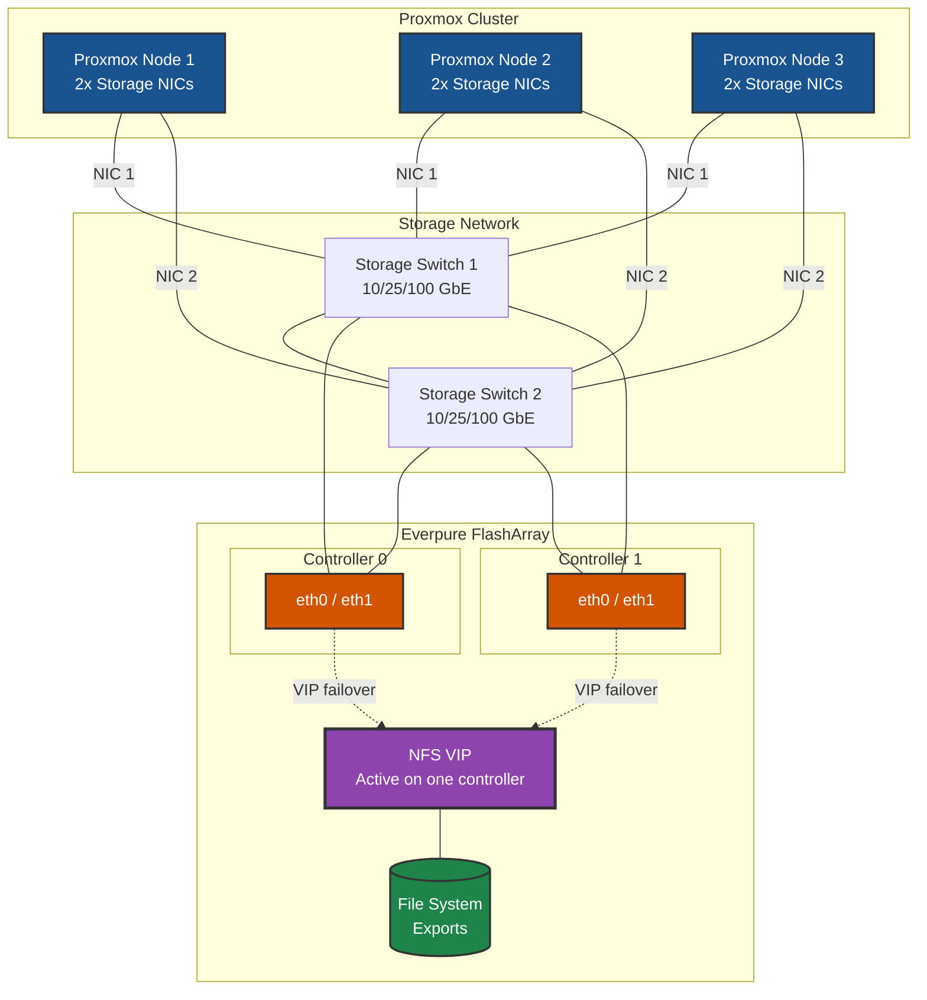

# NFS on Proxmox VE - Best Practices Guide

Comprehensive best practices for deploying NFS storage on Proxmox VE in production environments.

> **Related Guides:** For block storage alternatives, see:
> - [iSCSI Best Practices](../iscsi/BEST-PRACTICES.md)
> - [NVMe-TCP Best Practices](../nvme-tcp/BEST-PRACTICES.md)

---



---

## Table of Contents
- [Architecture Overview](#architecture-overview)
- [Proxmox VE-Specific Considerations](#proxmox-ve-specific-considerations)
- [Network Design](#network-design)
- [NFS Configuration](#nfs-configuration)
- [High Availability & Redundancy](#high-availability--redundancy)
- [Performance Optimization](#performance-optimization)
- [Security Best Practices](#security-best-practices)
- [Monitoring & Maintenance](#monitoring--maintenance)
- [Troubleshooting](#troubleshooting)

---

## Architecture Overview

### Reference Architecture

A production-grade NFS deployment for Proxmox VE consists of:

- **Proxmox Cluster**: 3+ nodes for high availability
  - *Why*: Minimum 3 nodes required for Proxmox HA quorum; allows maintenance without downtime

- **Dedicated Storage Network**: Isolated network infrastructure for storage traffic
  - *Why*: Prevents storage I/O contention with other traffic; ensures predictable performance

- **NFS Storage Array**: Enterprise storage with NFSv4.1 support
  - *Why*: NFSv4.1 provides session trunking, improved locking, and better performance

- **Redundant Network Paths**: Multiple NICs for failover and load balancing
  - *Why*: NFS over TCP handles path failover natively; provides network redundancy

### Deployment Topology





```bash
# Verify NFS mount is using the VIP
mount | grep nfs

# Check for any NFS errors during failover
dmesg | grep -i nfs
```

---

## Proxmox VE-Specific Considerations

### Proxmox VE Overview

**Key Characteristics:**
- Debian-based virtualization platform (current versions based on Debian 12 Bookworm)
- Native NFS storage support in the web interface
- Built-in clustering and HA capabilities
- Supports both KVM VMs and LXC containers on NFS

**Recommended Versions:**
- **Proxmox VE**: 8.x or later (based on Debian 12)
- **NFS Version**: NFSv4.1 (recommended for Pure FlashArray)

### Package Management

**NFS client is typically pre-installed. Verify or install:**
```bash
# Check NFS utilities
dpkg -l | grep nfs-common

# Install if needed
apt update
apt install -y nfs-common

# Verify NFS version support
cat /proc/fs/nfsd/versions
```

### Proxmox Storage Types for NFS

Proxmox supports NFS for the following content types:

| Content Type | Description | Recommended |
|--------------|-------------|-------------|
| **images** | VM disk images (qcow2, raw) | ✓ Yes |
| **rootdir** | Container root directories | ✓ Yes |
| **vztmpl** | Container templates | ✓ Yes |
| **iso** | ISO images | ✓ Yes |
| **backup** | VM/CT backups (vzdump) | ✓ Yes |
| **snippets** | Configuration snippets | ✓ Yes |

---

## Network Design

### Network Architecture Principles

1. **Dedicated Storage Network**: Always use dedicated physical or VLAN-isolated networks
   - *Why*: Isolates storage I/O from other traffic; ensures predictable performance

2. **Redundant Network Paths**: Use bonding/LACP for NIC redundancy
   - *Why*: NFS relies on TCP; bonded interfaces provide automatic failover

3. **Proper Segmentation**: Separate storage traffic from management and VM traffic
   - *Why*: Prevents bandwidth contention; simplifies troubleshooting

4. **Optimized MTU**: Use jumbo frames (MTU 9000) end-to-end
   - *Why*: Reduces CPU overhead; improves throughput for large transfers

### Proxmox Network Configuration (ifupdown2)

Proxmox uses `ifupdown2` for network configuration via `/etc/network/interfaces`.

#### Option 1: Bonded Interfaces (Recommended for NFS)

**Configuration in `/etc/network/interfaces`:**
```bash
# Physical NICs for storage bond
auto ens1f0
iface ens1f0 inet manual
    mtu 9000

auto ens1f1
iface ens1f1 inet manual
    mtu 9000

# Storage bond (LACP mode 4)
auto bond0
iface bond0 inet static
    address 10.100.1.101/24
    bond-slaves ens1f0 ens1f1
    bond-mode 802.3ad
    bond-miimon 100
    bond-xmit-hash-policy layer3+4
    mtu 9000
```

**Apply configuration:**
```bash
# Reload networking (ifupdown2 allows without reboot)
ifreload -a

# Verify bond status
cat /proc/net/bonding/bond0
```

#### Option 2: Active-Backup Bonding (No LACP Required)

```bash
# Storage bond (active-backup)
auto bond0
iface bond0 inet static
    address 10.100.1.101/24
    bond-slaves ens1f0 ens1f1
    bond-mode active-backup
    bond-miimon 100
    bond-primary ens1f0
    mtu 9000
```



**Verify traffic distribution on Proxmox:**
```bash
# Check per-interface statistics on the bond
cat /proc/net/bonding/bond0

# Watch traffic on each interface
watch -n 1 "cat /sys/class/net/ens1f0/statistics/tx_bytes; cat /sys/class/net/ens1f1/statistics/tx_bytes"
```

> **📘 Tip:** If predictable failover is more important than load distribution, consider **active-backup** bonding instead. It provides clear failover behavior without the complexity of hash-based distribution.

### MTU Configuration

**Verify MTU end-to-end:**
```bash
# Check interface MTU
ip link show bond0 | grep mtu

# Test MTU to NFS server (9000 - 28 byte header = 8972)
ping -M do -s 8972 <NFS_SERVER_IP>
```

**Important:** MTU must be 9000 end-to-end (host → switch → storage).

---

## NFS Configuration

### FlashArray NFS Export Configuration

**On the Everpure FlashArray, configure:**

1. **File Interface**: Create or use existing NFS file interface
2. **Export Policy**:
   - Enable NFSv4.1 (recommended)
   - Disable NFSv3 if not needed
   - Configure allowed client IPs/subnets
3. **Export Rules**:
   - Enable `no_root_squash` for Proxmox hosts
   - Set appropriate read/write permissions
4. **Quota Policy**: Configure as needed for capacity management

### Adding NFS Storage to Proxmox

#### Via GUI (Recommended)

1. Navigate to **Datacenter → Storage → Add → NFS**
2. Configure settings:

| Field | Recommended Value |
|-------|-------------------|
| **ID** | `pure-nfs` (descriptive name) |
| **Server** | FlashArray NFS interface IP |
| **Export** | Export path (e.g., `/proxmox/vms`) |
| **Content** | Select based on use case |
| **NFS Version** | `4.1` |

#### Via CLI

```bash
# Add NFS storage with all content types and recommended options
pvesm add nfs pure-nfs \
    --server <NFS_SERVER_IP> \
    --export /proxmox/vms \
    --content images,rootdir,vztmpl,iso,backup,snippets \
    --options vers=4.1,hard,timeo=300,retrans=2,nconnect=4,noatime,nodiratime

# Verify
pvesm status
```

### NFS Mount Options

**Recommended mount options for production:**

| Option | Value | Description |
|--------|-------|-------------|
| `vers` | `4.1` | Use NFSv4.1 for improved locking and performance |
| `nconnect` | `4-8` | Multiple TCP connections per mount (see below) |
| `noatime` | — | Don't update access times (reduces metadata I/O) |
| `nodiratime` | — | Don't update directory access times |

```bash
# View current mount options
mount | grep <storage_id>
```

**Configure via pvesm:**
```bash
pvesm set pure-nfs --options "vers=4.1,hard,timeo=300,retrans=2,nconnect=4,noatime,nodiratime"
```

### nconnect for Improved Throughput

The `nconnect` mount option (available in Linux kernel 5.3+) allows multiple TCP connections to be established for a single NFS mount. This significantly improves throughput on high-speed networks by parallelizing I/O operations across multiple connections.

**Benefits:**
- **Higher throughput**: Parallelizes I/O across multiple TCP connections
- **Better utilization**: Makes better use of high-bandwidth links (25GbE, 100GbE)
- **Reduced latency**: Multiple in-flight operations reduce head-of-line blocking

**Recommended values:**

| Network Speed | nconnect Value |
|---------------|----------------|
| 10 GbE | 2-4 |
| 25 GbE | 4-8 |
| 100 GbE | 8-16 |

**Configure nconnect:**
```bash
# Add new storage with all recommended options
pvesm add nfs pure-nfs \
    --server <NFS_SERVER_IP> \
    --export /proxmox/vms \
    --content images,rootdir,vztmpl,iso,backup,snippets \
    --options vers=4.1,hard,timeo=300,retrans=2,nconnect=4,noatime,nodiratime

# Update existing storage
pvesm set pure-nfs --options "vers=4.1,hard,timeo=300,retrans=2,nconnect=4,noatime,nodiratime"
```

**Verify nconnect is active:**
```bash
# Check mount options
mount | grep pure-nfs

# Verify multiple connections
cat /proc/fs/nfsfs/servers

# Check number of xprt connections
grep -r "" /sys/kernel/sunrpc/nfs/*/xprt_info 2>/dev/null | head
```

> **⚠️ Note:** After changing mount options, you may need to unmount and remount the storage, or restart the affected nodes for changes to take effect.

---

## High Availability & Redundancy

### Storage Redundancy

NFS high availability is achieved through:

1. **Network Bonding**: Bonded interfaces on Proxmox hosts
2. **Storage Array HA**: FlashArray controller redundancy
3. **Multiple NFS Interfaces**: Failover at the storage level

### Proxmox HA Configuration

**Enable HA for VMs on NFS storage:**

1. Ensure NFS storage is available on all cluster nodes
2. Configure HA groups and resources:

```bash
# Create HA group
ha-manager groupadd prodgroup --nodes pve1,pve2,pve3

# Add VM to HA
ha-manager add vm:<vmid> --group prodgroup --state started
```

### Verifying Storage Availability

```bash
# Check storage status across all nodes
pvesm status

# Verify NFS mounts on each node
for node in pve1 pve2 pve3; do
    ssh $node "mount | grep nfs"
done
```

---

## Performance Optimization

### NFS Client Tuning

**Kernel parameters for NFS performance:**

```bash
cat > /etc/sysctl.d/99-nfs-tuning.conf << 'EOF'
# NFS performance tuning

# Increase socket buffer sizes
net.core.rmem_max = 16777216
net.core.wmem_max = 16777216
net.core.rmem_default = 1048576
net.core.wmem_default = 1048576

# TCP tuning for NFS
net.ipv4.tcp_rmem = 4096 1048576 16777216
net.ipv4.tcp_wmem = 4096 1048576 16777216

# Reduce TCP latency
net.ipv4.tcp_low_latency = 1
EOF

sysctl -p /etc/sysctl.d/99-nfs-tuning.conf
```

### NFS Read/Write Size Tuning

NFSv4.1 typically negotiates optimal values automatically. Verify with:

```bash
# Check current NFS mount parameters
nfsstat -m

# Look for rsize and wsize values
# Recommended: rsize=1048576,wsize=1048576 (1MB)
```

### Performance Monitoring

```bash
# Monitor NFS statistics
nfsstat -c

# Watch NFS operations in real-time
watch -n 1 "nfsstat -c | head -20"

# Check for NFS latency issues
nfsiostat 1 5
```

---

## Security Best Practices

### Network Security

1. **Isolate Storage Traffic**: Use dedicated VLANs for NFS
2. **Firewall Rules**: Restrict NFS access to known hosts
3. **No Public Access**: Never expose NFS to untrusted networks

### Export Security

**On FlashArray:**
- Limit exports to specific IP addresses or subnets
- Use `no_root_squash` only for trusted Proxmox hosts
- Review export permissions regularly

### Proxmox Firewall

**If using pve-firewall, allow NFS traffic:**

```bash
# In /etc/pve/firewall/cluster.fw
[RULES]
IN ACCEPT -source 10.100.1.0/24 -p tcp -dport 2049 -log nolog
IN ACCEPT -source 10.100.1.0/24 -p tcp -dport 111 -log nolog
```

---

## Monitoring & Maintenance

### Regular Health Checks

```bash
# Check NFS mount status
mount | grep nfs

# Verify storage is accessible
pvesm status

# Check for stale mounts
df -h | grep nfs

# View NFS statistics
nfsstat -c
```

### Automated Monitoring Script

```bash
#!/bin/bash
# /usr/local/bin/check-nfs-health.sh

STORAGE_ID="pure-nfs"
MOUNT_POINT="/mnt/pve/$STORAGE_ID"

# Check if mounted
if ! mountpoint -q "$MOUNT_POINT"; then
    echo "ERROR: NFS storage $STORAGE_ID not mounted!"
    exit 1
fi

# Check if accessible
if ! ls "$MOUNT_POINT" > /dev/null 2>&1; then
    echo "ERROR: NFS storage $STORAGE_ID not accessible!"
    exit 1
fi

# Check Proxmox storage status
if ! pvesm status | grep -q "$STORAGE_ID.*active"; then
    echo "WARNING: Storage $STORAGE_ID not showing as active"
    exit 1
fi

echo "OK: NFS storage $STORAGE_ID healthy"
exit 0
```

---

## Troubleshooting

### Common Issues

#### NFS Mount Fails

```bash
# Check network connectivity
ping <NFS_SERVER_IP>
nc -zv <NFS_SERVER_IP> 2049

# Check exports
showmount -e <NFS_SERVER_IP>

# Check system logs
journalctl -u pve-storage -n 50
dmesg | grep -i nfs
```

#### Stale NFS Handle

```bash
# Symptoms: "Stale NFS file handle" errors

# Force remount
umount -f /mnt/pve/<storage_id>
pvesm set <storage_id> --disable 0

# Or restart storage service
systemctl restart pvestatd
```

#### Performance Issues

```bash
# Check NFS statistics for retransmissions
nfsstat -c | grep retrans

# High retransmissions indicate network issues

# Check for slow operations
nfsiostat -h 1 10
```

### Diagnostic Commands

| Command | Purpose |
|---------|---------|
| `pvesm status` | Check storage status |
| `mount \| grep nfs` | View NFS mounts |
| `nfsstat -c` | NFS client statistics |
| `nfsiostat 1` | Real-time NFS I/O stats |
| `showmount -e <server>` | List exports |
| `rpcinfo -p <server>` | RPC service info |

---

## Quick Reference

### Essential Commands

```bash
# Storage management
pvesm status                    # List all storage
pvesm add nfs <id> ...          # Add NFS storage
pvesm set <id> --disable 0      # Enable storage
pvesm set <id> --disable 1      # Disable storage
pvesm remove <id>               # Remove storage

# NFS diagnostics
showmount -e <server>           # List exports
nfsstat -c                      # Client statistics
nfsstat -m                      # Mount information
mount | grep nfs                # Current mounts

# Network verification
ping -M do -s 8972 <server>     # Test MTU
nc -zv <server> 2049            # Test NFS port
```

### Configuration Files

| File | Purpose |
|------|---------|
| `/etc/pve/storage.cfg` | Proxmox storage configuration |
| `/etc/network/interfaces` | Network configuration |
| `/etc/sysctl.d/99-nfs-tuning.conf` | NFS kernel tuning |

---

## Next Steps

- [NFS Quick Start](./QUICKSTART.md) - Get started quickly
- [iSCSI Best Practices](../iscsi/BEST-PRACTICES.md) - Block storage alternative
- [NVMe-TCP Best Practices](../nvme-tcp/BEST-PRACTICES.md) - High-performance storage

