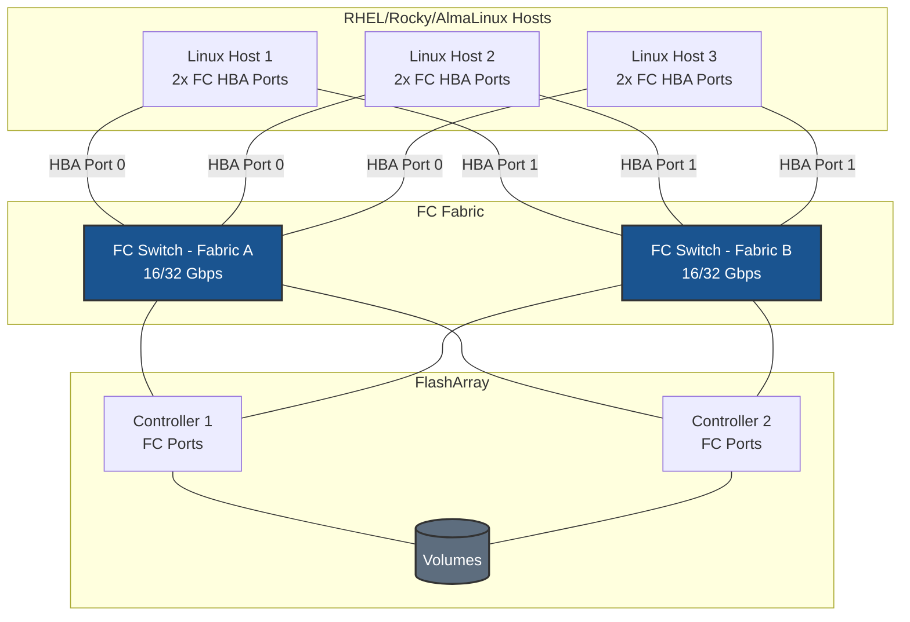
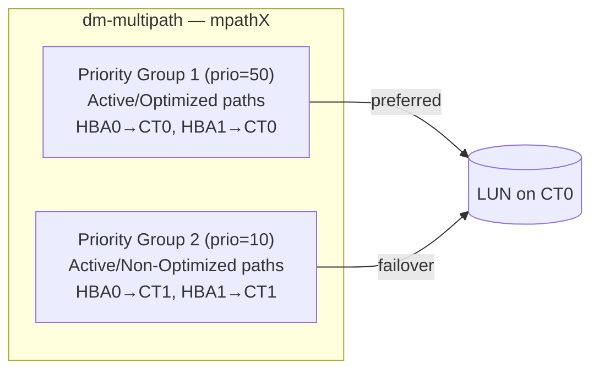
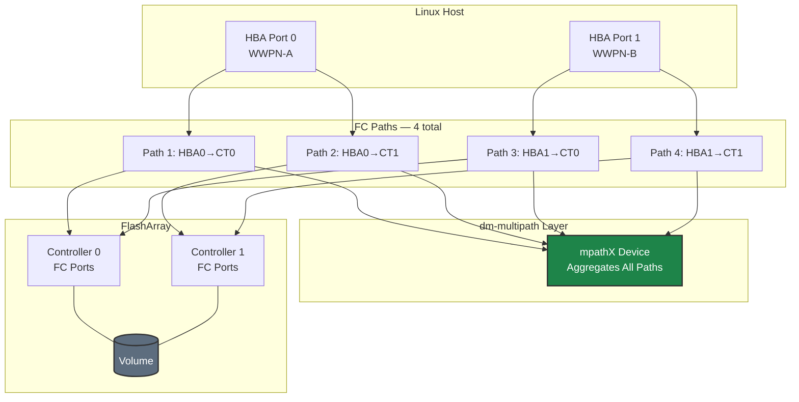

# Fibre Channel on RHEL/Rocky/AlmaLinux - Best Practices Guide

Comprehensive best practices for deploying Fibre Channel storage on RHEL-based systems in production environments.

---



---

## Table of Contents
- [Architecture Overview](#architecture-overview)
- [RHEL-Specific Considerations](#rhel-specific-considerations)
- [Fabric & Zoning Guidance](#fabric--zoning-guidance)
- [SELinux Configuration](#selinux-configuration)
- [FC Architecture](#fc-architecture)
- [Multipath Configuration](#multipath-configuration)
- [Performance Tuning](#performance-tuning)
- [High Availability](#high-availability)
- [Monitoring & Maintenance](#monitoring--maintenance)
- [Security](#security)
- [Troubleshooting](#troubleshooting)

---

## Architecture Overview

### Deployment Topology



**Key points for RHEL:**
- Dual-fabric topology (Fabric A and Fabric B) required for redundancy
- Each HBA port connects to a separate fabric — never both ports to the same switch
- Minimum 2×2 topology (2 HBA ports × 2 array controller ports = 4 paths)
- No IP or network configuration required on the host for FC storage traffic

---

## RHEL-Specific Considerations

### Subscription Management

**Red Hat Enterprise Linux:**
```bash
# Register system
sudo subscription-manager register --username <username>

# Attach subscription
sudo subscription-manager attach --auto

# Enable required repositories
sudo subscription-manager repos --enable=rhel-9-for-x86_64-baseos-rpms
sudo subscription-manager repos --enable=rhel-9-for-x86_64-appstream-rpms

# Update system
sudo dnf update -y
```

**Rocky Linux / AlmaLinux:**
```bash
# No subscription required
sudo dnf update -y

# Enable EPEL if needed for additional tools
sudo dnf install -y epel-release
```

### Kernel Requirements

**Minimum kernel versions:**
- **RHEL 8**: Kernel 4.18.0 or later
- **RHEL 9**: Kernel 5.14.0 or later (recommended)

**Check kernel version:**
```bash
uname -r

# Verify FC modules are available
modinfo lpfc
modinfo qla2xxx
```

### Package Management

**Essential packages:**
```bash
# Core FC and multipath tools
sudo dnf install -y \
    device-mapper-multipath \
    lvm2 \
    sg3_utils \
    sysfsutils

# Performance monitoring tools
sudo dnf install -y \
    sysstat \
    iotop \
    htop

# Optional: Tuned for performance profiles
sudo dnf install -y tuned tuned-utils
```

**Verify installation:**
```bash
# Check multipath
multipath -ll

# Check services
systemctl status multipathd
```

---

## Fabric & Zoning Guidance

### Single-Initiator Zoning (Required)

Each host WWPN must be in its own zone paired with the array's target ports. Never put multiple host initiators in the same zone.

**Correct zoning pattern:**
```
Zone: host1-hba0-to-array
  Members: host1-wwpn-hba0, array-ct0-port0, array-ct0-port1, array-ct1-port0, array-ct1-port1

Zone: host1-hba1-to-array
  Members: host1-wwpn-hba1, array-ct0-port2, array-ct0-port3, array-ct1-port2, array-ct1-port3
```

**Why single-initiator zoning:**
- Prevents unauthorized host-to-host communication over the fabric
- Reduces the blast radius of fabric events — a LIP on one initiator does not affect others
- Matches best practice guidance from Pure Storage, Broadcom, and Marvell/QLogic

### Fabric Redundancy

- **Two independent fabrics** (separate physical switches) — Fabric A and Fabric B
- Each host HBA port connects to only one fabric; never dual-home an HBA port
- Array controller ports are distributed across both fabrics
- All zoning is configured independently on each fabric

### Discovering WWPNs for Zoning

```bash
# Collect WWPNs from host — provide to SAN admin for zoning
cat /sys/class/fc_host/host*/port_name
```

Format for FC switch CLI input varies by vendor:
- **Brocade**: `portname` without colons
- **Cisco MDS**: `port_name` with colons — e.g., `21:00:00:1b:32:a1:bc:de`

---

## SELinux Configuration

### Understanding SELinux with FC Storage

SELinux does not directly govern FC transport (no TCP/IP layer involved), but it does control access to block devices and multipath device nodes.

**Check SELinux status:**
```bash
getenforce
sestatus
```

### SELinux Policies for Multipath Devices

**Allow multipath and LVM access:**
```bash
# Multipath device access should work out-of-the-box with default policies
# Check for denials
sudo ausearch -m avc -ts recent | grep -E "multipath|dm-"

# If denials found, generate policy
sudo ausearch -m avc -ts recent | audit2allow -M fc_multipath
sudo semodule -i fc_multipath.pp
```

**Allow raw block device access if needed:**
```bash
sudo setsebool -P virt_use_rawio 1
```

### SELinux Best Practices

1. **Never disable SELinux in production** — use permissive mode for troubleshooting only
2. **Monitor audit logs regularly**
   ```bash
   sudo ausearch -m avc -ts today
   ```
3. **Document custom policies** — keep `.te` files in version control with a note explaining the use case

---

## FC Architecture

### How FC Storage Appears in Linux

```
FC Fabric
  └── HBA Driver (lpfc / qla2xxx)
        └── SCSI Mid-Layer
              └── SCSI Disk (sdX — one per path)
                    └── dm-multipath
                          └── /dev/mapper/mpathX  ← application uses this
                                └── LVM (optional)
```

**Key points:**
- Each FC path presents as an independent `sdX` device in the kernel
- dm-multipath aggregates all `sdX` devices for the same LUN into a single `/dev/mapper/mpathX`
- Applications and LVM should always target the `/dev/mapper/` device, never a raw `sdX`
- ALUA (Asymmetric Logical Unit Access) indicates which paths are preferred (active/optimized) and which are available but non-preferred (active/non-optimized)

### ALUA Path Groups



---

## Multipath Configuration

### Enable Multipath

```bash
sudo systemctl enable --now multipathd
```

### RHEL-Optimized multipath.conf

```bash
sudo tee /etc/multipath.conf > /dev/null <<'EOF'
defaults {
    user_friendly_names     yes
    find_multipaths         no
    enable_foreign          "^$"
    polling_interval        10
    path_selector           "service-time 0"
    path_grouping_policy    group_by_prio
    failback                immediate
    no_path_retry           0
}

blacklist {
    devnode "^(ram|raw|loop|fd|md|dm-|sr|scd|st|nvme)[0-9]*"
    devnode "^hd[a-z]"
    devnode "^sd[a]$"
    devnode "^vd[a-z]"
}

# Add device-specific settings for your storage array
# Consult your storage vendor documentation for recommended values
#devices {
#    device {
#        vendor               "VENDOR"
#        product              "PRODUCT"
#        path_selector        "service-time 0"
#        hardware_handler     "1 alua"
#        path_grouping_policy group_by_prio
#        prio                 alua
#        failback             immediate
#        path_checker         tur
#        fast_io_fail_tmo     5
#        dev_loss_tmo         60
#        no_path_retry        0
#    }
#}
EOF

sudo systemctl restart multipathd
sudo multipath -ll
```

### Verify Multipath After Configuration

```bash
# Show multipath topology — expect 4 paths (2 HBA ports × 2 array controllers)
sudo multipath -ll

# Example output:
# mpatha (3624a937...) dm-0 PURE,FlashArray
# size=1.0T features='0' hwhandler='1 alua' wp=rw
# |-+- policy='service-time 0' prio=50 status=active
# | |- 6:0:0:1 sdb 8:16 active ready running
# | `- 7:0:0:1 sdd 8:48 active ready running
# `-+- policy='service-time 0' prio=10 status=enabled
#   |- 6:0:0:1 sdc 8:32 active ready running
#   `- 7:0:0:1 sde 8:64 active ready running
```

**Check for errors:**
```bash
sudo journalctl -u multipathd -n 50
```

---

## Performance Tuning

### HBA Queue Depth

Queue depth controls how many I/O commands can be outstanding to the HBA at once. The default (32 or 64) is conservative; higher values improve throughput for high-IOPS workloads.

**Check current queue depth:**
```bash
cat /sys/class/scsi_host/host*/can_queue
cat /sys/class/fc_host/host*/nr_ports
```

**Tune Emulex (lpfc) queue depth:**
```bash
# Check current setting
cat /sys/module/lpfc/parameters/lpfc_lun_queue_depth

# Set persistently via modprobe config
sudo tee /etc/modprobe.d/lpfc.conf > /dev/null <<'EOF'
options lpfc lpfc_lun_queue_depth=64
EOF

# Apply (requires driver reload or reboot)
sudo dracut -f
sudo reboot
```

**Tune QLogic (qla2xxx) queue depth:**
```bash
sudo tee /etc/modprobe.d/qla2xxx.conf > /dev/null <<'EOF'
options qla2xxx ql2xmaxqdepth=64
EOF

sudo dracut -f
sudo reboot
```

### Device-Level Queue Depth

After driver queue depth is set, tune the SCSI device queue depth for the multipath devices:

```bash
# Check current queue depth on FC-attached disks
for dev in /sys/block/sd*/device/queue_depth; do
    echo "$dev: $(cat $dev)"
done

# Persistent udev rule — set queue depth to 64 for Pure FlashArray devices
sudo tee /etc/udev/rules.d/99-pure-fc-queue-depth.rules > /dev/null <<'EOF'
ACTION=="add|change", SUBSYSTEM=="block", ATTRS{model}=="FlashArray*", ATTR{device/queue_depth}="64"
EOF

sudo udevadm control --reload-rules
sudo udevadm trigger
```

### Tuned Profile

```bash
sudo dnf install -y tuned tuned-utils
sudo systemctl enable --now tuned
sudo tuned-adm profile throughput-performance
sudo tuned-adm active
```

---

## High Availability

### FC Path Redundancy Model



### Failover Timers

| Parameter | Recommended | Effect |
|-----------|-------------|--------|
| `fast_io_fail_tmo` | 5 seconds | Time to fail I/O after fabric reports link down |
| `dev_loss_tmo` | 60 seconds | Time before device is removed after persistent failure |
| `failback` | `immediate` | Restore preferred paths as soon as they come back online |

**Why these values:**
- `fast_io_fail_tmo 5`: Fast enough to fail over before application timeouts (typically 30–60 s) while avoiding false positives from transient link bounces
- `dev_loss_tmo 60`: Allows time for switch or array failover events to resolve before the device is removed from the kernel
- `immediate` failback: Ensures optimized paths are used again after a controller failover resolves — prevents sustained I/O on non-optimized paths

### Simulating a Path Failure (Testing)

```bash
# Identify path devices
sudo multipath -ll

# Disable one path (replace sdb with actual device)
echo offline | sudo tee /sys/block/sdb/device/state

# Verify multipath reroutes
sudo multipath -ll

# Re-enable the path
echo running | sudo tee /sys/block/sdb/device/state
```

---

## Monitoring & Maintenance

### Check HBA Link State

```bash
# All ports should report "Online"
cat /sys/class/fc_host/host*/port_state

# Check for link errors
cat /sys/class/fc_host/host*/link_failure_count
cat /sys/class/fc_host/host*/loss_of_sync_count
cat /sys/class/fc_host/host*/loss_of_signal_count

# Speed verification
cat /sys/class/fc_host/host*/speed
```

### Monitor Multipath

```bash
# Current multipath status
sudo multipath -ll

# Watch for path changes
sudo multipathd -k"show paths"
sudo multipathd -k"show maps"

# Multipath daemon logs
sudo journalctl -u multipathd -f
```

### Regular Maintenance Tasks

```bash
# Verify all expected paths are present
sudo multipath -ll | grep -E "^(mpatha|[0-9]+:[0-9]+:[0-9]+:[0-9]+)"

# Check for failed paths
sudo multipath -ll | grep -v "active ready"

# Reload multipath configuration without service restart
sudo multipathd reconfigure
```

---

## Security

### FC Security Model

Fibre Channel security is implemented at the **fabric level**, not the host level. Host-level authentication is not part of the FC transport. Security controls for FC storage access are:

1. **Fabric zoning** — the primary access control mechanism. Only zoned initiators can communicate with target ports.
2. **LUN masking / host registration** — the storage array independently enforces which hosts can access which volumes based on WWPN registration and host group membership.
3. **Hard zoning** — enforce at the switch port level (not just name-server soft zoning) for strongest isolation.

**Best practices:**
- Use hard zoning on all production FC switches
- Audit zone membership quarterly — remove stale host entries
- Register each host with a specific OS type on the array for correct SCSI behavior
- Use separate host groups per cluster; do not share host groups across unrelated workloads
- Do not place HBA WWPNs in more zones than necessary



### No Host-Level Firewall Required

FC storage traffic does not traverse IP networks. No `firewalld` or `iptables` rules are needed for FC storage access on RHEL.

---

## Troubleshooting

### LUNs Not Appearing After Rescan

```bash
# 1. Verify HBA ports are online
cat /sys/class/fc_host/host*/port_state
# Expected: Online

# 2. Check HBA link errors
cat /sys/class/fc_host/host*/link_failure_count

# 3. Force rescan
sudo rescan-scsi-bus.sh -a -r

# 4. Check if the device is being seen at all
lsscsi

# 5. Check if multipath is suppressing the device
sudo multipath -ll
sudo dmsetup ls
```

**If still not visible:** Confirm with SAN administrator that:
- Zoning is in place for this host's WWPNs on both fabrics
- The volume is connected to the correct host group on the FlashArray
- The FlashArray shows the expected host connections in **Storage > Hosts**

### Fewer Than Expected Paths

```bash
# Check multipath for missing paths
sudo multipath -ll

# Check which hosts are registered with the OS
cat /sys/class/scsi_host/host*/proc_name

# Verify all HBA ports are online
for h in /sys/class/fc_host/host*; do
    echo "$h: $(cat $h/port_state) — WWPN: $(cat $h/port_name)"
done
```

**Common causes:**
- One HBA port not cabled or cabled to wrong switch
- Zone missing for one HBA port / one fabric
- Volume not connected on array side for one controller

### Path Flapping

Repeated `multipath -ll` output with paths bouncing between active/failed:

```bash
# Check link error counters
cat /sys/class/fc_host/host*/link_failure_count
cat /sys/class/fc_host/host*/loss_of_signal_count

# Look for hardware issues in messages
sudo grep -i "fc\|scsi\|disk" /var/log/messages | tail -50
```

**Common causes:** Faulty SFP/cable, switch port errors, HBA firmware issue. Engage SAN and hardware vendor support if error counters are incrementing.

### Multipath Shows Wrong Number of Priority Groups

If all paths appear in a single priority group (no ALUA separation), verify the `hardware_handler "1 alua"` setting is active in `multipath.conf` and that the storage array is presenting ALUA target port groups.

```bash
# Check ALUA target port groups
sudo sg_vpd -p al /dev/sdb    # replace sdb with an FC path device
```
