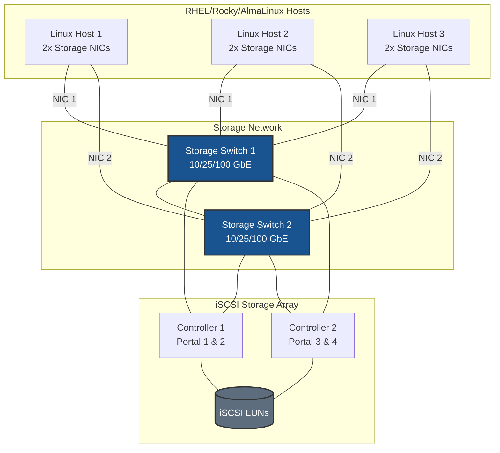
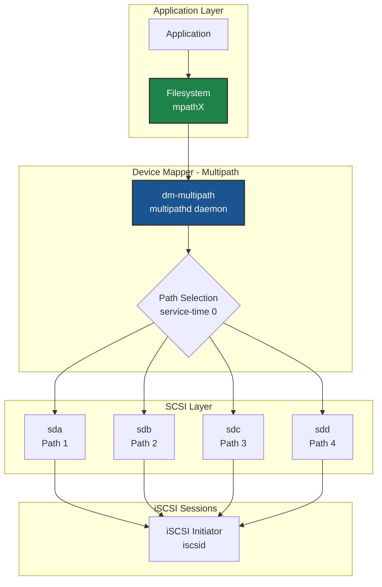
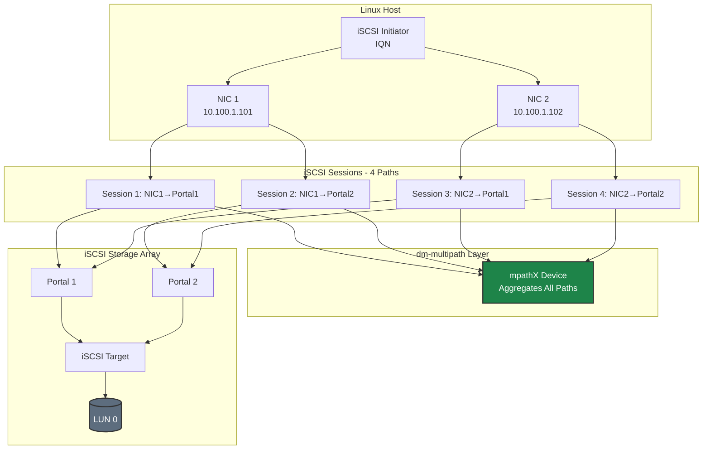
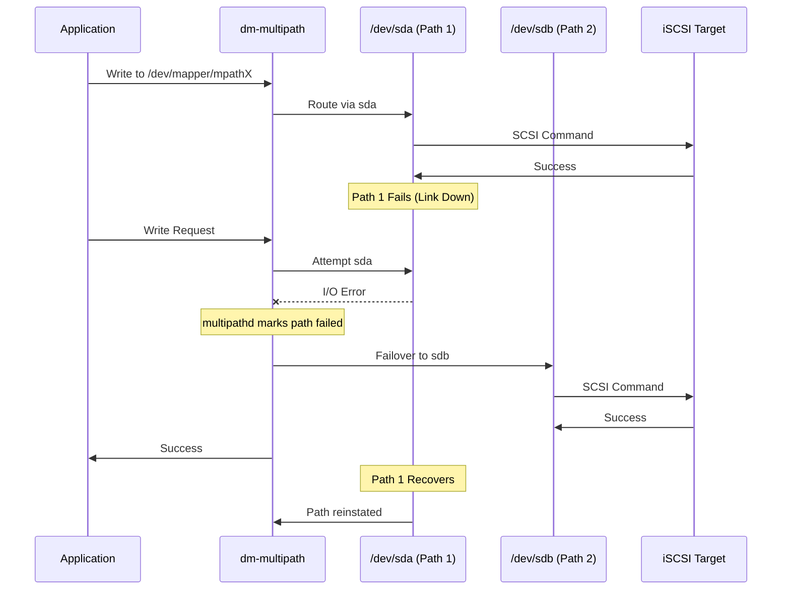
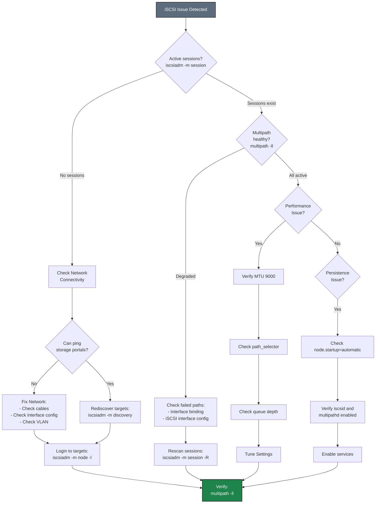

# iSCSI on RHEL/Rocky/AlmaLinux - Best Practices Guide

Comprehensive best practices for deploying iSCSI storage on RHEL-based systems in production environments.

---



---

## Table of Contents
- [Architecture Overview](#architecture-overview)
- [RHEL-Specific Considerations](#rhel-specific-considerations)
- [Network Configuration](#network-configuration)
- [SELinux Configuration](#selinux-configuration)
- [Firewall Configuration](#firewall-configuration)
- [iSCSI Architecture](#iscsi-architecture)
- [Multipath Configuration](#multipath-configuration)
- [Performance Tuning](#performance-tuning)
- [High Availability](#high-availability)
- [Monitoring & Maintenance](#monitoring--maintenance)
- [Security](#security)
- [Troubleshooting](#troubleshooting)

---

## Architecture Overview

### Deployment Topology



### dm-multipath Architecture



**Key Design Principles:**
- **Dual switches** for network redundancy
- **Minimum 2 NICs per host** for multipath
- **Dual controller array** for storage HA
- **dm-multipath** aggregates all paths into single device





---

## RHEL-Specific Considerations

### Subscription Management

**Red Hat Enterprise Linux:**
```bash
# Register system
sudo subscription-manager register --username <username>

# Attach subscription
sudo subscription-manager attach --auto

# Enable required repositories
sudo subscription-manager repos --enable=rhel-9-for-x86_64-baseos-rpms
sudo subscription-manager repos --enable=rhel-9-for-x86_64-appstream-rpms

# Update system
sudo dnf update -y
```

**Rocky Linux / AlmaLinux:**
```bash
# No subscription required
# Update system
sudo dnf update -y

# Enable EPEL if needed for additional tools
sudo dnf install -y epel-release
```

### Kernel Requirements

**Minimum kernel versions:**
- **RHEL 8**: Kernel 4.18.0 or later (iSCSI support)
- **RHEL 9**: Kernel 5.14.0 or later (recommended)

**Check kernel version:**
```bash
uname -r

# Verify iSCSI module is available
modinfo iscsi_tcp
```

**Update kernel if needed:**
```bash
sudo dnf update kernel
sudo reboot
```

### Package Management

**Essential packages:**
```bash
# Core iSCSI and multipath tools
sudo dnf install -y \
    iscsi-initiator-utils \
    device-mapper-multipath \
    lvm2 \
    sg3_utils

# Performance monitoring tools
sudo dnf install -y \
    sysstat \
    iotop \
    iftop \
    htop \
    perf

# Network tools
sudo dnf install -y \
    NetworkManager \
    NetworkManager-tui \
    ethtool \
    iproute \
    iputils \
    bind-utils

# Optional: Tuned for performance profiles
sudo dnf install -y tuned tuned-utils
```

**Verify installation:**
```bash
# Check iSCSI initiator
iscsiadm --version

# Check multipath
multipath -ll

# Check services
systemctl status iscsid
systemctl status multipathd
```

---

## Network Configuration

### NetworkManager Best Practices

**Why NetworkManager:**
- Default in RHEL 8/9
- Better integration with systemd
- Dynamic configuration support
- Team/bond support
- Consistent across RHEL ecosystem

**Disable network-scripts (RHEL 8):**
```bash
# Network scripts are deprecated
sudo systemctl disable network
sudo systemctl enable NetworkManager
sudo systemctl start NetworkManager
```

### Storage Network Configuration

#### Dedicated Interfaces (Recommended)

```bash
# Create connection for storage interface
sudo nmcli connection add type ethernet \
    con-name storage-iscsi-1 \
    ifname ens1f0 \
    ipv4.method manual \
    ipv4.addresses 10.100.1.101/24 \
    ipv4.never-default yes \
    ipv4.may-fail no \
    802-3-ethernet.mtu 9000 \
    connection.autoconnect yes \
    connection.autoconnect-priority 10

# Optimize for storage
sudo nmcli connection modify storage-iscsi-1 \
    ethtool.ring-rx 4096 \
    ethtool.ring-tx 4096 \
    ethtool.coalesce-rx-usecs 50 \
    ethtool.coalesce-tx-usecs 50

# Activate
sudo nmcli connection up storage-iscsi-1

# Repeat for second interface
sudo nmcli connection add type ethernet \
    con-name storage-iscsi-2 \
    ifname ens1f1 \
    ipv4.method manual \
    ipv4.addresses 10.100.2.101/24 \
    ipv4.never-default yes \
    ipv4.may-fail no \
    802-3-ethernet.mtu 9000 \
    connection.autoconnect yes \
    connection.autoconnect-priority 10

sudo nmcli connection up storage-iscsi-2
```

**Key NetworkManager parameters:**
- `ipv4.never-default yes` - No default route on storage interface
- `ipv4.may-fail no` - Boot waits for this interface
- `connection.autoconnect-priority 10` - Higher priority for storage
- `ethtool.*` - NIC tuning parameters

### MTU Configuration

```bash
# Set MTU 9000 for jumbo frames
sudo nmcli connection modify storage-iscsi-1 802-3-ethernet.mtu 9000
sudo nmcli connection modify storage-iscsi-2 802-3-ethernet.mtu 9000

# Verify
nmcli connection show storage-iscsi-1 | grep mtu

# Test MTU
ping -M do -s 8972 <storage_portal_ip>
```

**Important:** MTU must be 9000 on:
- Host interfaces
- All switches in path
- Storage array ports

---

## SELinux Configuration

### Understanding SELinux with iSCSI

**SELinux modes:**
- `enforcing` - SELinux policy is enforced (recommended for production)
- `permissive` - SELinux logs violations but doesn't block (testing)
- `disabled` - SELinux is disabled (not recommended)

**Check SELinux status:**
```bash
getenforce
sestatus
```

### SELinux Policies for iSCSI

**Allow iSCSI connections:**
```bash
# iSCSI should work out-of-the-box with default policies
# Check for denials
sudo ausearch -m avc -ts recent | grep iscsi

# If denials found, generate policy
sudo ausearch -m avc -ts recent | audit2allow -M iscsi_policy

# Review the policy
cat iscsi_policy.te

# Install policy
sudo semodule -i iscsi_policy.pp
```

### Port Labeling

**Label iSCSI port (if needed):**
```bash
# Check current port labels
sudo semanage port -l | grep iscsi

# Add custom port if using non-standard port
sudo semanage port -a -t iscsi_port_t -p tcp 3260
```

### Common SELinux Issues

**Issue: iSCSI connections blocked**
```bash
# Check for denials
sudo ausearch -m avc -ts recent

# Temporary: Set to permissive for testing
sudo setenforce 0

# Test iSCSI connection
sudo iscsiadm -m discovery -t sendtargets -p <portal_ip>:3260

# Check for new denials
sudo ausearch -m avc -ts recent

# Generate and install policy
sudo ausearch -m avc -ts recent | audit2allow -M iscsi_fix
sudo semodule -i iscsi_fix.pp

# Re-enable enforcing
sudo setenforce 1
```

**Issue: Multipath device access denied**
```bash
# Allow multipath to access devices
sudo setsebool -P virt_use_rawio 1

# Or create custom policy
sudo ausearch -m avc -ts recent | grep multipath | audit2allow -M multipath_iscsi
sudo semodule -i multipath_iscsi.pp
```

### SELinux Best Practices

1. **Never disable SELinux in production**
   - Use permissive mode for troubleshooting only
   - Always create proper policies

2. **Monitor audit logs regularly**
   ```bash
   sudo ausearch -m avc -ts today
   ```

3. **Use booleans when available**
   ```bash
   # List iSCSI-related booleans
   sudo getsebool -a | grep iscsi
   ```

4. **Document custom policies**
   - Keep .te files in version control
   - Document why each policy was needed

---

## Firewall Configuration

### firewalld Best Practices

**Why firewalld:**
- Default in RHEL 8/9
- Dynamic firewall management
- Zone-based configuration
- Integration with NetworkManager

**Check firewalld status:**
```bash
sudo systemctl status firewalld
sudo firewall-cmd --state
```

### Option 1: Trusted Zone (Recommended for Dedicated Storage Networks)

For dedicated storage networks, **disable firewall filtering** on storage interfaces to eliminate CPU overhead from packet inspection. This is important for high-throughput iSCSI storage.

**Why disable filtering on storage interfaces:**
- **CPU overhead**: Firewall packet inspection adds latency and consumes CPU cycles
- **Performance impact**: At high IOPS, filtering overhead becomes significant
- **Network isolation**: Dedicated storage VLANs provide security at the network layer
- **Simplicity**: No port rules to maintain for storage traffic

```bash
# Add storage interfaces to trusted zone (no packet filtering)
sudo firewall-cmd --permanent --zone=trusted --add-interface=ens1f0
sudo firewall-cmd --permanent --zone=trusted --add-interface=ens1f1

# Reload
sudo firewall-cmd --reload

# Verify
sudo firewall-cmd --zone=trusted --list-all
```

### Option 2: Port Filtering (For Shared or Non-Isolated Networks)

Use port filtering only when storage interfaces share a network with other traffic or when additional host-level security is required by policy.

> **⚠️ Performance Note:** Port filtering adds CPU overhead for every packet. For production storage with high IOPS requirements, use Option 1 with network-level isolation instead.

**Allow iSCSI traffic:**
```bash
# Add iSCSI service (port 3260)
sudo firewall-cmd --permanent --add-service=iscsi-target

# Or add port directly
sudo firewall-cmd --permanent --add-port=3260/tcp

# Reload firewall
sudo firewall-cmd --reload

# Verify
sudo firewall-cmd --list-all
```

#### Zone-Based Configuration with Port Filtering

**Dedicated storage zone with port filtering:**
```bash
# Create storage zone
sudo firewall-cmd --permanent --new-zone=storage

# Add storage interfaces to zone
sudo firewall-cmd --permanent --zone=storage --add-interface=ens1f0
sudo firewall-cmd --permanent --zone=storage --add-interface=ens1f1

# Allow iSCSI in storage zone
sudo firewall-cmd --permanent --zone=storage --add-port=3260/tcp

# Set target to DROP (deny by default except allowed ports)
sudo firewall-cmd --permanent --zone=storage --set-target=DROP

# Reload
sudo firewall-cmd --reload

# Verify
sudo firewall-cmd --zone=storage --list-all
```

### Rich Rules for Advanced Control

**Restrict iSCSI to specific source IPs:**
```bash
# Allow iSCSI only from storage array
sudo firewall-cmd --permanent --add-rich-rule='
  rule family="ipv4"
  source address="10.100.1.10"
  port protocol="tcp" port="3260" accept'

sudo firewall-cmd --permanent --add-rich-rule='
  rule family="ipv4"
  source address="10.100.2.10"
  port protocol="tcp" port="3260" accept'

sudo firewall-cmd --reload
```

---

## iSCSI Architecture



**Key points for RHEL:**
- Use dedicated storage networks (VLANs or physical)
- Minimum 2×2 topology (2 NICs × 2 portals = 4 paths)
- Static IP addressing (no DHCP)
- No default gateway on storage interfaces
- MTU 9000 end-to-end

---

## Multipath Configuration



### RHEL-Specific Multipath Setup

**Enable and configure multipath:**
```bash
# Enable multipath
sudo systemctl enable --now multipathd

# Generate default configuration
sudo mpathconf --enable --with_multipathd y

# Edit configuration
sudo vi /etc/multipath.conf
```

**RHEL-optimized multipath.conf:**
```bash
# /etc/multipath.conf
defaults {
    user_friendly_names yes
    find_multipaths no
    enable_foreign "^$"
}

blacklist {
    devnode "^(ram|raw|loop|fd|md|dm-|sr|scd|st)[0-9]*"
    devnode "^hd[a-z]"
    devnode "^cciss.*"
}

# Add device-specific settings for your storage array
# Consult your storage vendor documentation for recommended values
#devices {
#    device {
#        vendor "VENDOR"
#        product "PRODUCT"
#        path_selector "service-time 0"
#        path_grouping_policy "group_by_prio"
#        prio "alua"
#        failback "immediate"
#        path_checker "tur"
        fast_io_fail_tmo 10
        dev_loss_tmo 60
        no_path_retry 0
        hardware_handler "1 alua"
        rr_min_io_rq 1
    }
}
```

**Apply configuration:**
```bash
# Restart multipathd
sudo systemctl restart multipathd

# Verify configuration
sudo multipath -ll

# Check for errors
sudo journalctl -u multipathd -n 50
```

---

## Performance Tuning





### RHEL-Specific Tuning

#### Tuned Profiles

**Use tuned for automated tuning:**
```bash
# Install tuned
sudo dnf install -y tuned tuned-utils

# Enable tuned
sudo systemctl enable --now tuned

# List available profiles
sudo tuned-adm list

# Apply throughput-performance profile
sudo tuned-adm profile throughput-performance

# Or network-latency for low-latency workloads
sudo tuned-adm profile network-latency

# Verify active profile
sudo tuned-adm active
```

**Create custom tuned profile for iSCSI:**
```bash
# Create custom profile directory
sudo mkdir -p /etc/tuned/iscsi-storage

# Create tuned.conf
sudo tee /etc/tuned/iscsi-storage/tuned.conf > /dev/null <<'EOF'
[main]
summary=Optimized for iSCSI storage workloads
include=throughput-performance

[sysctl]
# Network tuning
net.core.rmem_max = 134217728
net.core.wmem_max = 134217728
net.ipv4.tcp_rmem = 4096 87380 67108864
net.ipv4.tcp_wmem = 4096 65536 67108864
net.ipv4.tcp_low_latency = 1

# iSCSI tuning
net.ipv4.tcp_timestamps = 1
net.ipv4.tcp_sack = 1

[disk]
# I/O scheduler for iSCSI devices
devices_udev_regex=^sd[a-z]+$
elevator=none

[script]
script=${i:PROFILE_DIR}/script.sh
EOF

# Create script
sudo tee /etc/tuned/iscsi-storage/script.sh > /dev/null <<'EOF'
#!/bin/bash
. /usr/lib/tuned/functions

start() {
    # Set queue depth for iSCSI devices
    for dev in /sys/block/sd*/device/queue_depth; do
        if [ -f "$dev" ]; then
            echo 128 > "$dev"
        fi
    done
    return 0
}

stop() {
    return 0
}

process $@
EOF

# Make script executable
sudo chmod +x /etc/tuned/iscsi-storage/script.sh

# Apply custom profile
sudo tuned-adm profile iscsi-storage

# Verify
sudo tuned-adm active
```

#### Kernel Parameters

**Optimize kernel for iSCSI:**
```bash
# Create sysctl configuration
sudo tee /etc/sysctl.d/99-iscsi-rhel.conf > /dev/null <<'EOF'
# Network performance
net.core.netdev_max_backlog = 5000
net.core.rmem_max = 134217728
net.core.wmem_max = 134217728
net.ipv4.tcp_rmem = 4096 87380 67108864
net.ipv4.tcp_wmem = 4096 65536 67108864

# Connection tracking
net.netfilter.nf_conntrack_max = 1048576

# Low latency
net.ipv4.tcp_low_latency = 1

# VM tuning for storage
vm.dirty_ratio = 10
vm.dirty_background_ratio = 5
vm.swappiness = 10

# ARP settings for same-subnet multipath (CRITICAL)
# Prevents ARP responses on wrong interface when multiple NICs share same subnet
# See: Network Concepts documentation for detailed explanation
net.ipv4.conf.all.arp_ignore = 2
net.ipv4.conf.default.arp_ignore = 2
net.ipv4.conf.all.arp_announce = 2
net.ipv4.conf.default.arp_announce = 2
# Interface-specific (adjust interface names as needed)
net.ipv4.conf.ens1f0.arp_ignore = 2
net.ipv4.conf.ens1f1.arp_ignore = 2
net.ipv4.conf.ens1f0.arp_announce = 2
net.ipv4.conf.ens1f1.arp_announce = 2
EOF

# Apply settings
sudo sysctl -p /etc/sysctl.d/99-iscsi-rhel.conf
```

---

## High Availability

### iSCSI Path Redundancy Model



### Failover Behavior





### Cluster Configuration

**Using Pacemaker/Corosync:**
```bash
# Install cluster packages
sudo dnf install -y pcs pacemaker corosync fence-agents-all

# Enable and start pcsd
sudo systemctl enable --now pcsd

# Set hacluster password (on all nodes)
sudo passwd hacluster

# Authenticate nodes (run on one node)
sudo pcs host auth node1 node2 node3 -u hacluster

# Create cluster
sudo pcs cluster setup mycluster node1 node2 node3

# Start cluster
sudo pcs cluster start --all
sudo pcs cluster enable --all

# Verify cluster status
sudo pcs status
```

### Fencing Configuration

**Configure STONITH (fencing):**
```bash
# Disable STONITH for testing (NOT for production)
sudo pcs property set stonith-enabled=false

# For production, configure appropriate fence agent
# Example: IPMI fencing
sudo pcs stonith create fence_node1 fence_ipmilan \
    pcmk_host_list="node1" \
    ipaddr="10.0.0.101" \
    login="admin" \
    passwd="password" \
    lanplus=1

# Verify fencing
sudo pcs stonith status
```

### Shared Storage Resources

**Configure iSCSI LVM as cluster resource:**
```bash
# Create LVM volume group on multipath device
sudo vgcreate --clustered y vg_iscsi /dev/mapper/mpatha

# Create logical volume
sudo lvcreate -L 100G -n lv_data vg_iscsi

# Create filesystem
sudo mkfs.xfs /dev/vg_iscsi/lv_data

# Add to cluster as resource
sudo pcs resource create fs_data Filesystem \
    device="/dev/vg_iscsi/lv_data" \
    directory="/mnt/data" \
    fstype="xfs" \
    --group storage_group

# Verify
sudo pcs resource status
```

---

## Monitoring & Maintenance



### RHEL-Specific Monitoring

#### Using systemd Journal

**Monitor iSCSI services:**
```bash
# View iSCSI logs
sudo journalctl -u iscsid -f

# View multipath logs
sudo journalctl -u multipathd -f

# View all storage-related logs
sudo journalctl -u iscsid -u multipathd -u lvm2-* --since "1 hour ago"
```

#### Performance Monitoring with sysstat

**Install and configure sysstat:**
```bash
# Install
sudo dnf install -y sysstat

# Enable data collection
sudo systemctl enable --now sysstat

# View I/O statistics
sar -d 1 10

# View network statistics
sar -n DEV 1 10

# Generate daily report
sar -A
```

#### Monitoring Scripts

**Create monitoring script:**
```bash
sudo tee /usr/local/bin/iscsi-health-check.sh > /dev/null <<'EOF'
#!/bin/bash
# iSCSI Health Check Script for RHEL

echo "=== iSCSI Health Check ==="
echo "Date: $(date)"
echo

echo "--- iSCSI Sessions ---"
iscsiadm -m session

echo
echo "--- Multipath Status ---"
multipath -ll | head -50

echo
echo "--- Failed Paths ---"
multipath -ll | grep -i "failed\|faulty" || echo "No failed paths"

echo
echo "--- Disk I/O ---"
iostat -x 1 2 | tail -20

echo
echo "--- Network Interfaces ---"
ip -s link show | grep -A 3 "ens1f"

echo
echo "=== End Health Check ==="
EOF

sudo chmod +x /usr/local/bin/iscsi-health-check.sh

# Run health check
sudo /usr/local/bin/iscsi-health-check.sh
```

**Schedule with cron:**
```bash
# Add to crontab
echo "0 */6 * * * /usr/local/bin/iscsi-health-check.sh >> /var/log/iscsi-health.log 2>&1" | sudo crontab -
```

---

## Security



### RHEL-Specific Security

#### CHAP Authentication

**Configure CHAP on initiator:**
```bash
# Set CHAP credentials
sudo iscsiadm -m node -T <target_iqn> -p <portal_ip>:3260 \
    -o update -n node.session.auth.authmethod -v CHAP

sudo iscsiadm -m node -T <target_iqn> -p <portal_ip>:3260 \
    -o update -n node.session.auth.username -v <username>

sudo iscsiadm -m node -T <target_iqn> -p <portal_ip>:3260 \
    -o update -n node.session.auth.password -v <password>

# For mutual CHAP
sudo iscsiadm -m node -T <target_iqn> -p <portal_ip>:3260 \
    -o update -n node.session.auth.username_in -v <target_username>

sudo iscsiadm -m node -T <target_iqn> -p <portal_ip>:3260 \
    -o update -n node.session.auth.password_in -v <target_password>

# Reconnect with CHAP
sudo iscsiadm -m node -T <target_iqn> -p <portal_ip>:3260 --logout
sudo iscsiadm -m node -T <target_iqn> -p <portal_ip>:3260 --login
```

#### Audit Logging

**Enable audit logging for iSCSI:**
```bash
# Add audit rules
sudo tee -a /etc/audit/rules.d/iscsi.rules > /dev/null <<'EOF'
# Monitor iSCSI configuration changes
-w /etc/iscsi/ -p wa -k iscsi_config
-w /etc/multipath.conf -p wa -k multipath_config

# Monitor iSCSI commands
-a always,exit -F arch=b64 -S execve -F path=/usr/sbin/iscsiadm -k iscsi_commands
EOF

# Reload audit rules
sudo augenrules --load

# View iSCSI audit events
sudo ausearch -k iscsi_config
sudo ausearch -k iscsi_commands
```

---

## Troubleshooting

### Troubleshooting Flowchart







### RHEL-Specific Troubleshooting

#### Check Service Status

```bash
# Check all iSCSI-related services
sudo systemctl status iscsid
sudo systemctl status iscsi
sudo systemctl status multipathd

# Check for failed services
sudo systemctl --failed | grep -E "iscsi|multipath"

# View detailed service logs
sudo journalctl -xe -u iscsid
```

#### Network Troubleshooting

```bash
# Check interface status
nmcli device status

# Check connection status
nmcli connection show

# Test connectivity to storage
ping -c 4 <portal_ip>

# Test iSCSI port
nc -zv <portal_ip> 3260

# Check routing
ip route get <portal_ip>

# Verify MTU
ip link show ens1f0 | grep mtu
```

#### Multipath Troubleshooting

```bash
# Verbose multipath output
sudo multipath -v3

# Reload multipath configuration
sudo systemctl reload multipathd

# Reconfigure all devices
sudo multipath -r

# Check for blacklisted devices
sudo multipath -v3 | grep -i blacklist

# View device mapper tables
sudo dmsetup table
sudo dmsetup status
```

#### SELinux Troubleshooting

```bash
# Check for recent denials
sudo ausearch -m avc -ts recent | grep iscsi

# Generate policy from denials
sudo ausearch -m avc -ts recent | audit2allow -M iscsi_troubleshoot

# Review generated policy
cat iscsi_troubleshoot.te

# Install if appropriate
sudo semodule -i iscsi_troubleshoot.pp
```

#### Performance Troubleshooting

```bash
# Check I/O statistics
iostat -x 1 5

# Check for I/O wait
vmstat 1 5

# Check network performance
sar -n DEV 1 5

# Check for dropped packets
netstat -i

# Check IRQ distribution
cat /proc/interrupts | grep -E "eth|ens"

# Verify tuned profile
sudo tuned-adm active
sudo tuned-adm verify
```

---

## Additional Resources

- [RHEL Storage Administration Guide](https://access.redhat.com/documentation/en-us/red_hat_enterprise_linux/9/html/managing_storage_devices/)
- [iSCSI Quick Start](./QUICKSTART.md)
- [Common Network Concepts]({{ site.baseurl }}/common/network-concepts.html)
- [Multipath Concepts]({{ site.baseurl }}/common/multipath-concepts.html)

---



**Restart services:**
```bash
sudo systemctl restart iscsid multipathd
```

**Check logs:**
```bash
sudo journalctl -u iscsid -u multipathd -f
```

