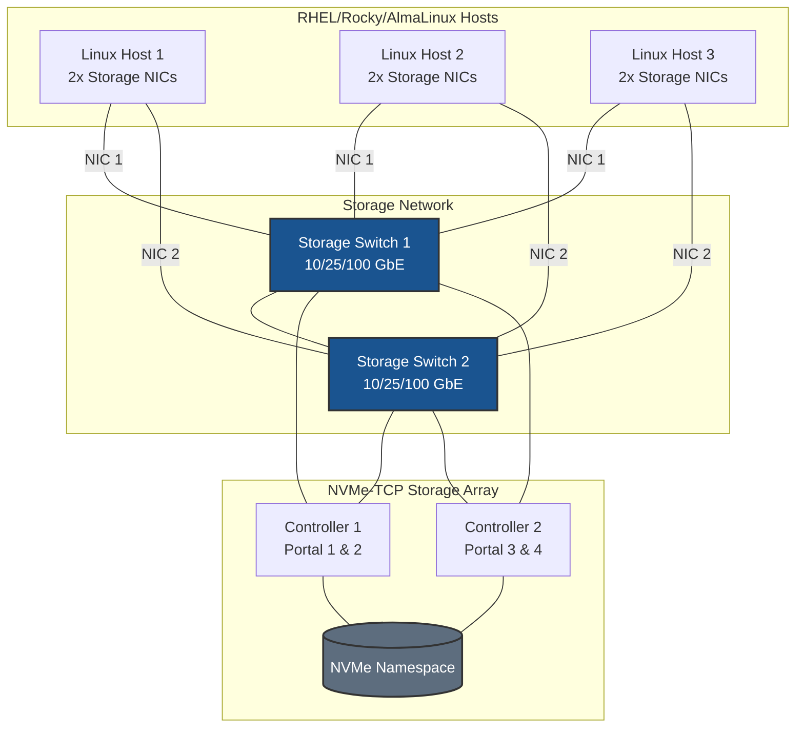
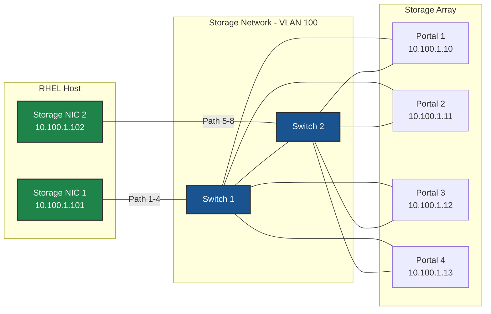
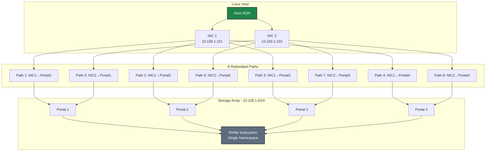
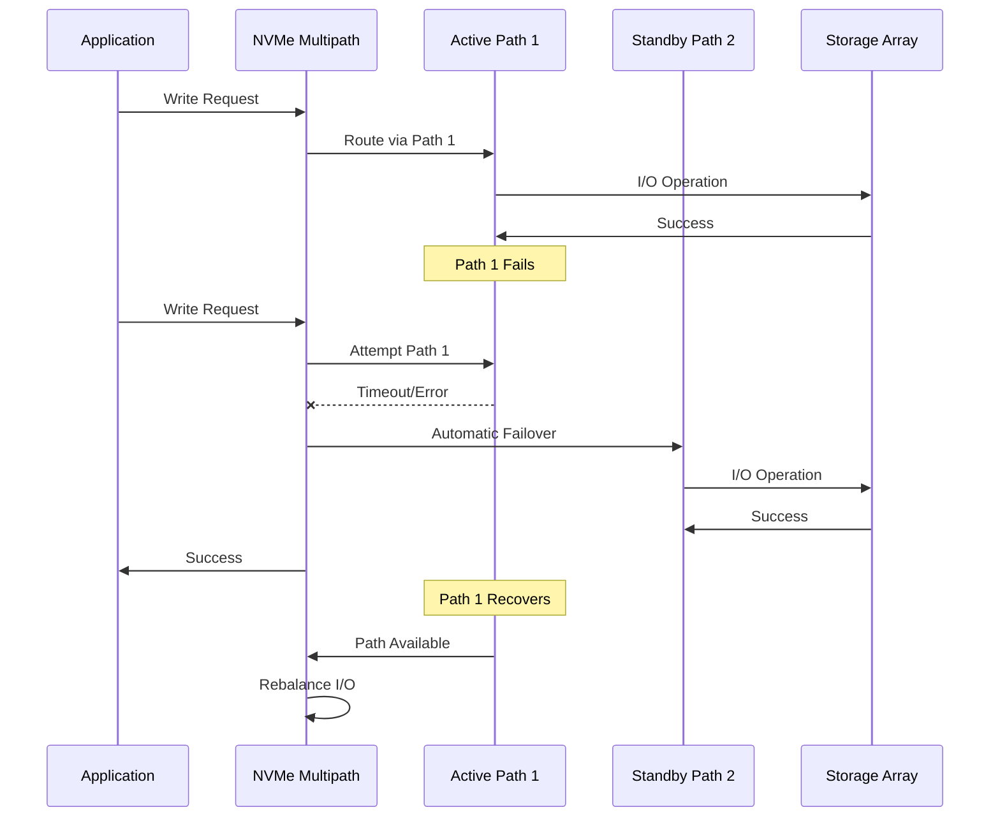
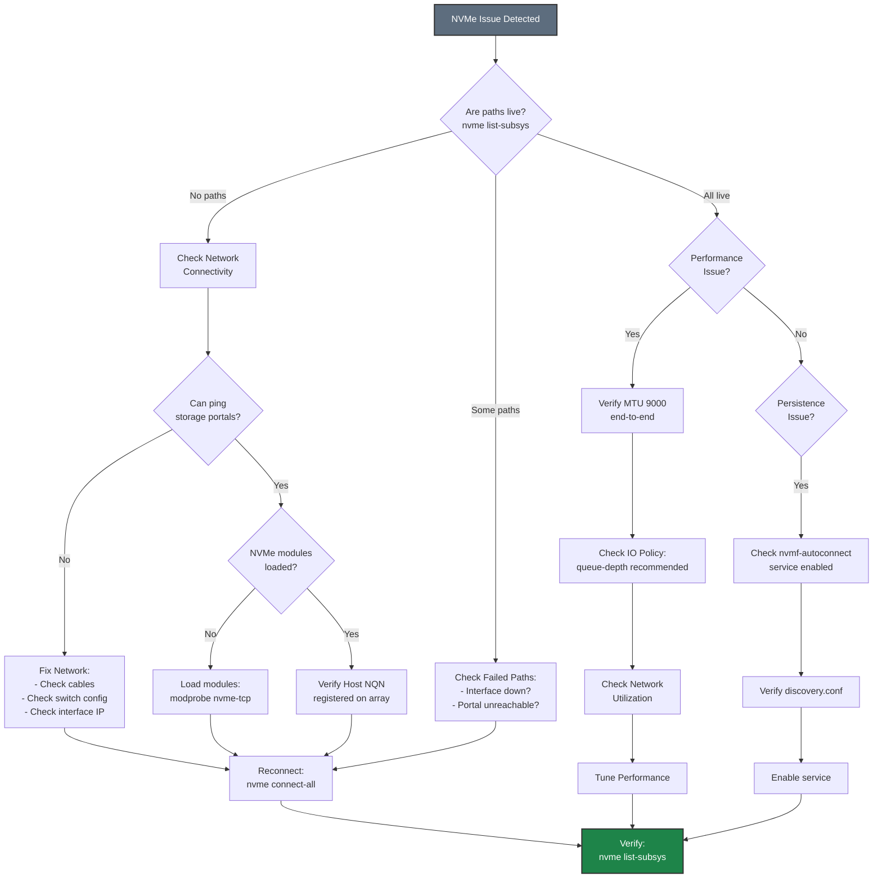

# NVMe-TCP on RHEL/Rocky/AlmaLinux - Best Practices Guide

Comprehensive best practices for deploying NVMe-TCP storage on RHEL-based systems in production environments.

---



---

## Table of Contents
- [Architecture Overview](#architecture-overview)
- [RHEL-Specific Considerations](#rhel-specific-considerations)
- [Network Configuration](#network-configuration)
- [SELinux Configuration](#selinux-configuration)
- [Firewall Configuration](#firewall-configuration)
- [Performance Tuning](#performance-tuning)
- [High Availability](#high-availability)
- [Monitoring & Maintenance](#monitoring--maintenance)
- [Security](#security)
- [Troubleshooting](#troubleshooting)

---

## Architecture Overview

### Deployment Topology



### Network Architecture



**Key Design Principles:**
- **Dual switches** for network redundancy
- **Minimum 2 NICs per host** for multipath
- **Dual controller array** for storage HA
- **8 paths** (2 NICs × 4 portals) for maximum redundancy





---

## RHEL-Specific Considerations

### Subscription Management

**Red Hat Enterprise Linux:**
```bash
# Register system
sudo subscription-manager register --username <username>

# Attach subscription
sudo subscription-manager attach --auto

# Enable required repositories
sudo subscription-manager repos --enable=rhel-9-for-x86_64-baseos-rpms
sudo subscription-manager repos --enable=rhel-9-for-x86_64-appstream-rpms

# Update system
sudo dnf update -y
```

**Rocky Linux / AlmaLinux:**
```bash
# No subscription required
# Update system
sudo dnf update -y

# Enable EPEL if needed for additional tools
sudo dnf install -y epel-release
```

### Kernel Requirements

**Minimum kernel versions:**
- **RHEL 8**: Kernel 4.18.0-193 or later (NVMe-TCP support)
- **RHEL 9**: Kernel 5.14.0 or later (recommended)

**Check kernel version:**
```bash
uname -r

# Verify NVMe-TCP module is available
modinfo nvme-tcp
```

**Update kernel if needed:**
```bash
sudo dnf update kernel
sudo reboot
```

### Package Management

**Essential packages:**
```bash
# Core NVMe and multipath tools
sudo dnf install -y \
    nvme-cli \
    device-mapper-multipath \
    lvm2 \
    sg3_utils

# Performance monitoring tools
sudo dnf install -y \
    sysstat \
    iotop \
    iftop \
    htop \
    perf

# Network tools
sudo dnf install -y \
    NetworkManager \
    NetworkManager-tui \
    ethtool \
    iproute \
    iputils \
    bind-utils

# Optional: Tuned for performance profiles
sudo dnf install -y tuned tuned-utils
```

---

## Network Configuration

### NetworkManager Best Practices

**Why NetworkManager:**
- Default in RHEL 8/9
- Better integration with systemd
- Dynamic configuration support
- Team/bond support
- Consistent across RHEL ecosystem

**Disable network-scripts (RHEL 8):**
```bash
# Network scripts are deprecated
sudo systemctl disable network
sudo systemctl enable NetworkManager
sudo systemctl start NetworkManager
```

### Storage Network Configuration

#### Dedicated Interfaces (Recommended)

```bash
# Create connection for storage interface
sudo nmcli connection add type ethernet \
    con-name storage-nvme-1 \
    ifname ens1f0 \
    ipv4.method manual \
    ipv4.addresses 10.100.1.101/24 \
    ipv4.never-default yes \
    ipv4.may-fail no \
    802-3-ethernet.mtu 9000 \
    connection.autoconnect yes \
    connection.autoconnect-priority 10

# Optimize for storage
sudo nmcli connection modify storage-nvme-1 \
    ethtool.ring-rx 4096 \
    ethtool.ring-tx 4096 \
    ethtool.coalesce-rx-usecs 50 \
    ethtool.coalesce-tx-usecs 50

# Activate
sudo nmcli connection up storage-nvme-1
```

**Key NetworkManager parameters:**
- `ipv4.never-default yes` - No default route on storage interface
- `ipv4.may-fail no` - Boot waits for this interface
- `connection.autoconnect-priority 10` - Higher priority for storage
- `ethtool.*` - NIC tuning parameters

#### Team/Bond Configuration (HA)

**Using team (recommended for RHEL):**
```bash
# Create team interface
sudo nmcli connection add type team \
    con-name storage-team0 \
    ifname team0 \
    team.runner activebackup \
    ipv4.method manual \
    ipv4.addresses 10.100.1.101/24 \
    ipv4.never-default yes

# Add team ports
sudo nmcli connection add type ethernet \
    con-name storage-team0-port1 \
    ifname ens1f0 \
    master team0

sudo nmcli connection add type ethernet \
    con-name storage-team0-port2 \
    ifname ens1f1 \
    master team0

# Activate
sudo nmcli connection up storage-team0
```

**Team runners:**
- `activebackup` - Active-passive failover (recommended for storage)
- `loadbalance` - Load balancing (use with caution for storage)
- `lacp` - 802.3ad LACP (requires switch support)

### MTU Configuration

```bash
# Set MTU 9000 for jumbo frames
sudo nmcli connection modify storage-nvme-1 802-3-ethernet.mtu 9000

# Verify
nmcli connection show storage-nvme-1 | grep mtu

# Test MTU
ping -M do -s 8972 <storage_portal_ip>
```

**Important:** MTU must be 9000 on:
- Host interfaces
- All switches in path
- Storage array ports

---

## SELinux Configuration

### Understanding SELinux with NVMe-TCP

**SELinux modes:**
- `enforcing` - SELinux policy is enforced (recommended for production)
- `permissive` - SELinux logs violations but doesn't block (testing)
- `disabled` - SELinux is disabled (not recommended)

**Check SELinux status:**
```bash
getenforce
sestatus
```

### SELinux Policies for NVMe-TCP

**Allow NVMe-TCP connections:**
```bash
# Check for denials
sudo ausearch -m avc -ts recent | grep nvme

# If denials found, generate policy
sudo ausearch -m avc -ts recent | audit2allow -M nvme_tcp_policy

# Review the policy
cat nvme_tcp_policy.te

# Install policy
sudo semodule -i nvme_tcp_policy.pp
```

### Common SELinux Issues

**Issue: NVMe connections blocked**
```bash
# Check for denials
sudo ausearch -m avc -ts recent

# Temporary: Set to permissive for testing
sudo setenforce 0

# Test NVMe connection
sudo nvme connect -t tcp -a <portal_ip> -s 4420 -n <nqn>

# Check for new denials
sudo ausearch -m avc -ts recent

# Generate and install policy
sudo ausearch -m avc -ts recent | audit2allow -M nvme_fix
sudo semodule -i nvme_fix.pp

# Re-enable enforcing
sudo setenforce 1
```

**Issue: Multipath device access denied**
```bash
# Allow multipath to access devices
sudo setsebool -P virt_use_rawio 1

# Or create custom policy
sudo ausearch -m avc -ts recent | grep multipath | audit2allow -M multipath_nvme
sudo semodule -i multipath_nvme.pp
```

### SELinux Best Practices

1. **Never disable SELinux in production**
   - Use permissive mode for troubleshooting only
   - Always create proper policies

2. **Use audit2allow carefully**
   - Review generated policies before installing
   - Understand what you're allowing
   - Document custom policies

3. **Monitor for denials**
   ```bash
   # Set up monitoring
   sudo ausearch -m avc -ts today | grep denied
   
   # Or use setroubleshoot
   sudo dnf install -y setroubleshoot-server
   sudo sealert -a /var/log/audit/audit.log
   ```

4. **Keep policies updated**
   ```bash
   # Update SELinux policies
   sudo dnf update selinux-policy\*
   ```

---

## Firewall Configuration

### FirewallD Best Practices

**Why FirewallD:**
- Default in RHEL 8/9
- Dynamic firewall management
- Zone-based configuration
- Integration with NetworkManager

**Check firewall status:**
```bash
sudo firewall-cmd --state
sudo firewall-cmd --list-all
```

### Storage Network Firewall Rules

#### Option 1: Trusted Zone (Recommended for Dedicated Storage Networks)

For dedicated storage networks, **disable firewall filtering** on storage interfaces to eliminate CPU overhead from packet inspection. This is critical for high-throughput NVMe-TCP storage.

```bash
# Add storage interfaces to trusted zone (no packet filtering)
sudo firewall-cmd --permanent --zone=trusted --add-interface=ens1f0
sudo firewall-cmd --permanent --zone=trusted --add-interface=ens1f1

# Reload
sudo firewall-cmd --reload

# Verify
sudo firewall-cmd --zone=trusted --list-all
```

**Why disable filtering on storage interfaces:**
- **CPU overhead**: Firewall packet inspection adds latency and consumes CPU cycles
- **Performance impact**: At high IOPS (millions with NVMe-TCP), filtering overhead becomes significant
- **Network isolation**: Dedicated storage VLANs provide security at the network layer
- **Simplicity**: No port rules to maintain for storage traffic

#### Option 2: Custom Zone with Port Filtering (For Shared Networks)

Use port filtering only when storage interfaces share a network with other traffic or when additional host-level security is required by policy.

> **⚠️ Performance Note:** Port filtering adds CPU overhead for every packet. For production storage with high IOPS requirements, use Option 1 with network-level isolation instead.

```bash
# Create custom storage zone
sudo firewall-cmd --permanent --new-zone=storage
# Port 4420 = Data port (connections)
# Port 8009 = Discovery port (optional, for nvme discover)
sudo firewall-cmd --permanent --zone=storage --add-port=4420/tcp
sudo firewall-cmd --permanent --zone=storage --add-port=8009/tcp
sudo firewall-cmd --permanent --zone=storage --add-interface=ens1f0
sudo firewall-cmd --permanent --zone=storage --add-interface=ens1f1

# Set target to DROP (deny by default)
sudo firewall-cmd --permanent --zone=storage --set-target=DROP

# Reload
sudo firewall-cmd --reload
```

### Rich Rules for Advanced Filtering

```bash
# Allow NVMe-TCP only from specific subnet
sudo firewall-cmd --permanent --zone=storage --add-rich-rule='
  rule family="ipv4"
  source address="10.100.1.0/24"
  port protocol="tcp" port="4420" accept'

sudo firewall-cmd --permanent --zone=storage --add-rich-rule='
  rule family="ipv4"
  source address="10.100.1.0/24"
  port protocol="tcp" port="8009" accept'

# Log dropped packets
sudo firewall-cmd --permanent --zone=storage --add-rich-rule='
  rule family="ipv4"
  log prefix="STORAGE-DROP: " level="warning"
  drop'

# Reload
sudo firewall-cmd --reload
```

---

## Performance Tuning

### Tuned Profiles

**Why use tuned:**
- Red Hat's system tuning daemon
- Pre-configured profiles for different workloads
- Dynamic tuning based on system state
- Easy to customize

**Install and enable tuned:**
```bash
sudo dnf install -y tuned tuned-utils
sudo systemctl enable --now tuned
```

**Available profiles:**
```bash
# List available profiles
sudo tuned-adm list

# Recommended profiles for storage:
# - throughput-performance: Maximum throughput
# - latency-performance: Minimum latency
# - network-latency: Network-optimized
```

**Apply profile:**
```bash
# For maximum throughput
sudo tuned-adm profile throughput-performance

# For minimum latency
sudo tuned-adm profile latency-performance

# Verify active profile
sudo tuned-adm active
```

### Custom Tuned Profile for NVMe-TCP

Create custom profile optimized for NVMe-TCP storage:

```bash
# Create custom profile directory
sudo mkdir -p /etc/tuned/nvme-tcp-storage

# Create profile configuration
sudo tee /etc/tuned/nvme-tcp-storage/tuned.conf > /dev/null <<'EOF'
[main]
summary=Optimized for NVMe-TCP storage workloads
include=throughput-performance

[cpu]
governor=performance
energy_perf_bias=performance
min_perf_pct=100

[sysctl]
# Network tuning
net.core.rmem_max=134217728
net.core.wmem_max=134217728
net.core.rmem_default=16777216
net.core.wmem_default=16777216
net.ipv4.tcp_rmem=4096 87380 67108864
net.ipv4.tcp_wmem=4096 65536 67108864
net.core.netdev_max_backlog=30000
net.core.somaxconn=4096
net.ipv4.tcp_window_scaling=1
net.ipv4.tcp_timestamps=0
net.ipv4.tcp_sack=1

# VM tuning
vm.dirty_ratio=10
vm.dirty_background_ratio=5
vm.swappiness=10

# ARP cache
net.ipv4.neigh.default.gc_thresh1=4096
net.ipv4.neigh.default.gc_thresh2=8192
net.ipv4.neigh.default.gc_thresh3=16384

# ARP settings for same-subnet multipath (CRITICAL)
# Prevents ARP responses on wrong interface when multiple NICs share same subnet
# See: Network Concepts documentation for detailed explanation
net.ipv4.conf.all.arp_ignore=2
net.ipv4.conf.default.arp_ignore=2
net.ipv4.conf.all.arp_announce=2
net.ipv4.conf.default.arp_announce=2
# Interface-specific (adjust interface names as needed)
net.ipv4.conf.ens1f0.arp_ignore=2
net.ipv4.conf.ens1f1.arp_ignore=2
net.ipv4.conf.ens1f0.arp_announce=2
net.ipv4.conf.ens1f1.arp_announce=2

[disk]
# I/O scheduler for NVMe
elevator=none

[script]
script=${i:PROFILE_DIR}/script.sh
EOF

# Create script for NIC tuning
sudo tee /etc/tuned/nvme-tcp-storage/script.sh > /dev/null <<'EOF'
#!/bin/bash

. /usr/lib/tuned/functions

start() {
    # Tune storage NICs (adjust interface names)
    for iface in ens1f0 ens1f1; do
        if [ -d "/sys/class/net/$iface" ]; then
            # Ring buffers
            ethtool -G $iface rx 4096 tx 4096 2>/dev/null || true

            # Interrupt coalescing
            ethtool -C $iface rx-usecs 50 tx-usecs 50 2>/dev/null || true

            # Offloads
            ethtool -K $iface tso on gso on gro on 2>/dev/null || true

            # Flow control
            ethtool -A $iface rx on tx on 2>/dev/null || true
        fi
    done

    return 0
}

stop() {
    return 0
}

process $@
EOF

# Make script executable
sudo chmod +x /etc/tuned/nvme-tcp-storage/script.sh

# Apply custom profile
sudo tuned-adm profile nvme-tcp-storage

# Verify
sudo tuned-adm active
```

### IRQ Affinity for Storage NICs

**Automatic IRQ distribution:**
```bash
# Install irqbalance
sudo dnf install -y irqbalance

# Configure for storage workload
sudo tee /etc/sysconfig/irqbalance > /dev/null <<EOF
IRQBALANCE_BANNED_CPUS=00000001
IRQBALANCE_ARGS="--policyscript=/usr/local/bin/irq-policy.sh"
EOF

# Enable and start
sudo systemctl enable --now irqbalance
```

**Manual IRQ affinity (for specific control):**
```bash
# Find storage NIC IRQs
grep ens1f0 /proc/interrupts | awk '{print $1}' | sed 's/://'

# Pin IRQs to specific CPUs (example: CPUs 2-5)
#!/bin/bash
INTERFACE="ens1f0"
CPU_START=2

for IRQ in $(grep $INTERFACE /proc/interrupts | awk '{print $1}' | sed 's/://'); do
    MASK=$(printf "%x" $((1 << $CPU_START)))
    echo $MASK > /proc/irq/$IRQ/smp_affinity
    echo "IRQ $IRQ -> CPU $CPU_START (mask: $MASK)"
    CPU_START=$((CPU_START + 1))
done
```

### NUMA Optimization

**Check NUMA topology:**
```bash
# Install numactl
sudo dnf install -y numactl

# Show NUMA topology
numactl --hardware

# Show NIC NUMA node
cat /sys/class/net/ens1f0/device/numa_node
```

**Optimize for NUMA:**
```bash
# Pin NVMe-TCP connections to NUMA node with storage NICs
# Example: Identify NUMA node for network interfaces

# Find NUMA node for your NVMe interface
cat /sys/class/net/eth1/device/numa_node

# Set IRQ affinity for NVMe interfaces to matching NUMA node
# See IRQ affinity section below
```

> **Note:** NVMe-TCP uses native NVMe multipathing, not dm-multipath. There is no `multipathd` service to tune for NVMe-TCP.

### Kernel Boot Parameters

**Edit GRUB configuration:**
```bash
# Edit /etc/default/grub
sudo vi /etc/default/grub

# Add to GRUB_CMDLINE_LINUX:
# isolcpus=2,3,10,11 nohz_full=2,3,10,11 rcu_nocbs=2,3,10,11 intel_iommu=on iommu=pt

# Update GRUB
sudo grub2-mkconfig -o /boot/grub2/grub.cfg  # BIOS
# OR
sudo grub2-mkconfig -o /boot/efi/EFI/redhat/grub.cfg  # UEFI

# Reboot
sudo reboot
```

**Parameter explanations:**
- `isolcpus` - Isolate CPUs from scheduler (dedicate to storage I/O)
- `nohz_full` - Disable timer ticks on isolated CPUs
- `rcu_nocbs` - Offload RCU callbacks from isolated CPUs
- `intel_iommu=on iommu=pt` - Enable IOMMU passthrough

---

## High Availability

### Path Redundancy Model



### Failover Behavior







### Native NVMe Multipath Configuration for HA

NVMe-TCP uses **native NVMe multipathing** built into the Linux kernel. This is NOT dm-multipath (`multipath.conf`, `multipathd`) - those are for iSCSI/Fibre Channel only.

**Enable Native NVMe Multipath:**
```bash
# Enable native NVMe multipathing
echo 'options nvme_core multipath=Y' | sudo tee /etc/modprobe.d/nvme-tcp.conf

# Reboot to apply (required if nvme_core already loaded)
sudo reboot
```

**Configure IO Policy for HA:**
```bash
# Create udev rule for NVMe IO policy
sudo tee /etc/udev/rules.d/99-nvme-iopolicy.rules > /dev/null <<'EOF'
# Set IO policy to queue-depth for all NVMe subsystems (recommended for HA)
ACTION=="add|change", SUBSYSTEM=="nvme-subsystem", ATTR{iopolicy}="queue-depth"
EOF

# Reload udev rules
sudo udevadm control --reload-rules
sudo udevadm trigger
```

**Configure NVMe Connection Timeouts for HA:**
```bash
# When connecting, use appropriate timeout values
# ctrl-loss-tmo: Time to wait before declaring controller lost (seconds)
# reconnect-delay: Delay between reconnection attempts (seconds)

# Example: Conservative HA settings
nvme connect -t tcp -a <IP> -s 4420 -n <NQN> \
    --ctrl-loss-tmo=1800 \
    --reconnect-delay=10

# For faster failover (may cause more transient errors):
nvme connect -t tcp -a <IP> -s 4420 -n <NQN> \
    --ctrl-loss-tmo=600 \
    --reconnect-delay=5
```

**Verify Native Multipath Status:**
```bash
# Check multipath is enabled
cat /sys/module/nvme_core/parameters/multipath
# Should show: Y

# View all paths per subsystem
sudo nvme list-subsys

# Check IO policy
cat /sys/class/nvme-subsystem/nvme-subsys*/iopolicy
```

### Systemd Service Dependencies

**Ensure proper boot order:**
```bash
# Create drop-in for services that depend on NVMe storage
sudo mkdir -p /etc/systemd/system/libvirtd.service.d

sudo tee /etc/systemd/system/libvirtd.service.d/storage.conf > /dev/null <<EOF
[Unit]
After=nvmf-autoconnect.service
Wants=nvmf-autoconnect.service
EOF

# Reload systemd
sudo systemctl daemon-reload
```

### Monitoring and Alerting

**Set up monitoring with systemd:**
```bash
# Create monitoring script for native NVMe multipath
sudo tee /usr/local/bin/check-nvme-paths.sh > /dev/null <<'EOF'
#!/bin/bash

# Check native NVMe multipath status (NOT dm-multipath)
# Count connections that are NOT in 'live' state
FAILED=$(nvme list-subsys 2>/dev/null | grep -c -E "connecting|deleting")

if [ $FAILED -gt 0 ]; then
    echo "WARNING: $FAILED NVMe paths not in live state"
    nvme list-subsys
    exit 1
fi

# Check connection count
EXPECTED_CONNECTIONS=8
ACTUAL=$(nvme list-subsys 2>/dev/null | grep -c "live")

if [ $ACTUAL -lt $EXPECTED_CONNECTIONS ]; then
    echo "WARNING: Only $ACTUAL of $EXPECTED_CONNECTIONS NVMe connections active"
    nvme list-subsys
    exit 1
fi

echo "OK: All NVMe storage paths healthy"
exit 0
EOF

sudo chmod +x /usr/local/bin/check-nvme-paths.sh

# Create systemd timer
sudo tee /etc/systemd/system/check-nvme-paths.service > /dev/null <<EOF
[Unit]
Description=Check NVMe-TCP path health

[Service]
Type=oneshot
ExecStart=/usr/local/bin/check-nvme-paths.sh
StandardOutput=journal
EOF

sudo tee /etc/systemd/system/check-nvme-paths.timer > /dev/null <<EOF
[Unit]
Description=Check NVMe-TCP paths every 5 minutes

[Timer]
OnBootSec=5min
OnUnitActiveSec=5min

[Install]
WantedBy=timers.target
EOF

# Enable timer
sudo systemctl enable --now check-nvme-paths.timer
```

---

## Monitoring & Maintenance



### RHEL-Specific Monitoring Tools

**Using Cockpit:**
```bash
# Install Cockpit
sudo dnf install -y cockpit cockpit-storaged

# Enable and start
sudo systemctl enable --now cockpit.socket

# Access via browser: https://<host>:9090
```

**Using Performance Co-Pilot (PCP):**
```bash
# Install PCP
sudo dnf install -y pcp pcp-system-tools

# Enable and start
sudo systemctl enable --now pmcd pmlogger

# Monitor storage performance
pmrep disk.dev.read disk.dev.write disk.dev.avactive

# Monitor network
pmrep network.interface.in.bytes network.interface.out.bytes
```

**Insights Integration (RHEL only):**
```bash
# Install Red Hat Insights client
sudo dnf install -y insights-client

# Register
sudo insights-client --register

# Run analysis
sudo insights-client
```

---

## Security



### RHEL-Specific Security

**FIPS Mode (for compliance):**
```bash
# Enable FIPS mode
sudo fips-mode-setup --enable

# Verify
fips-mode-setup --check

# Reboot required
sudo reboot
```

**Audit Rules for Storage:**
```bash
# Install auditd
sudo dnf install -y audit

# Add rules for storage access
sudo tee -a /etc/audit/rules.d/storage.rules > /dev/null <<EOF
# Monitor NVMe device access
-w /dev/nvme0n1 -p rwa -k nvme_access

# Monitor NVMe configuration changes
-w /etc/nvme/ -p wa -k nvme_config
-w /etc/modprobe.d/nvme-tcp.conf -p wa -k nvme_multipath_config
-w /etc/udev/rules.d/99-nvme-iopolicy.rules -p wa -k nvme_iopolicy_config
EOF

# Reload rules
sudo augenrules --load

# Enable and start auditd
sudo systemctl enable --now auditd
```

---

## Troubleshooting

### Troubleshooting Flowchart







### RHEL-Specific Issues

**Issue: NetworkManager conflicts with manual configuration**

```bash
# Disable NetworkManager for specific interface
sudo nmcli device set ens1f0 managed no

# Or configure via NetworkManager instead (recommended)
```

**Issue: Firewalld blocking connections**

```bash
# Temporarily disable for testing
sudo systemctl stop firewalld

# Test connection
sudo nvme connect -t tcp -a <portal_ip> -s 4420 -n <nqn>

# If works, add proper firewall rules
sudo firewall-cmd --permanent --add-port=4420/tcp
sudo firewall-cmd --reload

# Re-enable firewall
sudo systemctl start firewalld
```

**Issue: Subscription issues (RHEL)**

```bash
# Check subscription status
sudo subscription-manager status

# Refresh subscriptions
sudo subscription-manager refresh

# Re-attach if needed
sudo subscription-manager attach --auto
```

---

## Additional Resources

- [RHEL 9 Storage Administration Guide](https://access.redhat.com/documentation/en-us/red_hat_enterprise_linux/9/html/managing_storage_devices/)
- [RHEL 9 Security Hardening](https://access.redhat.com/documentation/en-us/red_hat_enterprise_linux/9/html/security_hardening/)
- [Quick Start Guide](./QUICKSTART.md)
- [Network Concepts]({{ site.baseurl }}/common/network-concepts.html)
- [Multipath Concepts]({{ site.baseurl }}/common/multipath-concepts.html)
- [Performance Tuning]({{ site.baseurl }}/common/performance-tuning.html)

---

## Maintenance Checklist

**Daily:**
- [ ] Check NVMe path status: `sudo nvme list-subsys`
- [ ] Check IO policy: `cat /sys/class/nvme-subsystem/nvme-subsys*/iopolicy`
- [ ] Review system logs: `sudo journalctl -p err --since today`
- [ ] Check firewall logs: `sudo journalctl -u firewalld --since today`

**Weekly:**
- [ ] Review SELinux denials: `sudo ausearch -m avc -ts week`
- [ ] Check for updates: `sudo dnf check-update`
- [ ] Review performance metrics: `sudo pmrep disk.dev.avactive`
- [ ] Verify backup completion

**Monthly:**
- [ ] Apply security updates: `sudo dnf update --security`
- [ ] Review tuned profile: `sudo tuned-adm verify`
- [ ] Check subscription status: `sudo subscription-manager status`
- [ ] Backup configurations
- [ ] Review Insights recommendations: `sudo insights-client`

**Quarterly:**
- [ ] Test failover procedures
- [ ] Review and update firewall rules
- [ ] Audit SELinux policies
- [ ] Capacity planning review
- [ ] Update documentation

