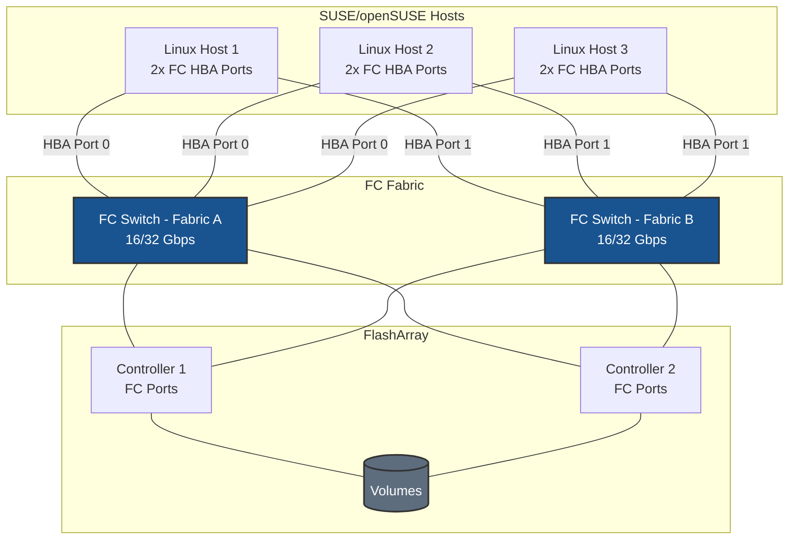

# Fibre Channel on SUSE/openSUSE - Best Practices Guide

Comprehensive best practices for deploying Fibre Channel storage on SUSE-based systems in production environments.

---



---

## Table of Contents
- [Architecture Overview](#architecture-overview)
- [SUSE-Specific Considerations](#suse-specific-considerations)
- [Fabric & Zoning Guidance](#fabric--zoning-guidance)
- [FC Architecture](#fc-architecture)
- [Multipath Configuration](#multipath-configuration)
- [Performance Tuning](#performance-tuning)
- [High Availability](#high-availability)
- [Monitoring & Maintenance](#monitoring--maintenance)
- [Security](#security)
- [Troubleshooting](#troubleshooting)

---

## Architecture Overview

### Deployment Topology



**Key points for SUSE/openSUSE:**
- Dual-fabric topology (Fabric A and Fabric B) required for redundancy
- Each HBA port connects to a separate fabric — never both ports to the same switch
- Minimum 2×2 topology (2 HBA ports × 2 array controller ports = 4 paths)
- No IP or network configuration required on the host for FC storage traffic

---

## SUSE-Specific Considerations

### Kernel and Driver Notes

SLES and openSUSE ship `lpfc` and `qla2xxx` HBA drivers in the standard kernel. SLES Enterprise subscribers have access to kernel live patching (kGraft) which does not require a reboot when applying kernel updates.

**Check running kernel:**
```bash
uname -r
```

**Verify FC modules are loaded:**
```bash
lsmod | grep -E "lpfc|qla2xxx|bnx2fc"

# Load manually if needed
sudo modprobe lpfc     # Broadcom/Emulex
sudo modprobe qla2xxx  # Marvell/QLogic
```

**Make module load persistent:**
```bash
echo "lpfc" | sudo tee -a /etc/modules-load.d/fc-hba.conf
# or
echo "qla2xxx" | sudo tee -a /etc/modules-load.d/fc-hba.conf
```

### Package Management

**Essential packages:**
```bash
sudo zypper install -y \
    multipath-tools \
    lvm2 \
    sg3_utils \
    sysfsutils

# Performance monitoring tools
sudo zypper install -y \
    sysstat \
    iotop \
    htop
```

**Verify installation:**
```bash
multipath -ll
systemctl status multipathd
```

### YaST Storage Notes

YaST provides a graphical interface for storage management on SLES. For FC storage:

- YaST > System > Partitioner can show the multipath device once it is configured
- For initial FC setup and `multipath.conf` configuration, **CLI is recommended** — YaST does not expose fine-grained multipath tuning parameters
- After LVM is configured via CLI, YaST can be used to monitor and manage the volume group

---

## Fabric & Zoning Guidance

### Single-Initiator Zoning (Required)

Each host WWPN must be in its own zone paired with the array's target ports.

**Correct zoning pattern:**
```
Zone: host1-hba0-to-array
  Members: host1-wwpn-hba0, array-ct0-port0, array-ct0-port1, array-ct1-port0, array-ct1-port1

Zone: host1-hba1-to-array
  Members: host1-wwpn-hba1, array-ct0-port2, array-ct0-port3, array-ct1-port2, array-ct1-port3
```

### Discovering WWPNs for Zoning

```bash
cat /sys/class/fc_host/host*/port_name
```

---

## FC Architecture

### How FC Storage Appears in Linux

```
FC Fabric
  └── HBA Driver (lpfc / qla2xxx)
        └── SCSI Mid-Layer
              └── SCSI Disk (sdX — one per path)
                    └── dm-multipath
                          └── /dev/mapper/mpathX  ← application uses this
                                └── LVM (optional)
```

Always target `/dev/mapper/` devices, never raw `sdX` paths. ALUA identifies preferred (active/optimized) vs. available (active/non-optimized) paths.

---

## Multipath Configuration

### Enable and Configure Multipath

```bash
sudo systemctl enable --now multipathd
```

### SUSE-Optimized multipath.conf

```bash
sudo tee /etc/multipath.conf > /dev/null <<'EOF'
defaults {
    find_multipaths         no
    polling_interval        10
    path_selector           "service-time 0"
    path_grouping_policy    group_by_prio
    failback                immediate
    no_path_retry           0
}

blacklist {
    devnode "^(ram|raw|loop|fd|md|dm-|sr|scd|st|nvme)[0-9]*"
    devnode "^sd[a]$"
    devnode "^vd[a-z]"
}

# Add device-specific settings for your storage array
# Consult your storage vendor documentation for recommended values
#devices {
#    device {
#        vendor               "VENDOR"
#        product              "PRODUCT"
#        path_selector        "service-time 0"
#        hardware_handler     "1 alua"
#        path_grouping_policy group_by_prio
#        prio                 alua
#        failback             immediate
#        path_checker         tur
#        fast_io_fail_tmo     5
#        dev_loss_tmo         60
#        no_path_retry        0
#    }
#}
EOF

sudo systemctl restart multipathd
sudo multipath -ll
```

---

## Performance Tuning

### HBA Queue Depth

**Tune Emulex (lpfc) queue depth:**
```bash
sudo tee /etc/modprobe.d/lpfc.conf > /dev/null <<'EOF'
options lpfc lpfc_lun_queue_depth=64
EOF

sudo dracut -f
sudo reboot
```

**Tune QLogic (qla2xxx) queue depth:**
```bash
sudo tee /etc/modprobe.d/qla2xxx.conf > /dev/null <<'EOF'
options qla2xxx ql2xmaxqdepth=64
EOF

sudo dracut -f
sudo reboot
```

### Device-Level Queue Depth

```bash
sudo tee /etc/udev/rules.d/99-pure-fc-queue-depth.rules > /dev/null <<'EOF'
ACTION=="add|change", SUBSYSTEM=="block", ATTRS{model}=="FlashArray*", ATTR{device/queue_depth}="64"
EOF

sudo udevadm control --reload-rules
sudo udevadm trigger
```

> **⚠️ Note:** These queue depth values are starting points for testing. Validate with performance monitoring (`iostat -x 1`, vendor telemetry) before deploying to production.

---

## High Availability

### Failover Timers

| Parameter | Recommended | Effect |
|-----------|-------------|--------|
| `fast_io_fail_tmo` | 5 seconds | Time to fail I/O after fabric reports link down |
| `dev_loss_tmo` | 60 seconds | Time before device is removed after persistent failure |
| `failback` | `immediate` | Restore preferred paths as soon as they come back online |

### Testing Path Failover

```bash
# Disable one path (replace sdb with actual device)
echo offline | sudo tee /sys/block/sdb/device/state

# Verify multipath reroutes
sudo multipath -ll

# Re-enable the path
echo running | sudo tee /sys/block/sdb/device/state
```

---

## Monitoring & Maintenance

### Check HBA Link State

```bash
cat /sys/class/fc_host/host*/port_state
cat /sys/class/fc_host/host*/link_failure_count
cat /sys/class/fc_host/host*/speed
```

### Monitor Multipath

```bash
sudo multipath -ll
sudo multipathd -k"show paths"
sudo journalctl -u multipathd -f
```

---

## Security

### FC Security Model

Fibre Channel security is implemented at the fabric level. Host-level authentication is not part of the FC transport. Security controls:

1. **Fabric zoning** — primary access control; only zoned initiators can communicate with target ports
2. **LUN masking / host registration** — the storage array independently enforces access based on WWPN registration and host group membership
3. **Hard zoning** — enforce at the switch port level for strongest isolation

**No host-level firewall is required for FC storage traffic.** FC does not traverse IP networks.



---

## Troubleshooting

### LUNs Not Appearing After Rescan

```bash
# 1. Verify HBA ports are online
cat /sys/class/fc_host/host*/port_state

# 2. Check HBA link errors
cat /sys/class/fc_host/host*/link_failure_count

# 3. Force rescan
sudo rescan-scsi-bus.sh -a -r
# or
for host in /sys/class/scsi_host/host*; do echo "- - -" | sudo tee "$host/scan"; done

# 4. Check device visibility
lsscsi
sudo multipath -ll
```

### Fewer Than Expected Paths

```bash
for h in /sys/class/fc_host/host*; do
    echo "$h: $(cat $h/port_state) — WWPN: $(cat $h/port_name)"
done
```

### Path Flapping

```bash
cat /sys/class/fc_host/host*/link_failure_count
cat /sys/class/fc_host/host*/loss_of_signal_count
sudo journalctl -k | grep -i "fc\|scsi" | tail -50
```

**Common causes:** Faulty SFP/cable, switch port errors, HBA firmware issue.
