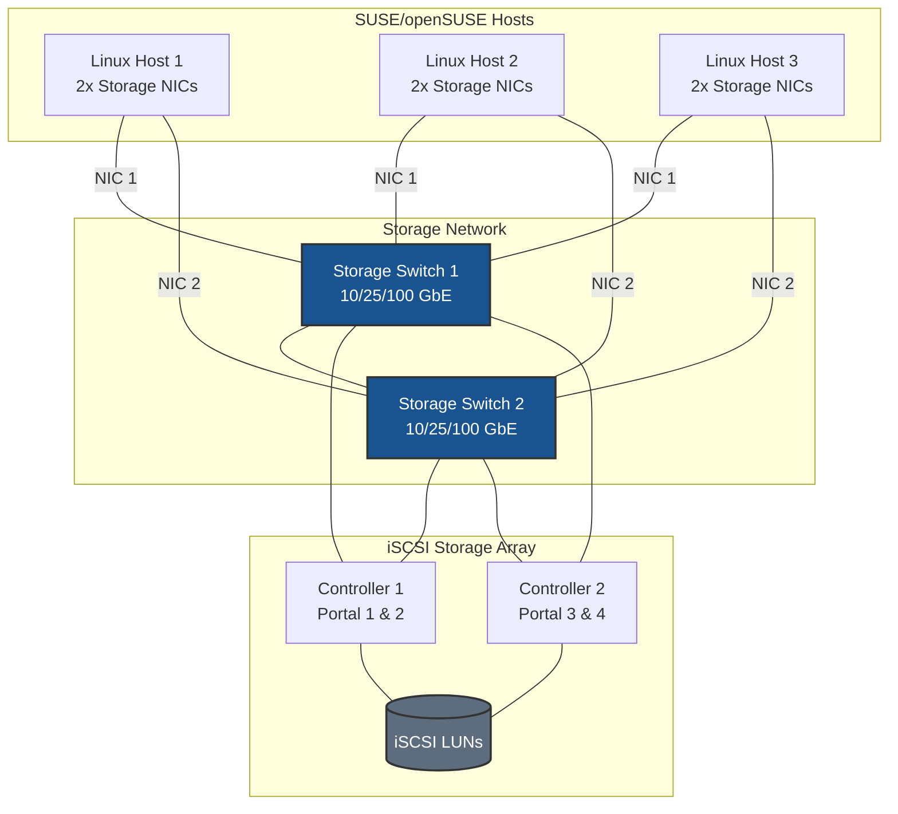
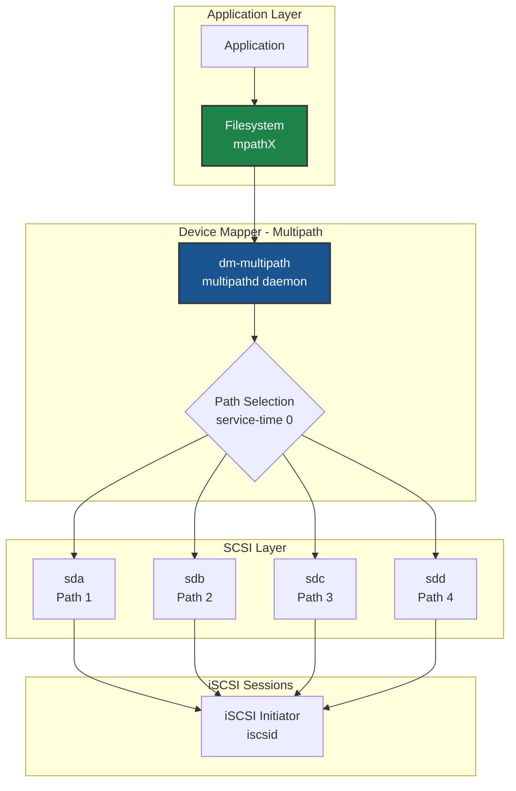
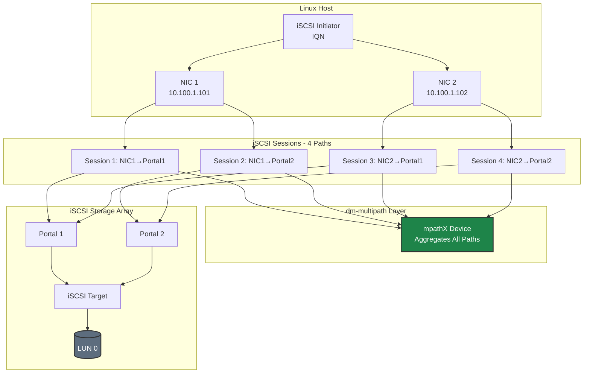
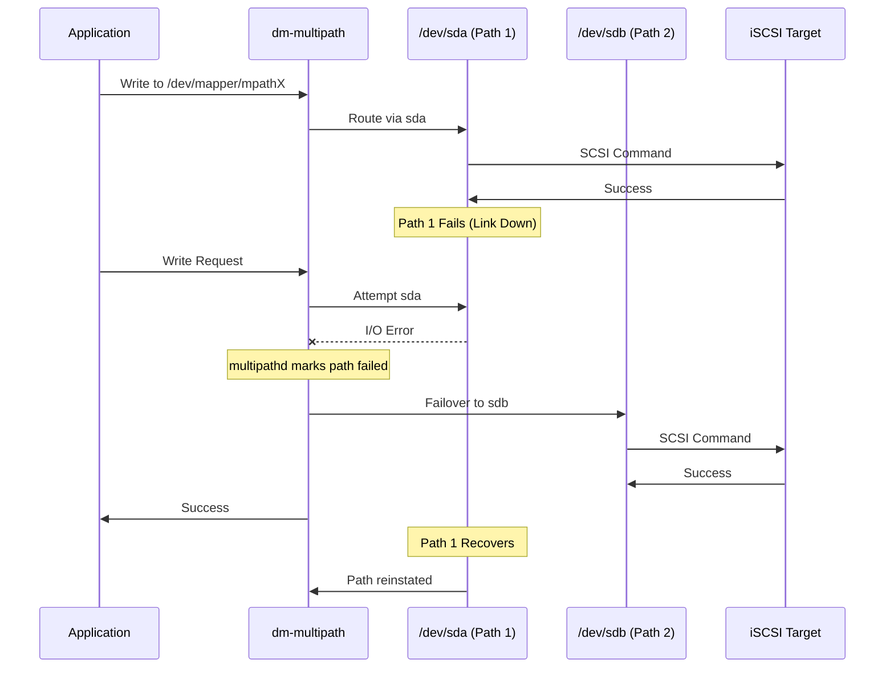
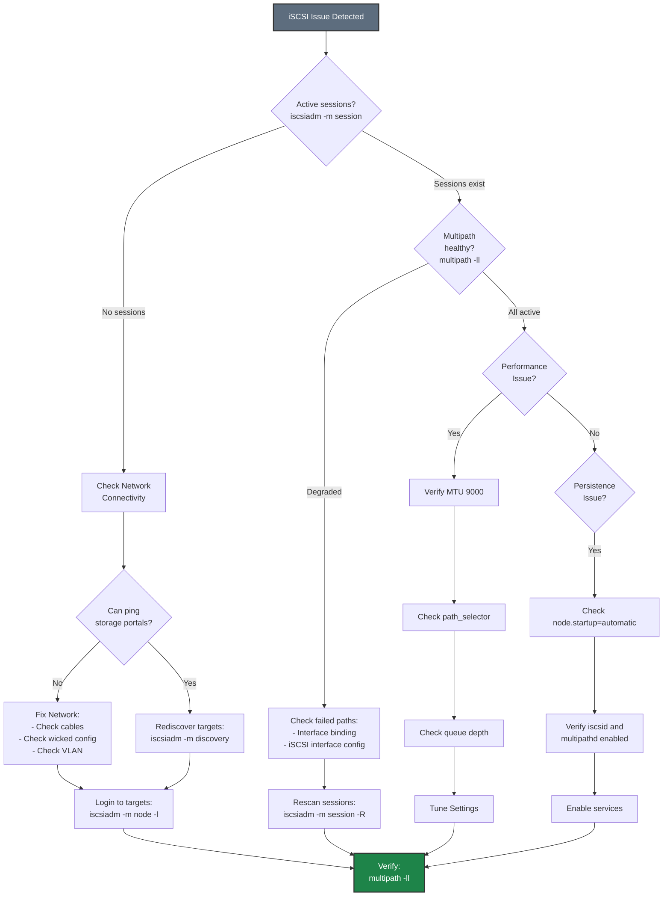

# iSCSI on SUSE/openSUSE - Best Practices Guide

Comprehensive best practices for deploying iSCSI storage on SUSE Linux Enterprise Server (SLES) and openSUSE systems in production environments.

---

## ⚠️ Important Disclaimers

> **Vendor Documentation Priority:**
> - This guide is **specific to Pure Storage configurations** and should be used in conjunction with official vendor documentation
> - Always consult and follow **SUSE/openSUSE official documentation** for complete system configuration
> - In case of any conflicts between this guide and vendor documentation, **vendor documentation takes precedence**
>
> **Testing Requirements:**
> - All configurations and recommendations in this guide are **for reference only**
> - **Test thoroughly in a lab environment** before implementing in production
> - Validate all settings with your specific hardware, software versions, and workload requirements
> - Performance and compatibility may vary based on your environment
>
> **Support:**
> - For Pure Storage-specific issues, contact Pure Storage Support
> - For SUSE/openSUSE issues, contact SUSE Support or community resources
> - This guide is provided as-is without warranty

---

## Table of Contents
- [Architecture Overview](#architecture-overview)
- [SUSE-Specific Considerations](#suse-specific-considerations)
- [Network Configuration](#network-configuration)
- [AppArmor Configuration](#apparmor-configuration)
- [Firewall Configuration](#firewall-configuration)
- [iSCSI Architecture](#iscsi-architecture)
- [Multipath Configuration](#multipath-configuration)
- [Performance Tuning](#performance-tuning)
- [High Availability](#high-availability)
- [Monitoring & Maintenance](#monitoring--maintenance)
- [Security](#security)
- [Troubleshooting](#troubleshooting)

---

## Architecture Overview

### Deployment Topology



### dm-multipath Architecture



**Key Design Principles:**
- **Dual switches** for network redundancy
- **Minimum 2 NICs per host** for multipath
- **Dual controller array** for storage HA
- **dm-multipath** aggregates all paths into single device

> **📊 More Diagrams:** See [Common Storage Topology](../../../common/includes/diagrams-storage-topology.md) and [iSCSI Multipath Diagrams](../../../common/includes/diagrams-iscsi-multipath.md) for additional diagrams.

---

## SUSE-Specific Considerations

### Distribution Differences

**SUSE Linux Enterprise Server (SLES):**
- Enterprise-grade, commercial distribution
- Long-term support (10-13 years)
- Requires subscription for updates
- Includes YaST for system management
- Optimized for SAP and enterprise workloads

**openSUSE:**
- **Leap**: Stable, aligned with SLES (recommended for production)
- **Tumbleweed**: Rolling release (latest packages, less stable)
- Community-supported
- Free to use

**Recommended versions:**
- **SLES**: 15 SP3 or later
- **openSUSE Leap**: 15.3 or later

### Subscription Management (SLES)

**Register SLES system:**
```bash
# Register with SUSE Customer Center
sudo SUSEConnect -r <registration_code>

# List available extensions
sudo SUSEConnect --list-extensions

# Activate High Availability extension (if needed)
sudo SUSEConnect -p sle-ha/15.4/x86_64

# Update system
sudo zypper refresh
sudo zypper update -y
```

**openSUSE (no registration required):**
```bash
# Update system
sudo zypper refresh
sudo zypper update -y
```

### Package Management

**Essential packages:**
```bash
# Core iSCSI and multipath tools
sudo zypper install -y \
    open-iscsi \
    multipath-tools \
    lvm2 \
    sg3_utils

# Performance monitoring tools
sudo zypper install -y \
    sysstat \
    iotop \
    iftop \
    htop \
    perf

# Network tools
sudo zypper install -y \
    ethtool \
    iproute2 \
    iputils \
    bind-utils

# YaST modules
sudo zypper install -y \
    yast2-iscsi-client \
    yast2-network

# Optional: Cluster tools (for HA)
sudo zypper install -y \
    pacemaker \
    corosync \
    crmsh
```

**Verify installation:**
```bash
# Check iSCSI initiator
iscsiadm --version

# Check multipath
multipath -ll

# Check services
systemctl status iscsid
systemctl status multipathd
```

### Kernel Requirements

**Check kernel version:**
```bash
uname -r

# Verify iSCSI module is available
modinfo iscsi_tcp
```

**Update kernel if needed:**
```bash
sudo zypper update kernel-default
sudo reboot
```

---

## Network Configuration

### Network Configuration Methods

**YaST (Recommended for SUSE):**
- GUI and CLI management
- Integrated system configuration
- Consistent across SUSE products

**wicked (Default network manager):**
- SUSE's network configuration framework
- XML-based configuration
- Replaces traditional ifcfg files

**NetworkManager (Alternative):**
- Available but not default
- Good for desktop environments

### Storage Network Configuration with YaST

**Using YaST CLI:**
```bash
# Configure storage interface with YaST
sudo yast lan add name=storage-iscsi-1 \
    ethdevice=ens1f0 \
    bootproto=static \
    ipaddr=10.100.1.101/24 \
    mtu=9000 \
    startmode=auto

sudo yast lan add name=storage-iscsi-2 \
    ethdevice=ens1f1 \
    bootproto=static \
    ipaddr=10.100.2.101/24 \
    mtu=9000 \
    startmode=auto

# Apply configuration
sudo systemctl restart wicked
```

**Using YaST GUI:**
```bash
# Launch YaST network configuration
sudo yast lan

# Follow GUI to:
# 1. Add new interface
# 2. Set static IP
# 3. Set MTU to 9000
# 4. Set to start on boot
# 5. Apply configuration
```

### Storage Network Configuration with wicked

**Create wicked configuration files:**
```bash
# Create configuration for first storage interface
sudo tee /etc/sysconfig/network/ifcfg-ens1f0 > /dev/null <<'EOF'
BOOTPROTO='static'
STARTMODE='auto'
IPADDR='10.100.1.101/24'
MTU='9000'
NAME='Storage iSCSI 1'
EOF

# Create configuration for second storage interface
sudo tee /etc/sysconfig/network/ifcfg-ens1f1 > /dev/null <<'EOF'
BOOTPROTO='static'
STARTMODE='auto'
IPADDR='10.100.2.101/24'
MTU='9000'
NAME='Storage iSCSI 2'
EOF

# Restart wicked
sudo systemctl restart wicked

# Verify
ip addr show ens1f0
ip addr show ens1f1
```

**Key wicked parameters:**
- `BOOTPROTO='static'` - Static IP configuration
- `STARTMODE='auto'` - Start on boot
- `MTU='9000'` - Jumbo frames

### MTU Configuration

```bash
# Verify MTU
ip link show ens1f0 | grep mtu

# Test MTU (jumbo frames)
ping -M do -s 8972 <storage_portal_ip>

# If using wicked, MTU is set in ifcfg file
# If using YaST, MTU can be set in GUI or CLI
```

**Important:** MTU must be 9000 end-to-end (host → switch → storage)

---

## AppArmor Configuration

### Understanding AppArmor on SUSE

**AppArmor status:**
- Available on SLES and openSUSE
- Not enabled by default on SLES (unlike Ubuntu)
- Can be enabled for additional security

**Check AppArmor status:**
```bash
sudo aa-status

# Check if AppArmor is enabled
sudo systemctl status apparmor
```

### Enable AppArmor (Optional)

**Enable AppArmor on SLES:**
```bash
# Install AppArmor
sudo zypper install -y apparmor-utils apparmor-profiles

# Enable AppArmor
sudo systemctl enable --now apparmor

# Check status
sudo aa-status
```

### AppArmor Profiles for iSCSI

**Check iSCSI-related profiles:**
```bash
# List loaded profiles
sudo aa-status | grep -i iscsi

# Check for denials
sudo dmesg | grep -i apparmor | grep -i iscsi
```

**Most iSCSI tools run unconfined by default on SUSE**

### AppArmor Best Practices

1. **Monitor for denials:**
   ```bash
   sudo dmesg | grep -i apparmor
   sudo journalctl | grep -i apparmor
   ```

2. **Use complain mode for testing:**
   ```bash
   # Set profile to complain mode
   sudo aa-complain /usr/sbin/iscsid

   # Set back to enforce mode
   sudo aa-enforce /usr/sbin/iscsid
   ```

---

## Firewall Configuration

### Option 1: Trusted Zone (Recommended for Dedicated Storage Networks)

For dedicated storage networks, **disable firewall filtering** on storage interfaces to eliminate CPU overhead from packet inspection. This is important for high-throughput iSCSI storage.

**Why disable filtering on storage interfaces:**
- **CPU overhead**: Firewall packet inspection adds latency and consumes CPU cycles
- **Performance impact**: At high IOPS, filtering overhead becomes significant
- **Network isolation**: Dedicated storage VLANs provide security at the network layer
- **Simplicity**: No port rules to maintain for storage traffic

#### Using firewalld (SLES 15+)

```bash
# Add storage interfaces to trusted zone (no packet filtering)
sudo firewall-cmd --permanent --zone=trusted --add-interface=ens1f0
sudo firewall-cmd --permanent --zone=trusted --add-interface=ens1f1

# Reload
sudo firewall-cmd --reload

# Verify
sudo firewall-cmd --zone=trusted --list-all
```

### Option 2: Port Filtering (For Shared or Non-Isolated Networks)

Use port filtering only when storage interfaces share a network with other traffic or when additional host-level security is required by policy.

> **⚠️ Performance Note:** Port filtering adds CPU overhead for every packet. For production storage with high IOPS requirements, use Option 1 with network-level isolation instead.

#### Using firewalld (SLES 15+)

```bash
# Enable firewalld
sudo systemctl enable --now firewalld

# Check status
sudo firewall-cmd --state

# Allow iSCSI traffic
sudo firewall-cmd --permanent --add-service=iscsi-target

# Or add port directly
sudo firewall-cmd --permanent --add-port=3260/tcp

# Reload firewall
sudo firewall-cmd --reload

# Verify
sudo firewall-cmd --list-all
```

#### Zone-Based Configuration with Port Filtering

**Dedicated storage zone with port filtering:**
```bash
# Create storage zone
sudo firewall-cmd --permanent --new-zone=storage

# Add storage interfaces to zone
sudo firewall-cmd --permanent --zone=storage --add-interface=ens1f0
sudo firewall-cmd --permanent --zone=storage --add-interface=ens1f1

# Allow iSCSI in storage zone
sudo firewall-cmd --permanent --zone=storage --add-port=3260/tcp

# Set target to DROP (deny by default except allowed ports)
sudo firewall-cmd --permanent --zone=storage --set-target=DROP

# Reload
sudo firewall-cmd --reload

# Verify
sudo firewall-cmd --zone=storage --list-all
```

#### Using YaST for Firewall Configuration

**Configure firewall with YaST:**
```bash
# Launch YaST firewall configuration
sudo yast firewall

# Or use YaST CLI
sudo yast firewall services add service=iscsi-target zone=public

# Verify
sudo firewall-cmd --list-all
```

---

## iSCSI Architecture

For comprehensive information on iSCSI architecture, topologies, and design principles, see:
- [iSCSI Architecture and Design](../../../common/includes/iscsi-architecture.md)

**Key points for SUSE:**
- Use dedicated storage networks (VLANs or physical)
- Minimum 2×2 topology (2 NICs × 2 portals = 4 paths)
- Static IP addressing (no DHCP)
- No default gateway on storage interfaces
- MTU 9000 end-to-end

---

## Multipath Configuration

For detailed multipath configuration information, see:
- [iSCSI Multipath Configuration](../../../common/includes/iscsi-multipath-config.md)

### SUSE-Specific Multipath Setup

**Enable and configure multipath:**
```bash
# Enable multipath
sudo systemctl enable --now multipathd

# Generate default configuration
sudo tee /etc/multipath.conf > /dev/null <<'EOF'
defaults {
    user_friendly_names yes
    find_multipaths no
    enable_foreign "^$"
}

blacklist {
    devnode "^(ram|raw|loop|fd|md|dm-|sr|scd|st)[0-9]*"
    devnode "^hd[a-z]"
    devnode "^cciss.*"
}

devices {
    device {
        vendor "PURE"
        product "FlashArray"
        path_selector "service-time 0"
        path_grouping_policy "group_by_prio"
        prio "alua"
        failback "immediate"
        path_checker "tur"
        fast_io_fail_tmo 10
        dev_loss_tmo 60
        no_path_retry 0
        hardware_handler "1 alua"
        rr_min_io_rq 1
    }
}
EOF

# Restart multipathd
sudo systemctl restart multipathd

# Verify configuration
sudo multipath -ll
```

### Using YaST for iSCSI Configuration

**Configure iSCSI with YaST:**
```bash
# Launch YaST iSCSI client
sudo yast iscsi-client

# Or use CLI
# Discover targets
sudo yast iscsi-client discovery ip=<portal_ip> port=3260

# Login to target
sudo yast iscsi-client connect target=<target_iqn> portal=<portal_ip>:3260
```

---

## Performance Tuning

For comprehensive performance tuning information, see:
- [iSCSI Performance Tuning](../../../common/includes/iscsi-performance-tuning.md)
- [General Performance Tuning](../../../common/includes/performance-tuning.md)

### SUSE-Specific Tuning

#### Kernel Parameters

**Optimize kernel for iSCSI:**
```bash
# Create sysctl configuration
sudo tee /etc/sysctl.d/99-iscsi-suse.conf > /dev/null <<'EOF'
# Network performance
net.core.netdev_max_backlog = 5000
net.core.rmem_max = 134217728
net.core.wmem_max = 134217728
net.ipv4.tcp_rmem = 4096 87380 67108864
net.ipv4.tcp_wmem = 4096 65536 67108864

# Connection tracking
net.netfilter.nf_conntrack_max = 1048576

# Low latency
net.ipv4.tcp_low_latency = 1

# VM tuning for storage
vm.dirty_ratio = 10
vm.dirty_background_ratio = 5
vm.swappiness = 10

# ARP settings for same-subnet multipath (CRITICAL)
# Prevents ARP responses on wrong interface when multiple NICs share same subnet
# See: ../../../common/includes/network-concepts.md for detailed explanation
net.ipv4.conf.all.arp_ignore = 2
net.ipv4.conf.default.arp_ignore = 2
net.ipv4.conf.all.arp_announce = 2
net.ipv4.conf.default.arp_announce = 2
# Interface-specific (adjust interface names as needed)
net.ipv4.conf.ens1f0.arp_ignore = 2
net.ipv4.conf.ens1f1.arp_ignore = 2
net.ipv4.conf.ens1f0.arp_announce = 2
net.ipv4.conf.ens1f1.arp_announce = 2
EOF

# Apply settings
sudo sysctl -p /etc/sysctl.d/99-iscsi-suse.conf
```

#### I/O Scheduler

**Set I/O scheduler for iSCSI devices:**
```bash
# Create udev rule
sudo tee /etc/udev/rules.d/99-iscsi-scheduler.rules > /dev/null <<'EOF'
# Set I/O scheduler for iSCSI devices (SSD/Flash)
ACTION=="add|change", KERNEL=="sd[a-z]", ATTR{queue/rotational}=="0", ATTR{queue/scheduler}="none"

# Set queue depth
ACTION=="add|change", KERNEL=="sd[a-z]", ATTR{device/vendor}=="PURE", ATTR{device/queue_depth}="128"

# Set read-ahead
ACTION=="add|change", KERNEL=="sd[a-z]", ATTR{device/vendor}=="PURE", ATTR{bdi/read_ahead_kb}="128"
EOF

# Reload udev rules
sudo udevadm control --reload-rules
sudo udevadm trigger
```

#### Filesystem Considerations

**SUSE default filesystem: Btrfs**
```bash
# Btrfs is default on SLES 15+
# For iSCSI storage, consider XFS for better performance

# Create XFS filesystem on multipath device
sudo mkfs.xfs -f -K /dev/mapper/mpatha

# Mount with optimized options
sudo mount -o noatime,nodiratime,logbufs=8,logbsize=256k /dev/mapper/mpatha /mnt/data

# Add to /etc/fstab
echo "/dev/mapper/mpatha /mnt/data xfs noatime,nodiratime,logbufs=8,logbsize=256k 0 0" | sudo tee -a /etc/fstab
```

**Btrfs optimization (if using Btrfs):**
```bash
# Create Btrfs filesystem
sudo mkfs.btrfs -f /dev/mapper/mpatha

# Mount with optimized options
sudo mount -o noatime,compress=lzo,space_cache=v2 /dev/mapper/mpatha /mnt/data

# Add to /etc/fstab
echo "/dev/mapper/mpatha /mnt/data btrfs noatime,compress=lzo,space_cache=v2 0 0" | sudo tee -a /etc/fstab
```

---

## High Availability

### iSCSI Path Redundancy Model



### Failover Behavior



> **📊 More Diagrams:** See [iSCSI Multipath Diagrams](../../../common/includes/diagrams-iscsi-multipath.md) and [Failover Diagrams](../../../common/includes/diagrams-failover.md) for additional details.

### Cluster Configuration with Pacemaker

**Install cluster packages:**
```bash
# Install Pacemaker and Corosync
sudo zypper install -y pacemaker corosync crmsh fence-agents

# Enable cluster services
sudo systemctl enable --now pacemaker
sudo systemctl enable --now corosync

# Check cluster status
sudo crm status
```

### Using YaST for Cluster Configuration

**Configure cluster with YaST:**
```bash
# Install YaST cluster module
sudo zypper install -y yast2-cluster

# Launch YaST cluster configuration
sudo yast cluster

# Follow GUI to configure:
# 1. Cluster name
# 2. Node membership
# 3. Communication settings
# 4. Resources
```

### Shared Storage Resources

**Configure iSCSI LVM as cluster resource:**
```bash
# Create LVM volume group on multipath device
sudo vgcreate vg_iscsi /dev/mapper/mpatha

# Create logical volume
sudo lvcreate -L 100G -n lv_data vg_iscsi

# Create filesystem
sudo mkfs.xfs /dev/vg_iscsi/lv_data

# Add to cluster as resource using crm
sudo crm configure primitive fs_data Filesystem \
    params device="/dev/vg_iscsi/lv_data" directory="/mnt/data" fstype="xfs" \
    op monitor interval="20s"

# Verify
sudo crm status
```

---

## Monitoring & Maintenance

For general monitoring and maintenance procedures, see:
- [Monitoring & Maintenance](../../../common/includes/monitoring-maintenance.md)

### SUSE-Specific Monitoring

#### Using systemd Journal

**Monitor iSCSI services:**
```bash
# View iSCSI logs
sudo journalctl -u iscsid -f

# View multipath logs
sudo journalctl -u multipathd -f

# View all storage-related logs
sudo journalctl -u iscsid -u multipathd -u lvm2-* --since "1 hour ago"
```

#### Performance Monitoring with sysstat

**Install and configure sysstat:**
```bash
# Install
sudo zypper install -y sysstat

# Enable data collection
sudo systemctl enable --now sysstat

# View I/O statistics
sar -d 1 10

# View network statistics
sar -n DEV 1 10
```

#### Using YaST for System Monitoring

**Monitor system with YaST:**
```bash
# Launch YaST system information
sudo yast sysconfig

# View logs with YaST
sudo yast logs
```

---

## Security

For general security best practices, see:
- [Security Best Practices](../../../common/includes/security-best-practices.md)

### SUSE-Specific Security

#### CHAP Authentication

**Configure CHAP on initiator:**
```bash
# Set CHAP credentials
sudo iscsiadm -m node -T <target_iqn> -p <portal_ip>:3260 \
    -o update -n node.session.auth.authmethod -v CHAP

sudo iscsiadm -m node -T <target_iqn> -p <portal_ip>:3260 \
    -o update -n node.session.auth.username -v <username>

sudo iscsiadm -m node -T <target_iqn> -p <portal_ip>:3260 \
    -o update -n node.session.auth.password -v <password>

# Reconnect with CHAP
sudo iscsiadm -m node -T <target_iqn> -p <portal_ip>:3260 --logout
sudo iscsiadm -m node -T <target_iqn> -p <portal_ip>:3260 --login
```

#### Audit Logging

**Enable audit logging for iSCSI:**
```bash
# Install auditd (usually pre-installed)
sudo zypper install -y audit

# Enable auditd
sudo systemctl enable --now auditd

# Add audit rules
sudo tee -a /etc/audit/rules.d/iscsi.rules > /dev/null <<'EOF'
# Monitor iSCSI configuration changes
-w /etc/iscsi/ -p wa -k iscsi_config
-w /etc/multipath.conf -p wa -k multipath_config

# Monitor iSCSI commands
-a always,exit -F arch=b64 -S execve -F path=/usr/sbin/iscsiadm -k iscsi_commands
EOF

# Reload audit rules
sudo augenrules --load

# View iSCSI audit events
sudo ausearch -k iscsi_config
sudo ausearch -k iscsi_commands
```

---

## Troubleshooting

### Troubleshooting Flowchart



> **📊 More Diagrams:** See [Troubleshooting Flowcharts](../../../common/includes/diagrams-troubleshooting.md) for detailed procedures.

For common troubleshooting procedures, see:
- [Common Troubleshooting](../../../common/includes/troubleshooting-common.md)

### SUSE-Specific Troubleshooting

#### Check Service Status

```bash
# Check all iSCSI-related services
sudo systemctl status iscsid
sudo systemctl status iscsi
sudo systemctl status multipathd

# Check for failed services
sudo systemctl --failed | grep -E "iscsi|multipath"

# View detailed service logs
sudo journalctl -xe -u iscsid
```

#### Network Troubleshooting with wicked

```bash
# Check wicked status
sudo systemctl status wicked

# Show interface configuration
sudo wicked show all

# Reload wicked configuration
sudo systemctl restart wicked

# Debug wicked
sudo wicked ifup --debug all ens1f0
```

#### Using YaST for Troubleshooting

```bash
# Check system logs with YaST
sudo yast logs

# Check network configuration
sudo yast lan

# Check iSCSI configuration
sudo yast iscsi-client
```

#### Multipath Troubleshooting

```bash
# Verbose multipath output
sudo multipath -v3

# Reload multipath configuration
sudo systemctl reload multipathd

# Reconfigure all devices
sudo multipath -r

# Check for blacklisted devices
sudo multipath -v3 | grep -i blacklist

# View device mapper tables
sudo dmsetup table
sudo dmsetup status
```

---

## Additional Resources

- [SUSE Linux Enterprise Server Documentation](https://documentation.suse.com/sles/)
- [openSUSE Documentation](https://doc.opensuse.org/)
- [iSCSI Quick Start](./QUICKSTART.md)
- [Common Network Concepts](../../../common/includes/network-concepts.md)
- [Multipath Concepts](../../../common/includes/multipath-concepts.md)

---

## Quick Reference

**Discover targets:**
```bash
sudo iscsiadm -m discovery -t sendtargets -p <portal_ip>:3260
```

**Login to target:**
```bash
sudo iscsiadm -m node -T <target_iqn> -p <portal_ip>:3260 --login
```

**Check sessions:**
```bash
sudo iscsiadm -m session
```

**Check multipath:**
```bash
sudo multipath -ll
```

**Restart services:**
```bash
sudo systemctl restart iscsid multipathd
```

**Check logs:**
```bash
sudo journalctl -u iscsid -u multipathd -f
```

**Using YaST:**
```bash
# iSCSI configuration
sudo yast iscsi-client

# Network configuration
sudo yast lan

# Firewall configuration
sudo yast firewall
```

