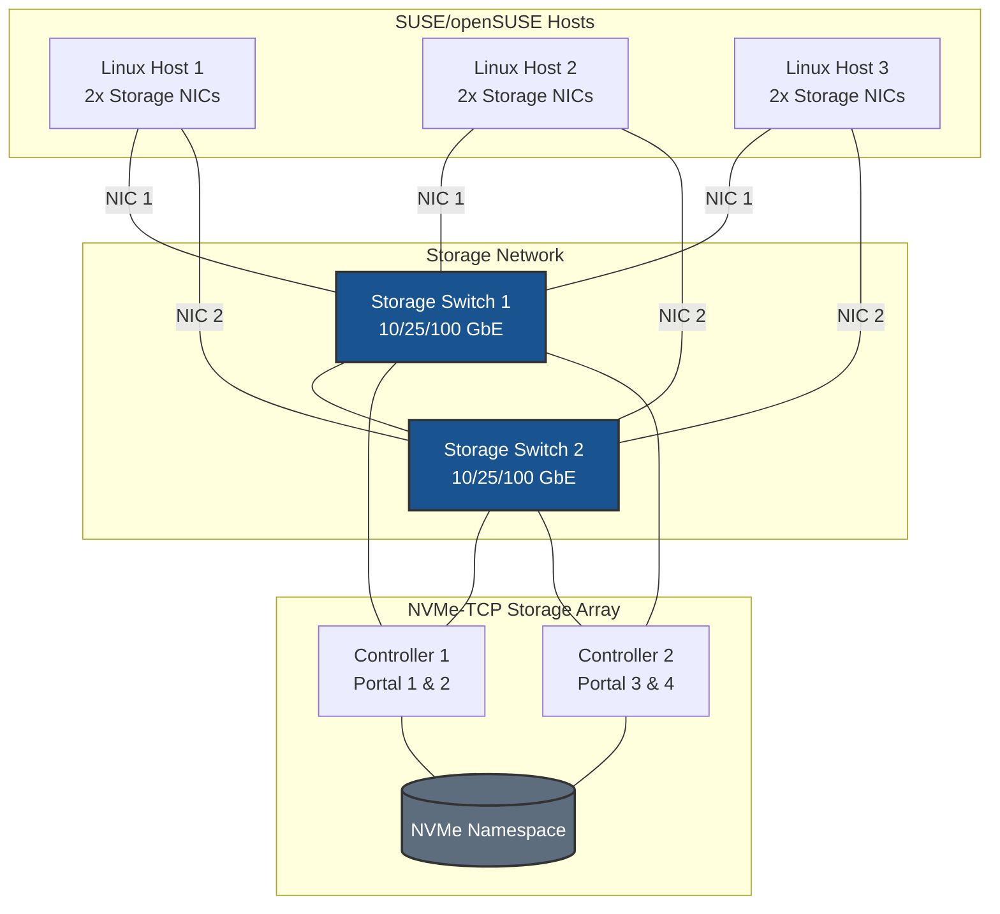
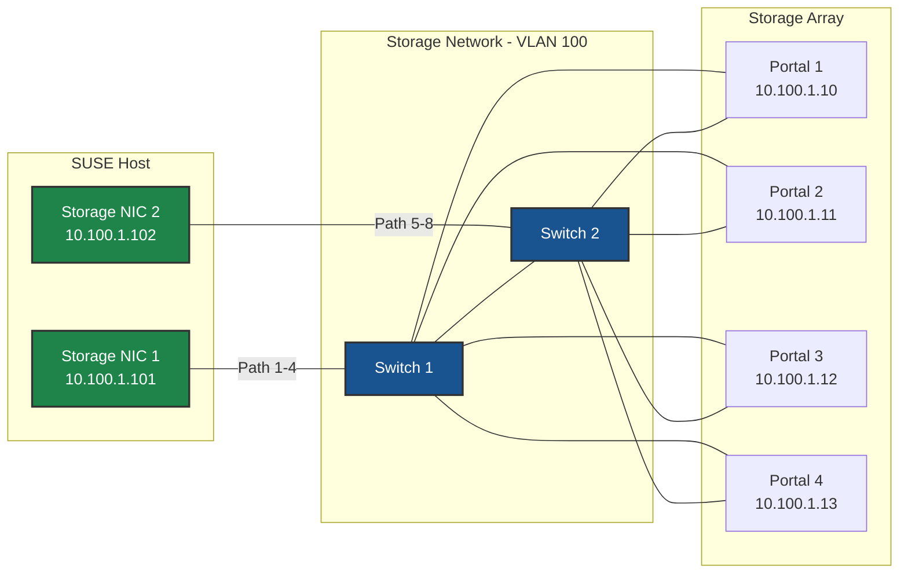
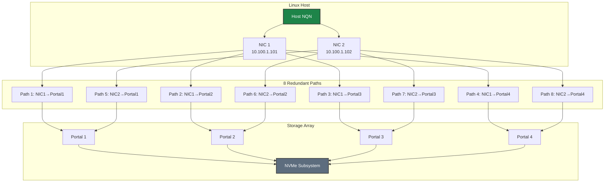
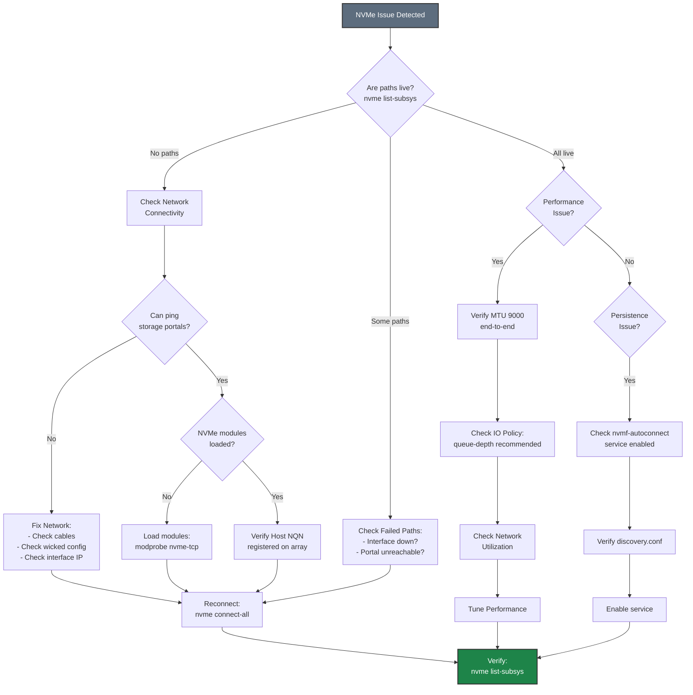

# NVMe-TCP on SUSE/openSUSE - Best Practices Guide

Comprehensive best practices for deploying NVMe-TCP storage on SUSE Linux Enterprise Server (SLES) and openSUSE systems in production environments.

---



---

## Table of Contents
- [Architecture Overview](#architecture-overview)
- [SUSE-Specific Considerations](#suse-specific-considerations)
- [Network Configuration](#network-configuration)
- [AppArmor Configuration](#apparmor-configuration)
- [Firewall Configuration](#firewall-configuration)
- [Performance Tuning](#performance-tuning)
- [High Availability](#high-availability)
- [Monitoring & Maintenance](#monitoring--maintenance)
- [Security](#security)
- [Troubleshooting](#troubleshooting)

---

## Architecture Overview

### Deployment Topology



### Network Architecture



**Key Design Principles:**
- **Dual switches** for network redundancy
- **Minimum 2 NICs per host** for multipath
- **Dual controller array** for storage HA
- **8 paths** (2 NICs × 4 portals) for maximum redundancy





---

## SUSE-Specific Considerations

### SLES vs openSUSE

**SUSE Linux Enterprise Server (SLES):**
- Enterprise-grade, commercial support
- Long-term support (10-13 years)
- Certified for enterprise workloads
- Requires active subscription
- Conservative package updates
- Recommended for production storage

**openSUSE Leap:**
- Community-supported
- Based on SLES codebase
- Free to use
- Shorter support cycle (18 months)
- Good for non-critical workloads

**openSUSE Tumbleweed:**
- Rolling release
- Latest packages
- Not recommended for production storage
- Good for testing/development

### Recommended Versions

**Production deployments:**
- **SLES:** 15 SP3, SP4, or SP5
- **openSUSE Leap:** 15.3, 15.4, or 15.5

**Kernel requirements:**
- Minimum: Kernel 5.3 (SLES 15 SP2)
- Recommended: Kernel 5.14+ (SLES 15 SP4)

**Check kernel version:**
```bash
uname -r

# Verify NVMe-TCP module is available
modinfo nvme-tcp
```

### Subscription Management (SLES)

**Register system:**
```bash
# Register with SUSE Customer Center
sudo SUSEConnect -r <REGISTRATION_CODE>

# List available extensions
sudo SUSEConnect --list-extensions

# Activate required modules
sudo SUSEConnect -p sle-module-server-applications/15.5/x86_64

# Update system
sudo zypper refresh
sudo zypper update -y
```

**Check subscription status:**
```bash
sudo SUSEConnect --status
```

### Package Management

**Essential packages:**
```bash
# Core NVMe and multipath tools
sudo zypper install -y \
    nvme-cli \
    multipath-tools \
    lvm2 \
    sg3_utils

# Performance monitoring tools
sudo zypper install -y \
    sysstat \
    iotop \
    iftop \
    htop \
    perf

# Network tools
sudo zypper install -y \
    ethtool \
    iproute2 \
    iputils \
    bind-utils

# YaST modules
sudo zypper install -y \
    yast2-network \
    yast2-firewall \
    yast2-storage-ng
```

---

## Network Configuration

### Wicked Best Practices

**Why Wicked:**
- Default network manager in SLES/openSUSE
- Designed for enterprise environments
- Better integration with YaST
- Supports complex network configurations
- Consistent across SUSE ecosystem

**Wicked architecture:**
- `wickedd` - Main daemon
- `wickedd-nanny` - Policy manager
- Configuration in `/etc/sysconfig/network/`

### Storage Network Configuration

#### Dedicated Interfaces

```bash
# Create configuration for storage interface
sudo tee /etc/sysconfig/network/ifcfg-ens1f0 > /dev/null <<EOF
BOOTPROTO='static'
STARTMODE='auto'
IPADDR='10.100.1.101/24'
MTU='9000'
NAME='Storage Network 1'
# Prevent default route
DHCLIENT_SET_DEFAULT_ROUTE='no'
# NIC tuning
ETHTOOL_OPTIONS='rx 4096 tx 4096; -C rx-usecs 50 tx-usecs 50; -K tso on gso on gro on'
EOF

# Second storage interface
sudo tee /etc/sysconfig/network/ifcfg-ens1f1 > /dev/null <<EOF
BOOTPROTO='static'
STARTMODE='auto'
IPADDR='10.100.2.101/24'
MTU='9000'
NAME='Storage Network 2'
DHCLIENT_SET_DEFAULT_ROUTE='no'
ETHTOOL_OPTIONS='rx 4096 tx 4096; -C rx-usecs 50 tx-usecs 50; -K tso on gso on gro on'
EOF

# Reload wicked configuration
sudo wicked ifreload all

# Verify
wicked ifstatus all
```

#### Bond Configuration for HA

```bash
# Create bond configuration
sudo tee /etc/sysconfig/network/ifcfg-bond0 > /dev/null <<EOF
BOOTPROTO='static'
STARTMODE='auto'
IPADDR='10.100.1.101/24'
MTU='9000'
BONDING_MASTER='yes'
BONDING_SLAVE_0='ens1f0'
BONDING_SLAVE_1='ens1f1'
BONDING_MODULE_OPTS='mode=active-backup miimon=100 primary=ens1f0'
EOF

# Create slave configurations
sudo tee /etc/sysconfig/network/ifcfg-ens1f0 > /dev/null <<EOF
BOOTPROTO='none'
STARTMODE='hotplug'
MTU='9000'
EOF

sudo tee /etc/sysconfig/network/ifcfg-ens1f1 > /dev/null <<EOF
BOOTPROTO='none'
STARTMODE='hotplug'
MTU='9000'
EOF

# Reload configuration
sudo wicked ifreload all
```

**Bond modes:**
- `mode=active-backup` (mode=1) - Active-passive failover (recommended for storage)
- `mode=802.3ad` (mode=4) - LACP (requires switch support)
- `mode=balance-xor` (mode=2) - Load balancing

### YaST Network Configuration

**Using YaST for network setup:**
```bash
# Launch YaST network module
sudo yast2 lan

# Or command-line
sudo yast lan edit id=0 bootproto=static ipaddr=10.100.1.101/24 mtu=9000
```

**YaST advantages:**
- GUI/TUI interface
- Validates configuration
- Integrates with other YaST modules
- Generates wicked configuration files

### MTU Configuration

```bash
# Test MTU end-to-end
ping -M do -s 8972 <storage_portal_ip>

# Set MTU in wicked config (shown above)
# Or temporarily
sudo ip link set ens1f0 mtu 9000
```

---

## AppArmor Configuration

### Understanding AppArmor on SUSE

**AppArmor status:**
- Enabled by default on SLES 15+
- Path-based mandatory access control
- Simpler than SELinux
- Integrated with YaST

**Check AppArmor status:**
```bash
sudo aa-status

# Check if AppArmor is enabled
sudo systemctl status apparmor
```

### AppArmor Profiles for NVMe-TCP

**Check for denials:**
```bash
# View AppArmor messages
sudo dmesg | grep -i apparmor
sudo journalctl | grep -i apparmor

# Check audit log
sudo grep -i apparmor /var/log/audit/audit.log
```

**Using YaST for AppArmor:**
```bash
# Launch YaST AppArmor module
sudo yast2 apparmor

# Or command-line tools
sudo aa-status
```

**AppArmor and NVMe-TCP:**

> **Note:** NVMe-TCP uses native NVMe multipathing, NOT dm-multipath (`multipathd`). There is no `multipathd` service for NVMe-TCP, so you don't need to create AppArmor profiles for it.

**If you have custom applications accessing NVMe devices:**
```bash
# Install AppArmor utilities
sudo zypper install -y apparmor-utils

# Check if any AppArmor denials related to NVMe
sudo dmesg | grep -i apparmor | grep nvme

# If you have custom scripts accessing NVMe devices,
# you may need to add these permissions to their profiles:
# /dev/nvme* rw,
# /sys/class/nvme/** r,
# /sys/devices/**/nvme*/** r,
```

---

## Firewall Configuration

### Option 1: Trusted Zone (Recommended for Dedicated Storage Networks)

For dedicated storage networks, **disable firewall filtering** on storage interfaces to eliminate CPU overhead from packet inspection. This is critical for high-throughput NVMe-TCP storage.

**Why disable filtering on storage interfaces:**
- **CPU overhead**: Firewall packet inspection adds latency and consumes CPU cycles
- **Performance impact**: At high IOPS (millions with NVMe-TCP), filtering overhead becomes significant
- **Network isolation**: Dedicated storage VLANs provide security at the network layer
- **Simplicity**: No port rules to maintain for storage traffic

```bash
# Add storage interfaces to trusted zone (no packet filtering)
sudo firewall-cmd --permanent --zone=trusted --add-interface=ens1f0
sudo firewall-cmd --permanent --zone=trusted --add-interface=ens1f1

# Reload
sudo firewall-cmd --reload

# Verify
sudo firewall-cmd --zone=trusted --list-all
```

### Option 2: Port Filtering (For Shared or Non-Isolated Networks)

Use port filtering only when storage interfaces share a network with other traffic or when additional host-level security is required by policy.

> **⚠️ Performance Note:** Port filtering adds CPU overhead for every packet. For production storage with high IOPS requirements, use Option 1 with network-level isolation instead.

#### Using firewalld (SLES 15+/openSUSE)

```bash
# Allow NVMe-TCP ports
# Port 4420 = Data port (connections)
# Port 8009 = Discovery port (optional, for nvme discover)
sudo firewall-cmd --permanent --add-port=4420/tcp
sudo firewall-cmd --permanent --add-port=8009/tcp

# Reload firewall
sudo firewall-cmd --reload

# Verify
sudo firewall-cmd --list-ports
```

#### Rich rules for advanced filtering

```bash
# Allow NVMe-TCP only from specific subnet
sudo firewall-cmd --permanent --zone=storage --add-rich-rule='
  rule family="ipv4"
  source address="10.100.1.0/24"
  port protocol="tcp" port="4420" accept'

sudo firewall-cmd --permanent --zone=storage --add-rich-rule='
  rule family="ipv4"
  source address="10.100.1.0/24"
  port protocol="tcp" port="8009" accept'

# Reload
sudo firewall-cmd --reload
```

#### Using YaST Firewall

```bash
# Launch YaST firewall module
sudo yast2 firewall

# Or command-line (4420 = data, 8009 = discovery)
sudo yast firewall services add tcpport=4420 zone=EXT
sudo yast firewall services add tcpport=8009 zone=EXT
```

---

## Performance Tuning

### Sysctl Tuning

**Create sysctl configuration:**
```bash
sudo tee /etc/sysctl.d/90-nvme-tcp-storage.conf > /dev/null <<'EOF'
# Network buffer sizes
net.core.rmem_max = 134217728
net.core.wmem_max = 134217728
net.core.rmem_default = 16777216
net.core.wmem_default = 16777216
net.ipv4.tcp_rmem = 4096 87380 67108864
net.ipv4.tcp_wmem = 4096 65536 67108864

# Network performance
net.core.netdev_max_backlog = 30000
net.core.somaxconn = 4096
net.ipv4.tcp_window_scaling = 1
net.ipv4.tcp_timestamps = 0
net.ipv4.tcp_sack = 1

# VM tuning
vm.dirty_ratio = 10
vm.dirty_background_ratio = 5
vm.swappiness = 10

# ARP cache
net.ipv4.neigh.default.gc_thresh1 = 4096
net.ipv4.neigh.default.gc_thresh2 = 8192
net.ipv4.neigh.default.gc_thresh3 = 16384

# ARP settings for same-subnet multipath (CRITICAL)
# Prevents ARP responses on wrong interface when multiple NICs share same subnet
# See: Network Concepts documentation for detailed explanation
net.ipv4.conf.all.arp_ignore = 2
net.ipv4.conf.default.arp_ignore = 2
net.ipv4.conf.all.arp_announce = 2
net.ipv4.conf.default.arp_announce = 2
# Interface-specific (adjust interface names as needed)
net.ipv4.conf.ens1f0.arp_ignore = 2
net.ipv4.conf.ens1f1.arp_ignore = 2
net.ipv4.conf.ens1f0.arp_announce = 2
net.ipv4.conf.ens1f1.arp_announce = 2
EOF

# Apply settings
sudo sysctl -p /etc/sysctl.d/90-nvme-tcp-storage.conf
```

### NIC Tuning with Wicked

**Integrated in wicked configuration:**
```bash
# Edit interface configuration
sudo nano /etc/sysconfig/network/ifcfg-ens1f0

# Add ETHTOOL_OPTIONS
ETHTOOL_OPTIONS='-G ${INTERFACE} rx 4096 tx 4096; -C ${INTERFACE} rx-usecs 50 tx-usecs 50; -K ${INTERFACE} tso on gso on gro on'

# Reload
sudo wicked ifreload ens1f0
```

**Or create systemd service:**
```bash
sudo tee /etc/systemd/system/tune-storage-nics.service > /dev/null <<'EOF'
[Unit]
Description=Tune storage network interfaces
After=network-online.target wicked.service
Wants=network-online.target

[Service]
Type=oneshot
RemainAfterExit=yes
ExecStart=/usr/local/bin/tune-storage-nics.sh

[Install]
WantedBy=multi-user.target
EOF

# Create tuning script
sudo tee /usr/local/bin/tune-storage-nics.sh > /dev/null <<'EOF'
#!/bin/bash

INTERFACES="ens1f0 ens1f1"

for iface in $INTERFACES; do
    if [ -d "/sys/class/net/$iface" ]; then
        echo "Tuning $iface..."
        ethtool -G $iface rx 4096 tx 4096 2>/dev/null || true
        ethtool -C $iface rx-usecs 50 tx-usecs 50 2>/dev/null || true
        ethtool -K $iface tso on gso on gro on 2>/dev/null || true
        ethtool -A $iface rx on tx on 2>/dev/null || true
        echo "$iface tuned successfully"
    fi
done
EOF

sudo chmod +x /usr/local/bin/tune-storage-nics.sh
sudo systemctl enable --now tune-storage-nics.service
```

### CPU Governor

**Set performance governor:**
```bash
# Install cpupower
sudo zypper install -y cpupower

# Set to performance
sudo cpupower frequency-set -g performance

# Make persistent
echo 'CPUPOWER_START_OPTS="frequency-set -g performance"' | \
    sudo tee /etc/sysconfig/cpupower

# Enable service
sudo systemctl enable --now cpupower
```

### IRQ Affinity

**Install irqbalance:**
```bash
sudo zypper install -y irqbalance

# Configure
sudo tee /etc/sysconfig/irqbalance > /dev/null <<EOF
IRQBALANCE_BANNED_CPUS=00000001
EOF

# Enable and start
sudo systemctl enable --now irqbalance
```

### I/O Scheduler

**Set I/O scheduler for NVMe:**
```bash
# Set to 'none' for NVMe
echo none | sudo tee /sys/block/nvme*/queue/scheduler

# Make persistent with udev
sudo tee /etc/udev/rules.d/60-nvme-scheduler.rules > /dev/null <<'EOF'
ACTION=="add|change", KERNEL=="nvme[0-9]n[0-9]", ATTR{queue/scheduler}="none"
EOF

# Reload udev
sudo udevadm control --reload-rules
sudo udevadm trigger
```

### Kernel Boot Parameters

**Edit GRUB configuration:**
```bash
# Edit /etc/default/grub
sudo nano /etc/default/grub

# Add to GRUB_CMDLINE_LINUX:
# isolcpus=2,3,10,11 nohz_full=2,3,10,11 rcu_nocbs=2,3,10,11 intel_iommu=on iommu=pt

# Update GRUB
sudo grub2-mkconfig -o /boot/grub2/grub.cfg

# Reboot
sudo reboot
```

---

## High Availability

### Path Redundancy Model







### Native NVMe Multipath Configuration for HA

NVMe-TCP uses **native NVMe multipathing** built into the Linux kernel. This is NOT dm-multipath (`multipath.conf`, `multipathd`) - those are for iSCSI/Fibre Channel only.

**Enable Native NVMe Multipath:**
```bash
# Enable native NVMe multipathing
echo 'options nvme_core multipath=Y' | sudo tee /etc/modprobe.d/nvme-tcp.conf

# Reboot to apply (required if nvme_core already loaded)
sudo reboot
```

**Configure IO Policy for HA:**
```bash
# Create udev rule for NVMe IO policy
sudo tee /etc/udev/rules.d/99-nvme-iopolicy.rules > /dev/null <<'EOF'
# Set IO policy to queue-depth for all NVMe subsystems (recommended for HA)
ACTION=="add|change", SUBSYSTEM=="nvme-subsystem", ATTR{iopolicy}="queue-depth"
EOF

# Reload udev rules
sudo udevadm control --reload-rules
sudo udevadm trigger
```

**Configure NVMe Connection Timeouts for HA:**
```bash
# When connecting, use appropriate timeout values
# ctrl-loss-tmo: Time to wait before declaring controller lost (seconds)
# reconnect-delay: Delay between reconnection attempts (seconds)

# Example: Conservative HA settings
nvme connect -t tcp -a <IP> -s 4420 -n <NQN> \
    --ctrl-loss-tmo=1800 \
    --reconnect-delay=10

# For faster failover (may cause more transient errors):
nvme connect -t tcp -a <IP> -s 4420 -n <NQN> \
    --ctrl-loss-tmo=600 \
    --reconnect-delay=5
```

**Verify Native Multipath Status:**
```bash
# Check multipath is enabled
cat /sys/module/nvme_core/parameters/multipath
# Should show: Y

# View all paths per subsystem
sudo nvme list-subsys

# Check IO policy
cat /sys/class/nvme-subsystem/nvme-subsys*/iopolicy
```

### Systemd Service Dependencies

**Ensure proper boot order:**
```bash
# Create drop-in for services that depend on NVMe storage
sudo mkdir -p /etc/systemd/system/libvirtd.service.d

sudo tee /etc/systemd/system/libvirtd.service.d/storage.conf > /dev/null <<EOF
[Unit]
After=nvmf-autoconnect.service wicked.service
Wants=nvmf-autoconnect.service

[Install]
WantedBy=multi-user.target
EOF

# Reload systemd
sudo systemctl daemon-reload
```

### Monitoring and Alerting

**Set up monitoring with systemd:**
```bash
# Create monitoring script for native NVMe multipath
sudo tee /usr/local/bin/check-nvme-paths.sh > /dev/null <<'EOF'
#!/bin/bash

# Check native NVMe multipath status (NOT dm-multipath)
# Count connections that are NOT in 'live' state
FAILED=$(nvme list-subsys 2>/dev/null | grep -c -E "connecting|deleting")

if [ $FAILED -gt 0 ]; then
    echo "WARNING: $FAILED NVMe paths not in live state"
    nvme list-subsys
    exit 1
fi

# Check connection count
EXPECTED_CONNECTIONS=8
ACTUAL=$(nvme list-subsys 2>/dev/null | grep -c "live")

if [ $ACTUAL -lt $EXPECTED_CONNECTIONS ]; then
    echo "WARNING: Only $ACTUAL of $EXPECTED_CONNECTIONS NVMe connections active"
    nvme list-subsys
    exit 1
fi

echo "OK: All NVMe storage paths healthy"
exit 0
EOF

sudo chmod +x /usr/local/bin/check-nvme-paths.sh

# Create systemd timer
sudo tee /etc/systemd/system/check-nvme-paths.service > /dev/null <<EOF
[Unit]
Description=Check NVMe-TCP path health

[Service]
Type=oneshot
ExecStart=/usr/local/bin/check-nvme-paths.sh
StandardOutput=journal
EOF

sudo tee /etc/systemd/system/check-nvme-paths.timer > /dev/null <<EOF
[Unit]
Description=Check NVMe-TCP paths every 5 minutes

[Timer]
OnBootSec=5min
OnUnitActiveSec=5min

[Install]
WantedBy=timers.target
EOF

# Enable timer
sudo systemctl enable --now check-nvme-paths.timer
```

---

## Monitoring & Maintenance



### SUSE-Specific Monitoring Tools

**Using sysstat:**
```bash
# Install sysstat
sudo zypper install -y sysstat

# Enable data collection
sudo systemctl enable --now sysstat

# View I/O statistics
iostat -x 1

# View network statistics
sar -n DEV 1
```

**Using YaST System Monitor:**
```bash
# Launch YaST system monitor
sudo yast2 system_statistics
```

**Using Prometheus node_exporter:**
```bash
# Install from openSUSE repositories
sudo zypper install -y golang-github-prometheus-node_exporter

# Enable and start
sudo systemctl enable --now prometheus-node_exporter

# Metrics available at: http://<host>:9100/metrics
```

---

## Security



### SUSE-Specific Security

**Automatic updates (SLES):**
```bash
# Install automatic updates
sudo zypper install -y yast2-online-update-configuration

# Configure with YaST
sudo yast2 online_update_configuration

# Or enable automatic patches
sudo zypper patch --auto-agree-with-licenses
```

**Audit daemon:**
```bash
# Install auditd
sudo zypper install -y audit

# Add rules for storage access
sudo tee -a /etc/audit/rules.d/storage.rules > /dev/null <<EOF
# Monitor NVMe device access
-w /dev/nvme0n1 -p rwa -k nvme_access

# Monitor NVMe configuration changes
-w /etc/nvme/ -p wa -k nvme_config
-w /etc/modprobe.d/nvme-tcp.conf -p wa -k nvme_multipath_config
-w /etc/udev/rules.d/99-nvme-iopolicy.rules -p wa -k nvme_iopolicy_config
EOF

# Reload rules
sudo augenrules --load

# Enable and start auditd
sudo systemctl enable --now auditd
```

---

## Troubleshooting

### Troubleshooting Flowchart







### SUSE-Specific Issues

**Issue: Wicked not applying configuration**

```bash
# Check wicked status
sudo systemctl status wickedd

# Reload configuration
sudo wicked ifreload all

# Debug wicked
sudo wicked ifstatus --verbose all

# Check wicked logs
sudo journalctl -u wickedd -f
```

**Issue: YaST configuration conflicts**

```bash
# Reconfigure with YaST
sudo yast2 lan

# Check YaST logs
sudo journalctl -u YaST2

# Reset network configuration
sudo yast lan delete id=0
sudo yast lan add name=ens1f0 bootproto=static ipaddr=10.100.1.101/24
```

**Issue: Subscription problems (SLES)**

```bash
# Check subscription status
sudo SUSEConnect --status

# Refresh subscriptions
sudo SUSEConnect --refresh

# Re-register if needed
sudo SUSEConnect -r <REGISTRATION_CODE>
```

**Issue: firewalld blocking connections**

```bash
# Temporarily disable for testing
sudo systemctl stop firewalld

# Test connection
sudo nvme connect -t tcp -a <portal_ip> -s 4420 -n <nqn>

# If works, add proper rules
sudo firewall-cmd --permanent --add-port=4420/tcp
sudo firewall-cmd --reload

# Re-enable firewall
sudo systemctl start firewalld
```

---

## Additional Resources

- [SUSE Documentation](https://documentation.suse.com/)
- [openSUSE Wiki](https://en.opensuse.org/)
- [Quick Start Guide](./QUICKSTART.md)
- [Network Concepts]({{ site.baseurl }}/common/network-concepts.html)
- [Multipath Concepts]({{ site.baseurl }}/common/multipath-concepts.html)
- [Performance Tuning]({{ site.baseurl }}/common/performance-tuning.html)

---

## Maintenance Checklist

**Daily:**
- [ ] Check NVMe path status: `sudo nvme list-subsys`
- [ ] Check IO policy: `cat /sys/class/nvme-subsystem/nvme-subsys*/iopolicy`
- [ ] Review system logs: `sudo journalctl -p err --since today`
- [ ] Check firewall logs: `sudo journalctl -u firewalld --since today`

**Weekly:**
- [ ] Check for updates: `sudo zypper list-updates`
- [ ] Review AppArmor denials: `sudo dmesg | grep -i apparmor`
- [ ] Review performance metrics: `iostat -x`
- [ ] Verify backup completion

**Monthly:**
- [ ] Apply security updates: `sudo zypper patch`
- [ ] Review wicked configuration: `wicked ifstatus all`
- [ ] Check subscription status: `sudo SUSEConnect --status` (SLES)
- [ ] Backup configurations
- [ ] Review disk usage: `df -h`

**Quarterly:**
- [ ] Test failover procedures
- [ ] Review and update firewall rules
- [ ] Audit AppArmor policies
- [ ] Capacity planning review
- [ ] Update documentation
- [ ] Review SUSE support cases (SLES)

