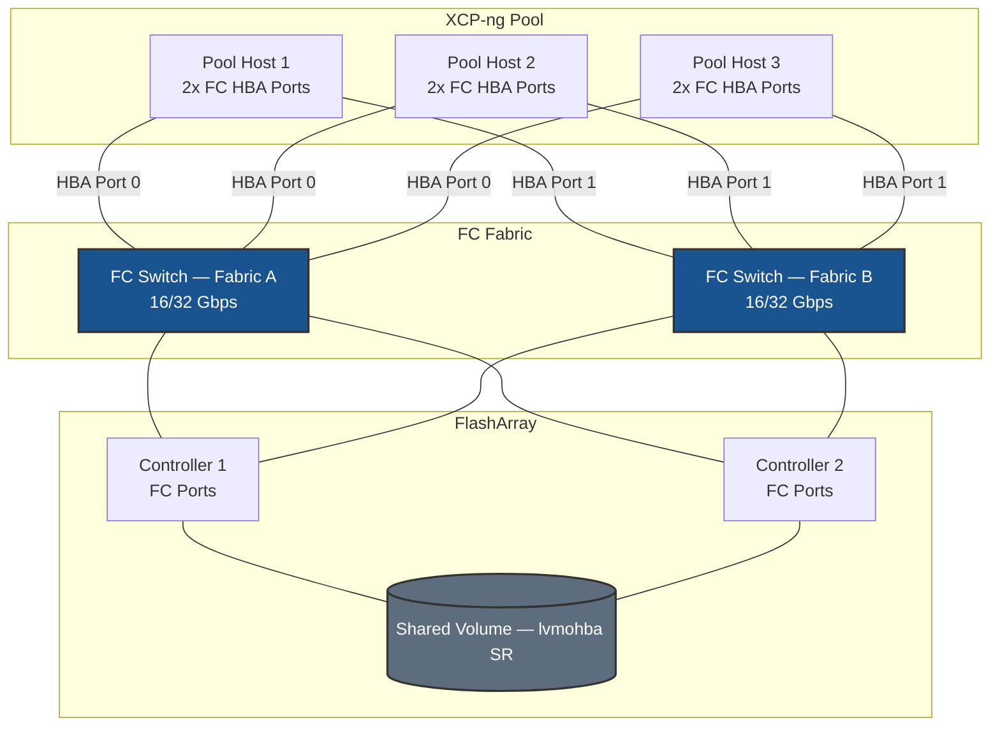

# Fibre Channel on XCP-ng - Best Practices Guide

Comprehensive best practices for deploying Fibre Channel storage on XCP-ng pools in production environments.

---



---

## Table of Contents
- [Architecture Overview](#architecture-overview)
- [XCP-ng-Specific Considerations](#xcp-ng-specific-considerations)
- [Fabric & Zoning Guidance](#fabric--zoning-guidance)
- [FC Architecture in XCP-ng](#fc-architecture-in-xcp-ng)
- [Multipath Configuration](#multipath-configuration)
- [Performance Tuning](#performance-tuning)
- [High Availability](#high-availability)
- [Monitoring & Maintenance](#monitoring--maintenance)
- [Security](#security)
- [Troubleshooting](#troubleshooting)

---

## Architecture Overview

### Deployment Topology



---

## XCP-ng-Specific Considerations

### lvmohba SR Type

XCP-ng uses the `lvmohba` (LVM over HBA) SR driver for Fibre Channel block storage. This SR type:

- Creates an LVM volume group directly on the FC-presented LUN
- Supports shared storage across pool hosts (VMs can be live-migrated between hosts)
- Uses dm-multipath for path management, controlled by the `multipathhandle=dmp` host parameter

### Multipath is Managed by XCP-ng

XCP-ng manages multipath at the pool level. The key parameters:

```bash
# Enable multipathing for a host
xe host-param-set uuid=<HOST_UUID> other-config:multipathing=true
xe host-param-set uuid=<HOST_UUID> other-config:multipathhandle=dmp
```

These settings tell XAPI to use dm-multipath for SAN storage, which ensures multipath is active before the SR is mounted.

### Do Not Modify the Default Multipath Config Directly

XCP-ng maintains its own multipath configuration at `/etc/multipath.xenserver/multipath.conf`. This file is managed by XCP-ng and may be overwritten during updates.

**Always use `/etc/multipath/conf.d/custom.conf`** for any device-specific additions:

```bash
# Check if your storage array already has an entry
cat /etc/multipath.xenserver/multipath.conf | grep -i "PURE"

# Add custom entry only if not already present
cat >> /etc/multipath/conf.d/custom.conf << 'EOF'
devices {
    device {
        vendor               "PURE"
        product              "FlashArray"
        path_selector        "service-time 0"
        hardware_handler     "1 alua"
        path_grouping_policy group_by_prio
        prio                 alua
        failback             immediate
        no_path_retry        0
        fast_io_fail_tmo     5
        dev_loss_tmo         60
    }
}
EOF
```

---

## Fabric & Zoning Guidance

### Single-Initiator Zoning (Required)

Each pool host's HBA WWPNs must be in their own zones. Register all pool host WWPNs in the same host group on the FlashArray so the SR is accessible from every host.

```
Zone: xcpng-host1-hba0-to-array
  Members: xcpng-host1-wwpn-hba0, array-ct0-port0, array-ct0-port1, array-ct1-port0, array-ct1-port1

Zone: xcpng-host1-hba1-to-array
  Members: xcpng-host1-wwpn-hba1, array-ct0-port2, array-ct0-port3, array-ct1-port2, array-ct1-port3
```

Repeat for each pool host.

### Collecting WWPNs from All Pool Hosts

```bash
# Run on each host and provide to SAN admin
hostname && cat /sys/class/fc_host/host*/port_name
```

---

## FC Architecture in XCP-ng

```
FC Fabric
  └── HBA Driver (lpfc / qla2xxx)
        └── SCSI Mid-Layer
              └── SCSI Disk (sdX — one per path)
                    └── dm-multipath (controlled by XAPI)
                          └── /dev/mapper/<wwid>
                                └── lvmohba SR (LVM volume group)
                                      └── VDIs (VM disk images)
```

**Key points:**
- XAPI manages SR attachment and detachment when hosts join/leave the pool
- The `lvmohba` driver identifies devices by SCSIid (WWID) — this ensures consistent device identification across all pool hosts
- Never manually `pvremove` or `vgremove` an lvmohba VG while the SR is attached to the pool

---

## Multipath Configuration

### Verify Multipath Status

```bash
# Check multipath topology — expect 4 paths per LUN
multipath -ll

# Check dm-multipath is active
systemctl status multipathd

# Check host multipathing parameters
xe host-param-list uuid=<HOST_UUID> | grep multipath
```

### Reload Configuration After Changes

```bash
# Reload without restarting the service
multipathd reconfigure

# Or restart if changes are significant
systemctl restart multipathd
```

---

## Performance Tuning

### HBA Queue Depth

XCP-ng hosts run a CentOS/RHEL-based DOM0. Use `dracut` to persist module parameters:

**Emulex (lpfc):**
```bash
tee /etc/modprobe.d/lpfc.conf > /dev/null <<'EOF'
options lpfc lpfc_lun_queue_depth=64
EOF
dracut -f
reboot
```

**QLogic (qla2xxx):**
```bash
tee /etc/modprobe.d/qla2xxx.conf > /dev/null <<'EOF'
options qla2xxx ql2xmaxqdepth=64
EOF
dracut -f
reboot
```

> **Note:** Apply to all pool hosts before creating the lvmohba SR.

---

## High Availability

### XCP-ng HA and FC Storage

XCP-ng HA (pool HA) monitors host availability and can automatically restart VMs on surviving hosts. For HA with FC storage:

- The FC SR must be accessible from all pool hosts before enabling pool HA
- XCP-ng HA requires a heartbeat SR — for FC environments, a small dedicated LUN on the FlashArray can serve as the heartbeat SR
- `fast_io_fail_tmo 5` and `dev_loss_tmo 60` ensure path failures are detected quickly enough to trigger HA failover within XCP-ng's fencing timeout

### Testing Path Failover

```bash
# Disable one path
echo offline | tee /sys/block/sdb/device/state
multipath -ll

# Re-enable
echo running | tee /sys/block/sdb/device/state
```

---

## Monitoring & Maintenance

```bash
# HBA link state
cat /sys/class/fc_host/host*/port_state
cat /sys/class/fc_host/host*/link_failure_count
cat /sys/class/fc_host/host*/speed

# Multipath
multipath -ll
multipathd -k"show paths"

# SR status via XAPI
xe sr-list
xe pbd-list
```

---

## Security

FC security is implemented at the fabric level — no host-level firewall is required.

1. **Fabric zoning** — primary access control
2. **LUN masking / host registration** — enforced by the FlashArray based on WWPN and host group
3. **Hard zoning** — enforce at switch port level

---

## Troubleshooting

### SR Cannot Be Created — SCSIid Not Found

```bash
# Probe available FC devices and their SCSIids
xe sr-probe type=lvmohba

# If no devices are listed, check multipath
multipath -ll

# And HBA state
cat /sys/class/fc_host/host*/port_state
```

**If still empty:** Confirm zoning and volume connection on the FlashArray, then rescan:

```bash
for host in /sys/class/scsi_host/host*; do echo "- - -" | tee "$host/scan"; done
multipath -ll
```

### SR Attached to Some Hosts But Not Others

```bash
# Check PBD (Physical Block Device) status per host
xe pbd-list sr-uuid=<SR_UUID>
# Look for "currently-attached ( false )" on any host

# Manually attach on a missing host
xe pbd-plug uuid=<PBD_UUID>
```

If PBD plug fails, verify the FC multipath device is visible on that host before attempting again.

### Fewer Than Expected Paths

```bash
for h in /sys/class/fc_host/host*; do
    echo "$h: $(cat $h/port_state) — WWPN: $(cat $h/port_name)"
done
```

### Path Flapping

```bash
cat /sys/class/fc_host/host*/link_failure_count
cat /sys/class/fc_host/host*/loss_of_signal_count
journalctl -k | grep -i "fc\|scsi" | tail -50
```
