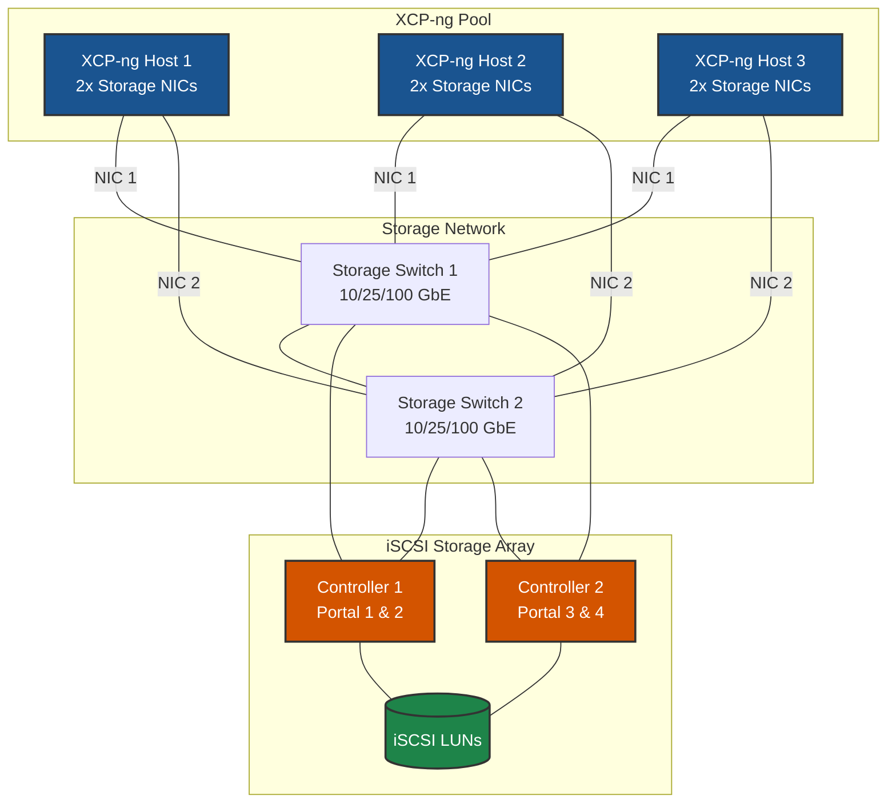
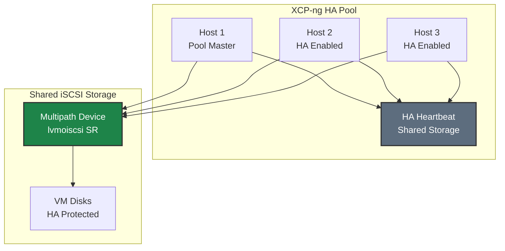

# iSCSI on XCP-ng - Best Practices Guide

Comprehensive best practices for deploying iSCSI storage on XCP-ng in production environments.

> **Distribution-Specific Guides:** For detailed best practices tailored to specific Linux distributions, see:
> - [RHEL/Rocky/AlmaLinux Best Practices](../rhel/iscsi/BEST-PRACTICES.md)
> - [Debian/Ubuntu Best Practices](../debian/iscsi/BEST-PRACTICES.md)
> - [SUSE/openSUSE Best Practices](../suse/iscsi/BEST-PRACTICES.md)
> - [Oracle Linux Best Practices](../oracle/iscsi/BEST-PRACTICES.md)

---



---

## Table of Contents
- [Architecture Overview](#architecture-overview)
- [XCP-ng-Specific Considerations](#xcp-ng-specific-considerations)
- [Network Design](#network-design)
- [Multipath Configuration](#multipath-configuration)
- [High Availability & Redundancy](#high-availability--redundancy)
- [Performance Optimization](#performance-optimization)
- [Security Best Practices](#security-best-practices)
- [Monitoring & Maintenance](#monitoring--maintenance)
- [Troubleshooting](#troubleshooting)

---

## Architecture Overview

### Reference Architecture

A production-grade iSCSI deployment for XCP-ng consists of:

- **XCP-ng Pool**: 3+ hosts for high availability
  - *Why*: Minimum 3 hosts recommended for HA; allows maintenance without downtime

- **Dedicated Storage Network**: Isolated network infrastructure for storage traffic
  - *Why*: Prevents storage I/O contention with other traffic; ensures predictable performance; simplifies troubleshooting

- **iSCSI Storage Array**: Enterprise storage with multiple controllers
  - *Why*: Multiple controllers eliminate single point of failure; enable active-active multipath for performance and redundancy

- **DM-Multipath Configuration**: Multiple redundant paths for failover and load balancing
  - *Why*: Automatic failover on path failure; load distribution across all paths; no downtime during maintenance

### Deployment Topology



---

## XCP-ng-Specific Considerations

### XCP-ng Overview

**Key Characteristics:**
- Open-source hypervisor based on Xen, forked from XenServer
- CentOS/RHEL-based dom0 (uses `yum` package manager)
- Uses XAPI (Xen API) and SMAPI (Storage Management API) for storage
- Managed via Xen Orchestra (web UI) or `xe` CLI
- Uses Open vSwitch for networking by default

**Recommended Versions:**
- **XCP-ng**: 8.2 or later
- **Kernel**: XCP-ng default kernel (includes required iSCSI and multipath modules)

### Package Management

**Update system:**
```bash
# Update package lists and upgrade
yum update -y
```

**Essential packages (pre-installed on XCP-ng):**
```bash
# Core iSCSI and multipath tools are pre-installed
rpm -qa | grep iscsi-initiator-utils
rpm -qa | grep device-mapper-multipath
```

**Verify installation:**
```bash
# Check iSCSI initiator
iscsiadm --version

# Check multipath
multipath -ll

# Check services
systemctl status iscsid
systemctl status multipathd
```

### XCP-ng Storage Architecture

XCP-ng uses **Storage Repositories (SR)** to manage storage:

- **lvmoiscsi**: LVM over iSCSI driver (recommended for iSCSI)
- **SR**: Storage Repository - collection of VDIs (Virtual Disk Images)
- **VDI**: Virtual Disk Image - individual VM disk
- **PBD**: Physical Block Device - connection between host and SR

```bash
# List SRs
xe sr-list

# List PBDs
xe pbd-list

# Get SR details
xe sr-param-list uuid=<SR_UUID>
```

---

## Network Design



### Network Architecture Principles

1. **Dedicated Storage Network**: Always use dedicated physical or VLAN-isolated networks for storage traffic
   - *Why*: Isolates storage I/O from other network traffic; prevents bandwidth contention

2. **No Single Points of Failure**: Redundant switches, NICs, and storage controllers
   - *Why*: Any single component can fail without impacting storage availability

3. **Proper Segmentation**: Separate storage traffic from management and VM traffic
   - *Why*: Prevents noisy neighbor problems; ensures consistent storage performance

4. **Optimized MTU**: Use jumbo frames (MTU 9000) end-to-end when possible
   - *Why*: Reduces CPU overhead; improves throughput by reducing packet count

### XCP-ng Network Configuration

XCP-ng uses PIFs (Physical Interface) and networks managed via `xe` CLI or Xen Orchestra.

#### Option 1: Dedicated Physical Networks (Recommended)

**Configure via xe CLI:**
```bash
# List available PIFs
xe pif-list

# Configure static IP on storage interface
xe pif-reconfigure-ip uuid=<PIF_UUID> \
    mode=static \
    IP=10.100.1.101 \
    netmask=255.255.255.0

# Verify configuration
xe pif-list params=uuid,device,IP,netmask
```

#### Option 2: VLAN-Based Storage Network

**Create VLAN network:**
```bash
# Create VLAN network
xe network-create name-label="Storage VLAN 100"

# Create VLAN PIF
xe vlan-create network-uuid=<NETWORK_UUID> pif-uuid=<PHYSICAL_PIF_UUID> vlan=100

# Configure IP on VLAN PIF
xe pif-reconfigure-ip uuid=<VLAN_PIF_UUID> \
    mode=static \
    IP=10.100.1.101 \
    netmask=255.255.255.0
```

### ARP Configuration for Same-Subnet Multipath

> **⚠️ CRITICAL**: When using multiple interfaces on the same subnet, proper ARP configuration is **mandatory** to prevent routing issues.

**Create ARP sysctl configuration:**
```bash
cat > /etc/sysctl.d/99-iscsi-arp.conf << 'EOF'
# ARP settings for same-subnet multipath (CRITICAL)
# Prevents ARP responses on wrong interface

net.ipv4.conf.all.arp_ignore = 2
net.ipv4.conf.default.arp_ignore = 2
net.ipv4.conf.all.arp_announce = 2
net.ipv4.conf.default.arp_announce = 2
EOF

# Apply settings
sysctl -p /etc/sysctl.d/99-iscsi-arp.conf
```

### MTU Configuration

**Verify MTU end-to-end:**
```bash
# Check interface MTU
ip link show eth1 | grep mtu

# Test MTU to storage portal (9000 - 28 byte header = 8972)
ping -M do -s 8972 10.100.1.10

# If ping fails, check:
# 1. Interface MTU
# 2. Switch MTU configuration
# 3. Storage array MTU
```

**Important:** MTU must be 9000 end-to-end (host → switch → storage).

### Firewall Configuration

XCP-ng typically does not have firewall rules on storage interfaces by default. For dedicated storage networks, this is the recommended approach.

**If firewall rules are needed:**
```bash
# Allow iSCSI traffic
iptables -A INPUT -p tcp --dport 3260 -j ACCEPT

# Save rules
iptables-save > /etc/sysconfig/iptables
```

---

## Multipath Configuration



### DM-Multipath for iSCSI

iSCSI on XCP-ng uses device-mapper multipath (dm-multipath) for path management.

**Why DM-Multipath for iSCSI:**
- Presents multiple paths as single block device
- Supports ALUA (Asymmetric Logical Unit Access) for path prioritization
- Configurable failover and load balancing policies
- Well-established and mature technology

### Custom Multipath Configuration

XCP-ng includes default multipath configurations in `/etc/multipath.xenserver/multipath.conf`. **Never modify this file directly** as it may be overwritten by updates.

**Add custom device configuration:**
```bash
cat > /etc/multipath/conf.d/custom.conf << 'EOF'
devices {
    # Configuration for your storage array
    # Consult your storage vendor documentation
    device {
        vendor           "VENDOR"
        product          "PRODUCT"
        path_selector    "service-time 0"
        path_grouping_policy group_by_prio
        prio             alua
        hardware_handler "1 alua"
        failback         immediate
        rr_weight        uniform
        no_path_retry    0
    }
}
EOF

# Restart multipathd to apply
systemctl restart multipathd

# Verify configuration
multipath -ll
```

**Key Configuration Parameters:**

| Parameter | Value | Purpose |
|-----------|-------|---------|
| `path_selector` | `service-time 0` | Routes I/O to path with lowest service time |
| `path_grouping_policy` | `group_by_prio` | Groups paths by ALUA priority |
| `prio` | `alua` | Uses ALUA for path prioritization |
| `failback` | `immediate` | Returns to preferred path immediately when available |
| `no_path_retry` | `0` | **Fail immediately when all paths down** (prevents hangs) |

> **⚠️ Critical**: Setting `no_path_retry 0` is recommended to prevent system hangs during APD (All Paths Down) events.

### Enable Pool Multipathing

Enable multipathing at the pool level:

**Via Xen Orchestra:**
1. Go to Pool → Advanced tab
2. Enable "Multipathing for all XCP-ng hosts"

**Via xe CLI:**
```bash
# Enable multipathing on host
xe host-param-set uuid=<HOST_UUID> other-config:multipathing=true
xe host-param-set uuid=<HOST_UUID> other-config:multipathhandle=dmp
```

---

## High Availability & Redundancy

### XCP-ng HA with iSCSI Storage

XCP-ng supports High Availability (HA) that works with iSCSI storage.

**HA Requirements:**
- Minimum 3 hosts recommended
- Shared storage accessible by all hosts (iSCSI multipath)
- HA heartbeat storage (can use separate SR or same SR)

**HA Architecture with iSCSI:**



### Creating iSCSI Storage Repository

**Via Xen Orchestra (Recommended):**
1. Go to **New → Storage**
2. Select **iSCSI** as storage type
3. Enter portal IPs, target IQN, and authentication details
4. Select the LUN to use
5. Click **Create**

**Via xe CLI:**
```bash
# Discover targets
iscsiadm -m discovery -t sendtargets -p <PORTAL_IP_1>:3260
iscsiadm -m discovery -t sendtargets -p <PORTAL_IP_2>:3260

# Create iSCSI SR
xe sr-create name-label="iSCSI Storage" type=lvmoiscsi shared=true \
    device-config:target=<PORTAL_IP_1>,<PORTAL_IP_2> \
    device-config:targetIQN=<TARGET_IQN> \
    device-config:SCSIid=<SCSI_ID>
```

### Path Redundancy

**Verify path redundancy:**
```bash
# Check multipath status
multipath -ll

# Expected output with 4 paths (2 NICs × 2 portals):
# 3600... dm-X VENDOR,PRODUCT
# size=100G features='0' hwhandler='1 alua' wp=rw
# |-+- policy='service-time 0' prio=50 status=active
# | |- 1:0:0:1 sda 8:0   active ready running
# | `- 2:0:0:1 sdb 8:16  active ready running
# `-+- policy='service-time 0' prio=10 status=enabled
#   |- 3:0:0:1 sdc 8:32  active ready running
#   `- 4:0:0:1 sdd 8:48  active ready running
```

**Test failover:**
```bash
# Simulate path failure (disconnect one NIC)
ip link set eth1 down

# Verify I/O continues on remaining paths
multipath -ll

# Restore path
ip link set eth1 up

# Verify path returns
multipath -ll
```

---

## Performance Optimization



### Kernel Parameters

**Optimize kernel for iSCSI storage:**
```bash
cat > /etc/sysctl.d/99-iscsi-xcpng.conf << 'EOF'
# Network performance for iSCSI
net.core.netdev_max_backlog = 5000
net.core.rmem_max = 134217728
net.core.wmem_max = 134217728
net.ipv4.tcp_rmem = 4096 87380 67108864
net.ipv4.tcp_wmem = 4096 65536 67108864

# Low latency TCP
net.ipv4.tcp_low_latency = 1

# VM tuning for storage workloads
vm.dirty_ratio = 10
vm.dirty_background_ratio = 5
vm.swappiness = 10

# ARP settings for same-subnet multipath
net.ipv4.conf.all.arp_ignore = 2
net.ipv4.conf.default.arp_ignore = 2
net.ipv4.conf.all.arp_announce = 2
net.ipv4.conf.default.arp_announce = 2
EOF

# Apply settings
sysctl -p /etc/sysctl.d/99-iscsi-xcpng.conf
```

### Network Interface Tuning

**Optimize NIC settings:**
```bash
# Create network tuning script
cat > /usr/local/bin/tune-storage-nics.sh << 'EOF'
#!/bin/bash
# Tune storage NICs for iSCSI

for NIC in eth1 eth2; do
    if ip link show $NIC &>/dev/null; then
        # Increase ring buffers
        ethtool -G $NIC rx 4096 tx 4096 2>/dev/null || true

        # Optimize interrupt coalescing
        ethtool -C $NIC rx-usecs 50 tx-usecs 50 2>/dev/null || true

        # Enable TCP offloads
        ethtool -K $NIC tso on gso on gro on 2>/dev/null || true

        echo "Tuned $NIC"
    fi
done
EOF

chmod +x /usr/local/bin/tune-storage-nics.sh
```

---

## Security Best Practices



### CHAP Authentication

**Configure CHAP on iSCSI targets:**

CHAP credentials can be configured when creating the SR via Xen Orchestra or xe CLI:

```bash
# Create SR with CHAP authentication
xe sr-create name-label="iSCSI Storage" type=lvmoiscsi shared=true \
    device-config:target=<PORTAL_IP> \
    device-config:targetIQN=<TARGET_IQN> \
    device-config:SCSIid=<SCSI_ID> \
    device-config:chapuser=<USERNAME> \
    device-config:chappassword=<PASSWORD>
```

### Network Isolation

**Best practices for storage network security:**
1. **Dedicated VLANs**: Isolate storage traffic on separate VLANs
2. **No default gateway**: Storage interfaces should not have default routes
3. **Physical isolation**: When possible, use dedicated switches
4. **Access control**: Use storage array ACLs to restrict initiator access

---

## Monitoring & Maintenance



### Health Check Script

**Create XCP-ng iSCSI health check:**
```bash
cat > /usr/local/bin/iscsi-health-check.sh << 'EOF'
#!/bin/bash
# iSCSI Health Check Script for XCP-ng

echo "=== iSCSI Health Check ==="
echo "Date: $(date)"
echo "Hostname: $(hostname)"
echo

echo "--- iSCSI Sessions ---"
iscsiadm -m session 2>/dev/null || echo "No active sessions"

echo
echo "--- Multipath Status ---"
multipath -ll | head -50

echo
echo "--- Failed/Faulty Paths ---"
multipath -ll | grep -i "failed\|faulty" || echo "No failed paths"

echo
echo "--- Storage Interface Status ---"
xe pif-list params=device,IP,currently-attached

echo
echo "--- SR Status ---"
xe sr-list params=name-label,physical-size,physical-utilisation

echo
echo "=== End Health Check ==="
EOF

chmod +x /usr/local/bin/iscsi-health-check.sh
```

### Monitoring with systemd Journal

**View iSCSI and multipath logs:**
```bash
# View iSCSI logs
journalctl -u iscsid -f

# View multipath logs
journalctl -u multipathd -f

# View storage-related kernel messages
dmesg -w | grep -E "scsi|multipath|iscsi"

# Check for recent errors
journalctl -p err -u iscsid -u multipathd --since "1 hour ago"
```

### Xen Orchestra Monitoring

Xen Orchestra provides built-in monitoring for:
- SR health and utilization
- Host connectivity
- VM storage I/O

Access via: **Dashboard → Health** or **SR → Details**

---

## Troubleshooting



### Service Status

**Check iSCSI and multipath services:**
```bash
# Check service status
systemctl status iscsid
systemctl status multipathd

# Check for failed services
systemctl --failed | grep -E "iscsi|multipath"

# View detailed logs
journalctl -xe -u iscsid
journalctl -xe -u multipathd
```

### Connection Issues

**Diagnose iSCSI connectivity:**
```bash
# Test network connectivity to portals
ping -c 3 10.100.1.10
ping -c 3 10.100.1.11

# Test iSCSI port
nc -zv 10.100.1.10 3260

# Rediscover targets
iscsiadm -m discovery -t sendtargets -p 10.100.1.10:3260

# Check session details
iscsiadm -m session -P 3
```

### Multipath Issues

**Diagnose multipath problems:**
```bash
# Verbose multipath output
multipath -v3

# Reconfigure multipath
multipath -r

# Check device mapper status
dmsetup table
dmsetup status

# Check for blacklisted devices
multipath -v3 2>&1 | grep -i blacklist
```

### Path Failure Recovery

**Recover from path failures:**
```bash
# Check current path status
multipath -ll

# Force path check
multipathd show paths

# Reinstate a failed path
multipathd reinstate path <device>

# Or restart multipath
systemctl restart multipathd

# Rescan SCSI bus
for host in /sys/class/scsi_host/host*; do
    echo "- - -" > ${host}/scan
done
```

### SR Issues

**Troubleshoot XCP-ng Storage Repository:**
```bash
# List SRs and their status
xe sr-list

# Check PBD connections
xe pbd-list sr-uuid=<SR_UUID>

# Reconnect SR to host
xe pbd-plug uuid=<PBD_UUID>

# Repair SR
xe sr-scan uuid=<SR_UUID>
```

---

## Additional Resources

- [XCP-ng Documentation](https://docs.xcp-ng.org/)
- [XCP-ng Storage Documentation](https://docs.xcp-ng.org/storage/)
- [XCP-ng Multipathing Guide](https://docs.xcp-ng.org/storage/multipathing)
- [iSCSI Quick Start](./QUICKSTART.md)
- [Common Network Concepts]({{ site.baseurl }}/common/network-concepts.html)
- [Multipath Concepts]({{ site.baseurl }}/common/multipath-concepts.html)
- [Storage Terminology Glossary]({{ site.baseurl }}/common/glossary.html)

---



**Check SR status:**
```bash
xe sr-list type=lvmoiscsi
```

**Restart services:**
```bash
systemctl restart iscsid multipathd
```

**Check logs:**
```bash
journalctl -u iscsid -u multipathd -f
```

**Verify path redundancy:**
```bash
multipath -ll | grep -E "status|policy"
```

