# iSCSI on XCP-ng - GUI Quick Start Guide

This guide walks you through configuring iSCSI storage on XCP-ng using **Xen Orchestra (XO)** web interface with multipathing enabled.

> **📘 For CLI-based setup:** See [iSCSI Quick Start (CLI)](./QUICKSTART.md)
> **📘 For production best practices:** See [iSCSI Best Practices](./BEST-PRACTICES.md)

---



---

## Prerequisites

- XCP-ng 8.2 or later with Xen Orchestra installed
- iSCSI storage array with:
  - Portal IPs (at least 2 for multipathing)
  - Target IQN
  - LUN/Volume created and mapped to XCP-ng hosts
- Dedicated storage network interfaces configured
- CHAP credentials (if required by your storage array)



---

## Step 1: Configure Storage Network (All Hosts)

Before adding iSCSI storage, ensure your storage network interfaces are configured on each host.

### Via Xen Orchestra

1. Navigate to **Home → Hosts** and select your host
2. Go to the **Network** tab
3. Identify your storage interfaces

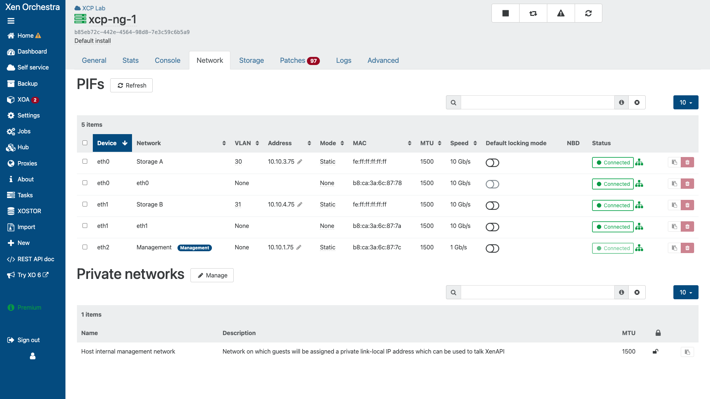
*XO Host Network tab showing storage interfaces*

4. If needed, configure static IPs on storage interfaces via **Network → PIFs**

### Via XCP-ng Center (Alternative)

1. Open XCP-ng Center and connect to your pool
2. Select a host → **Networking** tab
3. Configure storage interfaces with static IPs


---

## Step 2: Enable Multipathing on Pool

Multipathing must be enabled at the pool level before adding iSCSI storage.

### Via Xen Orchestra

1. Navigate to **Home → Pools** and select your pool
2. Go to the **Advanced** tab
3. Find **Multipathing** and enable it

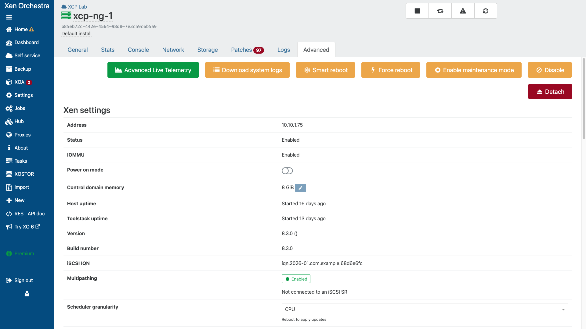
*XO Pool Advanced tab - Multipathing toggle*

4. Click **Save** or apply the changes

### Via CLI (Alternative)

If XO doesn't show the multipathing option, use CLI on the pool master:

```bash
# Enable multipathing for the pool
xe host-param-set uuid=<HOST_UUID> other-config:multipathing=true
xe host-param-set uuid=<HOST_UUID> other-config:multipathhandle=dmp
```

---

## Step 3: Configure Custom Multipath Settings (Optional)

For optimal performance with your storage array, configure custom multipath settings.

### Via SSH to Each Host

```bash
# Create custom multipath configuration
cat > /etc/multipath/conf.d/custom.conf << 'EOF'
devices {
    device {
        vendor           "PURE"
        product          "FlashArray"
        path_selector    "service-time 0"
        path_grouping_policy group_by_prio
        prio             alua
        hardware_handler "1 alua"
        failback         immediate
        rr_weight        uniform
        no_path_retry    0
    }
}
EOF

# Restart multipathd
systemctl restart multipathd
```

> **Note:** Adjust the `vendor` and `product` values to match your storage array.

---

## Step 4: Add iSCSI Storage Repository

### Understanding Multi-Subnet Discovery

> **⚠️ CRITICAL for Multi-Subnet/VLAN Architectures:**
>
> When your storage array uses **VLAN tagging** or presents iSCSI targets on **multiple subnets**, each discovery query only returns targets from that specific subnet. To discover ALL paths, you must provide at least one IP from EACH subnet in the Target field.
>
> **Example:** Pure FlashArray with 2-subnet architecture:
> - Subnet A (VLAN 30): `10.10.3.10`, `10.10.3.11` (CT0, CT1)
> - Subnet B (VLAN 31): `10.10.4.10`, `10.10.4.11` (CT0, CT1)
>
> Discovering from `10.10.3.10` alone returns only 2 targets (both on VLAN 30).
> To get all 4 paths, enter: `10.10.3.10,10.10.4.10`

### Via Xen Orchestra

1. Click **New → Storage** in the top menu


*XO New menu showing Storage option*

2. Select **iSCSI** as the storage type

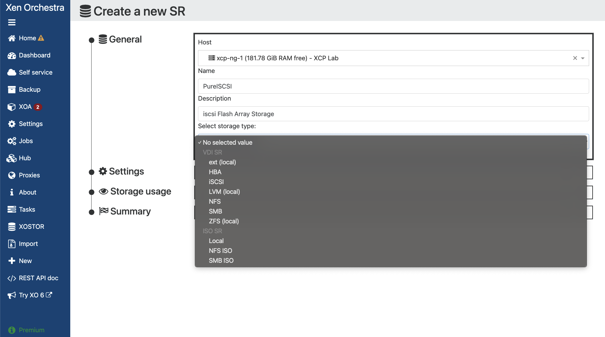
*Selecting iSCSI storage type*

3. Fill in the iSCSI connection details:

| Field | Value | Description |
|-------|-------|-------------|
| **Name** | `Pure-iSCSI-SR` | Descriptive name for the SR |
| **Description** | `Pure FlashArray iSCSI` | Optional description |
| **Host** | Select pool master | Initial host for discovery |
| **Target IPs** | `10.10.3.10,10.10.4.10` | **Comma-separated IPs - one from EACH subnet** |
| **Port** | `3260` | iSCSI port (default: 3260) |

> **💡 Key Point:** The Target IPs field accepts comma-separated values. For multi-subnet architectures, include one IP from each subnet to ensure XO discovers all available paths.

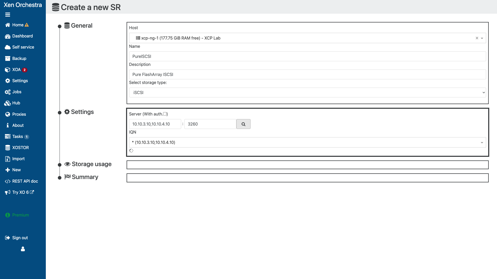
*iSCSI SR creation form with connection details*

4. Click **Discover IQNs** or **Connect**

5. Select the target IQN from the dropdown

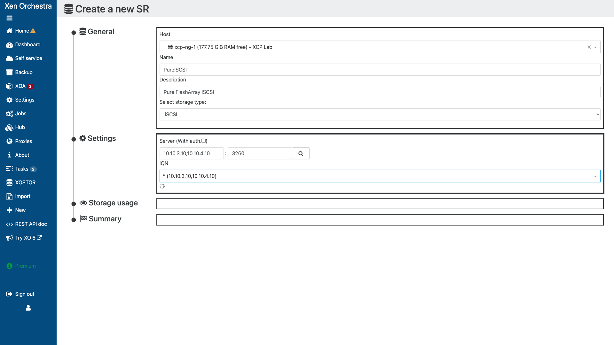
*Target IQN selection dropdown*

6. Select the LUN to use

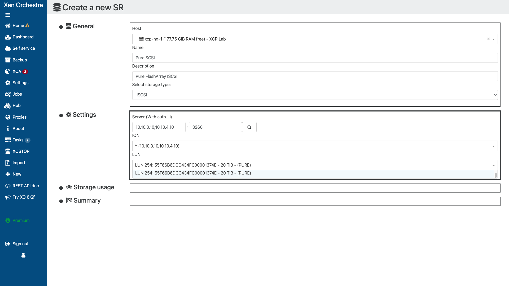
*LUN selection for SR creation*

7. If CHAP is required, enter credentials:
   - **Username:** Your CHAP username
   - **Password:** Your CHAP secret

> **Note:** CHAP authentication is optional. Skip if not required.

8. Click **Create**

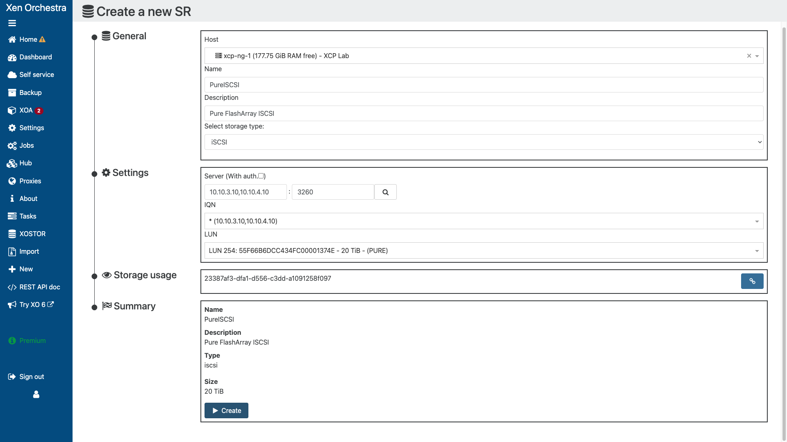
*SR reattach confirmation (if existing data found)*

---

## Step 5: Verify Storage Repository

### Via Xen Orchestra

1. Navigate to **Home → SRs** (Storage Repositories)
2. Find your new iSCSI SR in the list
3. Click on it to view details

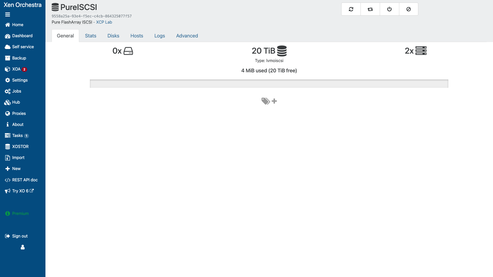
*SR details page showing status and configuration*

4. Verify the SR shows:
   - **Status:** Connected (green)
   - **Type:** lvmoiscsi
   - **Shared:** Yes (available on all hosts)


---

## Step 6: Verify Multipathing

### Via Xen Orchestra

1. In the SR details, check the **Physical Block Devices (PBDs)** section
2. Each host should show "connected" status

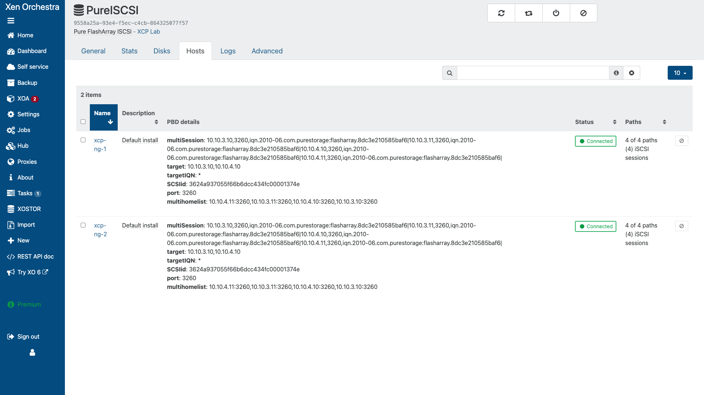
> ***SR Hosts tab showing multipathing with 4/4 paths per host connected_

### Via SSH (Verification)

Connect to each host via SSH and verify multipath:

```bash
# Check multipath status
multipath -ll

# Expected output showing multiple paths:
# 3600... dm-X VENDOR,PRODUCT
# size=100G features='0' hwhandler='1 alua' wp=rw
# |-+- policy='service-time 0' prio=50 status=active
# | |- 1:0:0:1 sda 8:0   active ready running
# | `- 2:0:0:1 sdb 8:16  active ready running
# `-+- policy='service-time 0' prio=10 status=enabled
#   |- 3:0:0:1 sdc 8:32  active ready running
#   `- 4:0:0:1 sdd 8:48  active ready running
```

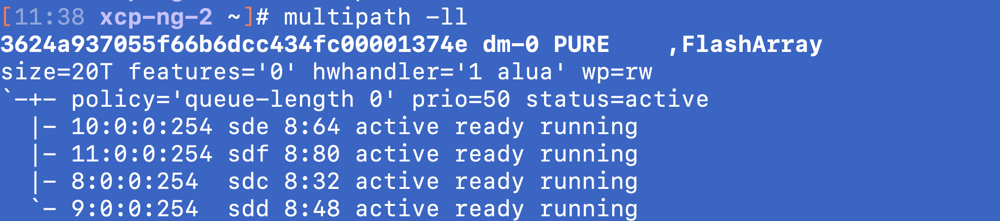
> ***Terminal showing multipath -ll with multiple active paths_

---

## Step 7: Create a Test VM

### Via Xen Orchestra

1. Click **New → VM**
2. Select your template (e.g., Ubuntu, CentOS)
3. In the **Disks** section, select your new iSCSI SR

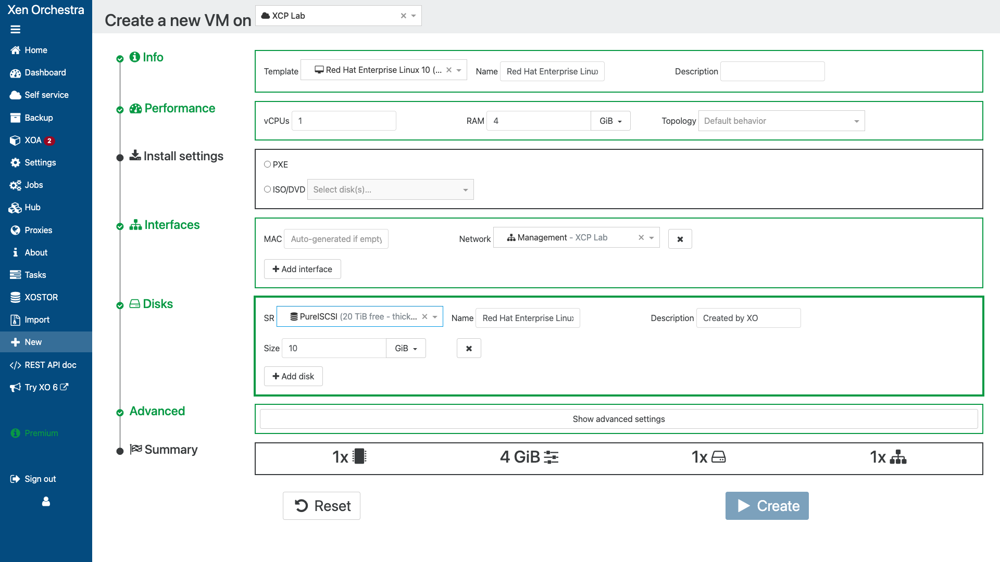
> ***VM creation showing iSCSI SR selected for disk storage_

4. Complete the VM creation wizard
5. Start the VM and verify it runs correctly

---

## Troubleshooting

### SR Not Connecting

1. **Check network connectivity:**
   ```bash
   ping 10.100.1.10  # Your portal IP
   nc -zv 10.100.1.10 3260  # Test iSCSI port
   ```

2. **Check multipath service:**
   ```bash
   systemctl status multipathd
   ```

3. **View logs in XO:**
   - Navigate to **Home → Logs**
   - Filter for storage-related events


### Paths Showing Failed

1. **Check path status:**
   ```bash
   multipath -ll | grep -E "status|failed"
   ```

2. **Reinstate paths:**
   ```bash
   multipathd show paths
   multipathd reinstate path <device>
   ```

3. **Restart multipath:**
   ```bash
   systemctl restart multipathd
   ```

---

## Quick Reference

| Task | Xen Orchestra Location |
|------|----------------------|
| View SRs | Home → SRs |
| Pool Settings | Home → Pools → Advanced |
| Host Network | Home → Hosts → [Host] → Network |
| Logs | Home → Logs |
| Create VM | New → VM |

### CLI Commands

```bash
# List SRs
xe sr-list

# Check SR status
xe sr-list name-label="Pure-iSCSI-SR"

# Verify multipath
multipath -ll

# Check PBD connections
xe pbd-list sr-uuid=<SR_UUID>
```

---

## Next Steps

- [iSCSI Best Practices](./BEST-PRACTICES.md) - Production deployment guidance
- [iSCSI CLI Quick Start](./QUICKSTART.md) - Command-line configuration
- [NFS Quick Start](../nfs/QUICKSTART.md) - Alternative storage protocol
- [Common Troubleshooting]({{ site.baseurl }}/common/troubleshooting-common.html)

