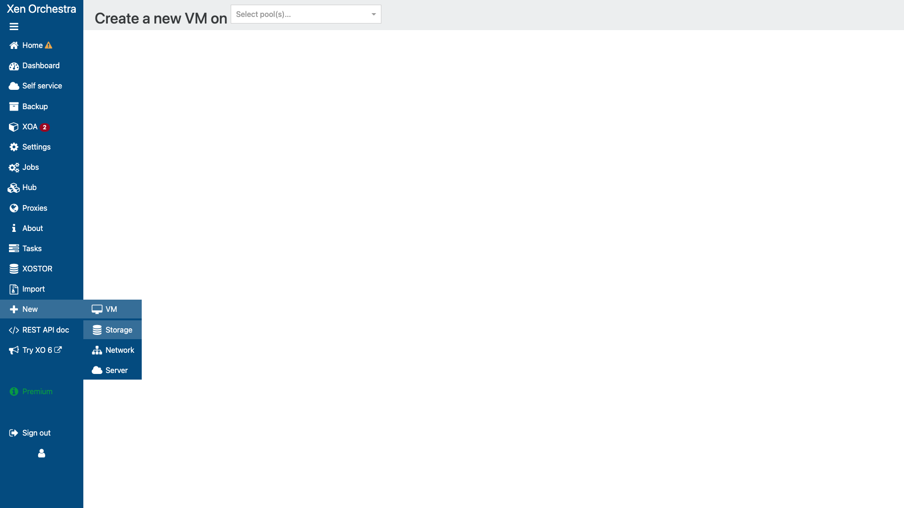
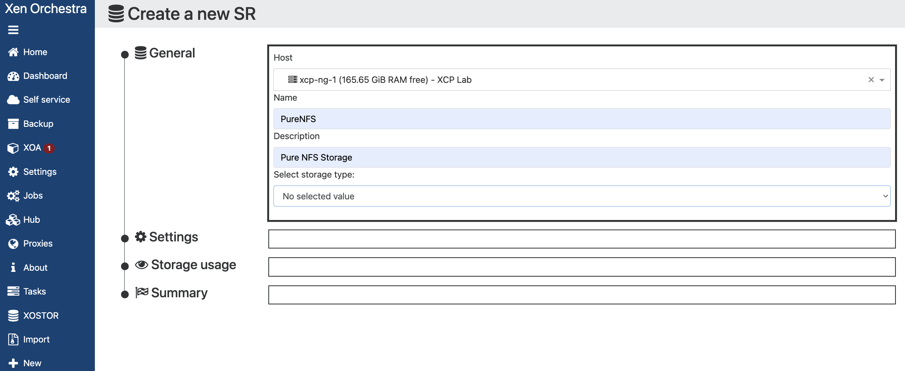
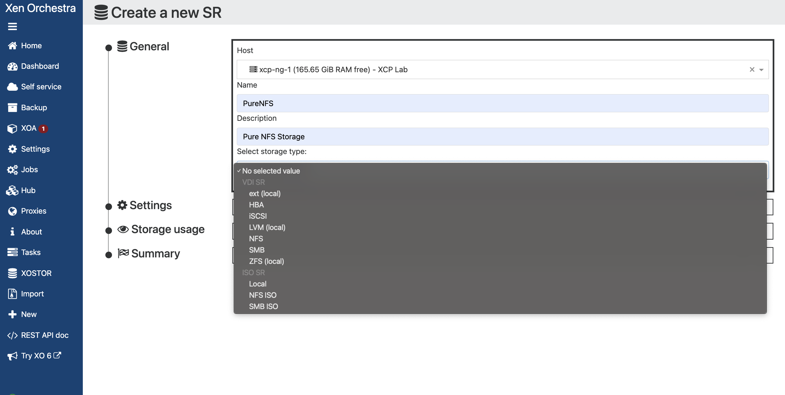
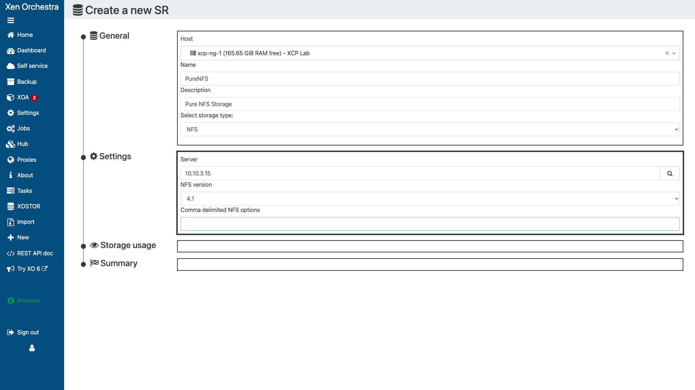
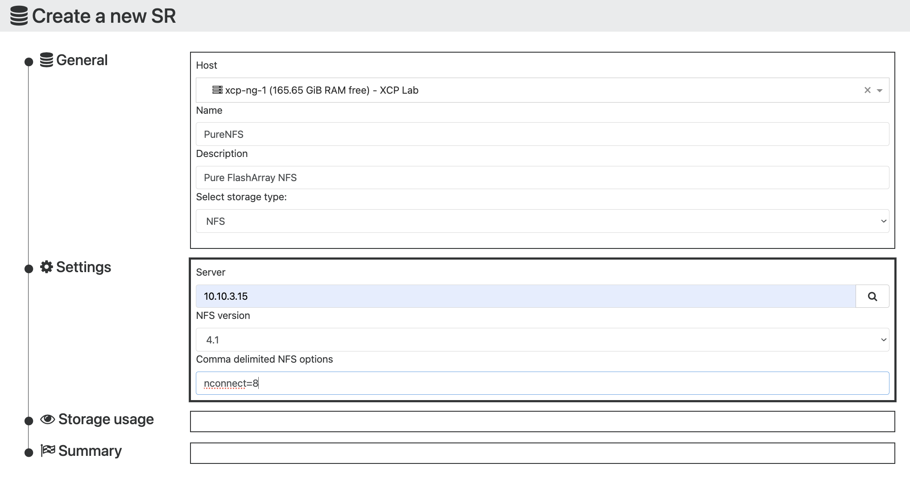
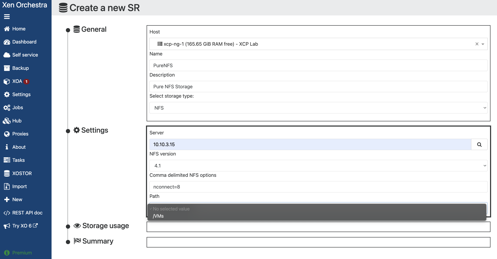
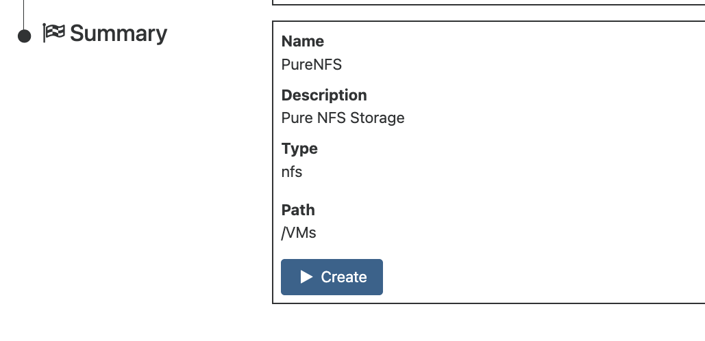
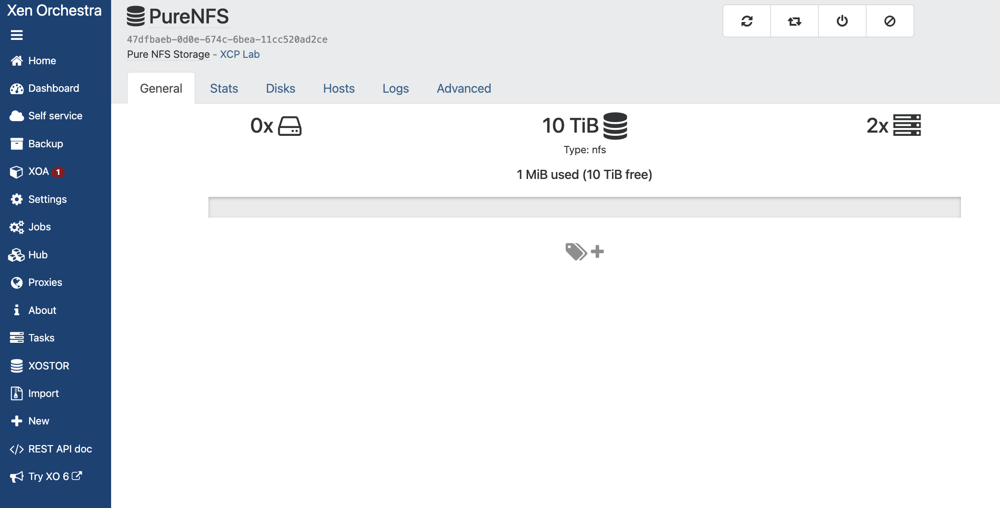
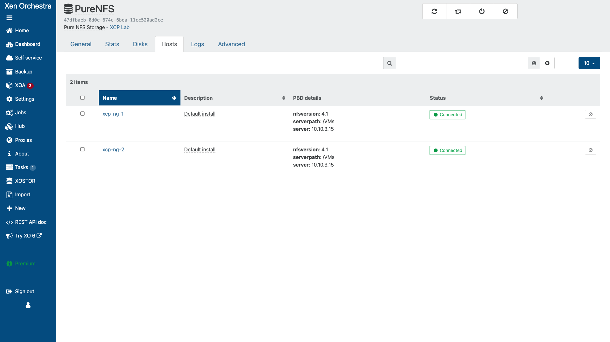

# NFS on XCP-ng - Quick Start Guide

This guide walks you through configuring NFS storage on XCP-ng using **Xen Orchestra (XO)** web interface.

> **📘 For iSCSI storage:** See [iSCSI Quick Start](../iscsi/QUICKSTART.md) or [iSCSI GUI Guide](../iscsi/GUI-QUICKSTART.md)

---



---

## Prerequisites

- XCP-ng 8.2 or later with Xen Orchestra installed
- NFS server with:
  - NFS export path configured
  - XCP-ng hosts allowed in export rules
  - NFSv3 or NFSv4.1 support
- Network connectivity between XCP-ng hosts and NFS server
- Pure FlashArray NFS file interface IP and export path

> **📖 New to NFS storage?** See the [Storage Terminology Glossary]({{ site.baseurl }}/common/glossary.html)

---

## Step 1: Prepare NFS Server

Ensure your NFS server has an export configured for XCP-ng.

### Example NFS Export Configuration

On your NFS server (e.g., `/etc/exports`):

```bash
/xcp/VMs  10.10.3.0/24(rw,sync,no_subtree_check,no_root_squash)
```

> **Security Note:** `no_root_squash` is required for XCP-ng to manage VM files. Restrict access to your storage network.


> **Note:** This guide assumes you have already configured your Pure FlashArray with NFS exports. See the Pure Storage documentation for array-side setup.

---

## Step 2: Verify Network Connectivity

Before adding NFS storage, verify connectivity from each XCP-ng host.

### Via SSH to Each Host

```bash
# Test connectivity to NFS server
ping -c 3 <NFS_SERVER_IP>

# Test NFS port (2049)
nc -zv <NFS_SERVER_IP> 2049

# List available exports
showmount -e <NFS_SERVER_IP>
```

Expected output from `showmount`:
```
Export list for 10.10.3.15:
/xcp/VMs 10.10.3.0/24
```


---

## Step 3: Add Pure FlashArray NFS

### Via Xen Orchestra

1. Click **New → Storage** in the top menu


*XO New menu showing Storage option*

2. Fill in the initial SR details:

| Field | Value | Description |
|-------|-------|-------------|
| **Host** | Select pool master | Initial host for connection |
| **Name** | `Pure-NFS-SR` | Descriptive name for the SR |
| **Description** | `Pure FlashArray NFS` | Optional description |


*Fill in Host, Name, and Description before selecting storage type*

3. Select **NFS** from the storage type dropdown


*Selecting NFS storage type*

4. Enter the NFS connection details:

| Field | Value | Description |
|-------|-------|-------------|
| **Server** | `10.10.3.15` | Pure FlashArray NFS file interface IP |
| **NFS Version** | `4.1` | NFSv4.1 recommended for Pure |


*NFS SR creation form with connection details*


5. Configure mount options (recommended for performance):
   - **Recommended:** `nconnect=8` - enables multiple TCP connections for improved throughput


*NFS mount options field with nconnect=8*


6. Select the NFS export path


*Selecting VMs path from NFS export*

7. Click **Create**


*Click Create to add the NFS SR*

8. Wait for the SR to be created - XO will automatically show the SR summary page


*SR General tab showing connected NFS storage repository*

9. Verify host connections in the **Hosts** tab


*SR Hosts tab showing all hosts connected to NFS SR*

---


## Step 4: Create a Test VM

### Via Xen Orchestra

1. Click **New → VM**
2. Select your template (e.g., Ubuntu, CentOS, Windows)
3. In the **Disks** section, select your new NFS SR


4. Complete the VM creation wizard
5. Start the VM and verify it runs correctly

### Verify VM Disk Location

After creating the VM, verify the disk is stored on NFS:

1. Select the VM in XO
2. Go to the **Disks** tab
3. Verify the disk shows the NFS SR as its location


---

## Step 6: Verify via CLI (Optional)

Connect to a host via SSH to verify the NFS mount:

```bash
# List SRs
xe sr-list type=nfs

# Check mount status
mount | grep nfs

# View SR directory
ls -la /var/run/sr-mount/<SR_UUID>/
```

---

## NFS vs iSCSI Comparison

| Feature | NFS | iSCSI |
|---------|-----|-------|
| **Protocol** | File-based | Block-based |
| **Setup Complexity** | Simpler | More complex |
| **Multipathing** | Built-in (TCP) | Requires dm-multipath |
| **Performance** | Good for mixed workloads | Better for I/O intensive |
| **Live Migration** | Supported | Supported |
| **Use Case** | General VM storage, ISO library | Database VMs, high IOPS |

---

## Troubleshooting

### SR Not Connecting

1. **Check network connectivity:**
   ```bash
   ping <NFS_SERVER_IP>
   nc -zv <NFS_SERVER_IP> 2049
   ```

2. **Check NFS exports:**
   ```bash
   showmount -e <NFS_SERVER_IP>
   ```

3. **Check firewall on NFS server:**
   - Ensure ports 111 (rpcbind) and 2049 (NFS) are open

4. **Check export permissions:**
   - Verify XCP-ng host IPs are in the allowed list


### Mount Failures

1. **Check NFS version compatibility:**
   ```bash
   # Try mounting manually with specific version
   mount -t nfs -o vers=3 <NFS_SERVER_IP>:/path /mnt/test
   ```

2. **Check for stale mounts:**
   ```bash
   # On XCP-ng host
   mount | grep nfs
   ```

### Performance Issues

1. **Check NFS options:**
   - Use `tcp` instead of `udp`
   - Adjust `rsize` and `wsize` if needed

2. **Check network:**
   ```bash
   # Test throughput
   dd if=/dev/zero of=/var/run/sr-mount/<SR_UUID>/testfile bs=1M count=1024
   ```

---

## Quick Reference

| Task | Xen Orchestra Location |
|------|----------------------|
| View SRs | Home → SRs |
| Create VM | New → VM |
| Pool Settings | Home → Pools → Advanced |
| Logs | Home → Logs |

### CLI Commands

```bash
# List NFS SRs
xe sr-list type=nfs

# Get SR details
xe sr-param-list uuid=<SR_UUID>

# Check PBD status
xe pbd-list sr-uuid=<SR_UUID>

# Reconnect SR
xe pbd-plug uuid=<PBD_UUID>

# Check mounts
mount | grep nfs
```

---

## Next Steps

- [iSCSI Quick Start](../iscsi/QUICKSTART.md) - Block storage alternative
- [iSCSI GUI Guide](../iscsi/GUI-QUICKSTART.md) - iSCSI with Xen Orchestra
- [iSCSI Best Practices](../iscsi/BEST-PRACTICES.md) - Production deployment guidance
- [Common Troubleshooting]({{ site.baseurl }}/common/troubleshooting-common.html)

