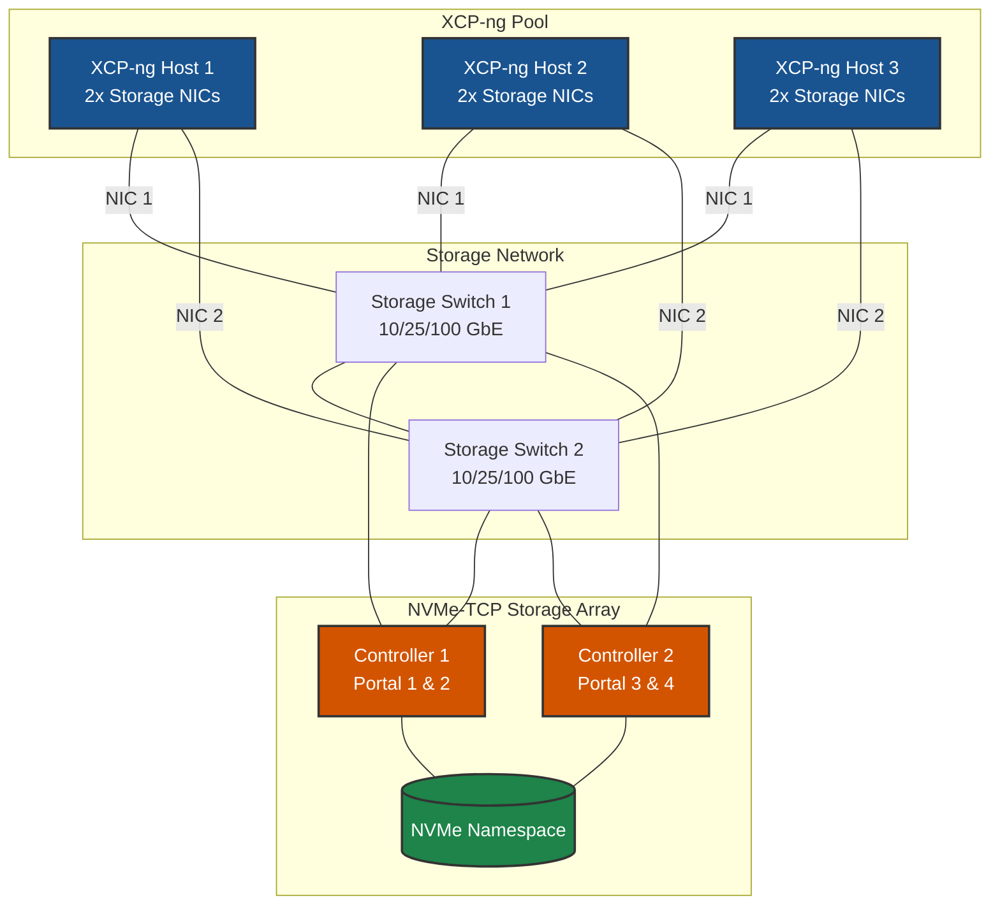

# NVMe-TCP on XCP-ng - Best Practices Guide

> **⚠️ Experimental:** NVMe-TCP is not officially documented by XCP-ng. This guide is based on standard Linux NVMe-TCP configuration and may require additional testing in your environment.

> **Distribution-Specific Guides:** For detailed best practices tailored to specific Linux distributions, see:
> - [RHEL/Rocky/AlmaLinux Best Practices](../rhel/nvme-tcp/BEST-PRACTICES.md)
> - [Debian/Ubuntu Best Practices](../debian/nvme-tcp/BEST-PRACTICES.md)
> - [SUSE/openSUSE Best Practices](../suse/nvme-tcp/BEST-PRACTICES.md)
> - [Oracle Linux Best Practices](../oracle/nvme-tcp/BEST-PRACTICES.md)

---



---

## Table of Contents
- [Architecture Overview](#architecture-overview)
- [XCP-ng-Specific Considerations](#xcp-ng-specific-considerations)
- [Network Design](#network-design)
- [NVMe Multipath Configuration](#nvme-multipath-configuration)
- [High Availability & Redundancy](#high-availability--redundancy)
- [Performance Optimization](#performance-optimization)
- [Security Best Practices](#security-best-practices)
- [Monitoring & Maintenance](#monitoring--maintenance)
- [Troubleshooting](#troubleshooting)

---

## Architecture Overview

### Reference Architecture

A production-grade NVMe-TCP deployment for XCP-ng consists of:

- **XCP-ng Pool**: 3+ hosts for high availability
  - *Why*: Minimum 3 hosts recommended for HA; allows maintenance without downtime

- **Dedicated Storage Network**: Isolated network infrastructure for storage traffic
  - *Why*: Prevents storage I/O contention with other traffic; ensures predictable performance

- **NVMe-TCP Storage Array**: Enterprise storage with multiple controllers
  - *Why*: Multiple controllers eliminate single point of failure; enable multipath for redundancy

- **Native NVMe Multipath**: Built-in kernel multipath for NVMe devices
  - *Why*: Lower overhead than dm-multipath; optimized for NVMe protocol

### Deployment Topology



---

## XCP-ng-Specific Considerations

### XCP-ng Overview

**Key Characteristics:**
- Open-source hypervisor based on Xen, forked from XenServer
- CentOS/RHEL-based dom0 (uses `yum` package manager)
- Uses XAPI (Xen API) and SMAPI (Storage Management API) for storage
- Managed via Xen Orchestra (web UI) or `xe` CLI
- Uses Open vSwitch for networking by default

**NVMe-TCP Support:**
- NVMe-TCP requires manual installation of `nvme-cli`
- Native NVMe multipath via kernel module
- Storage presented as local LVM SR

### Package Installation

**Install NVMe CLI tools:**
```bash
# Install nvme-cli
yum install -y nvme-cli

# Load required kernel modules
modprobe nvme nvme-tcp nvme-core

# Persist modules across reboots
cat > /etc/modules-load.d/nvme-tcp.conf << 'EOF'
nvme
nvme-tcp
nvme-core
EOF

# Enable native NVMe multipath
echo 'options nvme_core multipath=Y' > /etc/modprobe.d/nvme-tcp.conf
```

**Verify installation:**
```bash
# Check nvme-cli
nvme version

# Check kernel modules
lsmod | grep nvme

# Verify multipath is enabled
cat /sys/module/nvme_core/parameters/multipath
```

---

## Network Design



### Network Architecture Principles

1. **Dedicated Storage Network**: Always use dedicated physical or VLAN-isolated networks for storage traffic
   - *Why*: Isolates storage I/O from other network traffic; prevents bandwidth contention

2. **No Single Points of Failure**: Redundant switches, NICs, and storage controllers
   - *Why*: Any single component can fail without impacting storage availability

3. **Proper Segmentation**: Separate storage traffic from management and VM traffic
   - *Why*: Prevents noisy neighbor problems; ensures consistent storage performance

4. **Optimized MTU**: Use jumbo frames (MTU 9000) end-to-end when possible
   - *Why*: Reduces CPU overhead; improves throughput by reducing packet count

### XCP-ng Network Configuration

**Configure via xe CLI:**
```bash
# List available PIFs
xe pif-list

# Configure static IP on storage interface
xe pif-reconfigure-ip uuid=<PIF_UUID> \
    mode=static \
    IP=10.100.1.101 \
    netmask=255.255.255.0

# Set MTU for jumbo frames (optional)
xe pif-param-set uuid=<PIF_UUID> other-config:mtu=9000

# Verify configuration
xe pif-list params=uuid,device,IP,netmask
```

### ARP Configuration for Same-Subnet Multipath

> **⚠️ CRITICAL**: When using multiple interfaces on the same subnet, proper ARP configuration is **mandatory**.

```bash
cat > /etc/sysctl.d/99-nvme-arp.conf << 'EOF'
# ARP settings for same-subnet multipath
net.ipv4.conf.all.arp_ignore = 2
net.ipv4.conf.default.arp_ignore = 2
net.ipv4.conf.all.arp_announce = 2
net.ipv4.conf.default.arp_announce = 2
EOF

# Apply settings
sysctl -p /etc/sysctl.d/99-nvme-arp.conf
```

### MTU Configuration

**Verify MTU end-to-end:**
```bash
# Check interface MTU
ip link show eth1 | grep mtu

# Test MTU to storage portal (9000 - 28 byte header = 8972)
ping -M do -s 8972 10.100.1.10
```

---

## NVMe Multipath Configuration

### Native NVMe Multipath

NVMe-TCP uses **native kernel multipath**, not dm-multipath. This provides:
- Lower overhead than dm-multipath
- Optimized for NVMe protocol
- Automatic path management

**Enable native multipath:**
```bash
# Enable at boot
echo 'options nvme_core multipath=Y' > /etc/modprobe.d/nvme-tcp.conf

# Apply immediately (requires module reload)
modprobe -r nvme_tcp nvme_core
modprobe nvme_core multipath=Y
modprobe nvme_tcp
```

### Connecting to Storage

**Connect to NVMe-TCP subsystem:**
```bash
# Generate host NQN (if not exists)
nvme gen-hostnqn | tee /etc/nvme/hostnqn

# Connect to each portal
nvme connect -t tcp -a <PORTAL_IP_1> -s 4420 -n <SUBSYSTEM_NQN> \
    --host-iface=eth1 --host-traddr=<HOST_IP_1> \
    --ctrl-loss-tmo=1800 --reconnect-delay=10

nvme connect -t tcp -a <PORTAL_IP_2> -s 4420 -n <SUBSYSTEM_NQN> \
    --host-iface=eth2 --host-traddr=<HOST_IP_2> \
    --ctrl-loss-tmo=1800 --reconnect-delay=10

# Verify connections
nvme list-subsys
```

### Configure IO Policy

**Set round-robin for load balancing:**
```bash
# Set IO policy for all NVMe namespaces
for ns in /sys/class/nvme-subsystem/*/iopolicy; do
    echo "round-robin" > "$ns"
done

# Persist across reboots
cat > /etc/udev/rules.d/99-nvme-iopolicy.rules << 'EOF'
ACTION=="add", SUBSYSTEM=="nvme-subsystem", ATTR{iopolicy}="round-robin"
EOF
```

### Persistent Connections

**Configure automatic reconnection:**
```bash
mkdir -p /etc/nvme

# Create discovery configuration
cat > /etc/nvme/discovery.conf << 'EOF'
--transport=tcp
--traddr=<PORTAL_IP_1>
--trsvcid=4420
--host-traddr=<HOST_IP_1>

--transport=tcp
--traddr=<PORTAL_IP_2>
--trsvcid=4420
--host-traddr=<HOST_IP_2>
EOF

# Enable nvme-connect service (if available)
systemctl enable nvmf-autoconnect.service 2>/dev/null || true
```

---

## High Availability & Redundancy

### Creating LVM Storage Repository

Since NVMe-TCP devices appear as local block devices, create an LVM-based SR:

```bash
# Identify NVMe device (look for multipath device)
nvme list

# Create LVM SR
xe sr-create name-label="NVMe-TCP Storage" type=lvm shared=true \
    device-config:device=/dev/nvme0n1

# Verify SR creation
xe sr-list name-label="NVMe-TCP Storage"
```

### Activate on Other Hosts

After establishing NVMe connections on all hosts:

```bash
# Scan for volume groups
pvscan --cache

# Activate volume group
vgchange -ay

# Verify SR is available
xe sr-list
```

### Path Redundancy

**Verify multipath status:**
```bash
# Check NVMe subsystem paths
nvme list-subsys

# Expected output with multiple paths:
# nvme-subsys0 - NQN=nqn.2010-06.com.vendor:array
# \
#  +- nvme0 tcp traddr=10.100.1.10,trsvcid=4420 live
#  +- nvme1 tcp traddr=10.100.1.11,trsvcid=4420 live
#  +- nvme2 tcp traddr=10.100.2.10,trsvcid=4420 live
#  +- nvme3 tcp traddr=10.100.2.11,trsvcid=4420 live
```

**Test failover:**
```bash
# Simulate path failure
ip link set eth1 down

# Verify I/O continues
nvme list-subsys

# Restore path
ip link set eth1 up

# Verify path returns
nvme list-subsys
```

---

## Performance Optimization



### Kernel Parameters

**Optimize kernel for NVMe-TCP storage:**
```bash
cat > /etc/sysctl.d/99-nvme-xcpng.conf << 'EOF'
# Network performance for NVMe-TCP
net.core.netdev_max_backlog = 5000
net.core.rmem_max = 134217728
net.core.wmem_max = 134217728
net.ipv4.tcp_rmem = 4096 87380 67108864
net.ipv4.tcp_wmem = 4096 65536 67108864

# Low latency TCP
net.ipv4.tcp_low_latency = 1

# VM tuning for storage workloads
vm.dirty_ratio = 10
vm.dirty_background_ratio = 5
vm.swappiness = 10

# ARP settings for same-subnet multipath
net.ipv4.conf.all.arp_ignore = 2
net.ipv4.conf.default.arp_ignore = 2
net.ipv4.conf.all.arp_announce = 2
net.ipv4.conf.default.arp_announce = 2
EOF

# Apply settings
sysctl -p /etc/sysctl.d/99-nvme-xcpng.conf
```

### Network Interface Tuning

**Optimize NIC settings:**
```bash
cat > /usr/local/bin/tune-storage-nics.sh << 'EOF'
#!/bin/bash
# Tune storage NICs for NVMe-TCP

for NIC in eth1 eth2; do
    if ip link show $NIC &>/dev/null; then
        # Increase ring buffers
        ethtool -G $NIC rx 4096 tx 4096 2>/dev/null || true

        # Optimize interrupt coalescing
        ethtool -C $NIC rx-usecs 50 tx-usecs 50 2>/dev/null || true

        # Enable TCP offloads
        ethtool -K $NIC tso on gso on gro on 2>/dev/null || true

        echo "Tuned $NIC"
    fi
done
EOF

chmod +x /usr/local/bin/tune-storage-nics.sh
```

### Queue Depth Optimization

**Adjust NVMe queue depth:**
```bash
# Check current queue depth
cat /sys/class/nvme/nvme*/queue_count

# Adjust via module parameter (example)
echo 'options nvme_tcp nr_poll_queues=4' >> /etc/modprobe.d/nvme-tcp.conf
```

---

## Security Best Practices



### Network Isolation

**Best practices for storage network security:**
1. **Dedicated VLANs**: Isolate storage traffic on separate VLANs
2. **No default gateway**: Storage interfaces should not have default routes
3. **Physical isolation**: When possible, use dedicated switches
4. **Access control**: Use storage array ACLs to restrict initiator access

### NVMe Host Authentication

NVMe-TCP supports DH-HMAC-CHAP authentication (kernel 5.13+). Check your XCP-ng kernel version for support:

```bash
# Check kernel version
uname -r

# If supported, configure authentication in /etc/nvme/config.json
```

---

## Monitoring & Maintenance



### Health Check Script

**Create XCP-ng NVMe-TCP health check:**
```bash
cat > /usr/local/bin/nvme-health-check.sh << 'EOF'
#!/bin/bash
# NVMe-TCP Health Check Script for XCP-ng

echo "=== NVMe-TCP Health Check ==="
echo "Date: $(date)"
echo "Hostname: $(hostname)"
echo

echo "--- NVMe Controllers ---"
nvme list 2>/dev/null || echo "No NVMe devices found"

echo
echo "--- NVMe Subsystems (Multipath) ---"
nvme list-subsys 2>/dev/null || echo "No subsystems"

echo
echo "--- Path Status ---"
for ctrl in /sys/class/nvme/nvme*; do
    if [ -d "$ctrl" ]; then
        name=$(basename $ctrl)
        state=$(cat $ctrl/state 2>/dev/null)
        transport=$(cat $ctrl/transport 2>/dev/null)
        echo "$name: state=$state transport=$transport"
    fi
done

echo
echo "--- Storage Interface Status ---"
xe pif-list params=device,IP,currently-attached

echo
echo "--- SR Status ---"
xe sr-list params=name-label,physical-size,physical-utilisation

echo
echo "=== End Health Check ==="
EOF

chmod +x /usr/local/bin/nvme-health-check.sh
```

### Monitoring with systemd Journal

**View NVMe logs:**
```bash
# View NVMe kernel messages
dmesg -w | grep -i nvme

# Check for errors
journalctl -k | grep -i "nvme\|tcp" | tail -50
```

---

## Troubleshooting



### Service Status

**Check NVMe-TCP components:**
```bash
# Check NVMe modules
lsmod | grep nvme

# Check if multipath is enabled
cat /sys/module/nvme_core/parameters/multipath

# Check loaded namespaces
nvme list

# Check subsystem connectivity
nvme list-subsys
```

### Connection Issues

**Diagnose NVMe-TCP connectivity:**
```bash
# Test network connectivity to portals
ping -c 3 10.100.1.10
ping -c 3 10.100.1.11

# Test NVMe-TCP port (typically 4420)
nc -zv 10.100.1.10 4420

# Discover subsystems
nvme discover -t tcp -a 10.100.1.10 -s 4420

# Verbose connection attempt
nvme connect -t tcp -a 10.100.1.10 -s 4420 -n <NQN> -v
```

### Path Failures

**Diagnose path issues:**
```bash
# Check controller states
for ctrl in /sys/class/nvme/nvme*; do
    echo "$(basename $ctrl): $(cat $ctrl/state 2>/dev/null)"
done

# Check for reconnecting controllers
nvme list-subsys | grep -i "connecting\|reconnect"

# Force rescan
nvme rescan
```

### Reconnection Issues

**Handle stuck connections:**
```bash
# Disconnect specific controller
nvme disconnect -n <SUBSYSTEM_NQN>

# Reconnect
nvme connect -t tcp -a <PORTAL_IP> -s 4420 -n <SUBSYSTEM_NQN>

# Disconnect all and reconnect
nvme disconnect-all
# Then reconnect using your connection commands
```

### SR Issues

**Troubleshoot XCP-ng Storage Repository:**
```bash
# List SRs
xe sr-list

# Check PBD connections
xe pbd-list sr-uuid=<SR_UUID>

# Reconnect SR
xe pbd-plug uuid=<PBD_UUID>

# Rescan SR
xe sr-scan uuid=<SR_UUID>

# Check LVM
pvscan --cache
vgscan
```

---

## Additional Resources

- [XCP-ng Documentation](https://docs.xcp-ng.org/)
- [XCP-ng Storage Documentation](https://docs.xcp-ng.org/storage/)
- [Linux NVMe-TCP Documentation](https://docs.kernel.org/nvme/fabrics.html)
- [NVMe-TCP Quick Start](./QUICKSTART.md)
- [Common Network Concepts]({{ site.baseurl }}/common/network-concepts.html)
- [Storage Terminology Glossary]({{ site.baseurl }}/common/glossary.html)

---

## Quick Reference

**Check NVMe connections:**
```bash
nvme list-subsys
```

**Connect to storage:**
```bash
nvme connect -t tcp -a <IP> -s 4420 -n <NQN>
```

**Disconnect:**
```bash
nvme disconnect -n <NQN>
```

**Check SR status:**
```bash
xe sr-list type=lvm
```

**View logs:**
```bash
dmesg | grep -i nvme | tail -20
```

**Verify multipath:**
```bash
nvme list-subsys | grep -E "live|connecting"
```

