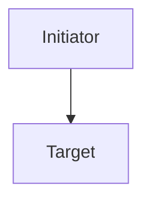

# Testdist iSCSI Best Practices Fixture

MARKER_BP_INTRO_BEFORE_FIRST_H2 — content between the H1 and the first H2 is
dropped by the H2 splitter. Asserted as a known behaviour, not an aspiration.

## Table of Contents

- MARKER_BP_TOC_ITEM (whole section is skipped by title)

## Architecture Overview

MARKER_BP_ARCH_PARAGRAPH introduces the architecture.



| Component | Role |
|-----------|------|
| Initiator | MARKER_BP_TABLE_CELL |
| Target | Array-side endpoint |

### Path Layout

MARKER_BP_SUBSECTION_A body text.

### Redundancy Model

MARKER_BP_SUBSECTION_B body text.



## Performance Tuning

MARKER_BP_PERF_PARAGRAPH.

### nconnect Tuning

MARKER_BP_NCONNECT_BODY — the anchor target for `#nconnect-tuning`.

### Queue Depth

MARKER_BP_QUEUE_DEPTH_BODY.

### 1.1 Numbered Subheading

MARKER_BP_NUMBERED_HEADING body — the generated section id must still be a legal
XML NCName, so it cannot start with a digit.

### Understanding APD (All Paths Down)

MARKER_BP_APD_BODY — heading punctuation must be dropped when the anchor slug is
computed, so `#understanding-apd-all-paths-down` resolves here.

### Quick Reference

MARKER_BP_INLINE_QUICKREF — an H3 whose title contains "quick reference" is
wrapped in a tip note instead of a section.

## Deep Heading Levels

### Lone Wrapper Heading

MARKER_BP_WRAPPER_BODY sits under a lone H3 wrapper, so the H3 becomes a bold
paragraph and the repeating H4s become the sections.

#### Wrapped One

MARKER_BP_H4_ONE body.

#### Wrapped Two

MARKER_BP_H4_TWO body.

## Notes Handling

> **Note:** MARKER_BP_NOTE_A.

> **Note:** MARKER_BP_NOTE_B.

> **Warning:** MARKER_BP_WARNING.

## Quick Reference

MARKER_BP_QUICKREF_BODY — this section is wrapped in a tip note, not a section.

```bash
iscsiadm -m node --login
```

## Troubleshooting

MARKER_BP_TROUBLESHOOTING_BODY — this whole section must not be emitted.

## Additional Resources

- [Quickstart in this directory](QUICKSTART.md)
- [Glossary](../../../_includes/glossary.md)
- [External reference](https://support.everpuredata.com/bundle/bp)
